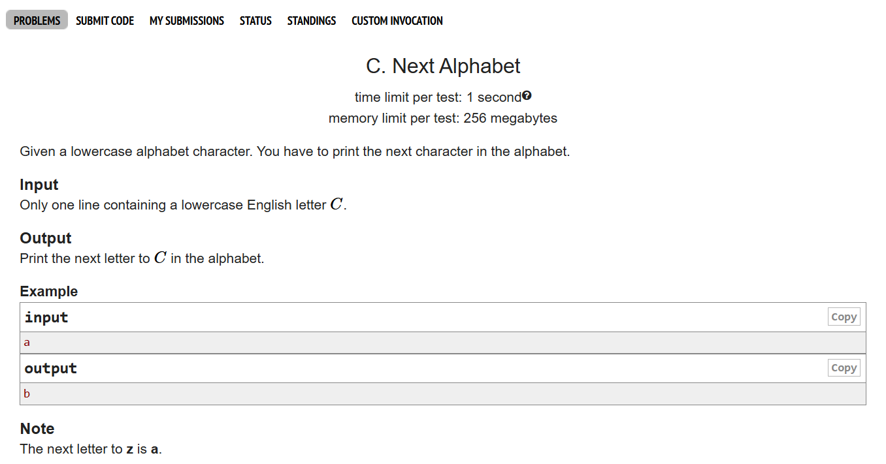
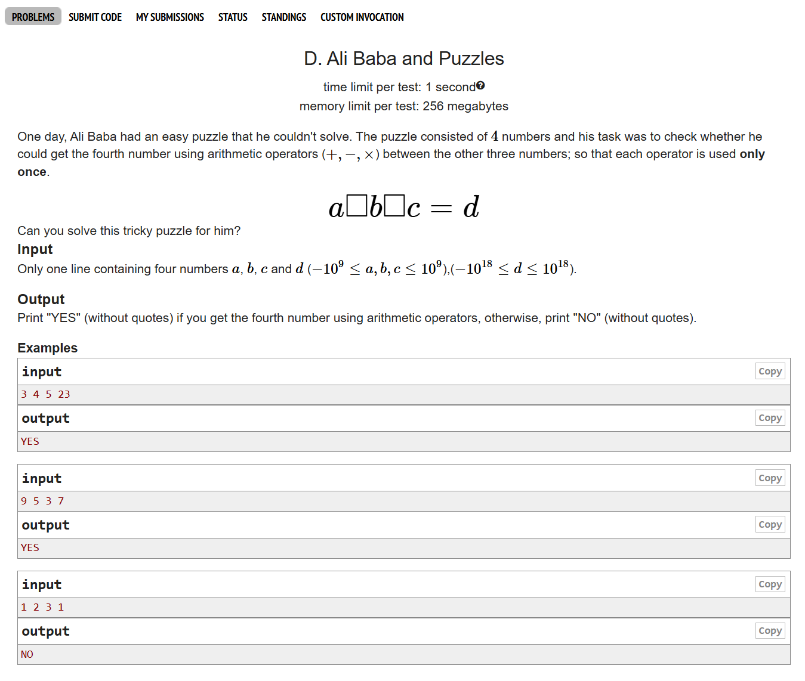
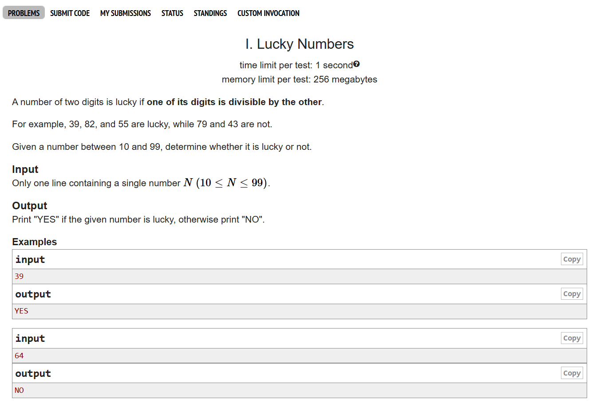

# Date: 14 April, 2025 - Monday

## Topics:
- Practice problem set
- Practice instructions

## Practice problem set
- Introduction to  C Programming
- Module 6.5: Practice Day 01 (CF, Pattern)
- Topics:
    - If Else Ladder
    - Nested If Else
    - Loop
    - Nested Loop
    - Basic Mathematics
- [Problem 1](https://codeforces.com/group/MWSDmqGsZm/contest/326175/problem/C)
    - 
- [Problem 2](https://codeforces.com/group/MWSDmqGsZm/contest/326175/problem/D)
    - 
- [Problem 3](https://codeforces.com/group/MWSDmqGsZm/contest/219432/problem/K)
    - 
- [Problem 4](https://codeforces.com/group/MWSDmqGsZm/contest/326175/problem/I)
    - 
- Extra Question Link: (Pattern Related) [Optional]
    - [Pattern 1](https://judge.phitron.io/topics/cm5z7wa3u0007p301xbzdqkuk/cm86cvm49008sr001t3j3mzp6?language=c_103)
    - [Pattern 2](https://judge.phitron.io/topics/cm5z7wa3u0007p301xbzdqkuk/cm86d15s50092r001qeu2gb0t?language=c_103)
    - [Pattern 3](https://judge.phitron.io/topics/cm5z7wa3u0007p301xbzdqkuk/cm86d8btu009er001s04tfa7u?language=c_103)

## Practice instructions
- 1st understand the questions
- 2nd write a paper and find out or understanding question
- Then code for problem solving