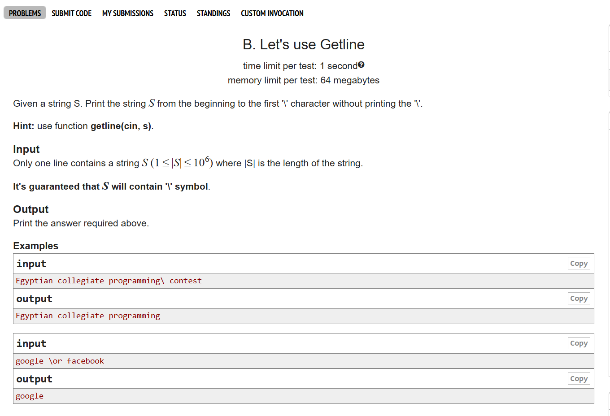

# Date: 20 April, 2025 - Sunday

## Topics:
- Text Instructions
0. Introduction
1. What is string Animated
2. What is string
3. String input and output
4. Null character
5. String input with space
6. String input Animated
7. String initialization
8. String initialization Animated
9. Length of a string
10. Length of a string Animated
11. Length of a string using strlen
12. Lets use getline
13. Count
14. Summary
- Quiz: Module 10
- Extra practice problem and quiz explanation module 10
- Feedback form module 10

## Text Instructions
- [মডিউলের প্রবলেম লিংক-](https://docs.google.com/document/d/1fPnGTrZ_zKMtYs52WO7bNyG7vAdZdQaTBW6N5wPu-Qs/edit?usp=sharing)
- মডিউল রিলেটেড তোমার যে কোন ফিডব্যাক থাকলে এই ফর্মে লিখে দিতে পারো। আমরা তোমার ফিডব্যাক গুরুত্বসহকার দেখব। [Feedback Form:](https://forms.gle/DH5mjuGD1x2EZ4z29)

## 0. Introduction
- What is string?
    - String is a character array
- String input and output
- Length of a string
- Problem solving with strings

## 1. What is string Animated
- String is character type of array
- `char a[5];` - `a = {'a', 'B', '{', ',' '#'};`
- index are same. 0 to start.

## 2. What is string
- Program: `string.c`
- Character string space give to 1 index.
- `%d %lld %f %lf` they are do not give to space`-`
- `%c` are give in to space in index.
- Space is a character value.

## 3. String input and output
- Program: `string_input.c`
- When `%s` character find the null (0) then they have stop.
- Like `a[7]`. `[Hello` - `0, 1, 2, 3, 4`] Hello have 4 index. `[5, 6]` They are `5` is a null value and `6` is a garbage value.
- Null character ASCII value is `0`.

## 4. Null character
- Program: `null_character.c`
- String means every string end have a null character
- String have a space then they are stop are print. `Dipu Ray` they are print to `Dipu` then they are not print. Because they find out the space.
- The null character is `'\0'`

## 5. String input with space
- Program: `string_space.c`
- Two ways to print including space
    - `gets()`
    - `fgets()` - [This is standard]
- If `gets()` and `fgets()` not working then you can add a header file `#include <string.h>`. Then can run easily.
- `gets()` and `fgets()` user input have any `enter` then they are stop the printing. But they can give into input `enter`.
- `scanf()`: if there are no space in string then we are use to scanf() function.
- `fgets()`: If there have space in string then we are use to fgets() function.

## 6. String input Animated
- Explanation with `scanf()` and `fgets()` string input.

## 7. String initialization
- Program: `str_initialize.c`

## 8. String initialization Animated
- Explanation string initialization with video

## 9. Length of a string
- Program: `string_length.c`

## 10. Length of a string Animated
- Explanation this program `string_length.c` in video

## 11. Length of a string using strlen
- Find the string length, have a build in function in c. `strlen()`
- Add to header file `#include <string.h>`

## 12. Lets use getline
- 
- Program: `problem_1.c`

## 13. Count
- 
- Program: `problem_2.c`

## 14. Summary
- Known to string and string basics.
- String super power.
- String one line print with `scanf("%s);`
- Whole array can print with string
- `""` can we are initialization
- Find out the string length or build in function
- String with 2 problem in codeforces:
    - Getline
    - Count
- The null character is `'\0'`

## Quiz: Module 10
- `Total Questions: 10`
- `Total Marks: 10`

## Quiz Explanation Module 10
- [Quiz Explanation Link](https://docs.google.com/document/d/11y0nEoD0c0b5h2YAmo4Qsog1NY_8qWUJn5ouDp87ZT0/edit?usp=sharing)
#### 1. How do you declare a string in C programming?
**a)** int str[];  
**b)** char name[size]; ✅  
**c)** char name;  
**d)** All of the above  
> **Explanation:** C প্রোগ্রামিংয়ে স্ট্রিং ডিক্লেয়ার করতে char টাইপের অ্যারে ব্যবহার করা হয়, যেমন: `char name[size];`। এখানে name স্ট্রিং ভেরিয়েবল এবং size হল সর্বোচ্চ ক্যারেক্টার সাইজ।

---

#### 2. What is the null character in C programming?
**a)** The character '0'  
**b)** The character '\0' ✅  
**c)** The character ''  
**d)** The character '\'  
> **Explanation:** C প্রোগ্রামিংয়ে NULL ক্যারেক্টার ('\0') হলো স্ট্রিংয়ের শেষ নির্দেশকারী বিশেষ ক্যারেক্টার, যার ASCII মান 0। এটি কম্পাইলারকে বুঝায় যে স্ট্রিংটি এখানেই শেষ।

---

#### 3. What is the purpose of the null character in string?
**a)** To indicate the end of a string ✅  
**b)** To indicate the beginning of a string  
**c)** To indicate a space in a string  
**d)** To indicate a special character in a string  
> **Explanation:** C প্রোগ্রামিংয়ে NULL ক্যারেক্টার ('\0') স্ট্রিংয়ের শেষ নির্দেশ করে।

---

#### 4. Which of the functions is used to input a string in C programming (with space)?
**a)** gets()  
**b)** fgets()  
**c)** puts()  
**d)** Both a and b ✅  
> **Explanation:** C প্রোগ্রামিংয়ে স্পেস সহ স্ট্রিং ইনপুট এর জন্য gets() এবং fgets() ব্যবহার করা যায়।

---

#### 5. What is the escape sequence for (\) in C programming?
**a)** \\ ✅  
**b)** //  
**c)** \t  
**d)** None of the above  
> **Explanation:** C প্রোগ্রামিংয়ে ব্যাকস্ল্যাশ (\) লিখতে `\\` ব্যবহার করা হয়, কারণ এটি একটি এস্কেপ সিকোয়েন্স। উদাহরণ: `printf("\\");` আউটপুট দেবে \

---

#### 6. What will be the output of the following C program?
```c
#include<stdio.h>
int main() {
    char str[20] = "HelloW\0rld";
    printf("%s", str);
    return 0;
}
```
**a)** HelloWorld  
**b)** No output. error.  
**c)** HelloW ✅  
**d)** None of the above  
> **Explanation:** NULL ক্যারেক্টার ('\0') স্ট্রিংয়ের শেষ নির্দেশ করে, তাই `printf("%s",str);` শুধুমাত্র HelloW প্রিন্ট করবে।

---

#### 7. What will be the minimum size of character array to hold "phitron" with null character?
**a)** char str[8]; ✅  
**b)** char str[7];  
**c)** char str[10];  
**d)** char str[12];  
> **Explanation:** "phitron" স্ট্রিংয়ের দৈর্ঘ্য 7 ক্যারেক্টার + 1 NULL ক্যারেক্টার ('\0') = মোট 8 ক্যারেক্টার।

---

#### 8. Which format specifier is used to work with string?
**a)** %c  
**b)** %s ✅  
**c)** %d  
**d)** %str  
> **Explanation:** C প্রোগ্রামিংয়ে স্ট্রিংয়ের জন্য `%s` ফরম্যাট স্পেসিফায়ার ব্যবহার করা হয়।

---

#### 9. What will be the output of the following code, if we input "Hello World"?
```c
#include<stdio.h>
int main() {
    char str[20];
    scanf("%s", str);
    printf("%s", str);
    return 0;
}
```
**a)** Hello World  
**b)** Hello ✅  
**c)** error  
**d)** None of the above  
> **Explanation:** `scanf("%s",str);` শুধুমাত্র স্পেসের আগ পর্যন্ত ইনপুট নেয়। তাই আউটপুট: **Hello**

---

#### 10. What will be the output of the following code, if we input "Hello World"?
```c
#include<stdio.h>
int main() {
    char str[20];
    scanf("%c", &str);
    printf("%s", str);
    return 0;
}
```
**a)** Hello World  
**b)** Hello  
**c)** hello  
**d)** None of the above ✅  
> **Explanation:** `scanf("%c", &str);` শুধুমাত্র একটি ক্যারেক্টার ইনপুট নেয় ('H'), আর `%s` দিয়ে স্ট্রিং প্রিন্ট করার চেষ্টা করলে অপ্রত্যাশিত ফলাফল দেখা দিতে পারে বা গার্বেজ প্রিন্ট হতে পারে। তাই সঠিক উত্তর: None of the above.

## Extra Practice Problem (Optional):
- [Extra Practice Problem Link](https://docs.google.com/document/d/1VmGUxd3sRCILjR0AHYY8SiRxDztTiTSjMtYZ7nZtxmk/edit?usp=sharing)
- Problem 1
    - 
- Problem 2
    - 
- Problem 3
    - 
- Problem 4
    - 

## Feedback Form Module 10
- মডিউল রিলেটেড তোমার যে কোন ফিডব্যাক থাকলে এই ফর্মে লিখে দিতে পারো। আমরা তোমার ফিডব্যাক গুরুত্বসহকার দেখব।
- [Form Links](https://forms.gle/DH5mjuGD1x2EZ4z29)