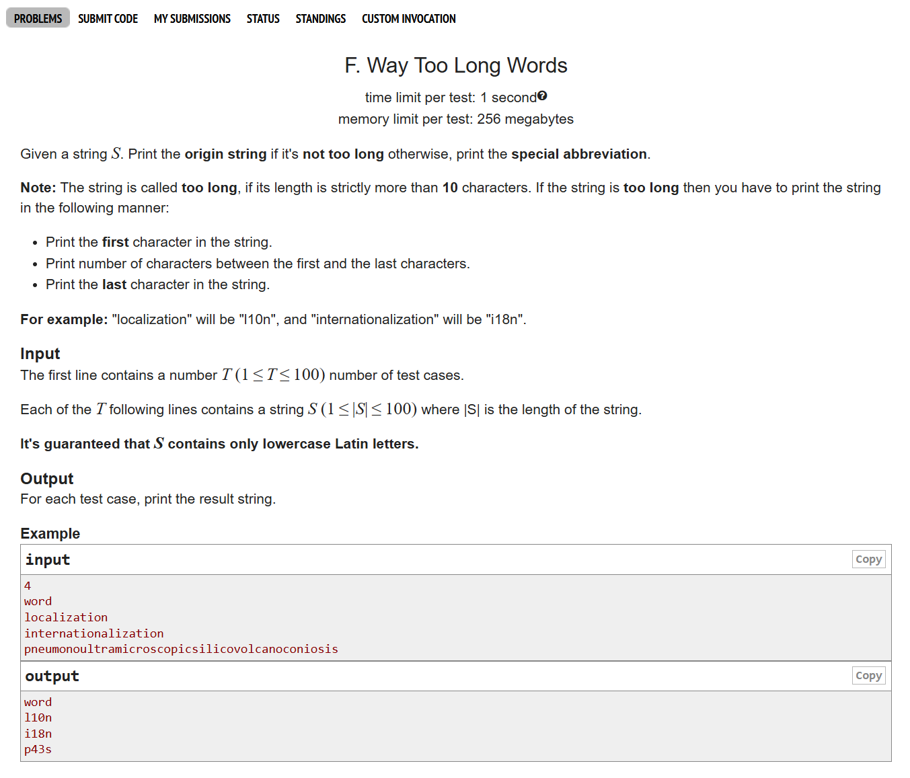
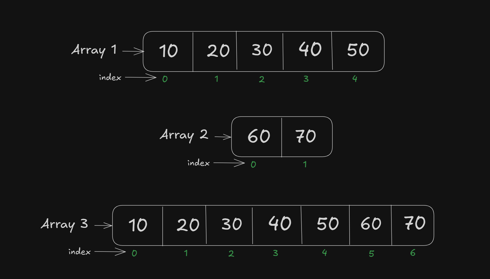

# Date: 21 April, 2025 - Monday

## Topics:
0. Practice Problem Module 10.5
1. Practice Instructions
2. Copy elements from 2 arrays to another array Animated
3. Copy elements from 2 arrays to another array

## 0. Practice Problem Module 10.5
- [Practice Problem Set :](https://docs.google.com/document/d/1BZ4EmlT9VnXCIWcsbU8wAdFk0RH2xjybs7Vzfqflggk/edit?tab=t.0#heading=h.1tiup1mwqtlu)
- Problem topic with Array and String.
- Problem 1:
    - 
- Problem 2:
    - 
- Problem 3:
    - 
- Problem 4:
    - 
- Problem 5:
    - 
- Problem 6:
    - 

## 1. Practice Instructions
- Explanation all practice problems

## 2. Copy elements from 2 arrays to another array Animated
- Copy from 2 array value in one new array with animations explanation
    - 

## 3. Copy elements from 2 arrays to another array
- Program: `concat_array.c`
- Copy from 2 array value in one new array with animations explanation
    - 