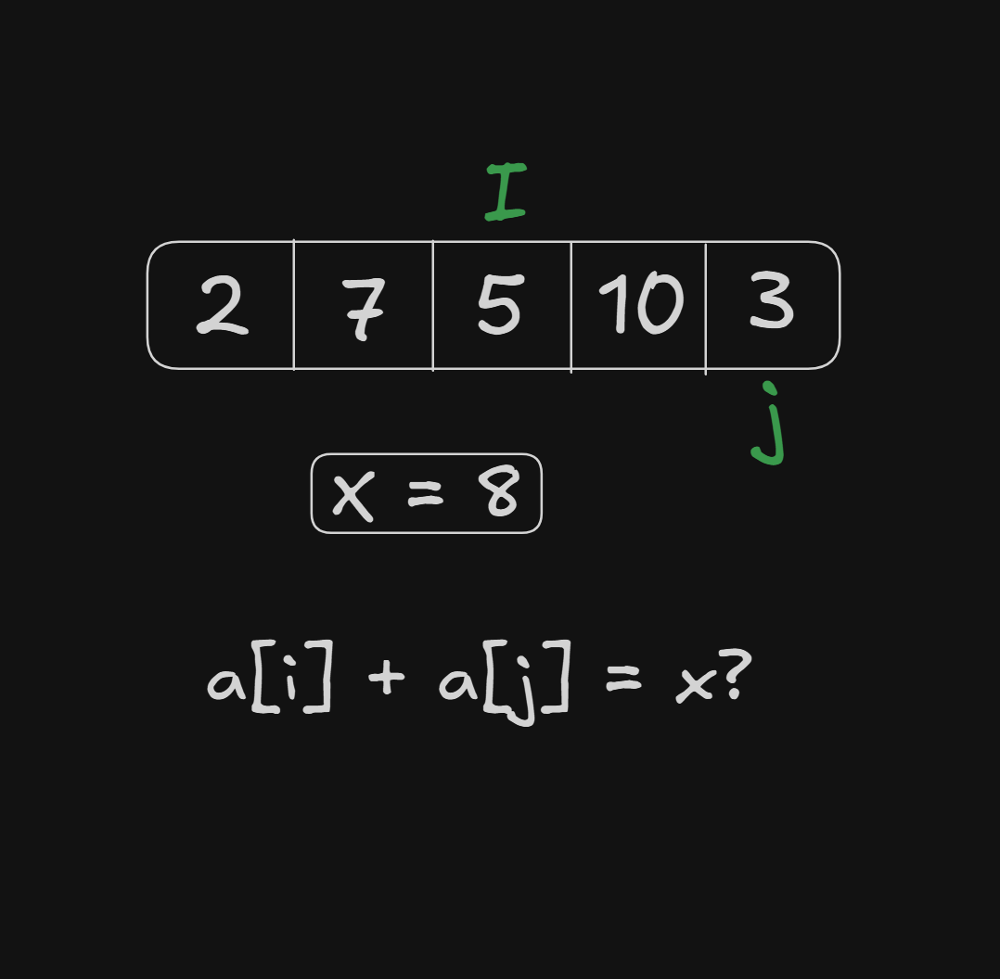
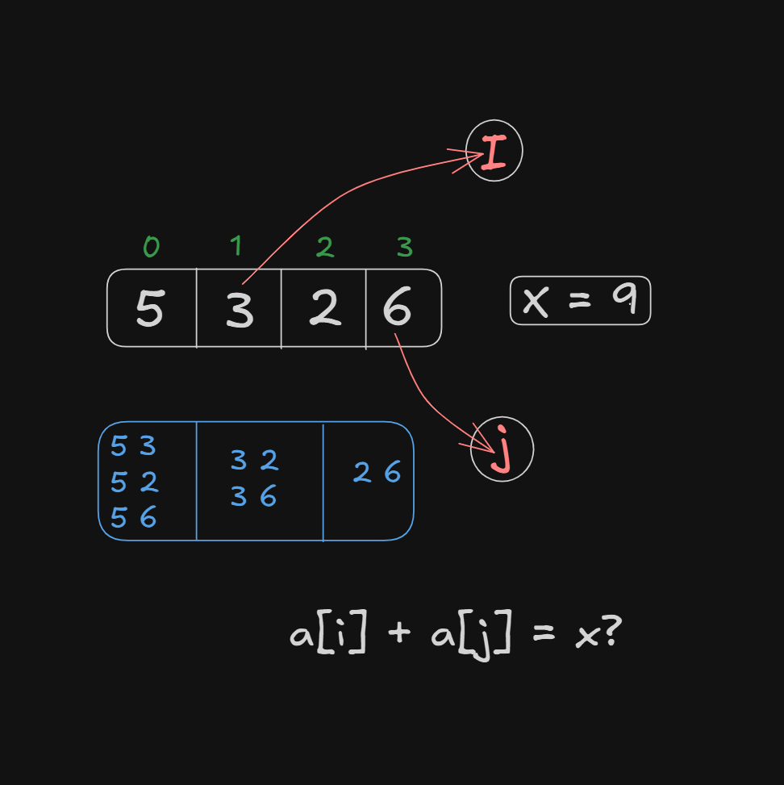
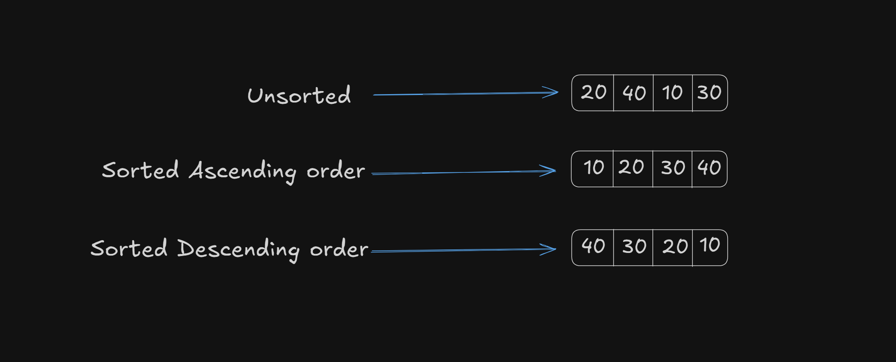
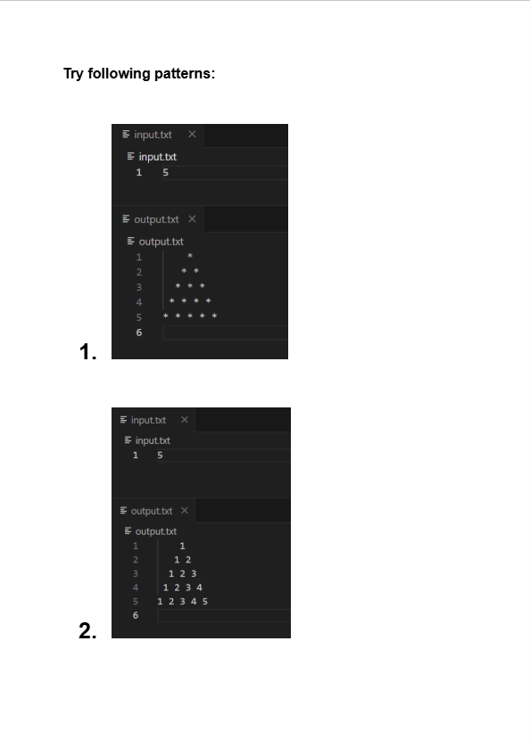
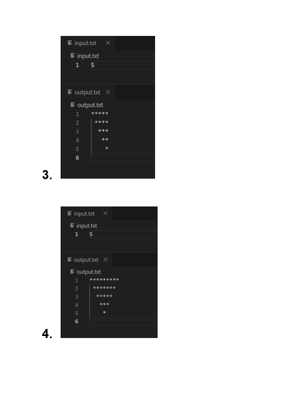
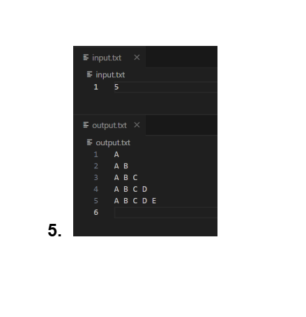

# Date: 03 May, 2025 - Saturday

## Topics:
- Text Instructions Module 13
0. Introduction
1. Star Pattern 1
2. Star Pattern 2
3. Pyramid Pattern
4. More Pattern
5. Sum of 2 values equal X Animation
6. Sum of 2 values equal x
7. Flag variable
8. Selection sort Animated
9. Selection sort
10. Summary
- Quiz: Module 13
- Extra Practice Problem and Quiz Explanation Module 13
- Feedback Form Module 13

## Text Instructions Module 13
- Welcome to the Module 13 of week 04.

## 0. Introduction
- Practice to nested loop and how they work.
- Make pattern with nested loop. Like- star pattern, pyramid pattern etc.
- How think a pattern how to build a pattern with code.
- Some problem solving with nested loop.
- Using nested loop with shorting algorithms

## 1. Star Pattern 1
- Program: `star_pattern.c`

## 2. Star Pattern 2
- Program: `star_pattern2.c`

## 3. Pyramid Pattern
- Program: `pyramid_pattern.c`

## 4. More Pattern
- Program: `pattern4.c`
- Program: `pattern5.c`

## 5. Sum of 2 values equal X Animation
- Any two values summation can equal to x value.
- Example: `a[i] + a[j] = x?`
- 

## 6. Sum of 2 values equal x
- Program: `main.c`
- 

## 7. Flag variable
- Program: `main2.c`
- Flag is simple variable, nothing else.
- Flag using with conditions

## 8. Selection sort Animated
- Short are 2 ways:
    - Min to max (Ascending order)
    - Max to min (Descending order)
- 
- Ascending order:
    - `a[i] > a[j]`
- Descending order:
    - `a[i] < a[j]`

## 9. Selection sort
- Using nested loop with shorting algorithm
- I will learn to selection short
- Program: `selection_short.c`

## 10. Summary
- Mainly work to nested loop.
- Pattern with nested loop. Like- start pattern, pyramid pattern etc.
- Problem solve with nested loop.
- Sorting algorithm (array shorting, string shorting etc.)

## Quiz: Module 13
- `Total Questions: 10`
- `Total Marks: 10`

## Quiz Explanation Module 13
- [Quiz Explanation Link](https://docs.google.com/document/d/12ND3Q_fbT0gcreYKgSY9WgYIUoLMdlpADBiWCQj-imQ/edit?usp=sharing)
#### 1. What will be the output of this pattern printing code?
```
for(int i=1; i<=3; i++) {
        for(int j=1; j<=i; j++) {
            printf("%d ", j);
        }
    }
```
**a)** 1 1 2 1 2 3 ✅  
**b)** 1 2 3   
**c)** 1 2 3 1 2 1  
**d)** None  
> **Explanation:** এই কোডে i এর মান 1 থেকে 3 পর্যন্ত চলবে এবং প্রতিটি i এর জন্য j-এর মান 1 থেকে শুরু করে i পর্যন্ত প্রিন্ট হয়। <br>
যখন i=1 হয় তখন শুধু 1 প্রিন্ট হয় <br>
যখন i=2 হয় তখন 1 2 প্রিন্ট হয় <br>
যখন i=3 হয় তখন 1 2 3 প্রিন্ট হয় <br>
সুতরাং ফাইনাল উত্তর 1 1 2 1 2 3
---
#### 2. Given an array [2,7,11,15] and X=9, which two elements sum to X?
**a)** 2 & 7 ✅  
**b)** 7 & 11   
**c)** 11 & 15  
**d)** No pair  
> **Explanation:** অ্যারেতে 2 এবং 7 এর যোগফল 9 (X=9)। অন্য কোনো জোড়ার যোগফল 9 সম্ভব না।
---
#### 3. How many stars (*) will this code print?
```
for(int i=1; i<=4; i++) {
    for(int j=1; j<=i; j++) {
        printf("*");
    }
}
```
**a)** 4   
**b)** 10 ✅  
**c)** 7  
**d)** 16  
> **Explanation:** এই কোডে i এর মান 1 থেকে 4 পর্যন্ত চলবে। <br>
i=1 হলে 1 টি * প্রিন্ট করবে। <br>
i=2 হলে 2 টি * প্রিন্ট করবে। <br>
i=3 হলে 3 টি * প্রিন্ট করবে। <br>
i=4 হলে 4 টি * প্রিন্ট করবে। <br>
সর্বমোট স্টার (*) প্রিন্ট হবে =1+2+3+4=10 বার।
---
#### 4. What pattern will this code print?
```
for(int i=1; i<=3; i++) {
    for(int j=1; j<=3; j++) {
        printf("%d ", i);
    }
}
```
**a)** 1 2 3 1 2 3 1 2 3   
**b)** 1 1 1 2 2 2 3 3 3 ✅  
**c)** 1 2 3  
**d)** None  
> **Explanation:** বাইরের লুপের চলক i-এর মান হয় 1 থেকে 3 এবং ভিতরের লুপ প্রতিটি i-এর মানকে 3 বার প্রিন্ট করে। <br>
যখন i=1 তখন 1 1 1 <br>
যখন i=2 তখন 2 2 2 <br>
যখন i=3 তখন 3 3 3 <br>
যেহেতু i এর প্রতি লুপ শেষ এ নিউ লাইন নাই তাই সব একই লাইনে দেখাবে।
---
#### 5. How many lines will this code print?
```
for(int i=1; i<=5; i+=2) {
    for(int j=1; j<=i; j++) {
        printf("*");
    }
    printf("\n");
}
```
**a)** 2   
**b)** 3 ✅  
**c)** 5  
**d)** 6  
> **Explanation:** বাইরের লুপটি চলবে i=1, i=3, i=5 (মোট 3 বার)। প্রতিটি লুপে: <br>
i=1 হলে  1 টি * প্রিন্ট করে নতুন লাইনে যায় <br>
i=3 হলে  3 টি * প্রিন্ট করে নতুন লাইনে যায় <br>
i=5 হলে  5 টি * প্রিন্ট করে নতুন লাইনে যায় <br>
মোট লাইন সংখ্যা: 3 টি
---
#### 6. What replaces “?” to print:
```
1  
2 3  
4 5 6
```
```
int num=1;
for(int i=1; i<=3; i++) {
    for(int j=1; j<=?; j++) {
        printf("%d ", num++);
    }
    printf("\n");
}
```
**a)** 3   
**b)** i ✅  
**c)** j  
**d)** num  
> **Explanation:** বাইরের লুপ (i): এটি সারি নিয়ন্ত্রণ করে (১ম সারি, ২য় সারি, ৩য় সারি) <br>
i=1 → ১ম সারি <br>
i=2 → ২য় সারি <br>
i=3 → ৩য় সারি <br><br>
ভিতরের লুপ (j): এটি প্রতিটি সারিতে কতগুলো সংখ্যা প্রিন্ট হবে তা নির্ধারণ করে <br>
১ম সারিতে 1 টি সংখ্যা (1) <br>
২য় সারিতে 2 টি সংখ্যা (2 3) <br>
৩য় সারিতে 3 টি সংখ্যা (4 5 6) <br><br>
num ভেরিয়েবল: এটি 1 থেকে শুরু হয় এবং প্রতিবার প্রিন্ট করার পর 1 করে বাড়ে (num++)<br><br>
আমাদের দরকার প্রতিটি সারিতে i সংখ্যক মান প্রিন্ট হবে অর্থাৎ ভিতরের লুপটি i বার চলবে।  তাই, প্রশ্ন চিহ্নের (?) স্থানে i আসবে।
---
#### 7. Given array: [4, 9, 3, 2, 5]  and Target sum (X=8). Which 0-indexed pair of elements sum to 8?
**a)** Index 0 & 1   
**b)** Index 1 & 3   
**c)** Index 2 & 4 ✅  
**d)** No such pair  
> **Explanation:** প্রদত্ত অ্যারে: [4, 9, 3, 2, 5] (0-ইনডেক্স ভিত্তিক)। ইনডেক্স 2 এর মান 3 এবং ইনডেক্স 4 এর মান 5, যার যোগফল: 3 + 5 = 8
---
#### 8. What's the output?
```
for(int i=3; i>=1; i--) {
    for(int j=1; j<=i; j++) {
        printf("*");
    }
    printf(" ");
}
```
**a)** *** ** * ✅  
**b)** ******   
**c)** * * *  
**d)** None  
> **Explanation:** বাইরের লুপ (i): i-এর মান শুরু হয় 3 থেকে এবং 1 পর্যন্ত কমতে থাকে (i--) অর্থাৎ লুপটি চলবে 3 বার: i=3, i=2, i=1 <br><br>
ভিতরের লুপ (j): প্রতিটি i-এর মানের জন্য j (1 থেকে i) পর্যন্ত চলবে, অর্থাৎ <br><br>
i=3 হলে  j (1 থেকে 3) পর্যন্ত → 3 টি * প্রিন্ট হবে <br>
i=2 হলে  j (1 থেকে 2) পর্যন্ত → 2 টি * প্রিন্ট হবে <br>
i=1 হলে  j (1 থেকে 1) পর্যন্ত → 1 টি * প্রিন্ট হবে <br><br>
নতুন লাইন: প্রতিটি ভিতরের লুপের শেষে space প্রিন্ট হবে <br><br>
আউটপুট: *** ** *
---
#### 9. What is the output after sorting this array in ascending order?
```
[5, 2, 9, 1]
```
**a)** [1, 2, 5, 9] ✅  
**b)** [9, 5, 2, 1]   
**c)** [1, 5, 2, 9]  
**d)** No change  
> **Explanation:** আসেন্ডিং অর্ডারে সাজানোর অর্থ হলো ছোট থেকে বড় সংখ্যার ক্রমে সাজানো। প্রদত্ত অ্যারে [5, 2, 9, 1]-কে আসেন্ডিং অর্ডারে সাজালে পাওয়া যায় [1, 2, 5, 9]
---
#### 10. What is the output after sorting this array in descending order?
```
[5, 2, 9, 1]
```
**a)** [1, 2, 5, 9]   
**b)** [9, 5, 2, 1] ✅  
**c)** [1, 5, 2, 9]  
**d)** No change  
> **Explanation:** ডিসেন্ডিং অর্ডারে সাজানোর অর্থ হলো বড় থেকে ছোট সংখ্যার ক্রমে সাজানো। প্রদত্ত অ্যারে [5, 2, 9, 1]-কে ডিসেন্ডিং অর্ডারে সাজালে পাওয়া যায় [9, 5, 2, 1]
---

## Extra Practice Problem (Optional):
- [Extra Practice Problem Link](https://docs.google.com/document/d/1KyUB7JrpN3tinY1C1epwbG4nfK5uAuGZG_da36ksnl0/edit?usp=sharing)
- 
- 
- 

## Feedback Form Module 13
- মডিউল রিলেটেড তোমার যে কোন ফিডব্যাক থাকলে এই ফর্মে লিখে দিতে পারো। আমরা তোমার ফিডব্যাক গুরুত্বসহকার দেখব।
- [Form Links](https://forms.gle/DH5mjuGD1x2EZ4z29)