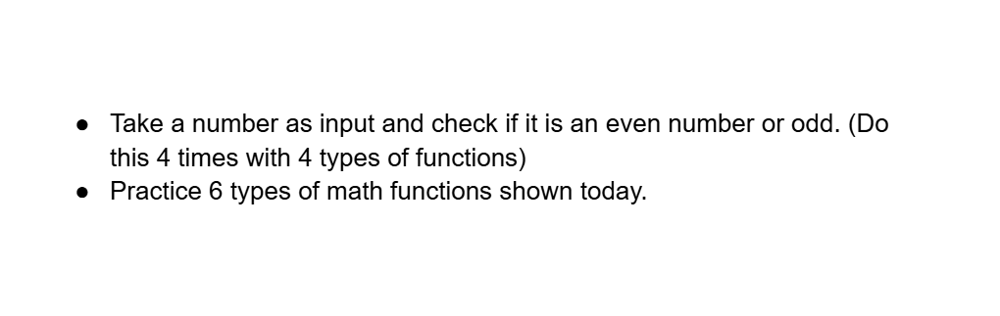

# Date: 04 May, 2025 - Sunday

## Topics:
0. Introduction
1. What is function
2. Function with return + parameter
3. Function with return + parameter Animated
4. Function with return + no parameter
5. Function with return + no parameter Animated
6. Function with no return + parameter
7. Function with no return + parameter Animated
8. Function with no return + no parameter
9. Function with no return + no parameter Animated
10. Usage of all types of functions
11. Variable scope
12. Useful math functions
13. Why int main and return 0
14. Summary
- Quiz: Module 14
- Extra Practice Problem and Quiz Explanation Module 14
- Feedback Form Module 14

## 0. Introduction
- What is function and functions variations?
- Function return type and parameter, divide by 4.
- Variable scope in c programming.
- Build in math function need to problem solving
- Why int `main()` and `return 0`?

## 1. What is function
- Function work with some instructions based.
- Function syntax:
    - `return_type function_name(parameters){...}`
- Function write `int main()` function above.
- `int function` is `return type function`.
- One function can do it one return not multiple.
- We have work with function with 4 ways:
    - `return + parameter`
    - `return + no parameter`
    - `no return + parameter`
    - `no return + parameter`

## 2. Function with return + parameter
- Program: `return_plus_parameter.c`
- Program to many ways solve it and work.

## 3. Function with return + parameter Animated
- Explanation the fifth program.

## 4. Function with return + no parameter
- Program: `return_plus_no_parameter.c`
- Program to 2 ways solve it and work. You can try more ways.

## 5. Function with return + no parameter Animated
- Explanation the first program.

## 6. Function with no return + parameter
- Program: `no_return_plus_parameter.c`
- Program to 2 ways solve it and work. You can try more ways.

## 7. Function with no return + parameter Animated
- Explanation the first program.

## 8. Function with no return + no parameter
- Program: `no_return_plus_no_parameter.c`
- Program to 1 ways solve it and work. You can try more ways.

## 9. Function with no return + no parameter Animated
- Explanation the `no_return_plus_no_parameter.c` program.

## 10. Usage of all types of functions
- One questions have, when which function to use?
    - There have no fix rule, If you work to just requirement.
- You just practice more, then you find out or realized.

## 11. Variable scope
- Program: `variable_scope.c`
- Scope means that specific int value access.

## 12. Useful math functions
- Program: `math_function.c`
- Functions:
    - Build-in function
    - User defined function
- `ceil()` function. Example: `4.5` = `5`
- `floor()` function. Example: `4.5` = `4`
- Add to header file is `#include <math.h>`
- `round()` function. Example: `4.5` = `5`
- `round()` function. Example: `4.4` = `4`
- `sqrt()` function. Example: `16` = `4`
- `pow()` function. Example: `3,2` = `6`
- `abs()` function. Example: `-10` = `10` [Absolute function]

## 13. Why int main and return 0
- If `return 0` that means code successfully run.
- If `return 0` not pass that means there have and error.

## 14. Summary
- Known to function and understand it.
- We have see to `4 function type`.
- Known to how to function work.
- Known to how to function memory access.
- Known to variable scope.
- We have to useful mathematical functions.
- We have see to why use to `return 0` or `main function`.

## Quiz: Module 14
- `Total Questions: 10`
- `Total Marks: 10`

## Quiz Explanation Module 14
- [Quiz Explanation Link](https://docs.google.com/document/d/1pzXu4-wp0fbTfq5NN53WMTxg_im8lyWvc2jNdQffwVk/edit?usp=sharing)
#### 1. Which of the following is a correct format for declaration of function?
**a)** return-type function-name (parameters); ✅  
**b)** function-name (parameter name) return-type;   
**c)** return-type (parameter type) function-name;  
**d)** all of the mentioned  
> **Explanation:** ফাংশন ডিক্লেয়ার করার সঠিক ফরম্যাট হলো: return-type function-name(parameters); <br>
return-type: ফাংশন যা রিটার্ন করবে তার ডাটা টাইপ (যেমন: int, void) <br>
function-name: ফাংশনের নাম <br>
parameters: ফাংশনের ইনপুট ভেরিয়েবল (অপশনাল )
---
#### 2. What will be the output of the following C code?
```
#include <stdio.h>

void m() {
    printf("hi");
}

int main() {
    m();
    return 0;
}
```
**a)** hi ✅  
**b)** Run time error   
**c)** hello  
**d)** None of the above  
> **Explanation:** main() ফাংশন থেকে m() ফাংশন কল করবে, যা "hi" প্রিন্ট করে।
---
#### 3. What will be the output of the following C code?
```
#include <stdio.h>

void m() {
    printf("hi ");
}

int main() {
    printf("hello ");
    return 0;
}
```
**a)** hi   
**b)** hello ✅  
**c)** hi hello  
**d)** hello hi  
> **Explanation:** প্রোগ্রামটি শুধুমাত্র main() ফাংশনের ভিতরের কোড printf("hello "); এক্সিকিউট করবে। কারণ, m() ফাংশন ডিফাইন করা থাকলেও, এটি কল করা হয় নি তাই এর ভিতরের কোড (printf("hi ");) রান হবে না।
---
#### 4. What should be the return type of sum function? Think deeply
```
#include <stdio.h>

___ sum() {
    int a = 10, b = 10;
    printf("%d", a + b);
}

int main() {
    sum();
    return 0;
}
```
**a)** int   
**b)** float   
**c)** void ✅  
**d)** None of the above  
> **Explanation:** sum() ফাংশনটি a + b এর মান প্রিন্ট করছে, কিন্তু কোনো মান রিটার্ন করছে না। যেহেতু ফাংশনটি কোনো মান রিটার্ন করছে না, এর রিটার্ন টাইপ void হবে।
---
#### 5. What will be the output of the following C code?
```
#include <stdio.h>

int sum(int x, int y) {
    int res = x + y;
    return res;
}

int main() {
    sum(5, 6);
    return 0;
}
```
**a)** 11   
**b)** 30   
**c)** -1  
**d)** None of the above ✅ 
> **Explanation:** প্রোগ্রামটি কোনো আউটপুট প্রদর্শন করবে না, কারণ: sum(5, 6) ফাংশনটি 11 রিটার্ন করলেও, এই মানটি কোথাও স্টোর বা প্রিন্ট করা হয়নি।
---
#### 6. What will be the output of the following C code?
```
#include <stdio.h>

int sum(int x, int y) {
    int res = x + y;
    return res;
}

int main() {
    printf("%d", sum(5, 6));
    return 0;
}
```
**a)** 11 ✅  
**b)** 30   
**c)** -1  
**d)** None of the above  
> **Explanation:** sum(5, 6) ফাংশনটি 5 ও 6 যোগ করে res ভেরিয়েবলে x + y (5+6=11) সংরক্ষিত হয় এবং এটি ফাংশন দ্বারা রিটার্ন হয়। printf("%d", sum(5, 6)); দ্বারা এই রিটার্ন ভ্যালু প্রিন্ট হয়।
---
#### 7. What is the purpose of the parameters in a C function?
**a)** to specify the type of data that the function returns   
**b)** to pass values to the function ✅  
**c)** to specify the function's name  
**d)** to mark the end of the function  
> **Explanation:** প্যারামিটার ব্যবহার করা হয় ফাংশনে ডাটা/মান পাঠানোর জন্য। ফাংশন কল করার সময় প্যারামিটারের মাধ্যমে ভ্যালু পাঠানো হয়।
---
#### 8. What is the purpose of the return statement in a C function?
**a)** to mark the start of the function   
**b)** to specify the type of data that the function returns   
**c)** to return a value to the caller of the function ✅  
**d)** to specify the function's name  
> **Explanation:** return স্টেটমেন্টের কাজ হলো ফাংশন থেকে কলার ফাংশনে কোনো ভ্যালু ফেরত দেওয়া। return ফাংশনের এক্সিকিউশন শেষ করে এবং নির্দিষ্ট ভ্যালু রিটার্ন করে।
---
#### 9. What will be the result of ceil(4.5)? Suppose all the header files are written
**a)** 4   
**b)** 5 ✅   
**c)** 4.5   
**d)** 6  
> **Explanation:** ceil() ফাংশনটি সিলিং মান রিটার্ন করে, অর্থাৎ দশমিক সংখ্যাকে তার থেকে বড় নিকটতম পূর্ণ সংখ্যায় রিটার্ন করে। ceil(4.5) এর ফলাফল 5 (কারণ 4.5 এর থেকে বড় নিকটতম পূর্ণসংখ্যা 5)।
---
#### 10. What will be the result of floor(4.5)? Suppose all the header files are written
**a)** 5   
**b)** 4 ✅   
**c)** 4.5   
**d)** 6  
> **Explanation:**  floor() ফাংশনটি ফ্লোর মান রিটার্ন করে, অর্থাৎ দশমিক সংখ্যাকে তার থেকে ছোট নিকটতম পূর্ণ সংখ্যায় রিটার্ন করে। floor(4.5) এর ফলাফল 4 (কারণ 4.5 এর থেকে ছোট নিকটতম পূর্ণসংখ্যা 4)।
---

## Extra Practice Problem (Optional):
- [Extra Practice Problem Link](https://docs.google.com/document/d/1ezSmXcT4woRw3NeAGW04NCljZ7zwIokHVw_sgfYmJ3U/edit?usp=sharing)
- 

## Feedback Form Module 14
- মডিউল রিলেটেড তোমার যে কোন ফিডব্যাক থাকলে এই ফর্মে লিখে দিতে পারো। আমরা তোমার ফিডব্যাক গুরুত্বসহকার দেখব।
- [Form Links](https://forms.gle/DH5mjuGD1x2EZ4z29)