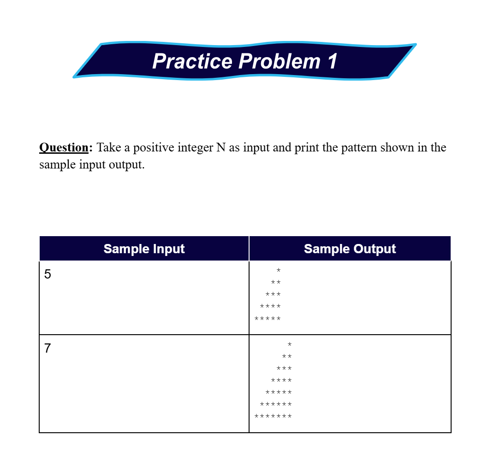
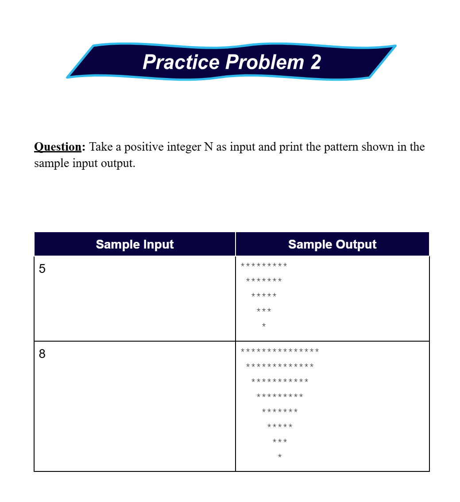
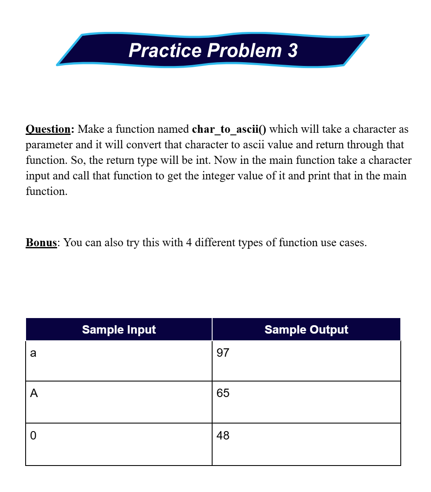
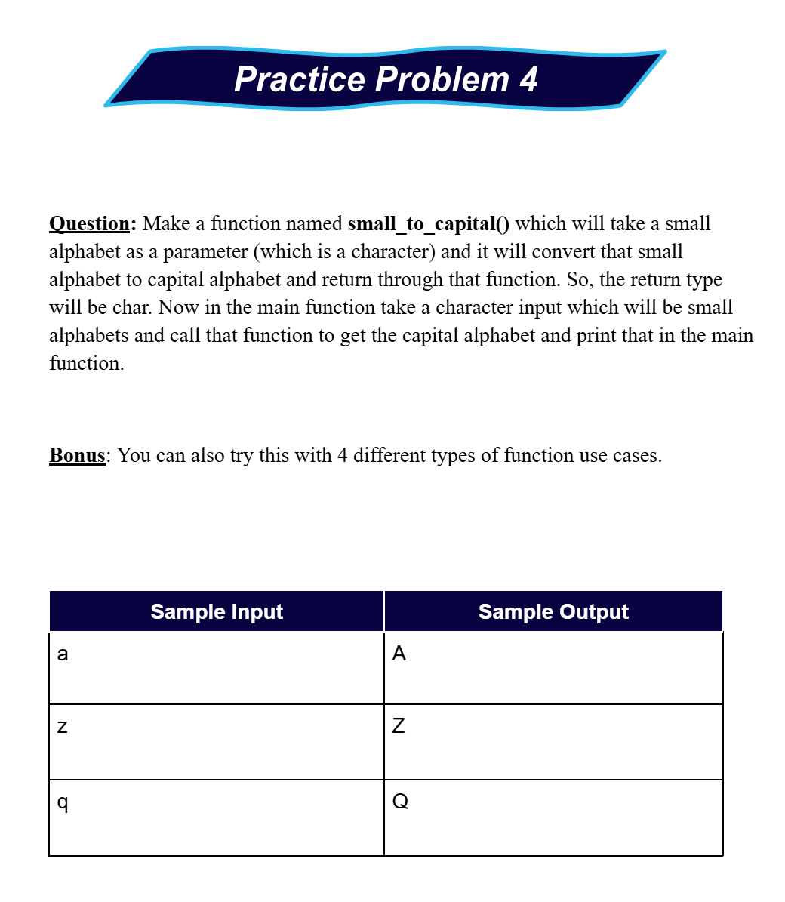
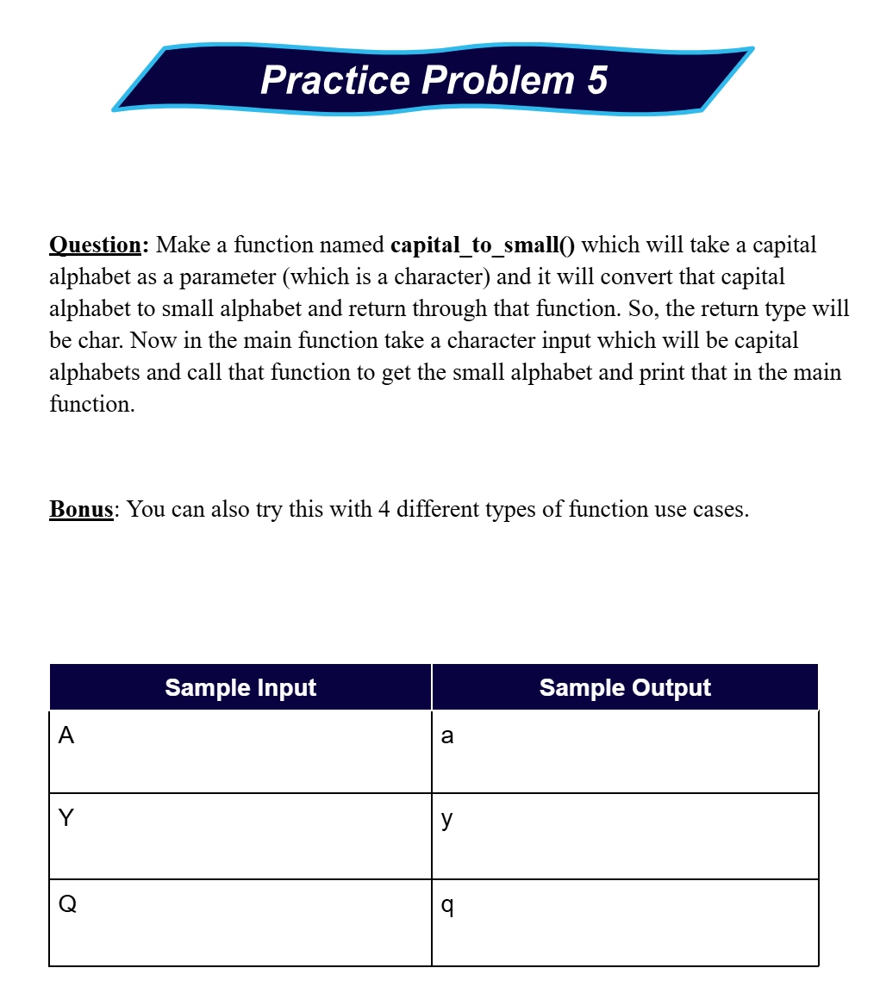

# Date: 05 May, 2025 - Monday

## Topics:
- Practice Problem Module 14.5
- Practice Instructions

## Practice Problem Module 14.5
- [Practice Problem Set :](https://docs.google.com/document/d/1uzoOl9K0McJaxyy_o0p4la_sGCC8A-O8/edit?tab=t.0)
- Topics:
    - Nested Loop
    - Pattern Printing
    - Functions
- [Problem 1](https://codeforces.com/group/MWSDmqGsZm/contest/219432/problem/P)
- [Problem 2](https://codeforces.com/group/MWSDmqGsZm/contest/219432/problem/T)
- [Problem 3](https://codeforces.com/group/MWSDmqGsZm/contest/219432/problem/W)
- [Problem 4](https://codeforces.com/group/MWSDmqGsZm/contest/219774/problem/H)
- More practice problems:
    - 
    - 
    - 
    - 
    - 

## Practice Instructions
- Explanations extra practice problems and more practice problems.