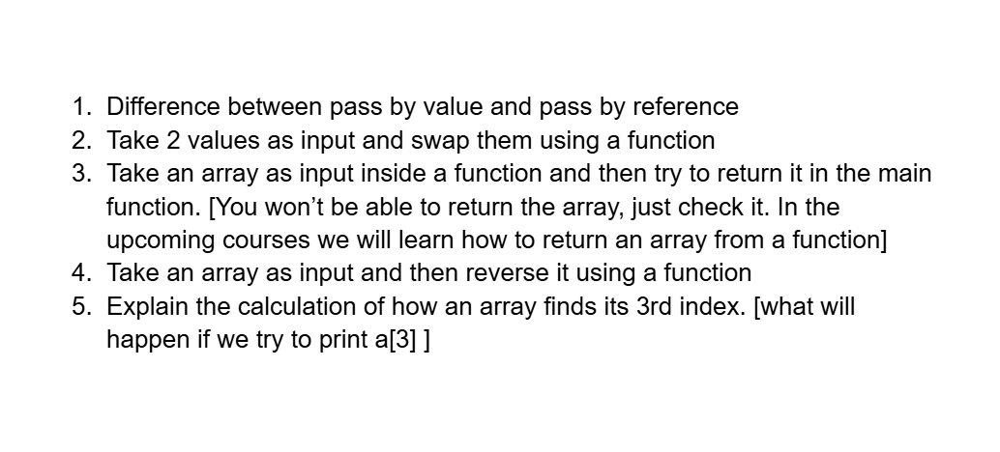

# Date: 06 May, 2025 - Tuesday

## Topics:
0. Introduction
1. Pointer
2. Dereferencing a pointer
3. Pointer Animated
4. Pass by value
5. Pass by reference
6. Pass by value VS Pass by reference Animated
7. Why we use reference in scanf
8. Pointer in array
9. Function with array
10. Function with array Animated
11. Function with string
12. Summary
- Quiz: Module 15
- Extra Practice Problem and Quiz Explanation Module 15
- Feedback Form Module 15

## 0. Introduction
- Know to new concept this name is `pointer`.
- Understanding pointers memory addresses.
- Dereferencing a pointer: Accessing the value.
- `Pass by value` vs `pass by reference`.
- Pointers in array: Natural connection.
- Function with array: Practical Applications.

## 1. Pointer
- Pointer variable is normal variable
- Every variable have an address with hexadecimal.
- Program: `pointers.c`
- A variable address access with `%p` format specifier.
- `%p` came from pointers.
- How to pointer variable syntax:
    - `data_type* pointer_variable_name;`

## 2. Dereferencing a pointer
- Pointer variable size can `8 bytes`.
- Program: `dereferencing_pointer.c`
- Access with address a specific variable with `dereferencing a pointer`.
    - Example: `printf("%d", &variable_name);`
- Go to address to value, this called to dereference.
- Go to value to address, this called to reference.

## 3. Pointer Animated
- Explanation pointer

## 4. Pass by value
- Program: `pass_by_value.c`
- They have two different variable and no access.

## 5. Pass by reference
- Program: `pass_by_reference.c`

## 6. Pass by value VS Pass by reference Animated
- Explanation `pass by value` and `pass by reference` concept.

## 7. Why we use reference in scanf
- Program: `scan_function.c`
- `scanf()` function variable address are always changing. That's it, we use to `& - reference or address of`.
- `printf()` function variable address are not changing. That's it, we don't use to `& - reference or address of`.

## 8. Pointer in array
- Program: `pointer_array.c`
- Array also a pointer.

## 9. Function with array
- Program: `function_with_array.c`
- Any data type variable gone `pass by value` always.
    - `variable` - `pass by value`
    - `array` - `pass by reference`
- Try many way to understand the logics.

## 10. Function with array Animated
- Explanation to pass array in function.

## 11. Function with string
- Program: `function_with_string.c`

## 12. Summary
- Learn to pointer and pointer concept.
- Function have 2 way value pass:
    - `pass by value`
    - `pass by reference`
- We know to why we use `scanf()` function `& - address of` and why we don't use to `printf()` function `& - address of`.
- Array have a pointer and learn how they work.
- Function with array and learn to how to pass array in function. By default pass to reference.
- When array pass in function then declare to size of array.
- Known to function with string.

## Quiz: Module 15
- `Total Questions: 10`
- `Total Marks: 10`

## Quiz Explanation Module 15
- [Quiz Explanation Link](https://docs.google.com/document/d/1w-IPd9cfIe5RG0NzANAbM1dQ1U3FLGDCYoLVhGZNsMU/edit?usp=sharing)
#### 1. What is a pointer in C programming?
**a)** A variable that stores the memory address of another variable ✅  
**b)** A variable that stores the value of another variable   
**c)** A variable that can only store integer values  
**d)** A variable that can only store character values  
> **Explanation:** পয়েন্টার হলো এমন একটি ভ্যারিয়েবল যা অন্য ভ্যারিয়বলের এড্রেস স্টোর করে রাখতে পারে।
---
#### 2. Which operator is used to access the value at the address pointed to by a pointer in C?
**a)** * ✅  
**b)** %   
**c)** ^  
**d)** &  
> **Explanation:** কোনো একটি পয়েন্টারে যে ভ্যারিয়বলের এড্রেস স্টোর করা আছে তার ভ্যালু এক্সেস করতে হলে আমাদের ঐ পয়েন্টার কে ডিরেফারেন্স করা লাগে। কোনো পয়েন্টারকে ডিরেফারেন্স করতে হলে তার আগে * চিহ্ন ব্যবহার করা হয়।
---
#### 3. Which type of function features in C can’t modify the value of the original variable from where it was called?
**a)** Call by value ✅  
**b)** Call by reference   
**c)** ^  
**d)** &  
> **Explanation:** কোনো ইউজার ক্রিয়েটেড ফাংশনে মেইন ফাংশন থেকে শুধুমাত্র ভ্যারিয়েবল পাস করা হলে সেক্ষেত্রে ফাংশনে আলাদা ভাবে ঐ ভ্যারিয়েবলের একটি কপি ক্রিয়েট হয় যেখানে ভ্যারিয়েবলের মান স্টোর থাকে। মেইন ফাংশনের ভ্যারিয়েবল এবং ইউজার ফাংশনের ভ্যারিয়েবল দুটির এড্রেস ভিন্ন হয়ে থাকে। একে call by value / pass by value বলা হয়ে থাকে। যেহেতু এক্ষেত্রে দুটি ভ্যারিয়েবলের এড্রেস ভিন্ন হয় , তাই ফাংশনে ঐ ভ্যারিয়েবলের উপর কোনো মডিফিকেশন করা হলে তা মেইন ফাংশনে পরিলক্ষিত হয় না।
---
#### 4. Which type of function features in C allows the function to modify the value of the original variable from where it was called?
**a)** Call by value   
**b)** Call by reference ✅  
**c)** ^  
**d)** &  
> **Explanation:** কোনো ইউজার ক্রিয়েটেড ফাংশনে মেইন ফাংশন থেকে  ভ্যারিয়েবল এড্রেস সহ পাস করা হলে সেক্ষেত্রে ইউজার ফাংশনে কোনো কপি মেমরী ক্রিয়েট হয় না , বরং মেইন ফাংশনের ভ্যারিয়েবলের এড্রেস টি স্টোর হয়।  মেইন ফাংশনের ভ্যারিয়েবল এবং ইউজার ফাংশনের ভ্যারিয়েবল দুটির এড্রেস একই হওয়াতে  ইউজার ফাংশনে ঐ ভ্যারিয়েবলের উপরে কোনো কাজ করা হলে তা মেইন ফাংশনের ভ্যারিয়েবলেও পরিলক্ষিত হয়। একে call by reference/ Pass by reference বলা হয়।
---
#### 5. What will be the output of the following C code?
```
#include <stdio.h>

void swap(int *p, int *q) {
    int temp = *p;
    *p = *q;
    *q = temp;
}

int main() {
    int a = 6, b = 5;
    swap(&a, &b);
    printf("%d %d\n", a, b);
}
```
**a)** 5 6 ✅  
**b)** 6 5   
**c)** 5 5  
**d)** 6 6  
> **Explanation:** উক্ত ফাংশন টি একটি swap ফাংশন। যার মাধ্যমে দুটি ভ্যারিয়েবলের ভ্যালু swap করা যায়। এক্ষেত্রে মেইন ফাংশন থেকে pass by reference  এর মাধ্যমে a,b এর ভ্যালু পাস করার কারণে swap function এই দুটি ভ্যারিয়েবলের উপর যে যে কাজ হবে তা মেইন ফাংশনের a, b ভ্যারিয়েবলের উপর পরিলক্ষিত হবে । এক্ষেত্রে swap ফাংশনে  a,b এর মান swap হয়েছে তাই , a, b এর পরিবর্তিত মান হবে a= 5 , b= 6।
---
#### 6. What will be the output of the following C code?(think deeply)
```
#include <stdio.h>

void m(int *p) {
    int i = 0;
    for (i = 0; i < 5; i++)
        printf("%d ", p[i]);
}

int main() {
    int a[5] = {6, 5, 3};
    m(a);
}
```
**a)** 0 0 0 0 0   
**b)** 6 5 3 0 0 ✅  
**c)** Run time error  
**d)** 6 5 3 garbage_value garbage_value  
> **Explanation:** এখানে a এরেটিকে ফাংশনে পাস করা হয়েছে। a এরেটি ৫ সাইজের ডিক্লেয়ার করা হলেও এখানে ৩ টি ইন্ডেক্সে মান এসাইন করা হয়েছে। এভাবে এরেতে ভ্যালু এসাইন করা হলে , সেক্ষেত্রে যে ইন্ডেক্স গুলোতে ভ্যালু এসাইন কর হয়নি , তা ০ দ্বারা by default পূর্ণ হয়ে যাবে । তাই ফাংশনে এই সেইম এরে a প্রিন্ট করার সময় উক্ত আউটপুট পাওয়া যাবে।
---
#### 7. What will be the output of the following C code?
```
#include <stdio.h>

void m(int p, int q) {
    int temp = p;
    p = q;
    q = temp;
}

int main() {
    int a = 6, b = 5;
    m(a, b);
    printf("%d %d\n", a, b);
}
```
**a)** 5 6   
**b)** 5 5   
**c)** 6 5 ✅  
**d)** 6 6  
> **Explanation:** উক্ত swap function এ মেইন মেমরী থেকে pass by value হিসেবে ভ্যালু পাস হয়েছে , তাই a,b এই দুটি ভ্যারিয়েবলের উপর ফাংশনে কাজ করা হলেও তা main ফাংশনে পরিলক্ষিত হবে না , তাই a,b এর ভ্যালু অপরিবর্তিত থাকবে।
---
#### 8. What will be the output of the following C code?
```
#include <stdio.h>

int main() {
    int ary[4] = {1, 2, 3, 4};
    printf("%d\n", *ary);
}
```
**a)** 1 ✅  
**b)** Compile time error   
**c)** Some garbage value  
**d)** Undefined variable  
> **Explanation:** মডিউল হতে আমরা জেনেছি , এরে এর নাম ঐ এরে এর প্রথম ঘরের এড্রেস টি রাখে। তাই ,  ary অর্থাৎ এরে এর নামটি ডিরেফারেন্স করা হলে আমরা ঐ এরে টির প্রথম ঘরের ভ্যালু দেখতে পাবো।
---
#### 9. Which of the following is the correct syntax to pass an integer array named ar as a parameter to function?
**a)** void func(int ar[]){}; ✅  
**b)** void func(int ar){};   
**c)** Both of the above  
**d)** None of the above  
> **Explanation:** মডিউলে এই বিষয় নিয়ে ডিস্কাশন করা হয়েছে।
---
#### 10. What will be the output of the following C code?(A tricky question. Don’t answer without thinking.)
```
#include <stdio.h>

int main()
{
    int ary[4] = {1, 2, 3, 4};
    int *p;
    p = ary + 3;
    *p = 5;
    printf("%d\n", ary[3]);
}
```
**a)** 4   
**b)** 5 ✅  
**c)** Compile time error  
**d)** 3  
> **Explanation:** এখানে p নামক পয়েন্টারের ary+3 অর্থাৎ array এর ৩ নাম্বার ইন্ডক্সের এড্রেস  রয়েছে। ঐ এড্রেস ডিরেফারেন্স করে এর মধ্যে ভ্যালু ৫ রাখা হয়েছে। তাই ary[3] এর ভ্যালু 5।
---

## Extra Practice Problem (Optional):
- [Extra Practice Problem Link](https://docs.google.com/document/d/1qZpI8UZ1ddpCvHszj2uUC61rpeNTUi_ERTrhTVObNZA/edit?usp=sharing)
- 

## Feedback Form Module 15
- মডিউল রিলেটেড তোমার যে কোন ফিডব্যাক থাকলে এই ফর্মে লিখে দিতে পারো। আমরা তোমার ফিডব্যাক গুরুত্বসহকার দেখব।
- [Form Links](https://forms.gle/DH5mjuGD1x2EZ4z29)