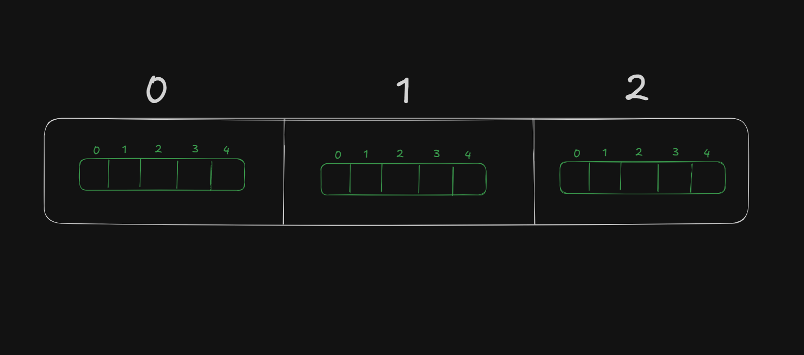
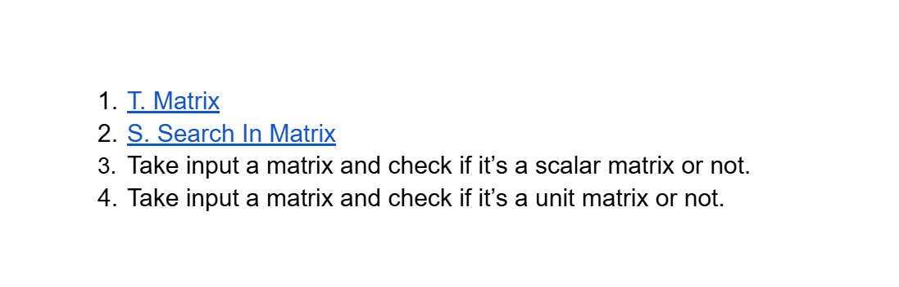

# Date: 11 May, 2025 - Sunday

## Topics:
0. Introduction
1. Why we need 2D array
2. What is 2D array
3. Declaring 2D array
4. 2D array input and output
5. 2D array input and output Animated
6. Printing specific row and column
7. Printing specific row and column Animated
8. Types of matrix
9. Checking row, column and square matrix
10. Checking zero matrix
11. Checking primary diagonal matrix
12. Checking secondary diagonal matrix
13. Summary
- Quiz: Module 18
- Extra Practice Problem and Quiz Explanation Module 18
- Feedback Form Module 18

## 0. Introduction
- 2D Arrays & Matrix
- Understanding 2D Arrays
- Why we need to learn 2D Arrays
- 2D Array Input and Output
- Accessing Specific Rows and Columns
- Introduction to Matrices
- Types of Matrix
- Checking row, column and square Matrix
- Checking Zero and Diagonal Matrix
- Identifying Scalar and Unit Matrix

## 1. Why we need 2D array
- There have so many arrays. Like 10k array or 100k+ arrays
- Then we need to `2D arrays`
- `1D means` - They have 1 (one) dimension `Length`. Example: A Line size have one part, length.
- `2D means` - They have 2 (two) dimension `Length` and `Width`. Example: A Square size have two part, length and width.
- `3D means` - They have 3 (three) dimension `Length`, `Width` and `Height`. Example: A Box size have three part, length, width and height.
- `2D array` - There have fixed array in 2D arrays.
    - `0 index arrays - 5 size of array`
    - `1 index arrays - 5 size of array`
    - `2 index arrays - 5 size of array`
    - `nth index arrays - 5 size of array`

## 2. What is 2D array
- 2D Array Draw:
    - 
- How to declare 2D arrays:
    - a[row_number][column_number]
- It's also similar to matrix concept

## 3. Declaring 2D array
- Program: `2d_array.c`

## 4. 2D array input and output
- `2d_array2.c`

## 5. 2D array input and output Animated
- Explanation this `2d_array2.c` program.

## 6. Printing specific row and column
- Program: `row_column.c`

## 7. Printing specific row and column Animated
- Explanation this `row_column.c` program.

## 8. Types of matrix
- Image with example matrix
- Order of matrix
- Type of matrix:
    - Row matrix
    - Column matrix or Vector matrix
    - Zero matrix or Null matrix
    - Diagonal matrix
    - Scalar matrix
    - Unit matrix

## 9. Checking row, column and square matrix
- Program: `checking_row_matrix.c`

## 10. Checking zero matrix
- Program: `checking_zero_matrix.c`

## 11. Checking primary diagonal matrix
- Program: `diagonal_matrix.c`

## 12. Checking secondary diagonal matrix
- Program: `diagonal_matrix2.c`

## 13. Summary
- Know to 2D arrays
- How to store memory and how to declare
- 2D arrays input and output
- Print to fixed row and column
- Idea to matrix
- Implement with 2D array for matrix

## Quiz: Module 18
- `Total Questions: 10`
- `Total Marks: 10`

## Quiz Explanation Module 18
- [Quiz Explanation Link](https://docs.google.com/document/d/1b9Y_1ouIE0ck0-ckhTG1nMgCoIlGT_YSsqbWwhW1BGQ/edit?usp=drivesdk)
#### 1. What is a 2D array in C programming?
**a)** An array of integers with 2 elements  
**b)** An array of arrays ✅  
**c)** An array of integer pointers   
**d)** An array of strings  
> **Explanation:** 2D এরে হচ্ছে একটি এরে যার প্রতিটি ইন্ডেক্সে একটি করে এরে আছে।
---
#### 2. What type of matrix is this?
```
2 0 0
0 0 0
0 0 9
```
**a)** Square matrix  
**b)** Diagonal matrix   
**c)** Both of the above ✅   
**d)** None of the above  
> **Explanation:** ম্যাট্রিক্সটিতে ৩টি রো এবং ৩টি কলাম আছে। রো এবং কলাম নাম্বার সেইম তাই এটি একটি স্কয়ার ম্যাট্রিক্স। আবার ম্যাট্রিক্সটির ডায়াগনাল বাদে বাকি সব ভেলু গুলো 0। তাই এটি একটি ডায়াগনাল ম্যাট্রিক্স।
---
#### 3. Is the following matrix a Diagonal matrix?
```
3 0 0
0 3 0
0 0 0
```
**a)** Yes ✅  
**b)** No    
> **Explanation:** ম্যাট্রিক্সটিতে ৩টি রো এবং ৩টি কলাম আছে। রো এবং কলাম নাম্বার সেইম তাই এটি একটি স্কয়ার ম্যাট্রিক্স। আবার ম্যাট্রিক্সটির ডায়াগনাল বাদে বাকি সব ভেলু গুলো 0। তাই এটি একটি ডায়াগনাল ম্যাট্রিক্স।
---
#### 4. We have a matrix like this:
```
1 2 -5 0
-3 0 2 -5
4 5 -6 7
-2 -2 -1 0
```
#### What is the value on secondary diagonal at 2nd row? (1 based index)
**a)** 0   
**b)** 2 ✅    
**c)** 5    
**d)** There is no secondary diagonal in this matrix.    
> **Explanation:** এই ম্যাট্রিক্স এর সেকেন্ডারি ডায়াগনাল হচ্ছেঃ
```
1 2 -5 0
-3 0 2 -5
4 5 -6 7
-2 -2 -1 0
```
1 index based দ্বিতীয় রো এর সেকেন্ডারি ডায়াগনাল এর ভেলু হচ্ছে 2।

---
#### 5. We have a matrix like this:
```
1 2 -5 0
-3 0 2 -5
4 5 -6 7
-2 -2 -1 0
```
#### What is the value on secondary diagonal at 3rd row?(0 based index)
**a)** 0   
**b)** 2    
**c)** -2 ✅    
**d)** There is no secondary diagonal in this matrix.    
> **Explanation:** এই ম্যাট্রিক্স এর সেকেন্ডারি ডায়াগনাল হচ্ছেঃ
```
1 2 -5 0
-3 0 2 -5
4 5 -6 7
-2 -2 -1 0
```
0 index based তৃতীয় রো এর সেকেন্ডারি ডায়াগনাল এর ভেলু হচ্ছে -2।

---
#### 6. We have a matrix like this:
```
2 3 5
4 5 -6
1 0 2
0 0 3
```
#### What is the value on primary diagonal at 1st row? (1 based index)
**a)** 2   
**b)** 5    
**c)** 3    
**d)** There is no primary diagonal in this matrix. ✅    
> **Explanation:** এখানে ম্যাট্রিক্স এ রো আছে ৪টি, কলাম আছে ৩টি। যেহেতু রো এবং কলাম সংখ্যা সমান না তাই এটি স্কয়ার ম্যাট্রিক্স না। ডায়াগনাল বা কর্ণ শুধুমাত্র স্কয়ার ম্যাট্রিক্স এই থাকে, তাই এখানে কোন ডায়াগনাল নেই।
---
#### 7. We have a 2D array arr[3][3]. How many elements at max we can store in this 2D array?
**a)** 6   
**b)** 8    
**c)** 9 ✅    
**d)** Unlimited     
> **Explanation:** এখানে 2D এরেতে ৩টি রো এবং ৩টি কলাম আছে। তারমানে টোটাল সাইজ হচ্ছে ৩*৩ = ৯। তাই এখানে সর্বোচ্চ ৯টি ভেলু রাখা যাবে।
---
#### 8. We have a 2D array arr[3][3]. We will store these values into the array: 2,5,6,1,4,7,10,22,14. Now, what’s the value at arr[1][2]? (0 based index)
**a)** 5   
**b)** 7 ✅    
**c)** 4     
**d)** Error     
> **Explanation:** যেহেতু ম্যাট্রিক্সটিতে ৩টি রো এবং ৩টি কলাম আছে, তাই ইন্ডেক্সগুলো হবে এরকমঃ

| Index | 0   | 1  | 2  |
|:------|:---:|:--:|---:|
| 0     | 2   | 5  | 6  |
| 1     | 1   | 4  | 7  |
| 2     | 10  | 20 | 14 |

তাই ইন্ডেক্স [1][2] তে ভেলু থাকবে ৭।

---
#### 9. We want to store these values: 1,0,-2,4,3,9,0,5,7,1,-3,5 into a 2D array. So, we have to declare a 2D array like this: arr[3][?]. What is the minimum value at “?” ?
**a)** 3   
**b)** 4 ✅    
**c)** 5     
**d)** None of the above     
> **Explanation:** এখানে টোটাল ভেলু আছে ১২টি। ১২টি ভেলু রাখতে হলে এরের মিনিমাম সাইজ হতে হবে ১২। যেহেতু ৩টি রো থাকবে তাই অবশ্যই কলাম থাকতে হবে ৪টি। ৩*৪ = ১২ সাইজ।
---
#### 10. We have a matrix like this:
```
-2 -3 -6
4 5 -6
0 1 0
```
#### Which value is present both at the primary and secondary diagonal?
**a)** 0   
**b)** -6     
**c)** 5 ✅     
**d)** There is no diagonal     
> **Explanation:** এখানে লাল কালারগুলো হচ্ছে প্রাইমারি এবং সবুজ কালারগুলো হচ্ছে সেকেন্ডারি ডায়াগনাল।
```
-2 -3 -6
4 5 -6
0 1 0

-2 -3 -6
4 5 -6
0 1 0
```

ভেলু 5 দুটি ডায়াগনাল এর মধ্যেই আছে।

#### কুইজে ভুল হলে হতাশ হওয়ার কিছু নেই। ভুল করেছেন মানেই নতুন কিছু শিখেছেন। আপনি যদি কুইজ দিয়ে ১০/১০ পান। তারমানে আপনার নতুন কিছু শিখা হয় নি। মডিউল দেখে যা শিখেছেন সেটাই জাস্ট যাচাই করলেন এখানে। কিন্তু আপনি যদি ৮/১০ পান অথবা ৭/১০ পান তারমানে আপনি ২টা বা ৩টা ভুল করেছেন। তারপর আপনি যখন চেক করে দেখছেন যে কেন ভুল হলো এবং সেই ভুল থেকে শিক্ষা নিচ্ছেন। তখন আপনার নতুন জিনিস শিখা হলো যেটা আপনার মডিউল দেখে হয়নি। তাই ভুল করতে থাকুন। শিখতে থাকুন। হ্যাপি কোডিং 🙂
---


## Extra Practice Problem (Optional):
- [Extra Practice Problem Link](https://docs.google.com/document/d/1xvLXm5kvrnoACi9rOBUZz2eXsICC7ooEO3DOY32FPew/edit?usp=drivesdk)
- [Problem 1](https://codeforces.com/group/MWSDmqGsZm/contest/219774/problem/T)
- [Problem 2](https://codeforces.com/group/MWSDmqGsZm/contest/219774/problem/S)
- [Problem 3]()
- [Problem 4]()
- 

## Feedback Form Module 18
- মডিউল রিলেটেড তোমার যে কোন ফিডব্যাক থাকলে এই ফর্মে লিখে দিতে পারো। আমরা তোমার ফিডব্যাক গুরুত্বসহকার দেখব।
- [Form Links](https://forms.gle/DH5mjuGD1x2EZ4z29)