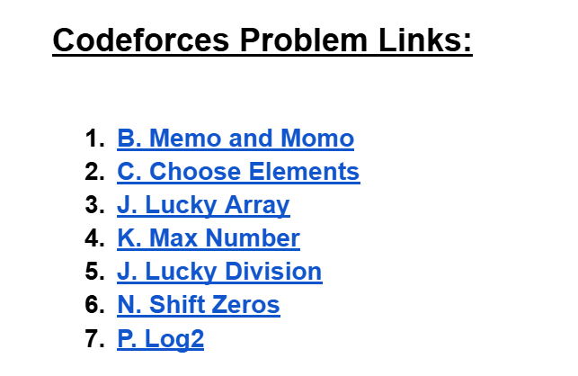

# Date: 14 May, 2025 - Wednesday

## Topics:
- Practice Problem Module 19.5
- Practice Instructions

## Practice Problem Module 19.5
- [Practice Problem Set :](https://docs.google.com/document/d/1fWgdURQDzQ4XhdTn_-bktF1gXLyJAcQC/edit?usp=sharing&ouid=110071013354717279052&rtpof=true&sd=true)
    - Topics:
        - Math
        - Frequency array
        - Sorting
        - Recursion
    - 
    - [Problem 1](https://codeforces.com/group/MWSDmqGsZm/contest/326175/problem/B)
    - [Problem 2](https://codeforces.com/group/MWSDmqGsZm/contest/329103/problem/C)
    - [Problem 3](https://codeforces.com/group/MWSDmqGsZm/contest/219774/problem/J)
    - [Problem 4](https://codeforces.com/group/MWSDmqGsZm/contest/223339/problem/K)
    - [Problem 5](https://codeforces.com/group/MWSDmqGsZm/contest/223206/problem/J)
    - [Problem 6](https://codeforces.com/group/MWSDmqGsZm/contest/223205/problem/N)
    - [Problem 7](https://codeforces.com/group/MWSDmqGsZm/contest/223339/problem/P)

## Practice Instructions
- Idea to final exam of introduction to c programming.
- Disguised with final exam mark system.
- How to prepared for final exam and practice all before from learn.