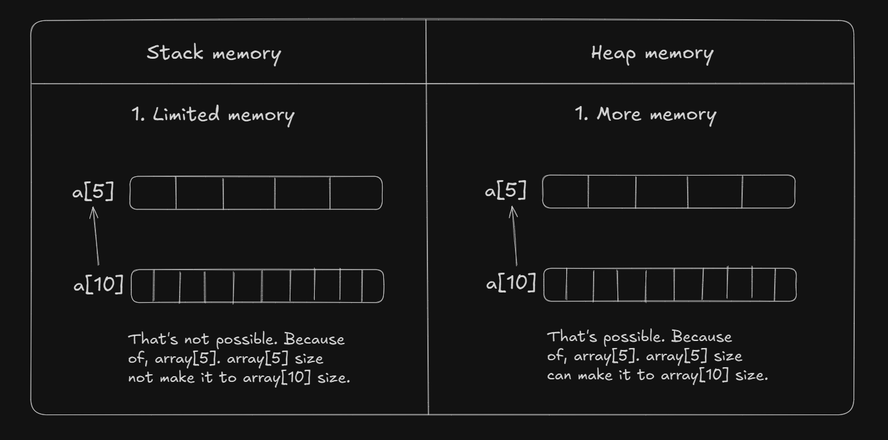
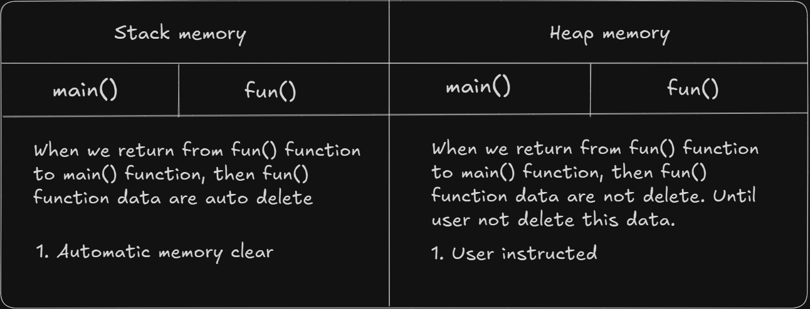

# Date: 25 May, 2025 - Sunday

## Topics:
0. Introduction
1. Static vs Dynamic Memory
2. Dynamic Variable
3. Dynamic variable Animated
4. Dynamic Array
5. Dynamic array Animated
6. Dynamic Array Return From Function
7. Return Array From Function Animated
8. Increase Size of Dynamic Array
9. Why We Need Dynamic Memory Allocation Animated
10. Summary
- Quiz: Module 02
- Feedback Form and Quiz Explanation

## 0. Introduction
- `Dynamic` and `Static` memory in C++
- How to declare dynamic variable in C++
- How to declare dynamic array in C++
- Array return from function in C++
- How to delete dynamic memory in C++

## 1. Static vs Dynamic Memory
- Stack memory in C++. It's also call to `Static` or `Compile Time` memory.
- Heap memory in C++. It's also call to `Dynamic` or `Runtime` memory.
- What is the difference between `stack memory` and `heap memory`?
    - Stack memory have limited memory.
    - Heap memory have more memory.
- Dynamic array and static array syntax are different.
- Dynamic and Static memory difference 1:
- 
- Dynamic and Static memory difference 2:
- 

## 2. Dynamic Variable
- How to declare dynamic variable in C++
- Program: `dynamic_variable.cpp`
- `new` keyword access to heap memory.
    - Syntax: `new datatype`
- Pointer use in dynamic variable.
- Pointer store another variable address.
- Pointer syntax:
    - `datatype *variable_name = new int;`
    - Like: `int *x = new int;`
- Stack memory are auto delete.
- Heap memory are not auto delete.

## 3. Dynamic variable Animated
- Explanation dynamic variable program. Like `dynamic_variable.cpp` this program.

## 4. Dynamic Array
- Program: `dynamic_array.cpp`
- Dynamic array structure:
    - `datatype array_name = new datatype[array_size]`

## 5. Dynamic array Animated
- Explanation this `dynamic_array.cpp` program.

## 6. Dynamic Array Return From Function
- Program: `dynamic_arr_func.cpp`

## 7. Return Array From Function Animated
- Explanation this `dynamic_arr_func.cpp` program.

## 8. Increase Size of Dynamic Array
- Program: `size_increase.cpp`
- You can delete a dynamic variable or dynamic array with this `delete var_name/arr_name` keyword using.
- Static variable or static array you can not delete.

## 9. Why We Need Dynamic Memory Allocation Animated
- Explanation dynamic memory allocation to the whole process 02 to 08 videos examples.
- `Problem 1`: Stack memory are auto delete when he return from a function
- `Problem 02`: You can not delete a stack memory variable or array.
- These two problem are solved with `Dynamic Variable/Array`

## 10. Summary
- Understand the dynamic memory allocation
- Understand what is the difference between dynamic or static memory.
- Understand dynamic variable and dynamic array.
- Static memory are auto delete data after return from function.
- Static memory size not increase but dynamic memory size are increase.
- C++ structure shortcut with snippet:
    - Copy C++ structure and then go to `snippet generator`. Paste to your structure and copy `VSCode` copy then go to your `VSCode software`. Click on `setting icon` go to snippet select on your languages then paste your copied generator copy code.

## Quiz: Module 02
- `Total Questions: 10`
- `Total Marks: 10`

## Quiz Explanation Module 02
- [Quiz Explanation Link](https://docs.google.com/document/d/1XK1FLgH0S442Al4sZx_o-6Zo8SE1W3NhlgTcqK1Ympo/edit?usp=sharing)
#### 1. What is dynamic memory allocation in C++?
**a)** Allocating memory at compile-time   
**b)** Allocating memory at runtime ✅  
**c)** Allocating memory on the stack   
**d)** Allocating memory for local variables  
> **Explanation:** Dynamic memory allocation হলো সেই প্রক্রিয়া যেখানে প্রোগ্রাম চলাকালীন (runtime) মেমোরি বরাদ্দ করা হয়। এর মাধ্যমে প্রোগ্রামার মেমোরির আকার ঠিক করতে পারেন এবং প্রয়োজন অনুযায়ী এটি বৃদ্ধি বা হ্রাস করতে পারেন। Static memory allocation compile-time-এ ঘটে এবং এর সাইজ পরিবর্তন করা যায় না।
---
#### 2. Which keyword is used to allocate dynamic memory in C++?
**a)** new ✅   
**b)** alloc()   
**c)** malloc()   
**d)** calloc()  
> **Explanation:** C++-এ dynamic memory allocation-এর জন্য new কিওয়ার্ড ব্যবহার করা হয়। এটি একটি pointer রিটার্ন করে। malloc() এবং calloc() C ভাষায় ব্যবহৃত হয়। C++-এ new দেওয়া হয়।
---
#### 3. What is the correct way to create a dynamic integer array in C++?
**a)** int array = new int[size];    
**b)** int* array = malloc(size);   
**c)** int* array = new int[size]; ✅   
**d)** int array[] = new int[size];  
> **Explanation:** Dynamic array তৈরি করতে new কিওয়ার্ড এবং একটি pointer ব্যবহার করতে হয়। malloc() বা অন্য কোনো ফাংশন ব্যবহার C++-এ করা হয় না।
---
#### 4. How do you deallocate(delete from heap memory) an array from dynamic memory in C++?
**a)** delete array_name    
**b)** free() array_name   
**c)** delete[] array_name ✅   
**d)** delete array_name[]  
> **Explanation:** Dynamic memory থেকে বরাদ্দকৃত array-কে মুছে ফেলার জন্য delete[] ব্যবহার করা হয়। delete শুধুমাত্র একটি সিঙ্গেল অবজেক্টের (যেমনঃ ভ্যারিয়েবল ) জন্য ব্যবহৃত হয়।
---
#### 5. How can you pass a dynamic array to a function as a parameter in C++?
**a)** Pass it as value    
**b)** Pass it as a pointer ✅   
**c)** Dynamic arrays cannot be passed to functions    
**d)** Pass it with return keyword  
> **Explanation:** Dynamic array মূলত pointer দিয়ে কাজ করে, তাই এটি ফাংশনে পাস করতে হলে pointer পাস করতে হয়। ফলে ফাংশনের ভিতরে সরাসরি পরিবর্তন করা যায়।
---
#### 6. What is the advantage of using dynamic arrays over static arrays in C++?
**a)** Dynamic arrays have a fixed size.    
**b)** Dynamic arrays are automatically deallocated.    
**c)** Dynamic arrays allow memory deletion and won’t remove automatically ✅    
**d)** Static arrays are faster than dynamic arrays.  
> **Explanation:** Dynamic array-এর প্রধান সুবিধা হলো এর মেমোরি runtime-এ বরাদ্দ করা হয় এবং মেমোরি পরবর্তী সময়ে মুছে ফেলা যায়। Static array-এর আকার compile-time-এ নির্ধারণ হয় এবং এটি পরিবর্তন করা যায় না।
---
#### 7. What is the purpose of the ternary operator in C++?
**a)** Bitwise operations    
**b)** Arithmetic calculations    
**c)** Conditional expressions ✅    
**d)** Loop control  
> **Explanation:** Ternary operator একটি শর্ত পরীক্ষা করে এবং তার উপর ভিত্তি করে দুটি expression-এর মধ্যে একটি রিটার্ন করে। এটি if-else এর সংক্ষিপ্ত রূপ।
---
#### 8. What is the syntax of the ternary operator in C++?
**a)** condition ? expression1 : expression2 ✅   
**b)** expression1 ? condition : expression2    
**c)** expression1 : expression2 ? condition     
**d)** condition : expression1 ? expression2  
> **Explanation:** Ternary operator-এর সাধারণ গঠন হলো:  
condition ? expression1 : expression2  
যদি condition সত্য হয়, তবে expression1 রিটার্ন হবে;   অন্যথায় expression2 রিটার্ন হবে।
---
#### 9. How can you return a dynamic array from a function in C++?(think deeply)
**a)** Return the array directly    
**b)** Return a pointer to the array ✅    
**c)** Return the dynamic memory directly     
**d)** Dynamic arrays cannot be returned from functions  
> **Explanation:** Dynamic array return করতে pointer রিটার্ন করতে হয়। Dynamic memory allocation heap-এ ঘটে, তাই এটি ফাংশন থেকে রিটার্নের পরেও মেমোরিতে থাকে।
---
#### 10. Which operator is used to access elements of a dynamic array by index?
**a)** .    
**b)** ->     
**c)** [] ✅     
**d)** *  
> **Explanation:** Dynamic array-এর element অ্যাক্সেস করতে [] অপারেটর ব্যবহার করা হয়।
যেমনঃ arr[0] = 10;
---

## Feedback Form Module 02
- মডিউল রিলেটেড তোমার যে কোন ফিডব্যাক থাকলে এই ফর্মে লিখে দিতে পারো। আমরা তোমার ফিডব্যাক গুরুত্বসহকার দেখব।
- [Form Links](https://forms.gle/DH5mjuGD1x2EZ4z29)