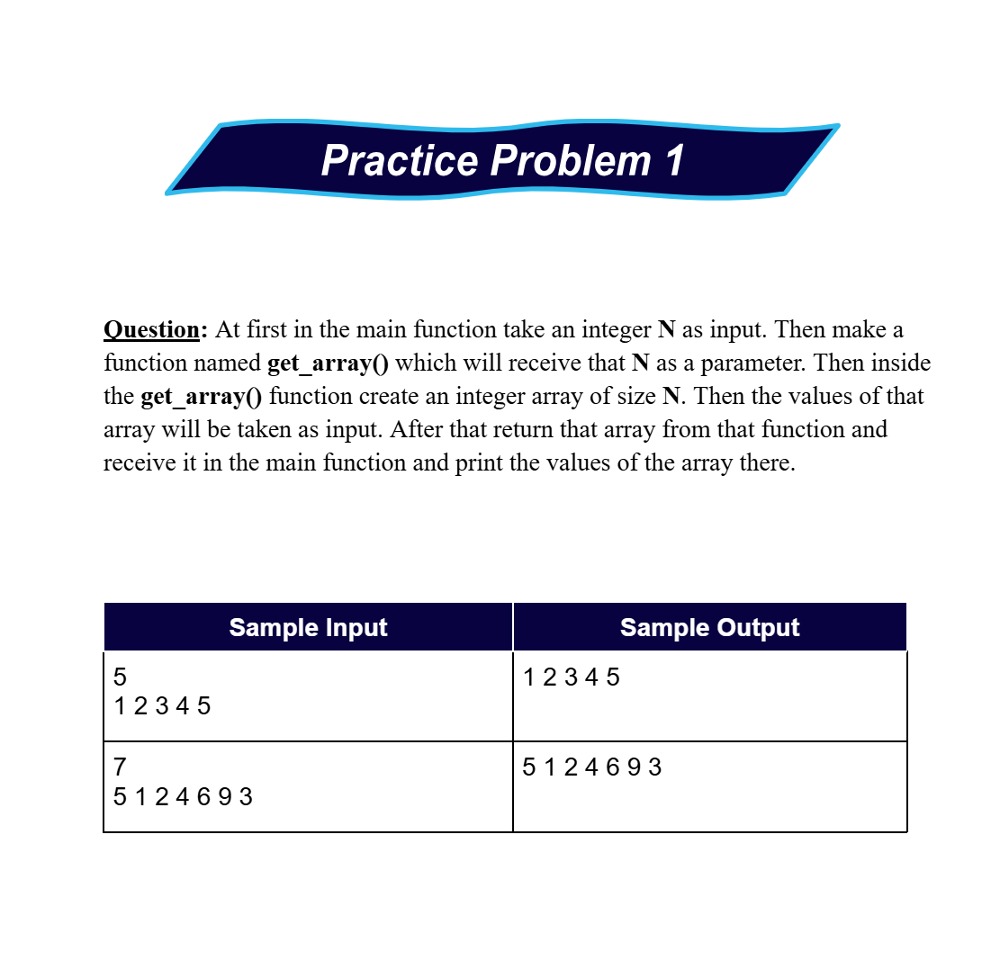
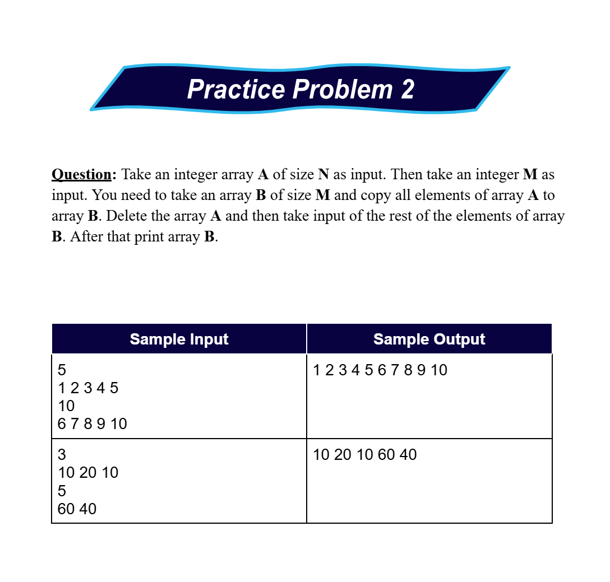

# Date: 26 May, 2025 - Monday

## Topics:
- Practice Problem Set
1. Practice Instructions
2. Max Solution

## Practice Problem Set
- [Link](https://docs.google.com/document/d/1oHwyJVnvl6wFvXi-NAKLUab_I4rzrTkw/edit?usp=drivesdk&ouid=114998114005563982581&rtpof=true&sd=true)
    - Topics:
        - Basic C++
        - Dynamic Memory Allocations
    - Codeforces Problem Links:
        - [Problem 1](https://codeforces.com/group/MWSDmqGsZm/contest/219158/problem/M)
        - [Problem 2](https://codeforces.com/group/MWSDmqGsZm/contest/219158/problem/C)
        - [Problem 3](https://codeforces.com/group/MWSDmqGsZm/contest/219774/problem/F)
        - [Problem 4](https://codeforces.com/group/MWSDmqGsZm/contest/219432/problem/E)
        - [Problem 5](https://codeforces.com/group/MWSDmqGsZm/contest/219158/problem/K)
    - Extra Practice Problems:
        - 
        - 

## 1. Practice Instructions
- Explanation extra practice problems.
- There problem plus more some problem solving then you clear of C++ concept.

## 2. Max Solution
- Max problem solving and then others problem are explanation.