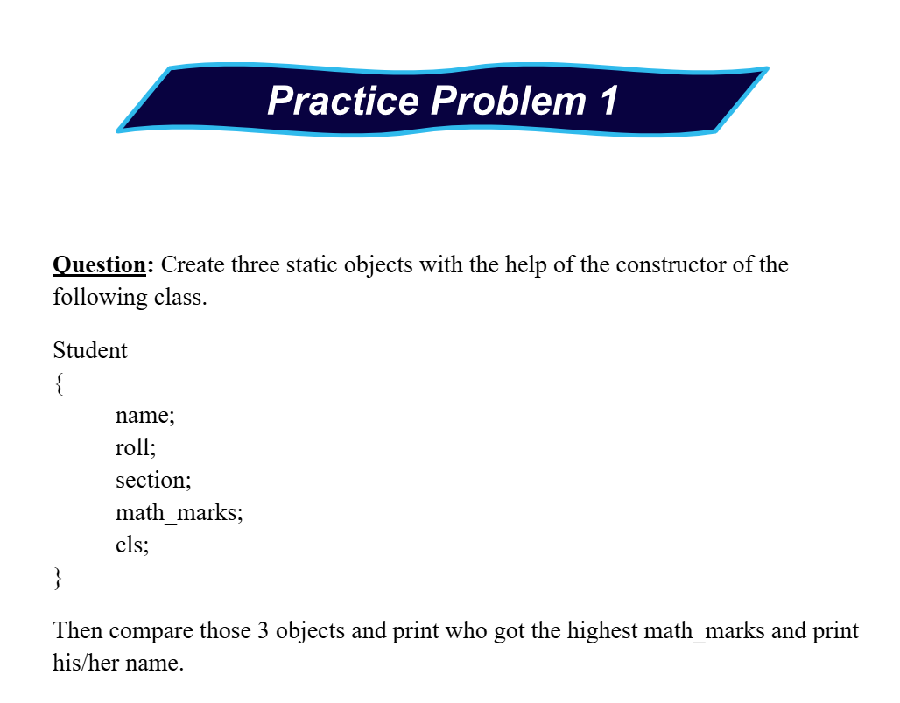
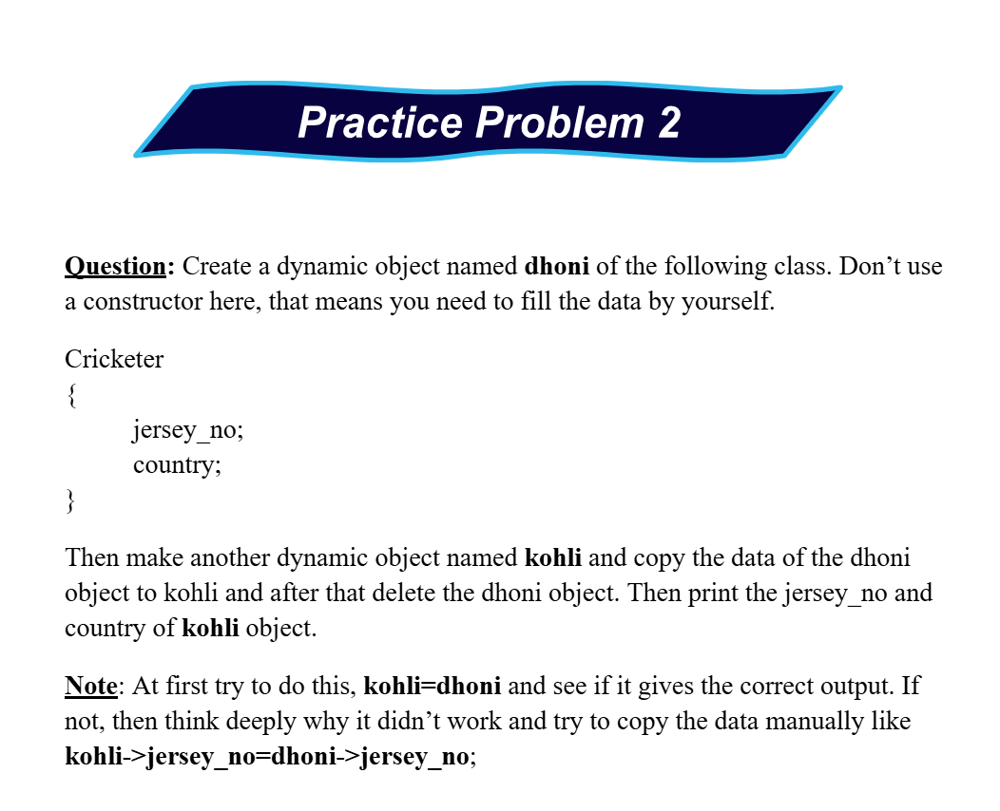

# Date: 28 May, 2025 - Wednesday

## Topics:
- Practice Problem Set: Module 3.5
1. Practice

## Practice Problem Set: Module 3.5
- [Link:](https://docs.google.com/document/d/1myhhYc5mXuI0G6jAMWp3yk4N0WO8aLse/edit?usp=drivesdk&ouid=112433310488936743525&rtpof=true&sd=true)
- Topics:
    - Basic C++
    - Class and Object
- Codeforces Problem Links:
    - [Problem 1](https://codeforces.com/group/MWSDmqGsZm/contest/219158/problem/V)
    - [Problem 2](https://codeforces.com/group/MWSDmqGsZm/contest/219158/problem/W)
    - [Problem 3](https://codeforces.com/group/MWSDmqGsZm/contest/219774/problem/G)
    - [Problem 4](https://codeforces.com/group/MWSDmqGsZm/contest/219774/problem/I)
    - [Problem 5](https://codeforces.com/group/MWSDmqGsZm/contest/219774/problem/H)
    - 
    - 

## 1. Practice
- Explanation all the problems include practice problems.