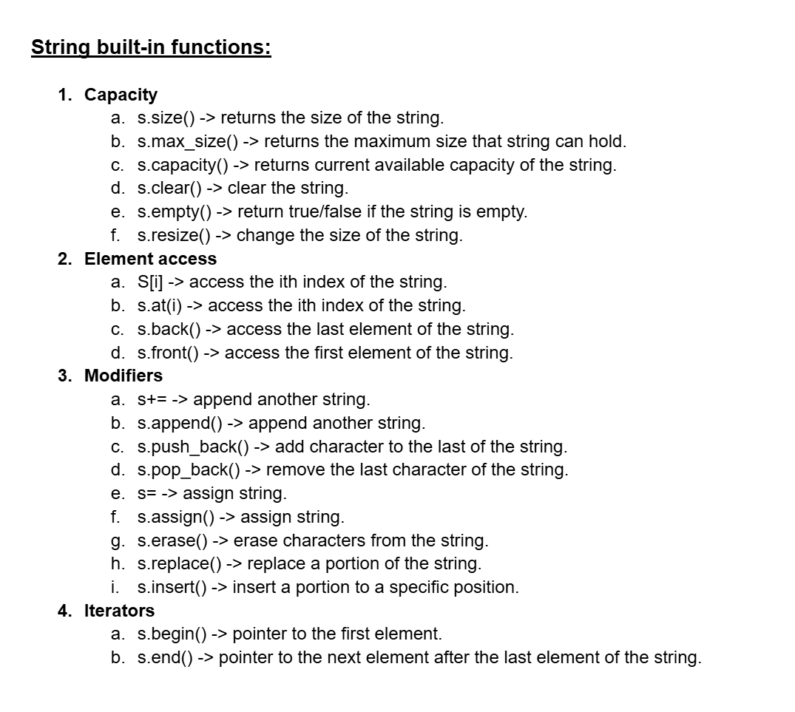
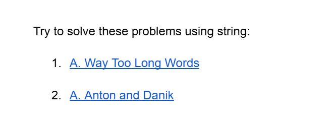

# Date: 31 May, 2025 - Saturday

## Topics:
- Important Links
0. Introduction
1. String in C++
2. String Capacity Functions
3. String Element Access
4. String Modifiers Part I
5. String Modifiers Part II
6. String Iterators
7. String iterator Animated
8. String input with spaces
9. Stringstream
10. Stringstream Animated
11. Summary
- Quiz: Module 05
- Feedback Form and Quiz Explanation

## Important Links
- [String Built In Functions:](https://docs.google.com/document/d/1nxFrcoG_t-hMbeuAw6A5r_CV7I1lYvKLwEpupTQqkrM/edit?usp=sharing)
    - 


- [Extra Practice (Optional):](https://docs.google.com/document/d/14sdQIgBZV29d8cSMPfMasotAc_jhZNgxaqRSOG_yR1c/edit?usp=sharing)
    - 
    - [Problem 1](https://codeforces.com/problemset/problem/71/A)
    - [Problem 2](https://codeforces.com/problemset/problem/734/A)

## 0. Introduction
- String in C++
- Build-in Functions of String - `size()`, `clear()`, `empty()`, `append()` etc.
- Taking Input with Space - `getline()` and `cin.get()`.
- Stringstream in C++
- Iterator in C++
- String Iterators - `begin()`, `end()`, `rbegin()`, `rend()`.

## 1. String in C++
- Program: `string.cpp`

## 2. String Capacity Functions
- Program: `string_capacity.cpp`
- `string` is a build-in class in c++.

## 3. String Element Access
- Program: `element_access.cpp`

## 4. String Modifiers Part I
- Program: `string_modifiers.cpp`
- `append()` and `push_back()` function are expand memory and adding new character.

## 5. String Modifiers Part II
- Program: `string_modifiers2.cpp`

## 6. String Iterators
- Program: `string_iterators.cpp`
- `begin()` and `end()` function also a pointer.
- If we give value from a pointer then use to dereference like `*`.
- Iterator basically work on a loops nothing ending point. Then use to iterator in loops.

## 7. String iterator Animated
- Explanation `string_iterators.cpp` this program. Just iterator explained.

## 8. String input with spaces
- Program: `string_space.cpp`
- Using `getline()` function for string.

## 9. Stringstream
- Program: `stringstream.cpp`

## 10. Stringstream Animated
- Explanation this code
    ```
    string s;
    getline(cin, s);
    cout << s << endl;

    stringstream ss(s);
    string word;
    while(ss >> word) {
        cout << word << endl;
    }
    ```

## 11. Summary
- String capacity functions
- String element access functions
- String modifiers functions
- String iterators functions
- Input with spaces in String
- We using `getline()` function
- We using `stringstream` in String

## Quiz: Module 05
- `Total Questions: 10`
- `Total Marks: 10`

## Quiz Explanation Module 05
- [Quiz Explanation:](https://docs.google.com/document/d/1h0joCeKS7C8t5V6GS9WypYdKD4ouBsWwXe1DwJ8SRbw/edit?usp=sharing)
#### 1. How can you access an individual character in a string?
**a)** Using the a() function     
**b)** Using the get() function   
**c)** Using the put() function   
**d)** Using the index operator [] ✅  
> **Explanation:** স্ট্রিংকে সি++-এ অ্যারের মতো ব্যবহার করা যায়। তাই ইনডেক্স অপারেটর ([]) ব্যবহার করে স্ট্রিং-এর নির্দিষ্ট পজিশনের ক্যারেক্টার অ্যাক্সেস করা সম্ভব। যেমনঃ str[0] , স্ট্রিং-এর প্রথম ক্যারেক্টার রিটার্ন করে।
---
#### 2. Which function is used to concatenate two strings?
**a)** append() ✅     
**b)** concat()   
**c)** join()   
**d)** merge()   
> **Explanation:** সি++-এ append() ফাংশন ব্যবহার করে দুটি স্ট্রিং যুক্ত করা হয়। এটি প্রথম স্ট্রিংয়ের শেষে দ্বিতীয় স্ট্রিং যোগ করে।
---
#### 3. What is the difference between push_back() and append() functions?
**a)** push_back() adds a character to the end, while append() concatenates two strings ✅     
**b)** push_back() is used with integers, while append() is used with strings   
**c)** push_back() is used with vectors, while append() is used with strings   
**d)** There is no difference, they are interchangeable   
> **Explanation:** push_back(): এটি শুধুমাত্র একটি ক্যারেক্টার স্ট্রিংয়ের শেষে যোগ করে।
append(): এটি পুরো একটি স্ট্রিংকে আরেকটি স্ট্রিংয়ের সাথে যুক্ত করে।
---
#### 4. How can you check if a string is empty?
**a)** Using the is_empty() function      
**b)** Using the empty() function ✅   
**c)** Using the is_null() function   
**d)** Using the insert() function   
> **Explanation:** সি++-এ empty() ফাংশন ব্যবহার করে কোনো স্ট্রিং খালি কি না তা যাচাই করা যায়। এটি একটি বুলিয়ান মান রিটার্ন করে।
---
#### 5. Which of the following options you will use to compare two strings for equality?
**a)** compares()      
**b)** equals()    
**c)** isEqualTo()   
**d)** == operator ✅ 
> **Explanation:** সি++-এ == অপারেটর দুটি স্ট্রিং তুলনা করতে ব্যবহার করা হয়। যদি স্ট্রিংগুলো সমান হয়, তবে এটি true রিটার্ন করে, অন্যথায় false।
---
#### 6. How can you input a string named str containing spaces using cin?
**a)** cin >> str;      
**b)** cin.getline(str);    
**c)** getline(cin, str); ✅   
**d)** cin.read(str, size);  
> **Explanation:** cin ডিফল্টভাবে প্রথম স্পেস পর্যন্ত ইনপুট নেয়। স্পেসসহ পুরো লাইন ইনপুট নিতে getline(cin, str) ব্যবহার করা হয়।
---
#### 7. Which function is used to ignore a particular character?
**a)** cin.ignore()      
**b)** ignore()    
**c)** getchar()    
**d)** both a and c ✅  
> **Explanation:** cin.ignore() and getchar() <br>
cin.ignore() ফাংশন , এই ফাংশনটি ইনপুট স্ট্রিম থেকে নির্দিষ্ট সংখ্যক ক্যারেক্টার বা একটি নির্দিষ্ট ক্যারেক্টার পর্যন্ত উপেক্ষা করতে ব্যবহৃত হয়। <br>
getchar() ফাংশন, এই ফাংশনটি ইনপুট স্ট্রিম থেকে একটি ক্যারেক্টার গ্রহণ করে এবং সেটি রিটার্ন করে। আপনি যদি এটি রিটার্ন করা ভ্যালুটি ব্যবহার না করেন, তাহলে এটি কার্যত ক্যারেক্টারটি উপেক্ষা করে।
---
#### 8. Which operator is used to concatenate two strings?
**a)** += ✅      
**b)** -    
**c)** *    
**d)** =  
> **Explanation:** += অপারেটর ব্যবহার করে দুটি স্ট্রিং যুক্ত করা যায়।
---
#### 9. Which one is used to extract data from a stringstream?
**a)** getline()       
**b)** extract()    
**c)** get()    
**d)** >> ✅  
> **Explanation:** >> অপারেটর ব্যবহার করে ডেটা stringstream থেকে বের করা হয়।
---
#### 10. How can you pass string ‘s’ to our stringstream “ss”?
**a)** stringstream ss(s);       
**b)** stringstream ss; ss >> s;    
**c)** stringstream ss; ss << s;    
**d)** both a and c ✅  
> **Explanation:** stringstream তৈরি করার দুইটি পদ্ধতি আছে: <br>
(i) সরাসরি ইনিশিয়ালাইজ করা: stringstream ss(s); <br>
(ii) স্ট্রিমে লেখা: stringstream ss; ss << s; <br>
---

## Feedback Form Module 05
- মডিউল রিলেটেড তোমার যে কোন ফিডব্যাক থাকলে এই ফর্মে লিখে দিতে পারো। আমরা তোমার ফিডব্যাক গুরুত্বসহকার দেখব।
- [Form Links](https://forms.gle/DH5mjuGD1x2EZ4z29)