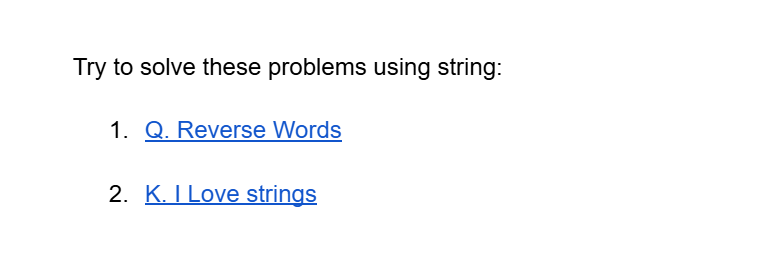

# Date: 01 June, 2025 - Sunday

## Topics:
0. Introduction
1. String Constructor
2. Sort string using sort() function
3. Range based for loop
4. Reverse function in C++
5. Reverse word codeforces solution
6. Function inside class
7. Function inside class Animated
8. Copy dynamic object
9. Copy dynamic object Animated
10. Summary
- Quiz: Module 06
- Extra Practice Problem and Quiz Explanation Module 06
- Feedback Form Module 06

## 0. Introduction
- Repeat and explore string and class
- Understanding to `string constructor`
- Understanding to `sorting string`
- Understanding to `range-based for loop`
- Understanding to `reverse word printing`
- Understanding to `functions inside classes`
- Understanding to `copying dynamic object`

## 1. String Constructor
- Program: `string_constructor.cpp`

## 2. Sort string using sort() function
- Program: `sort_string.cpp`

## 3. Range based for loop
- Program: `range_based.cpp`

## 4. Reverse function in C++
- Program: `reverse_functions.cpp`

## 5. Reverse word codeforces solution
- Program: `reverse_words.cpp`

## 6. Function inside class
- Program: `function_class.cpp`

## 7. Function inside class Animated
- Explanation to this code:
    ```
    #include <bits/stdc++.h>
    using namespace std;

    class Student {
        public:
        string name;
        int roll;

        Student(string name, int roll) {
            this->name = name;
            this->roll = roll;
        }

        void hello() {
            cout << "Hello from " << name << endl;
        }
    };

    int main() {
        Student sakib("Sakib Ahmed", 5);
        cout << sakib.name << endl;
        sakib.hello();
        Student rakib("Rakib Ahmed", 5);
        rakib.hello();

        return 0;
    }
    ```

## 8. Copy dynamic object
- Program: `dynamic_object.cpp`
- `Segmentation fault` - When we access a memory location they have not exits.

## 9. Copy dynamic object Animated
- Explanation this `dynamic_object.cpp`program code.

## 10. Summary
- Explore to `class` and `string`
- String constructor
- Sorting a string
- Range based for loop
- C++ build-in reverse function
- Problem solve from codeforces - reverse word
- Function inside class
- How to copy dynamic objects

## Quiz: Module 06
- `Total Questions: 10`
- `Total Marks: 10`

## Quiz Explanation Module 06
- [Quiz Explanation:](https://docs.google.com/document/d/1DWezZd84w4paxxg_Qi7fC3r2HatVlNWE9KXTzhEbBUs/edit?usp=sharing)
#### 1. What will be the value of s if we declare “string s(“hello”,2)”?
**a)** hello     
**b)** lo   
**c)** he ✅   
**d)** NULL   
> **Explanation:** C++-এ স্ট্রিং কনস্ট্রাক্টর string s("hello", 2) ব্যবহারের মাধ্যমে স্ট্রিং s-এর মধ্যে স্ট্রিং "hello" থেকে প্রথম ২টি ক্যারেক্টার কপি করা হয়। এভাবে, s-এর মান হয় "he"। এটি স্ট্রিং কনস্ট্রাক্টরের একটি গুরুত্বপূর্ণ বৈশিষ্ট্য, যেখানে সংখ্যা ব্যবহার করে সীমিত অংশ নির্বাচন করা যায়।
---
#### 2. What will be the value of s if we declare “string s(5,’a’)”?
**a)** aaaaa ✅     
**b)** a   
**c)** 5a    
**d)** A5   
> **Explanation:** স্ট্রিং কনস্ট্রাক্টর string s(5, 'a') ব্যবহার করে 'a' ক্যারেক্টারটি ৫ বার স্ট্রিংয়ের মধ্যে যোগ করা হয়। এর ফলে, s হয় "aaaaa"। এটি কনস্ট্রাক্টরের একটি সুবিধা যা নির্দিষ্ট সংখ্যক ক্যারেক্টার দিয়ে স্ট্রিং তৈরি করতে ব্যবহৃত হয়।
---
#### 3. What is the correct syntax of sorting a string object named s in c++?
**a)** sort()      
**b)** sort(s,s+n)   
**c)** sort(s.begin(),s.end()-1)    
**d)** sort(s.begin(),s.end()) ✅   
> **Explanation:** C++-এ sort() ফাংশন ব্যবহার করে স্ট্রিং বা অ্যারে সাজাতে হয়। s.begin() স্ট্রিংয়ের প্রথম ক্যারেক্টার নির্দেশ করে এবং s.end() শেষ ক্যারেক্টারের ঠিক পরের পজিশন নির্দেশ করে। এভাবে পুরো স্ট্রিং সাজানো সম্ভব। ভুল অপশনগুলোর মধ্যে s.end()-1 ব্যবহার করলে শেষ ক্যারেক্টার বাদ পড়ে।
---
#### 4. What is the name of the following loop?
```
    for(char ch: s) {}
```
**a)** Shortcut for loop      
**b)** Simple for loop   
**c)** Range based for loop ✅    
**d)** Ranger for loop    
> **Explanation:** C++-এর একটি সরলীকৃত ফর্ম যা রেঞ্জের প্রতিটি এলিমেন্টের উপর কাজ করে। স্ট্রিং s-এর প্রতিটি ক্যারেক্টার ch-এ ক্যারেক্টার হিসেবে পাওয়া যায়। এটিকে রেঞ্জ-বেসড ফর লুপ বলা হয়।
---
#### 5. Which one is the correct syntax for copying dynamic object B to A?
**a)** *A = *B ✅      
**b)** A = B   
**c)** A.copy(B)     
**d)** None of the above    
> **Explanation:** ডায়নামিক অবজেক্ট কপি করার জন্য ডি-রেফারেন্স অপারেটর (*) ব্যবহার করতে হয়। সরাসরি A = B করলে পয়েন্টার অ্যাসাইন হয়, কিন্তু অবজেক্টের ডেটা কপি হয় না। *A = *B ব্যবহার করলে উভয়    অবজেক্টের ডেটা এক হয়।
---
#### 6. Which keyword is used to refer to the current object instance within a class?
**a)** self       
**b)** that   
**c)** me     
**d)** this ✅    
> **Explanation:** C++-এ this কীওয়ার্ড ব্যবহার করে বর্তমান ক্লাস অবজেক্টকে রেফার করা হয়। এটি মেম্বার ভ্যারিয়েবল এবং প্যারামিটার ভ্যারিয়েবলের মধ্যে পার্থক্য করতে সাহায্য করে। উদাহরণস্বরূপ, this->x মানে বর্তমান অবজেক্টের x ভ্যারিয়েবল।
---
#### 7. How do you copy an object in C++?
**a)** Using the memcpy function       
**b)** Using the assignment operator (=) ✅   
**c)** Using the copy function     
**d)** Objects cannot be copied     
> **Explanation:** C++-এ অবজেক্ট কপি করতে = অপারেটর ব্যবহার করা হয়। এটি ক্লাসের কপি কনস্ট্রাক্টর বা অ্যাসাইনমেন্ট অপারেটরের মাধ্যমে ডেটা কপি করে। উদাহরণস্বরূপ, obj1 = obj2 করলে obj2-এর ডেটা obj1-এ কপি হবে।
---
#### 8. Suppose a string s contains the word "world". What will the following code snippet output?
```
string s = "world";
reverse(s.begin(), s.end());
cout << s;
```
**a)** dlrow ✅       
**b)** world    
**c)** rowld     
**d)** None of the above     
> **Explanation:** কোডে reverse(s.begin(), s.end()); ফাংশনটি s স্ট্রিং-এর শুরু থেকে শেষ পর্যন্ত (পুরো স্ট্রিং) রিভার্স করে দেয়। "world" স্ট্রিংটি রিভার্স হলে "dlrow" হয়ে যায়। তারপর cout << s; এটি রিভার্স হওয়া স্ট্রিংটি প্রিন্ট করে। তাই আউটপুট হবে "dlrow"।
---
#### 9. How do you access a member of a class using the "this" pointer?
**a)** this.member        
**b)** this->member ✅    
**c)** this::member     
**d)** this>member     
> **Explanation:** this পয়েন্টার ব্যবহার করে ক্লাসের বর্তমান অবজেক্টের মেম্বার অ্যাক্সেস করা যায়। উদাহরণস্বরূপ, this->x মানে বর্তমান অবজেক্টের x ভ্যারিয়েবল।
---
#### 10. What will the following code snippet print?
```
string s = "hello";
for (char ch : s) {
    cout << ch << "  ";
}
```
**a)** h e l l o ✅        
**b)** hello     
**c)** Compile error     
**d)** None of the above     
> **Explanation:** কোডটি একটি range-based for loop ব্যবহার করে স্ট্রিং s-এর প্রতিটি ক্যারেক্টারকে প্রিন্ট করে। for (char ch : s) লুপটি s-এর প্রতিটি ক্যারেক্টারকে একে একে ch ভেরিয়েবলে ধারণ করে। তারপর cout << ch << " "; লাইনটি প্রতিটি ক্যারেক্টারের পর একটি স্পেস সহ প্রিন্ট করে। ফলাফল: h e l l o (প্রতিটি ক্যারেক্টার একটি স্পেস দিয়ে আলাদা)।
---
- [Extra Practice Problem (Optional):](https://docs.google.com/document/d/1P10bN99yHVTCJ-Pz3_PC-Ie_WESe5Hl_JEMvdiQl6do/edit?usp=sharing)
- [Problem 1](https://codeforces.com/group/MWSDmqGsZm/contest/219856/problem/Q)
- [Problem 2](https://codeforces.com/group/MWSDmqGsZm/contest/219856/problem/K)
- 

## Feedback Form Module 06
- মডিউল রিলেটেড তোমার যে কোন ফিডব্যাক থাকলে এই ফর্মে লিখে দিতে পারো। আমরা তোমার ফিডব্যাক গুরুত্বসহকার দেখব।
- [Form Links](https://forms.gle/DH5mjuGD1x2EZ4z29)