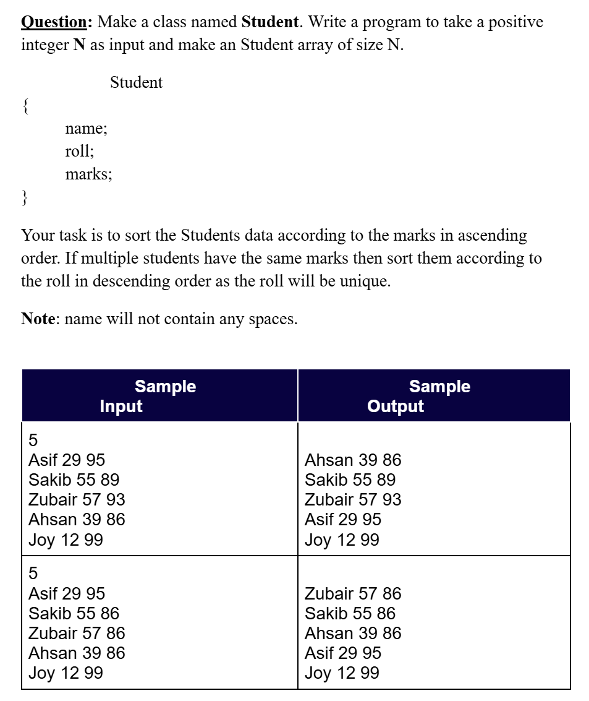

# Date: 03 June, 2025 - Tuesday

## Topics:
0. Introduction
1. Array of objects
2. Array of objects Animated
3. Min or Max from array of objects
4. Sort array of objects part I
5. Sort array of objects part II
6. Sort array of objects Animated
7. Sort array of objects part III
8. Sort array of objects part IV
9. Summary
- Quiz: Module 07
- Extra Practice Problem and Quiz Explanation Module 07

## 0. Introduction
- Array of objects
- Minimum and maximum in array of objects
- Sort array of objects
- Custom sort

## 1. Array of objects
- Program: `array_objects.cpp`

## 2. Array of objects Animated
- Explanation this `array_objects.cpp` program.

## 3. Min or Max from array of objects
- Program: `min_max.cpp`

## 4. Sort array of objects part I
- Program: `sort_array.cpp`
- Make a `custom compare function`. That means we write itself to a function and return type are `bool`.

## 5. Sort array of objects part II
- Explanation this `sort_array.cpp` program sort function also a `custom compare function` function explanation.
- `custom compare function` function work similarity also 99%.

## 6. Sort array of objects Animated
- Explanation with animated way `sort_array.cpp` this program whole code.

## 7. Sort array of objects part III
- Program: `sort_array2.cpp`
- The logic of sorting array - `When need this order make to true`

## 8. Sort array of objects part IV
- Program: `sort_array3.cpp`

## 9. Summary
- Array of objects
- Sorting array of objects with different ways
- Minimum and maximum find out from an objects
- Custom compare function in array of objects
- Mark ascending order or mark descending order
- Roll ascending order or roll descending order
- See those shortcut way
- Use to ternary operators in array of objects

## Quiz: Module 07
- `Total Questions: 10`
- `Total Marks: 10`

## Quiz Explanation Module 07
- [Quiz Explanation:](https://docs.google.com/document/d/1nJgs7zWIYOZ5UbzFkFyHaGGbhH0YwvGL4y8bbvVKftA/edit?usp=sharing)
#### 1. How to declare an array of objects of this Student class?
```
class Student {
    public:
    int roll;
    Student(int r) {	
        roll = r;
    }
};
```
**a)** Student a[5];     
**b)** Student* a[5];   
**c)** new Student a[5];    
**d)** we don’t declare array of objects of class with constructor. ✅   
> **Explanation:** যদি কোনো ক্লাসে কনস্ট্রাক্টর ডিফাইন করা থাকে এবং সেই কনস্ট্রাক্টরে প্যারামিটার প্রয়োজন হয়, তাহলে সরাসরি অবজেক্টের অ্যারে ডিক্লেয়ার করা সম্ভব নয়। কারণ প্যারামিটার ছাড়া কনস্ট্রাক্টর কল করা সম্ভব হবে না। <br>
যদি আমরা Student a[5]; ব্যবহার করি, তবে এটি কোনো আর্গুমেন্ট ছাড়াই পাঁচটি Student অবজেক্ট তৈরি করার চেষ্টা করবে, যা কনস্ট্রাক্টরের অভাবে কম্পাইল-টাইম ত্রুটি সৃষ্টি করবে। এই কারণে, প্যারামিটারযুক্ত কনস্ট্রাক্টর থাকা অবস্থায় এমন অ্যারে সরাসরি ডিক্লেয়ার করা সম্ভব নয়।
---
#### 2. How to declare a static array of objects of this Student class?
```
class Student {
    public:
	int roll;
};
```
**a)** Student a[5]; ✅     
**b)** Student* a[5];   
**c)** new Student a[5];    
**d)** we don’t declare array of objects of class with constructor.    
> **Explanation:** যেহেতু এখানে কোনো কনস্ট্রাক্টর নেই, একটি স্ট্যাটিক অ্যারে সরাসরি ডিক্লেয়ার করা যায় Student a[5]; দিয়ে। এটি পাঁচটি Student অবজেক্ট তৈরি করবে।
---
#### 3. Suppose we have created a static array of 5 objects of Student class. How can we access 3rd student’s roll?
**a)** a[3].roll;      
**b)** a[2]->roll;   
**c)** a[2].roll; ✅     
**d)** *(a[2].roll);    
> **Explanation:** অ্যারের ইন্ডেক্স ০ থেকে শুরু হয়। তাই তৃতীয় এলিমেন্ট অ্যাক্সেস করতে হলে a[2] ব্যবহার করতে হবে। a[2].roll লেখার মাধ্যমে আপনি ঐ অবজেক্টের roll প্রোপার্টি পেতে পারবেন।
---
#### 4. What will be the datatype of our mx variable, if we want to find the object with maximum marks from an array of objects of a class named Student?
**a)** int mx;      
**b)** Student mx; ✅   
**c)** int* mx;      
**d)** None of the above.    
> **Explanation:** যেহেতু আমরা একটি অবজেক্টের সর্বোচ্চ প্রপার্টি খুঁজছি, তাই আমাদের Student টাইপের একটি ভেরিয়েবল প্রয়োজন যা সেই অবজেক্ট ধারণ করতে পারে। তাই Student mx; ব্যবহার করতে হবে।
---
#### 5. It is possible to get the object with maximum marks using the builtin max function
**a)** True      
**b)** False ✅       
> **Explanation:** C++-এর built-in max ফাংশন সাধারণত দুটি মান (যেমন, সংখ্যা বা প্রিমিটিভ ডেটা টাইপ) তুলনা করতে ব্যবহার করা হয়। এটি object-এর ক্ষেত্রে সরাসরি কাজ করে না, কারণ object-এর মধ্যে কীভাবে তুলনা করতে হবে, তা max ফাংশন জানে না।
---
#### 6. What is the return type of comparator function?
**a)** Int      
**b)** Float         
**c)** Bool ✅       
**d)** None of the above.        
> **Explanation:** C++-এর comparator ফাংশন হলো একটি user-defined ফাংশন, যা sorting বা তুলনা করার সময় ব্যবহার করা হয়। এই ফাংশনের কাজ হলো দুটি object বা মানের মধ্যে তুলনা করা এবং true বা false রিটার্ন করা।
---
#### 7. What is our condition in the comparator function, if we want to sort by descending order of roll?
**a)** if(a[i].roll < a[j].roll)      
**b)** if(a[i].roll > a[j].roll) ✅         
**c)** if(a[i]->roll < a[j]->roll)        
**d)** if(a[i]->roll > a[j]->roll)        
> **Explanation:** Descending order-এ সোর্ট করতে হলে, আমাদের শর্ত হবে a[i].roll যদি a[j].roll এর চেয়ে বড় হয় তবে True return হবে।
---
#### 8. What’s the syntax to sort array of objects of a class using built-in sort function?
**a)** sort(array_name, array_name+size);      
**b)** sort(array_name.begin(), array_name.end());          
**c)** sort(array_name, array_name+size, user_defined_bool_function); ✅        
**d)** sort(array_name);        
> **Explanation:** যখন আমরা একটি অবজেক্ট অ্যারে সোর্ট করতে চাই, আমাদের একটি user_defined_bool_function সরবরাহ করতে হবে যা কাস্টম শর্ত অনুযায়ী সঠিক সিকোয়েন্স প্রদান করবে।
---
#### 9. If this is our user-defined boolean compare function, then in which order our array of objects will sort?
```
bool cmp(Student a, Student b) {
    if(a.roll > b.roll) {
        return true;
    }
    else {
        return false;
    }
}
```
**a)** Ascending order of roll.      
**b)** Descending order of roll. ✅          
**c)** Descending order of marks.         
**d)** Ascending order of marks.        
> **Explanation:** উপরের কম্পারেটর ফাংশনটি a.roll এবং b.roll এর তুলনায় a.roll > b.roll এর ক্ষেত্রে true রিটার্ন করে। এটি roll এর ডেসেন্ডিং অর্ডার নিশ্চিত করে।
---
#### 10. How can we access the index of a lowercase character stored in variable(c) in frequency array named frq?
**a)** frq[c-97]      
**b)** frq[c-’a’]           
**c)** Both of the above. ✅         
**d)** None of the above.        
> **Explanation:** স্ট্রিং থেকে কোনো ছোট হাতের অক্ষরের ফ্রিকোয়েন্সি খুঁজতে হলে, আমরা c-'a' বা c-97 ব্যবহার করতে পারি। এটি c অক্ষরের ASCII মান থেকে 'a' বা ৯৭ বাদ দিয়ে তার সঠিক ইন্ডেক্স নির্ধারণ করে।
---
[Extra Practice Problem (Optional):](https://docs.google.com/document/d/15rYM3MJapotWUND4XENMVHnduPzIoSqLVqTPgg7goJE/edit?usp=sharing)


## Feedback Form Module 07
- মডিউল রিলেটেড তোমার যে কোন ফিডব্যাক থাকলে এই ফর্মে লিখে দিতে পারো। আমরা তোমার ফিডব্যাক গুরুত্বসহকার দেখব।
- [Form Links](https://forms.gle/DH5mjuGD1x2EZ4z29)