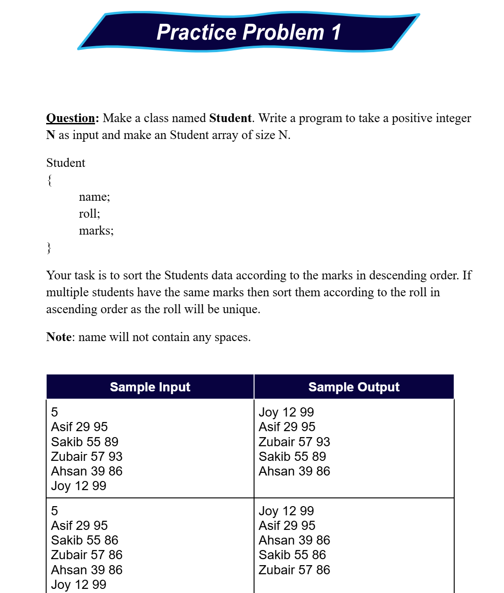
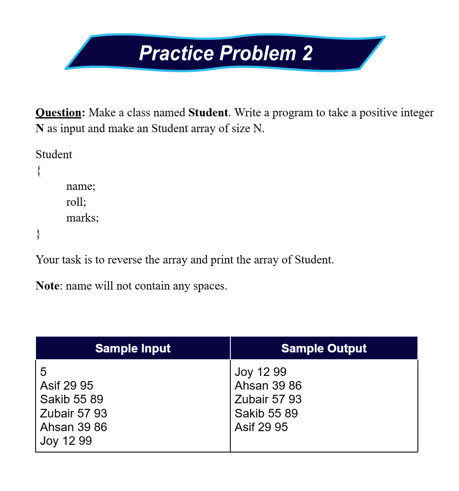
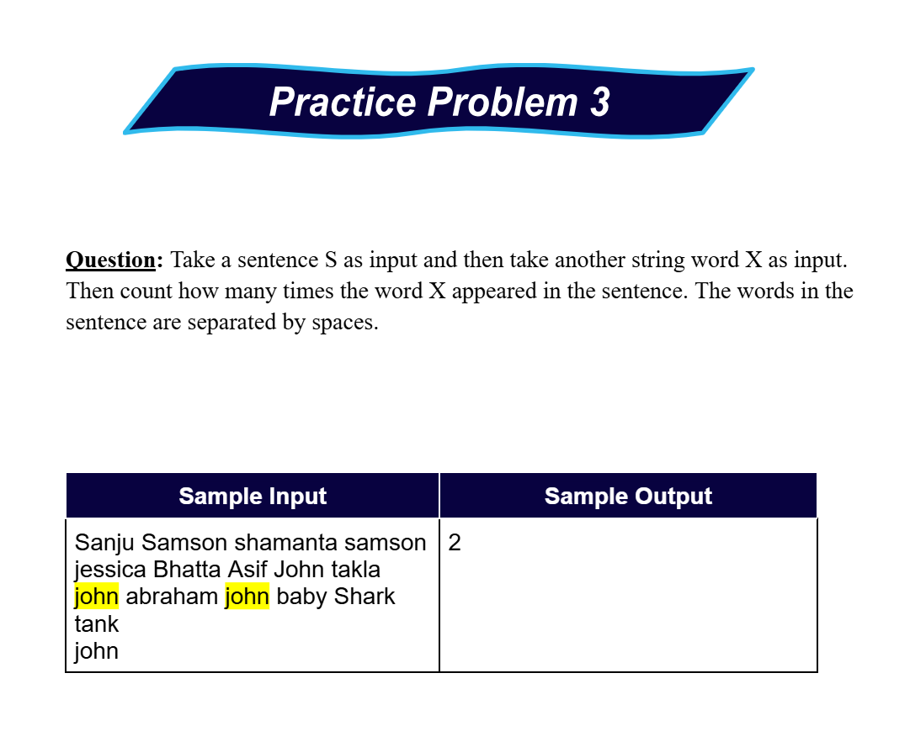

# Date: 04 June, 2025 - Wednesday

## Topics:
- Practice Problem Set: Module 7.5
1. Practice

## Practice Problem Set: Module 7.5
- [Link](https://docs.google.com/document/d/1opBWGSgS0Kc51mwh9xWCF7n1TXwiadYF/edit?usp=drivesdk&ouid=114998114005563982581&rtpof=true&sd=true)
- Topics:
    - Array of Objects
    - Random questions
- Codeforces Links:
    - [Problem 1](https://codeforces.com/group/MWSDmqGsZm/contest/329103/problem/G)
    - [Problem 2](https://codeforces.com/group/MWSDmqGsZm/contest/223205/problem/H)
- Extra Practice Problems:
    - 
    - 
    - 

## 1. Practice
- Explanation this whole practice problem set