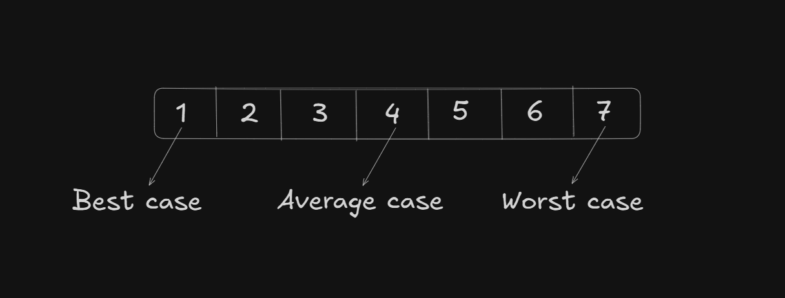

# Date: 15 June, 2025 - Sunday

## Topics:
- Text Instruction: Module 01 [Must Read]
- DS Course Overview
0. Introduction
1. Why we need to learn time complexity
2. What is time complexity
3. How to calculate time complexity
4. Linear Complexity O(N)
5. Logarithmic Complexity O(logN)
6. Sqrt complexity O(sqrt(N))
7. Quadratic complexity O(N_N)
8. Linearithmic complexity O(NlogN)
9. Best to Worst Complexity
10. Solving time complexity related problems
11. How to calculate time from time complexity
12. Space Complexity
13. Summary
- Quiz: Module 01
- Extra Practice Problem and Quiz Explanation
- Feedback Form

## Text Instruction: Module 01 [Must Read]
- সি প্রোগ্রামিং এবং সি++ এর দুর্দান্ত একটা জার্নি শেষ করে এখন নতুন আরেকটা জার্নি শুরু হতে যাচ্ছে আজ থেকে। এই জার্নিতে তোমাদের আরো বেশী ডেডিকেটেড হতে হবে। কারন এই কোর্সের মাধ্যমে প্রোগ্রামিং এর মজার জগতে তুমি আরেক ধাপ এগিয়ে যেতে পারবে। শুরু হচ্ছে তোমাদের ৩য় কোর্স ডাটা স্ট্রাকচার। এটি ২য় সেমিস্টারের প্রথম কোর্স। রিলিজ হচ্ছে মডিউল নাম্বার ১।
- ডাটা স্ট্রাকচার কোন ল্যাংগুয়েজ দিয়ে যেন করানো হবে? হ্যাঁ তোমরা তো জানোই এটা সি++ দিয়ে করানো হবে। আজকে শেখানো হবে প্রোগ্রামিং এর অতি গুরুত্বপূর্ণ টপিক কমপ্লেক্সিসিটি। যেকোন কোডিং ইন্টারভিউ এবং প্রফেশনাল প্রোগ্রামিং ক্যারিয়ারে এটা অনেক বেশী ইম্পর্ট্যান্ট। কমপ্লেক্সিসিটি আসলে কি? এটা কয় প্রকার এবং কিভাবে সেগুলো বের করতে হয়, তা নিয়ে বিস্তারিত আলোচনা থাকবে আজকের মডিউলে।
- প্রোগ্রামিং শিখতে হলে প্রোগ্রামিংকে ভালোবাসতে হবে। এটাকে যদি নিজের লাইফের প্যারা মনে করো তাহলে তোমাকে দিয়ে কখনোই প্রোগ্রামিং হবেনা। প্রোগ্রামিং শিখতে হলে কষ্ট অবশ্যই করতে হবে। ডেডিকেটেড হতে হবে। আজকে থেকে আবার নতুন উদ্যমে শুরু করে দাও। আজকে যারা বড় বড় প্রোগ্রামার তাদের কারো জার্নিই স্মুথ ছিলোনা। কষ্ট করার মাধ্যমেই তারা আজ সফল হয়েছে। সো শুভ কামনা রইলো সবার জন্য।

## DS Course Overview
- Learn with week wise
- Week 01 - Time and Space Complexity: The foundation
- Week 02 - Linked Lists: Dynamic Data Storage
- Week 03 - Doubly Linked Lists: Enhanced Flexiblity
- Week 04 - Stacks and Queues: LIFO and FIFO Structures
- Week 05 - Binary Trees: Hierarchical Data Organization
- Week 06 - Binary Search Trees: Efficient Searching
- Week 07 - Heaps: Priority Queue Implementation

## 0. Introduction
- Understanding Time and Space Complexity
- What is Time Complexity?
- Calculating Time from Complexity
- Linear Time Complexity: `O(N)`
- Logarithmic Time Complexity: `O(Log N)`
- Quadratic Time Complexity: `O(N*N)`
- Linearithmic Time and Complexity: `O(N log N)`
- Square Root Time Complexity: `O(sqrt(N))`
- What is Space Complexity?

## 1. Why we need to learn time complexity
- Program: `sum.cpp`
- Two way to solve this program. Which one the better way?
    - Solve to `Time Complexity`. Formula way was better. Because of, formula just do it one single line and loops was repeat 100 times.
- For another example for better understand `Why we need to learn time complexity`
    - Program: `binary_search.cpp`
    - That's problem was almost solve. But this program have an error of - `Time limit exceeded (TLE)`
    - Now, the target was not problem solve, to solve better way or optimized.
    - `TLE` means code logic was right but do not this better way. Make sure it better way.
    - This `TLE` got remove to know `Time Complexity`.
    - When you know the `Time Complexity` then you will understand with problems input, which way to solve it.

## 2. What is time complexity
- `Time Complexity` are not work with time. Means how much time to need this run. There haven't this logic. `Time Complexity` are work step or operations.
```
for(int i = 0; i < n; i++) {
    cout << "Hello world";
}
```
How much time to repeat this loops
- `1000` - `1000 OP`
- `20` - `20 OP`
- `10` - `10 OP`
- `n` - `n OP`
- `0(n)`

## 3. How to calculate time complexity
- `Time Complexity` when you calculate then you have must to known this `Asymptotic notations`
- `Asymptotic notations` have 3 types:
    - `Omega notation (Ω)` - Best case
    - `Theta notation (θ)` - Average case
    - `Big O notation (O)` - Worst case
- Example with Drawing:

- Rules of calculate time complexity:
    - Always take the worst case
    - Ignore the constant
- `O(n)` - When a code going on last line or nth line, then we work or take to `worst case` and `worst case` symble is the `big O`. Also called to `order of n`
```
for(int i = 0; i < n-1; i++) {
    cout << "Hello world";
}
```
- OR
```
for(int i = 0; i < n-2; i++) {
    cout << "Hello world";
}
```
- OR
```
for(int i = 0; i < 2n; i++) {
    cout << "Hello world";
}
```
- Then you can `ignore the constant`. That's means use to `O(n) - Order of n`

## 4. Linear Complexity O(N)
- Program: `linear_complexity.cpp`
    - This program final complexity of `O(n) - order of n`. And ingore the constant.
    - `O(n+n+4) = O(n+n) = O(2n) = O(n)`. We will ingore constant.

## 5. Logarithmic Complexity O(logN)
- Program: `logarithmic_complexity.cpp`
    - Best way to understand `logarithmic complexity` when a loops increment part evolution with `substraction` and decrement part of `division` then you understand this is `logarithmic complexity`.

## 6. Sqrt complexity O(sqrt(N))
- Program: `sqrt_complexity.cpp`

## 7. Quadratic complexity O(N_N)
- Program: `quadratic_complexity.cpp`
- Complexity calculate by we need and customize. There have so many complexity.

## 8. Linearithmic complexity O(NlogN)
- Program: `linearithmic_complexity.cpp`

## 9. Best to Worst Complexity
- Program: `best_worst_complexity.cpp`