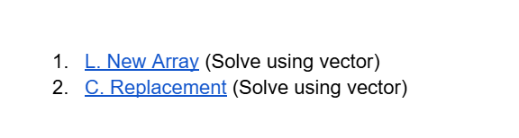

# Date: 17 June, 2025 - Tuesday

## Topics:
- Vector Built-in Functions
0. Introduction
1. Vector initialization
2. Vector Capacity functions
3. Vector Modifiers I
4. Vector Modifiers II
5. Vector Element Access
6. Vector Iterators
7. Vector input and output
8. Vector of String
9. Summary
- Quiz: Module 02
- Extra Problems and Quiz Explanation
- Feedback Form

## Vector Built-in Functions
- [Link](https://docs.google.com/document/d/1nxpbS-5RKFSwcJ6mHv3P2Vru9HTqXOeB/edit?usp=sharing&ouid=112433310488936743525&rtpof=true&sd=true)


## 0. Introduction
- STL vector basic
- Vector modifiers function
- Vector capacity function
- Vector accessing and input
- Vector of strings

## 1. Vector initialization
- `STL` - `Standard Template Library`
- `Vector` work with dynamic array.
- Program: `vector_initialization.cpp`

## 2. Vector Capacity functions
- Program: `vector_capacity.cpp`

## 3. Vector Modifiers I
- Program: `vector_modifiers.cpp`

## 4. Vector Modifiers II
- Program: `vector_modifiers2.cpp`

## 5. Vector Element Access
- Program: `vector_element.cpp`

## 6. Vector Iterators
- Program: `vector_iterators.cpp`

## 7. Vector input and output
- Program: `vector_input.cpp`

## 8. Vector of String
- Program: `string_vector.cpp`

## 9. Summary
- Known to STL vector
- How to vector initialization
- Known to capacity functions
- Known to modifiers functions
- Learn to every function time complexity
- Known to element access functions
- Known to iterators functions
- Learn how to get input in vector and vector of string

## Quiz: Module 02
- `Total Questions: 10`
- `Total Marks: 10`

## Quiz Explanation Module 02
- [Extra Problem Link](https://docs.google.com/document/d/1zCtGILmwz3TTS35Y9PPE3kqZ_O8NIPcov6Sz_QIB94c/edit?usp=drivesdk)
    - 
    - [Problem 1](https://codeforces.com/group/MWSDmqGsZm/contest/223205/problem/L)
    - [Problem 2](https://codeforces.com/group/MWSDmqGsZm/contest/219774/problem/C)


- [Quiz Explanation Link](https://docs.google.com/document/d/11R5lR-YMVVmkB4hs7xkMV9Vw9qrOwjiRgFtxRWdafNw/edit?usp=drivesdk)
#### 1. What will be the output of the v[3] of the following code snippet?
```
int a[4] = {12, 13, 14, 15};
vector<int> v(a, a+4);
```
**a)** 12     
**b)** 14   
**c)** 13    
**d)** 15 ✅  
> **Explanation:** এখানে, a একটি অ্যারে যার মান {12, 13, 14, 15}। এরপর v নামে একটি vector তৈরি করা হয়, যা a অ্যারের প্রথম উপাদান থেকে শুরু হয়ে শেষ উপাদান পর্যন্ত (অর্থাৎ a+4 পর্যন্ত) মান গুলি ধারণ করবে। <br>
`v[0] = 12` <br>
`v[1] = 13` <br>
`v[2] = 14` <br>
`v[3] = 15` <br>
তাহলে, v[3] এর মান হবে 15, কারণ v[3] তে a অ্যারের চতুর্থ উপাদান থাকবে, যা 15। <br>
`উত্তর: 15`
---
#### 2. How do you add an element to the end of a vector in C++?
**a)** v.add(element);     
**b)** v.insert(element);   
**c)** v.push_back(element); ✅    
**d)** v.append(element);   
> **Explanation:** push_back() ফাংশনটি একটি vector এর শেষে একটি নতুন উপাদান যোগ করে।
---
#### 3. Which of the following functions is used to check if a vector is empty?
**a)** size()     
**b)** capacity()   
**c)** empty() ✅    
**d)** clear()   
> **Explanation:** empty() ফাংশনটি একটি vector এর ভিতরে কোনও উপাদান আছে কিনা তা চেক করে। যদি vector খালি থাকে, এটি true রিটার্ন করে; অন্যথায় false রিটার্ন করে।
---
#### 4. What will be the output of the following code if we print the vector?
```
vector<int> v = {1, 2, 3, 4};
v.resize(2);
v.resize(4);
```
**a)** 1 2 3 4     
**b)** 1 2 3 0   
**c)** 1 2 0 0 ✅    
**d)** 0 0 0 0   
> **Explanation:** `1.` প্রথমে v ভেক্টরটি {1, 2, 3, 4} দিয়ে শুরু হয়। <br> `2.` v.resize(2) কল করার পর, ভেক্টরের আকার ২ এ পরিবর্তিত হয়, এবং এখন এটি {1, 2} হবে। অতিরিক্ত উপাদানগুলো (৩ ও ৪) মুছে ফেলা হয়। <br> `3.` এরপর v.resize(4) কল করা হয়, যা ভেক্টরের আকার ৪ হয়। কিন্তু এখানে কোনো নতুন উপাদান সরাসরি প্রদান করা হয়নি, তাই স্বয়ংক্রিয়ভাবে নতুন উপাদানগুলির মান 0 হয়ে যাবে। ফলে ভেক্টরটি {1, 2, 0, 0} হবে। <br> `উত্তর: 1 2 0 0 `
---
#### 5. Which function would you use to delete the last element of a vector in C++?
**a)** erase()     
**b)** pop_back() ✅   
**c)** clear()     
**d)** remove()   
> **Explanation:** pop_back() ফাংশনটি vector এর শেষ উপাদানটি মুছে ফেলে। এটি vector এর আকার এক করে কমিয়ে দেয়।
---