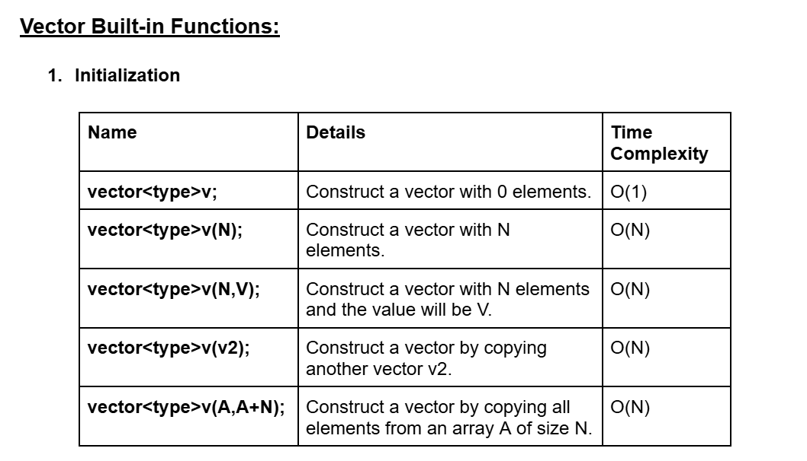
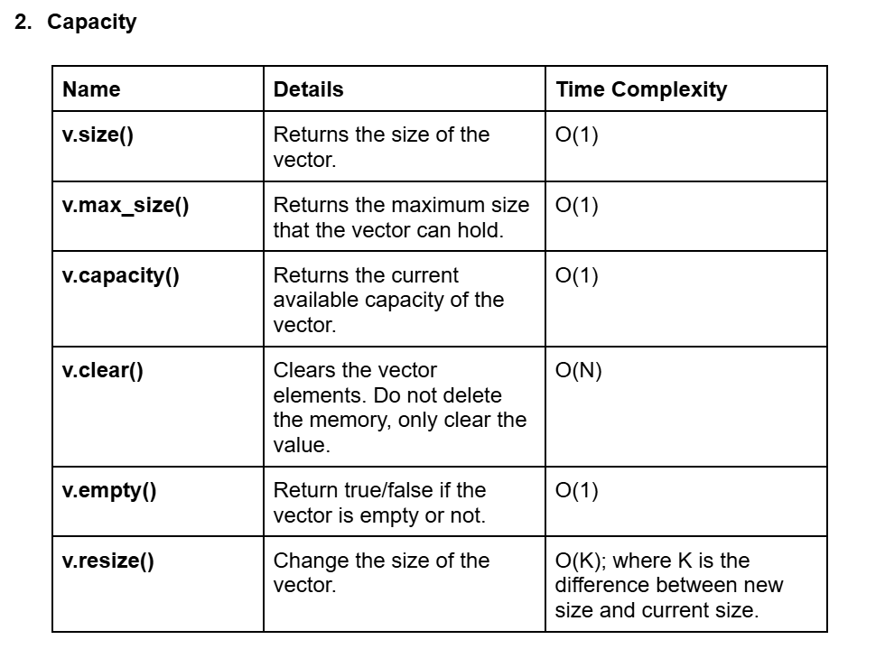
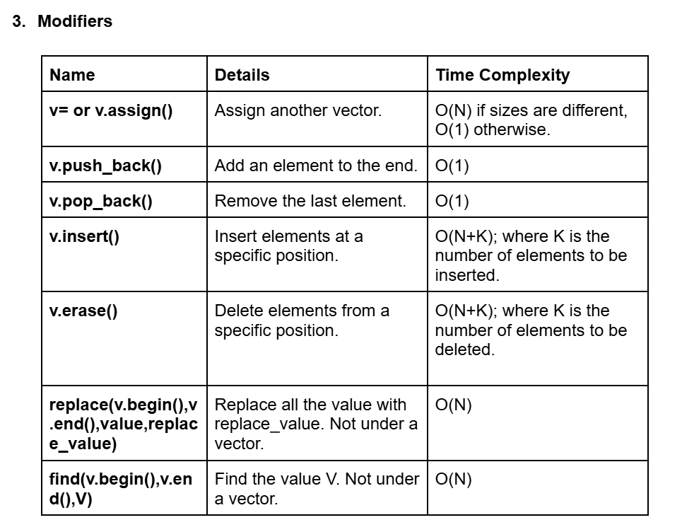
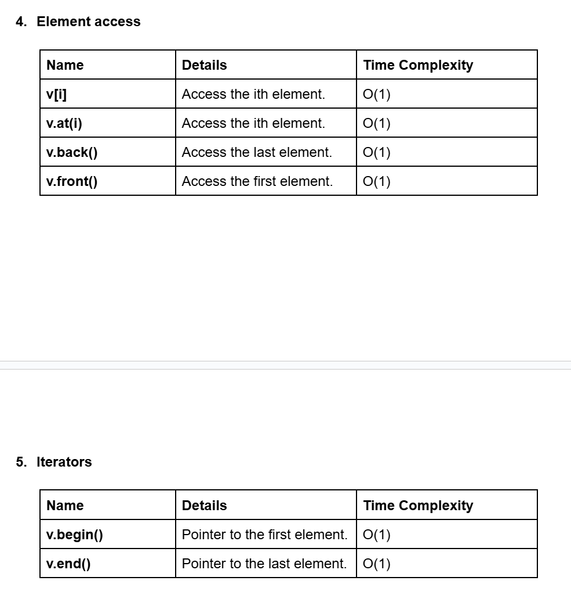

# Date: 17 June, 2025 - Tuesday

## Topics:
- Vector Built-in Functions
0. Introduction
1. Vector initialization
2. Vector Capacity functions
3. Vector Modifiers I
4. Vector Modifiers II
5. Vector Element Access
6. Vector Iterators
7. Vector input and output
8. Vector of String
9. Summary
- Quiz: Module 02
- Extra Problems and Quiz Explanation
- Feedback Form

## Vector Built-in Functions
- [Link](https://docs.google.com/document/d/1nxpbS-5RKFSwcJ6mHv3P2Vru9HTqXOeB/edit?usp=sharing&ouid=112433310488936743525&rtpof=true&sd=true)

## 0. Introduction
- STL vector basic
- Vector modifiers function
- Vector capacity function
- Vector accessing and input
- Vector of strings

## 1. Vector initialization
- `STL` - `Standard Template Library`
- `Vector` work with dynamic array.
- Program: `vector_initialization.cpp`

## 2. Vector Capacity functions
- Program: `vector_capacity.cpp`

## 3. Vector Modifiers I
- Program: `vector_modifiers.cpp`

## 4. Vector Modifiers II
- Program: `vector_modifiers2.cpp`

## 5. Vector Element Access
- Program: `vector_element.cpp`

## 6. Vector Iterators
- Program: `vector_iterators.cpp`

## 7. Vector input and output
- Program: `vector_input.cpp`