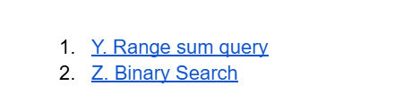

# Date: 21 June, 2025 - Saturday

## Topics:
0. Introduction
1. Range Sum Query Bruteforce solution
2. Idea of Prefix Sum
3. Range sum Query prefix sum solution I
4. Range Sum Query prefix sum solution II
5. Prefix Sum Animated
6. Binary Search Bruteforce solution
7. Idea of Binary Search
8. Steps of Binary Search
9. Binary Search Animated
10. Binary Search Implementation
11. Binary Search solution
12. Summary
- Quiz: Module 03
- Quiz Explanation and Practice Problem Set
- Feedback Form: Module 03

## 0. Introduction
- New two technique - `Prefix sum` and `Binary search`
- Understand the `prefix sum`
- Power of binary search
- Binary search in action
- Mastering data structure

## 1. Range Sum Query Bruteforce solution
- `Brute force` - A problem solve with simple way not optimize or better way to solve, that's brute force.
- [Problem Link](https://codeforces.com/group/MWSDmqGsZm/contest/219774/problem/Y)
- 
- Problem solve program: `prefix_sum.cpp`
- This problem solving have done `prefix_sum.cpp`. Not error but TLE that's means time complexity.

## 2. Idea of Prefix Sum
- Program: `prefix_sum2.cpp`
- Not done idea of prefix some this module

## 3. Range sum Query prefix sum solution I
- Program: `prefix_sum3.cpp`
- Solved the next module...

## 4. Range Sum Query prefix sum solution II
- Program: `prefix_sum4.cpp`

## 5. Prefix Sum Animated
- Explanation this program `prefix_sum4.cpp` with prefix sum

## 6. Binary Search Bruteforce solution
- `Brute force` - A problem solve with simple way not optimize or better way to solve, that's brute force.
- [Problem Link](https://codeforces.com/group/MWSDmqGsZm/contest/219774/problem/Z)
- 
- Problem solve program: `binary_search.cpp`
- This problem solving have done `binary_search.cpp`. Not error but TLE that's means time complexity.

## 7. Idea of Binary Search
- Learn to explore `binary search` and this is very powerful algorithms
- Different between `binary search` and `linear search`
- When array are sorted then you apply `binary search`
- When array are unsorted then you apply `linear search`

## 8. Steps of Binary Search
- Once more understand to `Binary Search`
- `middle = (left+right)/2`

## 9. Binary Search Animated
- Explanation `binary search` with animation way

## 10. Binary Search Implementation
- Program: `binary_search2.cpp`
- This problem normally solve with binary search

## 11. Binary Search solution
- Program: `binary_search3.cpp`
- Problem solve from link or image with `binary search` using.

## 12. Summary
- There have this module two problem solve `prefix sum` and `binary search`.
- Understand deeply what is `prefix sum`
- Understand deeply what is `binary search`

## Quiz: Module 03
- `Total Questions: 10`
- `Total Marks: 10`

## Quiz Explanation Module 03
- [Quiz Explanation Link](https://docs.google.com/document/d/1iw2V33H1N6SJVkUQd3DDbG7h7ct2UV5lbuusSBwv4ho/edit?usp=drivesdk)
- [Extra Problem Link](https://docs.google.com/document/d/1LMFyd4rQ5Gpyc48Ht5b9RFBc3A2ycqEP/edit?usp=drivesdk&ouid=112433310488936743525&rtpof=true&sd=true)
    - 
    - [Problem 1](https://codeforces.com/group/MWSDmqGsZm/contest/219774/problem/Y)
    - [Problem 1](https://codeforces.com/group/MWSDmqGsZm/contest/219774/problem/Z)

#### 1. What is the purpose of a prefix sum algorithm?
**a)** Sorting an array     
**b)** Finding the maximum element in an array   
**c)** Calculating the cumulative sum of elements in an array    
**d)** Reversing an array ✅  
> **Explanation:** ক্রমযোজিত যোগফল (cumulative sum) বের করার মাধ্যমে কোনো রেঞ্জের যোগফল সহজে বের করার জন্য prefix sum algorithm ব্যবহার করা হয়।
---
#### 2. What is the time complexity of calculating a prefix sum using a loop?
**a)** O(n)     
**b)** O(logn) ✅   
**c)** O(n^2)    
**d)** O(1)   
> **Explanation:** 2 থেকে n পর্যন্ত একটি for loop চালানোর মাধ্যমে prefix sum array টি generate করা হয়ে থাকে।
---
#### 3. What is the time complexity of calculating a range based sum from L to R using a prefix sum array?
**a)** O(n)     
**b)** O(logn)    
**c)** O(n^2)    
**d)** O(1) ✅   
> **Explanation:** প্রিফিক্স সাম array টি generate করার পর শুধুমাত্র ঐ array টির ইন্ডেক্স এক্সেস করার মাধ্যমে আমরা একটি রেঞ্জের যোগফল O(1) কমপ্লেক্সিটি তে বের করে আনতে পারি।
---
#### 4. What is the time complexity of binary search in the worst case?
**a)** O(n)     
**b)** O(logn) ✅    
**c)** O(n^2)    
**d)** O(1)    
> **Explanation:** Binary search এর ক্ষেত্রে ম্যাক্সিমাম logN বার লুপ চললে একটি মান খুজে নেয়া যায়।
---
#### 5. Binary search can be applied to which of the following?
**a)** Sorted arrays ✅     
**b)** Unsorted arrays    
> **Explanation:** যেহেতু একটি iteration এর পর ভ্যালুটি খুজে না পেলে আমরা ভ্যালুটির মান ছোট নাকি বড় তা কম্পেয়ার করে আমাদের সার্চ স্পেসটির বাম সাইড / ডান সাইড ইগ্নোর করি , তাই sorted array না হলে কোন সাইড ইগ্নোর করবো তা সিদ্ধান্ত নেয়া যাবে না।
---
#### 6. In binary search, what is the index of the middle element in each iteration?
**a)** (start + end) / 2 ✅     
**b)** (start + end) / 4     
**c)** (start + end) / 8    
**d)** (start + end) / (start - end)    
> **Explanation:** মিডল ইন্ডেক্স পাওয়া যাবে start+end কে ২ দ্বারা ভাগ করার মাধ্যমে।
---
#### 7. In binary search, what is the condition for terminating the search if the target element is not found?
**a)** When the start index becomes greater than the end index. ✅     
**b)** When the start index becomes equal to the end index.     
**c)** When the middle element becomes equal to the target value.    
**d)** When the middle element becomes greater than the target value.    
> **Explanation:** start index থেকে end index বড় হয়ে যাওয়া মানে হলো এই রেঞ্জ টি valid নয়। valid search space না হলে আমরা আমাদের সার্চ টি বন্ধ করে দিবো।
---