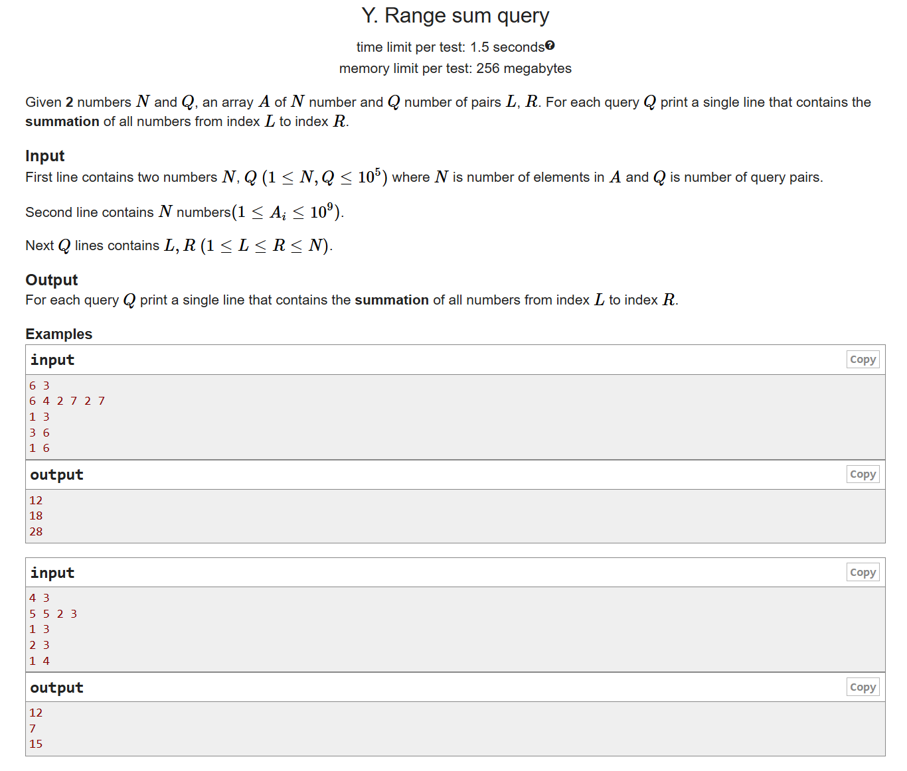
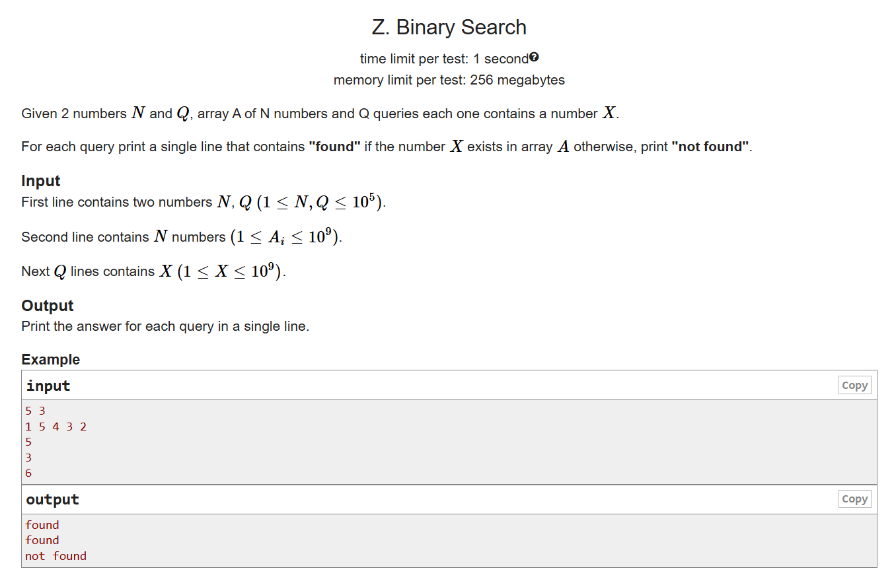

# Date: 21 June, 2025 - Saturday

## Topics:
0. Introduction
1. Range Sum Query Bruteforce solution
2. Idea of Prefix Sum
3. Range sum Query prefix sum solution I
4. Range Sum Query prefix sum solution II
5. Prefix Sum Animated
6. Binary Search Bruteforce solution
7. Idea of Binary Search
8. Steps of Binary Search
9. Binary Search Animated
10. Binary Search Implementation
11. Binary Search solution
12. Summary
- Quiz: Module 03
- Quiz Explanation and Practice Problem Set
- Feedback Form: Module 03

## 0. Introduction
- New two technique - `Prefix sum` and `Binary search`
- Understand the `prefix sum`
- Power of binary search
- Binary search in action
- Mastering data structure

## 1. Range Sum Query Bruteforce solution
- `Brute force` - A problem solve with simple way not optimize or better way to solve, that's brute force.
- [Problem Link](https://codeforces.com/group/MWSDmqGsZm/contest/219774/problem/Y)
- 
- Problem solve program: `prefix_sum.cpp`
- This problem solving have done `prefix_sum.cpp`. Not error but TLE that's means time complexity.

## 2. Idea of Prefix Sum
- Program: `prefix_sum2.cpp`
- Not done idea of prefix some this module

## 3. Range sum Query prefix sum solution I
- Program: `prefix_sum3.cpp`
- Solved the next module...

## 4. Range Sum Query prefix sum solution II
- Program: `prefix_sum4.cpp`

## 5. Prefix Sum Animated
- Explanation this program `prefix_sum4.cpp` with prefix sum

## 6. Binary Search Bruteforce solution
- `Brute force` - A problem solve with simple way not optimize or better way to solve, that's brute force.
- [Problem Link](https://codeforces.com/group/MWSDmqGsZm/contest/219774/problem/Z)
- 
- Problem solve program: `binary_search.cpp`
- This problem solving have done `binary_search.cpp`. Not error but TLE that's means time complexity.

## 7. Idea of Binary Search
- Learn to explore `binary search` and this is very powerful algorithms
- Different between `binary search` and `linear search`
- When array are sorted then you apply `binary search`
- When array are unsorted then you apply `linear search`

## 8. Steps of Binary Search
- Once more understand to `Binary Search`
- `middle = (left+right)/2`

## 9. Binary Search Animated
- Explanation `binary search` with animation way

## 10. Binary Search Implementation
- Program: `binary_search2.cpp`

## 11. Binary Search solution
- 