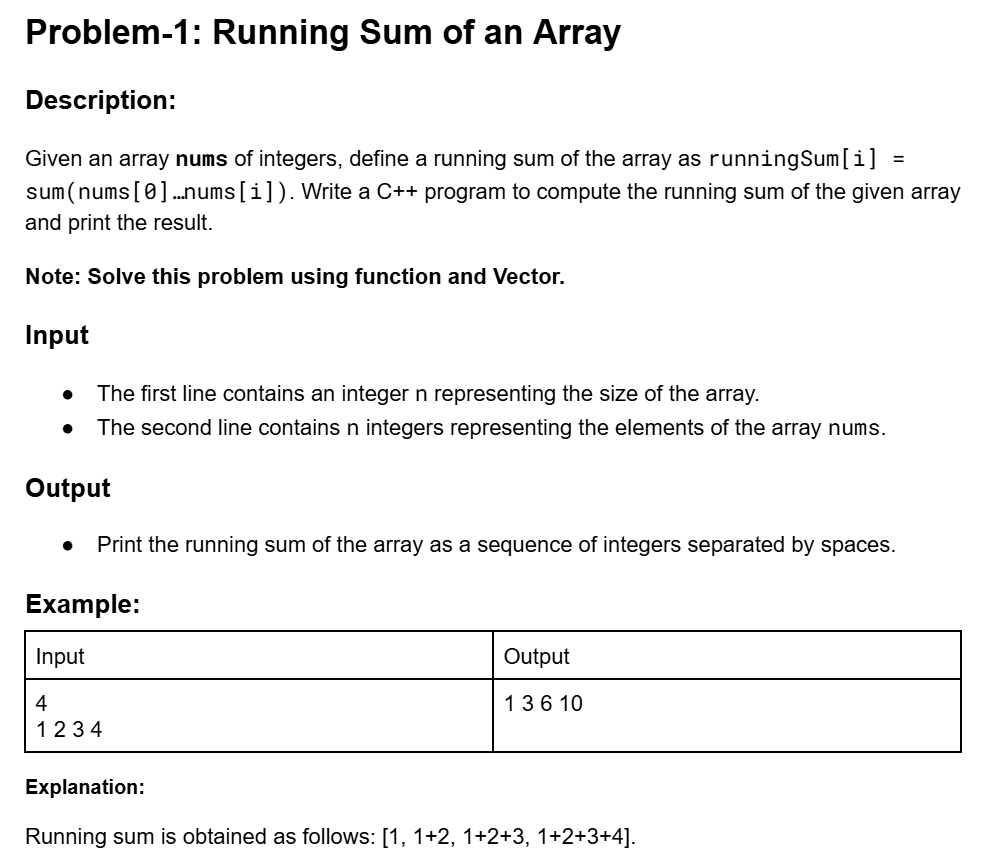
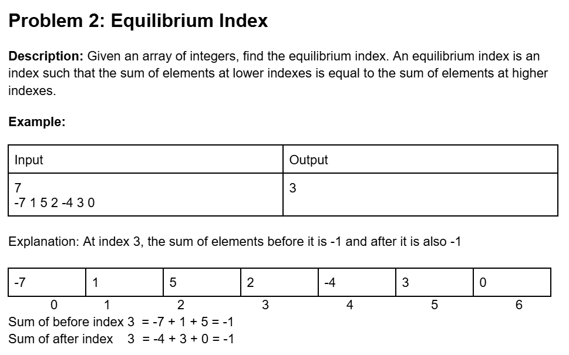
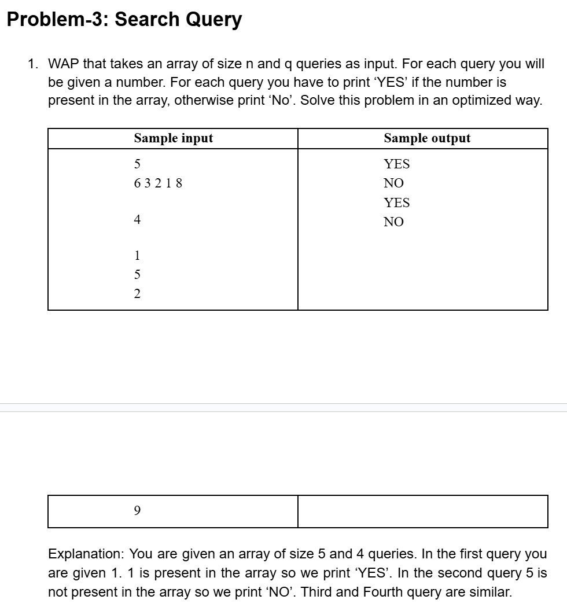
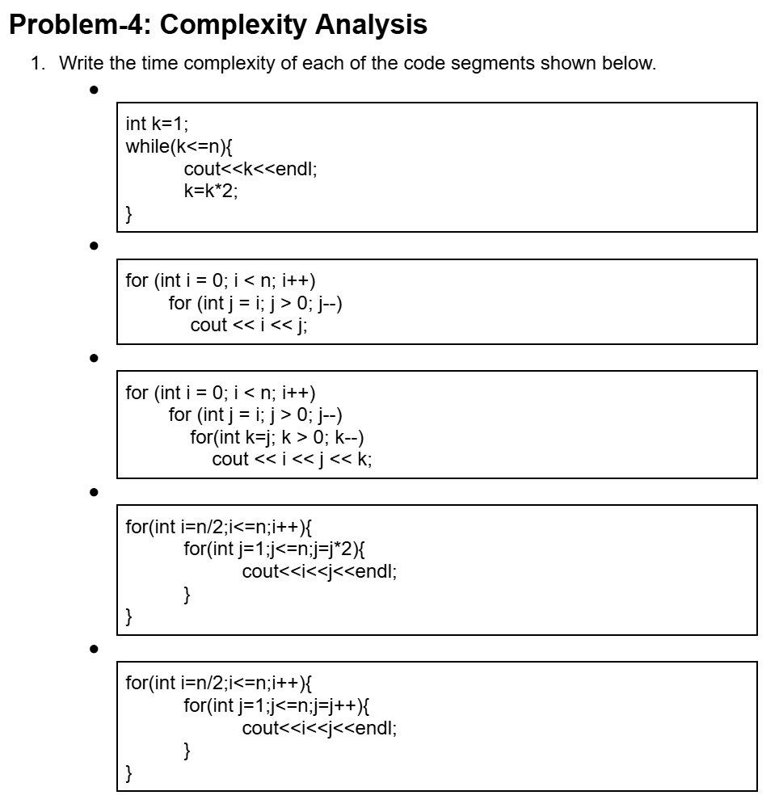
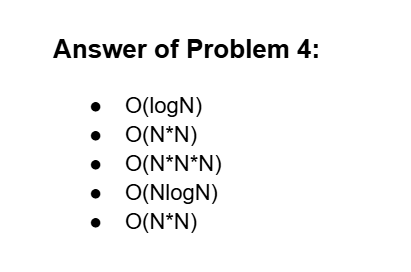
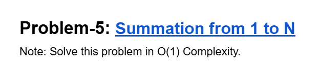

# Date: 23 June, 2025 - Monday

## Topics:
- Practice Problem Set
1. Practice

## Practice Problem Set
- [Link](https://docs.google.com/document/d/1SInJU7vWMgmLO-lulcQ2aGAeLze-0632fS8Iz-14t_A/edit?tab=t.0)
- Problem 1:
    - 
- Problem 2:
    - 
- Problem 3:
    - 
- Problem 4:
    - 

- Ans sheet:
    - 

- Problem 5:
    - 
    - [Link:](https://codeforces.com/group/MWSDmqGsZm/contest/219158/problem/G)

## 1. Practice
- Explanation this whole problems. `1` to `5` problems.