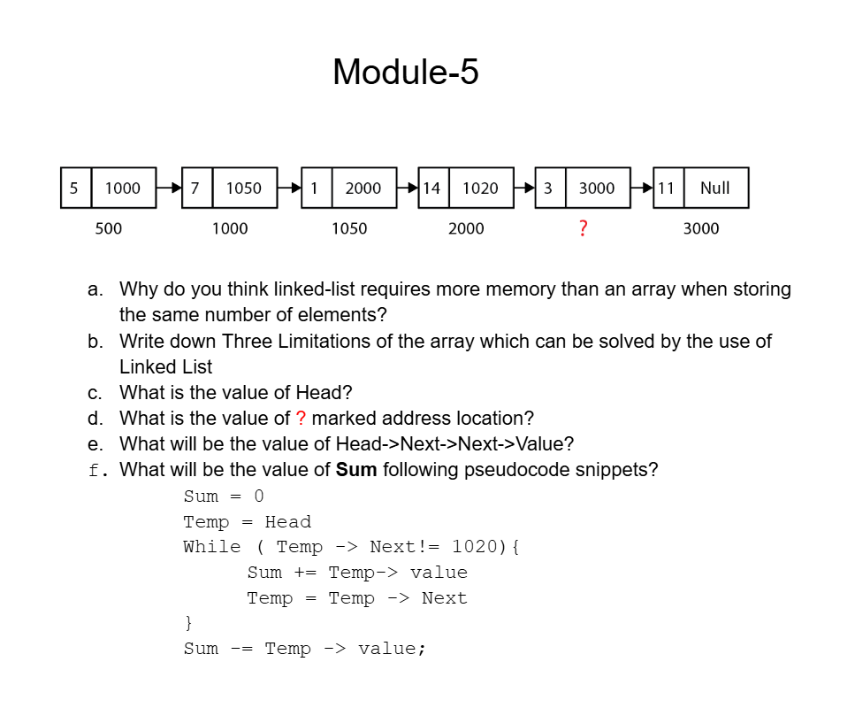

# Date: 28 June, 2025 - Saturday

## Topics:
0. Introduction
1. Another limitation of array
2. Idea of a Linked list
3. Creating a Node
4. Creating a Node Animated
5. Node with Constructor
6. Dynamic Node
7. Dynamic Node Animated
8. Printing Linked List
9. Printing Linked List Animated
10. Summary
- Quiz: Module 05
- Quiz Explanation and Extra Practice Problems
- Feedback Form: Module 05

## 0. Introduction
- Learn and understand to `Linked List`.
- Why learn linked list?
- Understand the basics of `linked lists`
- Creating a `singly linked list`
- Visualizing the `linked list`
- Printing the `linked list`

## 1. Another limitation of array
- Array also a data structure and array have main two problems are:
    - `Fixed size`
    - `Sequential Memory Allocation`
- This problem solve and covered with `Linked List`
- `Fixed size` problem also solve with `array` and `vector` but `Sequential Memory Allocation` this problem not solving with `array` and `vector`
- Program: `linked_list.cpp`
- Drawing `Sequential Memory Allocation`:
    - 
- Memory are not empty with serial or sequential, then `array` or `vector` memory not access. This is the problem of `Sequential Memory Allocation`.

## 2. Idea of a Linked list
- Array memory allocate are serially and sequentially.
- 
- `Linked list` value are connect to each others with his address that's why it called to `linked list` and `linked list` end eas `null` address using.

## 3. Creating a Node
- Program: `creating_node.cpp`
- In an array value and address then they called to `node`
    - 
- A `node` going to next `node` then use to `node` address not array element address.
    - 
- A `first node` also called to `head node`

## 4. Creating a Node Animated
- Explanation this code
    ```
    class Node {
        public:
        int value;
        Node* next;
    };

    int main() {
        Node a, b, c;
        a.value = 10;
        b.value = 20;
        c.value = 30;

        a.next = &b;
        b.next = &c;
        c.next = NULL;
    }
    ```

## 5. Node with Constructor
- Program: `creating_node2.cpp`
- Using a constructor in Node

## 6. Dynamic Node
- Program: `dynamic_node.cpp`
- Create a dynamic objects or node.

## 7. Dynamic Node Animated
- How to work dynamic array with singly linked list
- Explanation this program:
    ```
    int main() {
        Node* head = new Node(10);
        Node* a = new Node(20);
        Node* b = new Node(30);

        head->next = a;
        a->next = b;

        return 0;
    }
    ```

## 8. Printing Linked List
- Program: `print_linked_list.cpp`

## 9. Printing Linked List Animated
- Explanation this program:
    ```
    // Node or value with 10, 20, 30, 40
    tmp = head;
    while(tmp != NULL) {
        cout << tmp->value << endl;
        tmp = tmp->next;
    }
    ```

## 10. Summary
- Learn to `Linked List` data structure
- Why need to `Linked List`
- How to create a `node` in `Linked List`
- Then use to `Constructor` in `node`
- Then learn to `Dynamic Node`
- How to print a `Linked List`

## Quiz: Module 05
- `Total Questions: 10`
- `Total Marks: 10`

## Quiz Explanation and Extra Practice Problems
- [Quiz Explanation Link](https://docs.google.com/document/d/1DbwQuXaihsNJh5VlggPDJOccDr_C0HsZL2sCLMxROaw/edit?usp=sharing)
- [Extra Problem Link](https://docs.google.com/document/d/1mBmbTd2A0r2GYV50GkweULyN-TqKZSmx7UVM4-NX5cs/edit?tab=t.0)
#### 1. What is a node in a linked list?
**a)** It is a pointer to the previous node     
**b)** It is a pointer to the next node   
**c)** It stores the data and a pointer to the next node ✅    
**d)** It is the head of the linked list   
> **Explanation:** একটি node লিংকড লিস্টে দুইটি অংশ নিয়ে গঠিত - <br>
Data: যে তথ্য সংরক্ষণ করা হয়। <br>
Pointer: এটি পরবর্তী নোডকে নির্দেশ করে।
---
#### 2. How do you create a dynamic node in a linked list?
**a)** Using the new keyword ✅     
**b)** Using the malloc function   
**c)** Using the delete keyword     
**d)** Using the free function   
> **Explanation:** C++ তে dynamic memory allocation এর জন্য new keyword ব্যবহার করা হয়। এটি heap মেমোরিতে একটি নতুন নোড তৈরি করে।
---
#### 3. What is the purpose of a constructor in a node class?
**a)** To initialize the data in the node ✅     
**b)** To allocate memory for the node   
**c)** To delete the node from memory     
**d)** To point to the previous node in the list   
> **Explanation:** Constructor হলো একটি বিশেষ ফাংশন যা স্বয়ংক্রিয়ভাবে কল হয়। Constructor একটি class এর জন্য initial values সেট করে দেয়।  নোড তৈরি হলে, constructor এর মাধ্যমে automatically data এবং next পয়েন্টার সেট হয়।
---
#### 4. Which of the following statements about a singly linked list is true?
**a)** It contains a pointer to the previous node      
**b)** It contains a pointer to the next node ✅   
**c)** It contains both a pointer to the previous and next node     
**d)** It does not contain any pointers   
> **Explanation:** Singly linked list এ প্রতিটি নোড শুধু পরবর্তী নোড এর একটি পয়েন্টার ধারণ করে। পূর্ববর্তী নোডের কোন রেফারেন্স থাকে না।
---
#### 5. How can you check if a singly linked list is empty?
**a)** if (head == NULL) ✅      
**b)** if (head->next == NULL)    
**c)** if (head.empty())     
**d)** if (head->val == NULL)   
> **Explanation:** একটি linked list ফাঁকা হলে head pointer NULL থাকে। এই শর্তটি ব্যবহার করেই চেক করা হয়।
---
#### 6. What was the condition to print the linked list?
**a)** while(temp != NULL) ✅      
**b)** while(temp == NULL)    
**c)** while(temp->next == NULL)     
**d)** while(temp->next != NULL)   
> **Explanation:** Linked list এর প্রতিটি নোড traverse করতে হলে আমরা একটি temp পয়েন্টার ব্যবহার করি। লুপ চলবে যতক্ষণ না temp পয়েন্টার NULL হয়।
---
#### 7. What is the purpose of the head pointer in a linked list?
**a)** It points to the last node in the list       
**b)** It points to the first node in the list ✅    
**c)** It points to a random node in the list     
**d)** It is not used in linked lists   
> **Explanation:** Head pointer linked list এর প্রথম নোডের ঠিকানা সংরক্ষণ করে। এটি লিস্ট traverse এর জন্য অত্যন্ত গুরুত্বপূর্ণ।
---
#### 8. Which of the following code snippets correctly creates a new dynamic node in a singly linked list using a class?
**a)** Node newNode();       
**b)** Node* newNode = new Node(); ✅    
**c)** Node newNode = Node();     
**d)** Node* newNode();   
> **Explanation:** new keyword ব্যবহার করে heap মেমোরিতে dynamic node তৈরি করা হয়।
---
#### 9. What is the output of the following code snippet? Assume that the class and main function are implemented.
```
Node* node = new Node(5);
cout << node->val << endl;
```
**a)** 5 ✅       
**b)** 0     
**c)** Garbage value     
**d)** Compilation error   
> **Explanation:** new Node(5) এর মাধ্যমে ডেটা 5 দিয়ে ইনিশিয়ালাইজ করা হয়। node->val প্রিন্ট করলে 5 দেখাবে।
---
#### 10. In a singly linked list, the "->" operator is used to:
**a)** Access the previous node        
**b)** Access the properties of a node ✅     
**c)** Access the head node     
**d)** Access the tail node   
> **Explanation:** -> অপারেটর পয়ন্টার দিয়ে নোডের প্রপার্টি (যেমন ডেটা বা next পয়ন্টার) অ্যাক্সেস করার জন্য ব্যবহৃত হয়।
---
- Extra Practice Problems Image:
    - 