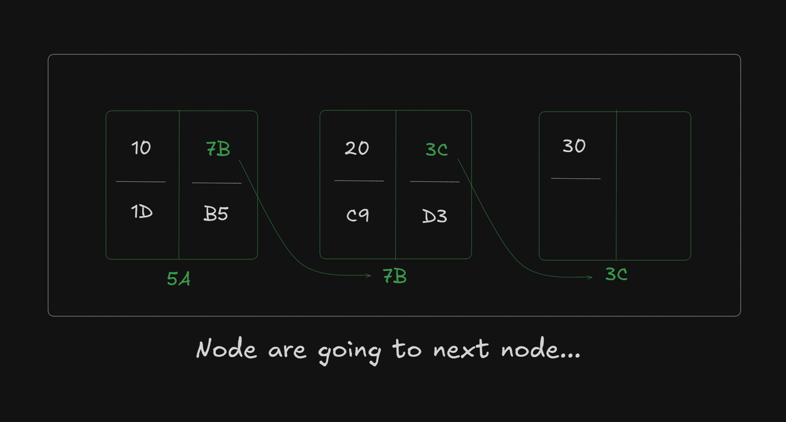

# Date: 28 June, 2025 - Saturday

## Topics:
0. Introduction
1. Another limitation of array
2. Idea of a Linked list
3. Creating a Node
4. Creating a Node Animated
5. Node with Constructor
6. Dynamic Node
7. Dynamic Node Animated
8. Printing Linked List
9. Printing Linked List Animated
10. Summary
- Quiz: Module 05
- Quiz Explanation and Extra Practice Problems
- Feedback Form: Module 05

## 0. Introduction
- Learn and understand to `Linked List`.
- Why learn linked list?
- Understand the basics of `linked lists`
- Creating a `singly linked list`
- Visualizing the `linked list`
- Printing the `linked list`

## 1. Another limitation of array
- Array also a data structure and array have main two problems are:
    - `Fixed size`
    - `Sequential Memory Allocation`
- This problem solve and covered with `Linked List`
- `Fixed size` problem also solve with `array` and `vector` but `Sequential Memory Allocation` this problem not solving with `array` and `vector`
- Program: `linked_list.cpp`
- Drawing `Sequential Memory Allocation`:
    - 
- Memory are not empty with serial or sequential, then `array` or `vector` memory not access. This is the problem of `Sequential Memory Allocation`.

## 2. Idea of a Linked list
- Array memory allocate are serially and sequentially.
- 
- `Linked list` value are connect to each others with his address that's why it called to `linked list` and `linked list` end eas `null` address using.

## 3. Creating a Node
- Program: `creating_node.cpp`
- In an array value and address then they called to `node`
    - 
- A `node` going to next `node` then use to `node` address not array element address.
    - 
- A `first node` also called to `head node`

## 4. Creating a Node Animated
- Explanation this code
    ```
    class Node {
        public:
        int value;
        Node* next;
    };

    int main() {
        Node a, b, c;
        a.value = 10;
        b.value = 20;
        c.value = 30;

        a.next = &b;
        b.next = &c;
        c.next = NULL;
    }
    ```

## 5. Node with Constructor
- Program: `creating_node2.cpp`
- Using a constructor in Node

## 6. Dynamic Node
- Program: `dynamic_node.cpp`
- Create a dynamic objects or node.

## 7. Dynamic Node Animated
- 