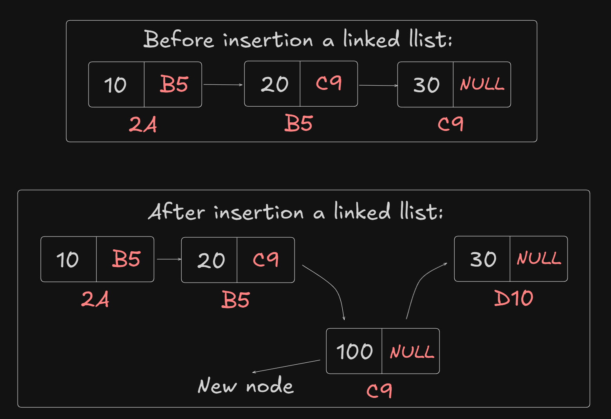
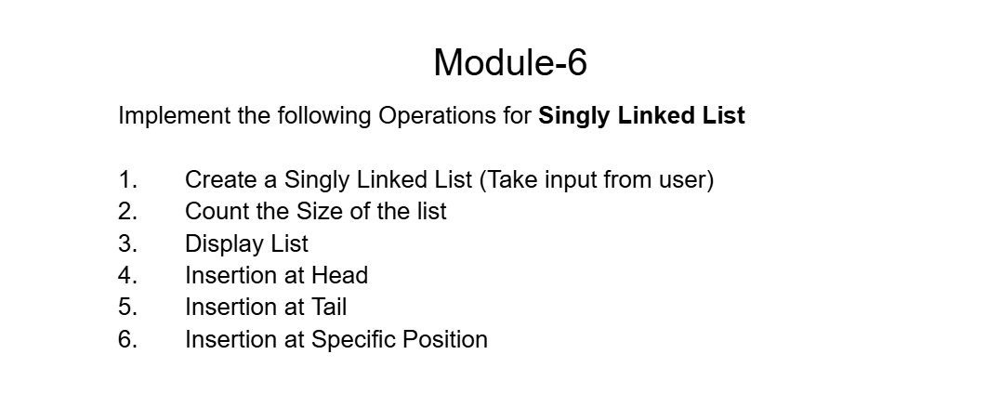

# Date: 29 June, 2025 - Sunday

## Topics:
0. Introduction
1. Reference of a pointer
2. Insert at head
3. Insert at Head Animated
4. Insert at tail
5. Insert at Tail Animated
6. Insert at any position
7. Insert at any Position Animated
8. Complexity analysis of insertion operations
9. Insert at tail Optimized
10. Insert at tail (Optimized) Animated
11. Summary
- Quiz: Module 06
- Quiz Explanation and Extra Practice Problem
- Feedback Form: Module 06

## 0. Introduction
- Linked List Operations:
    - `Insertion`:
        - at head
        - at tail
        - at any position
    - `Deletion`:
        - at head
        - at tail
        - at any position
    - `Printing`:
        - forward
        - backward
    - `Sorting`:
        - ascending
        - descending
- These topics we will covered two modules - `Module 06` and `Module 07`
- `Module 06` topics will `Insertion` and `Printing`
- `Module 07` topics will `Deletion` and `Sorting`

## 1. Reference of a pointer
- Program: `pointer_reference.cpp`
- The topics is `reference of a pointer`
- Access to `fun()` function with `reference (&)`
- When `reference (&)` are not use to `fun()` function parameter then can't access to `fun()` function.

## 2. Insert at head
- Program: `head_insert.cpp`
- Draw the logic:
    - 
- After make a function logic with draw:
    - 
    - 

## 3. Insert at Head Animated
- Explanation this code:
    ```
    void insert_at_head(Node* &head, int value) {
        Node* newNode = new Node(value);
        newNode->next = head;
        head = newNode;
    }
    ```

## 4. Insert at tail
- Program: `tail_insert.cpp`
- `Tail` that's means the last node are tail
- When a `pointer` have change then you add to `reference` and when a `pointer` will not change then you will not use to `reference`.
- When you will use `reference` everywhere that's a big problem. You can use `reference` everywhere.
- If linked list are empty and head or tail insert a value then this program: `empty_node.cpp`

## 5. Insert at Tail Animated
- Explanation this code:
    ```
    void insert_at_tail(Node* &head, int value) {
        Node* newNode = new Node(value);

        if(head == NULL) {
            head = newNode;
            return;
        }

        Node* tmp = head;
        while(tmp->next != NULL) {
            tmp = tmp->next;
        }

        tmp->next = newNode;
    }
    ```

## 6. Insert at any position
- Understand to linked list add to any position
- `Linked list` don't have index. We just thinking.
- Draw the logic:
    - 
- Program: `any_position.cpp`
- 
- `Linked list` don't have index. We just thinking.

## 7. Insert at any Position Animated
- Explanation this program:
    ```
        void insert_at_any_position(Node* &head, int index, int value) {
        Node* newNode = new Node(value);
        Node* tmp = head;

        for(int i = 0; i < index-1; i++) {
            tmp = tmp->next;
        }

        newNode->next = tmp->next;
        tmp->next = newNode;
    }
    ```
- `Linked list` don't have index. We just thinking.

## 8. Complexity analysis of insertion operations
- `Time complexity` of head insertion, tail insertion and any position insertion.
- `Head Insertion` - `O(1)`
- `Any Position Insertion` - `O(N)`
- `Tail Insertion` - `O(N)`

## 9. Insert at tail Optimized
- Program: `tail_insert_optimized.cpp`
- Optimized to insert a tail. Which time complexity is `O(1)`.

## 10. Insert at tail (Optimized) Animated
- Explanation this code:
    ```
    void insert_at_tail(Node* &head, Node* &tail, int value) {
        Node* newNode = new Node(value);

        if(head == NULL) {
            head = newNode;
            return;
        }

        tail->next = newNode;
        tail = tail->next;
    }
    ```

## 11. Summary
- Today work on `linked list operations`
- Insertion - `insert at head`
- Insertion - `insert at tail`
- Insertion - `insert at tail` optimized way
- Insertion - `insert at any position`
- Build logic with `draw`, this whole module build to `logic` with `drawing` not only `code or programming`. `Build drawing and build the logics`.
- Practices `code to make drawing` and `drawing to make code`.
- `Visualize` and make code or program.
- Understand to reference of a pointer.

## Quiz: Module 06
- `Total Questions: 10`
- `Total Marks: 10`

## Quiz Explanation & Extra Practice Problem
- [Extra Problems -](https://docs.google.com/document/d/1P9adF6lPRgQcQFZH0Bq4e8tPxa5pdiBlxuJlS7p8jXg/edit?usp=sharing)
- 
<br>

- [Quiz Explanation -](https://docs.google.com/document/d/12T11zTkSCgryQKJx8J89L4h1hkjn276GsnPuYXHW8AI/edit?tab=t.0)
#### 1. What will be the output of the following code?
```
#include <bits/stdc++.h>
using namespace std;

void fun(int *p) {
    *p = 20;
}

int main() {
    int val = 10;
    int *ptr = &val;
    fun(ptr);
    cout << *ptr << endl;

    return 0;
}
```
**a)** 10     
**b)** 20 ✅   
**c)** Segmentation Fault     
**d)** Compiler error   
> **Explanation:** কোডে, fun ফাংশনে একটি পয়েন্টার পাস করা হয়েছে। পয়েন্টারটি val এর এড্রেস নির্দেশ করছে। *p = 20; এই লাইনটি val এর ভ্যালু পরিবর্তন করে 20 করে। cout << *ptr প্রিন্ট করার সময় ptr পয়েন্ট করছে val এর ঠিকানায়। তাই আউটপুট হবে 20।
---
#### 2. What will be the output of the following code?
```
#include <bits/stdc++.h>
using namespace std;

void fun(int *p) {
    p = NULL;
}

int main() {
    int val = 10;
    int *ptr = &val;
    fun(ptr);
    cout << *ptr << endl;

    return 0;
}
```
**a)** 10 ✅     
**b)** 20    
**c)** Segmentation Fault     
**d)** Compiler error   
> **Explanation:** কোডে, fun ফাংশনের মধ্যে p = NULL করলে শুধু local pointer( fun ফাংশনের মধ্যে ) p NULL হয়ে যায়। ptr এর সাথে এর কোনো সম্পর্ক নেই। তাই, ptr এখনো val এর ঠিকানায় পয়েন্ট করছে, যার ভ্যালু 10।
---
#### 3. What will be the output of the following code?
```
#include <bits/stdc++.h>
using namespace std;

void fun(int *&p) {
    p = NULL;
}

int main() {
    int val = 10;
    int *ptr = &val;
    fun(ptr);
    cout << ptr << endl;

    return 0;
}
```
**a)** 10      
**b)** 20    
**c)** 0 ✅  
**d)** Compiler error   
> **Explanation:** সি++-এ NULL মেমরি খালি এড্রেস হিসেবে বোঝানো হয়। যখন এটি cout দিয়ে প্রিন্ট করা হয়, তখন 0 আউটপুট হয়। int*& ব্যবহার করার ফলে ফাংশনের ভেতরে করা পরিবর্তন সরাসরি মূল পয়েন্টারে প্রতিফলিত হয়।
---
#### 4. What will the following code snippet do?
```
Node *tmp = head;
while(tmp->next != NULL) {
    tmp = tmp->next;
}
tmp->next = newNode;
```
**a)** Insert a node at head      
**b)** Insert a node at any position    
**c)** Delete the head node   
**d)** Insert a node only at tail ✅   
> **Explanation:** লুপটি লিংকড লিস্টের শেষ পর্যন্ত চলে এবং tmp কে last node এ সেট করে। এরপর tmp->next = newNode করলে নতুন নোডটি লিস্টের টেইলে যোগ হয়।
---
#### 5. What will the following code snippet do?
```
newNode->next = head;
head = newNode;
```
**a)** Insert a node at head ✅  
**b)** Insert a node at any position    
**c)** Delete the head node   
**d)** Insert a node only at tail    
> **Explanation:** কোডটি একটি নতুন নোডকে লিস্টের হেড হিসাবে সেট করে। প্রথমে newNode->next = head, বর্তমান হেড নোডকে নতুন নোডের পরবর্তী হিসেবে সেট করে। তারপর head = newNode, নতুন নোডকে হেড হিসাবে আপডেট করে।
---
#### 6. What will the following code snippet do?
```
Node *tmp = head;
for(int i = 1; i <= pos - 1; i++) {
    tmp = tmp->next;
}
newNode->next = tmp->next;
tmp->next = newNode;
```
**a)** Insert a node at head   
**b)** Insert a node at any position ✅    
**c)** Delete the head node   
**d)** Insert a node only at tail    
> **Explanation:** কোডটি নির্দিষ্ট অবস্থানে একটি নোড যোগ করার জন্য ব্যবহৃত হয়। লুপটি tmp কে পজিশনের আগের নোডে নিয়ে যায়। এরপর newNode->next = tmp->next এবং tmp->next = newNode ব্যবহার করে নতুন নোড যোগ করা হয়।
---
#### 7. What is the time complexity of inserting an element at any position in a singly linkedlist?
**a)** O(1)   
**b)** O(N) ✅  
**c)** O(N*N)   
**d)** O(logN)    
> **Explanation:** আমরা singly linked list এর যেকোনো position এ একটি নোড যুক্ত করতে হলে প্রথমে ওই position এর আগের নোড পর্যন্ত ট্রাভের্স করে যেতে হবে। তারপর, ওই নোডের সাথে নতুন নোড যুক্ত করতে হবে এবং নতুন নোডের সাথে আগে position এ যেই নোড ছিলো যেটা যুক্ত করে দিতে হবে। এখানে, position শুরুর নোড থেকে শেষের (N) নোড পর্যন্ত যেকোনো সংখ্যক নোড ট্রাভের্স করতে হতে পারে, তাই টাইম কপ্লেক্সিটি হবে - O(N)।
---
#### 8. What is the time complexity of inserting an element at tail in a singly linkedlist? (Without tail track)
**a)** O(N) ✅   
**b)** O(1)   
**c)** O(N*N)   
**d)** O(logN)    
> **Explanation:** আমরা singly linked list এর tail এ একটি নোড যুক্ত করতে হলে প্রথমে শেষ নোড পর্যন্ত ট্রাভের্স করে যেতে হবে। তারপর শেষ নোডের সাথে নতুন নোড যুক্ত করতে হবে। এখানে শেষ নোড পর্যন্ত যেতে N সংখ্যক নোড ট্রাভের্স করতে টাইম কপ্লেক্সিটি হবে - O(N)।
---
#### 9. What is the time complexity of traversing a singly linked list?
**a)** O(1)    
**b)** O(N) ✅   
**c)** O(N*N)   
**d)** O(logN)    
> **Explanation:** লুপ চালিয়ে লিস্টের প্রতিটি নোড একবার করে ভিজিট করতে হয়। যদি N নোড থাকে, তাহলে ট্রাভার্সের জন্য N বার অপারেশন লাগে।
---
#### 10. What is the time complexity of inserting an element at head in a singly linked list?
**a)** O(N)    
**b)** O(1) ✅   
**c)** O(N*N)   
**d)** O(logN)    
> **Explanation:** হেডে নতুন ভ্যালু যোগ করতে কোনো লুপ চালাতে হয় না। নতুন নোডের next হেডে সেট করা এবং
নতুন নোডকে হেডে সেট করা। এটি কনস্ট্যান্ট টাইমে সম্পন্ন হয়।
---