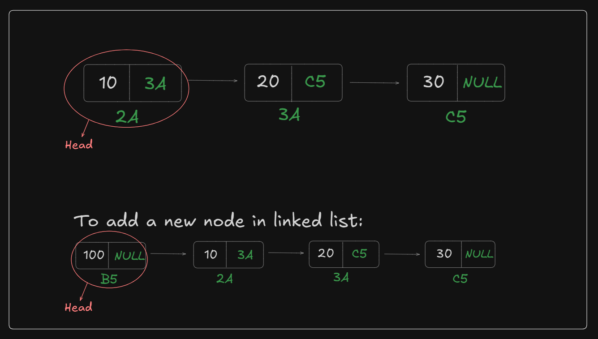
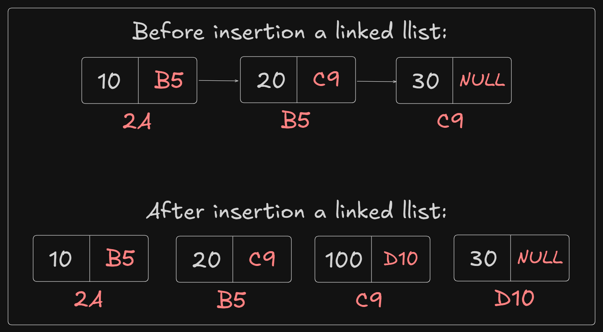

# Date: 29 June, 2025 - Sunday

## Topics:
0. Introduction
1. Reference of a pointer
2. Insert at head
3. Insert at Head Animated
4. Insert at tail
5. Insert at Tail Animated
6. Insert at any position
7. Insert at any Position Animated
8. Complexity analysis of insertion operations
9. Insert at tail Optimized
10. Insert at tail (Optimized) Animated
11. Summary
- Quiz: Module 06
- Quiz Explanation and Extra Practice Problem
- Feedback Form: Module 06

## 0. Introduction
- Linked List Operations:
    - `Insertion`:
        - at head
        - at tail
        - at any position
    - `Deletion`:
        - at head
        - at tail
        - at any position
    - `Printing`:
        - forward
        - backward
    - `Sorting`:
        - ascending
        - descending
- These topics we will covered two modules - `Module 06` and `Module 07`
- `Module 06` topics will `Insertion` and `Printing`
- `Module 07` topics will `Deletion` and `Sorting`

## 1. Reference of a pointer
- Program: `pointer_reference.cpp`
- The topics is `reference of a pointer`
- Access to `fun()` function with `reference (&)`
- When `reference (&)` are not use to `fun()` function parameter then can't access to `fun()` function.

## 2. Insert at head
- Program: `head_insert.cpp`
- Draw the logic:
    - 
- After make a function logic with draw:
    - 
    - 

## 3. Insert at Head Animated
- Explanation this code:
    ```
    void insert_at_head(Node* &head, int value) {
        Node* newNode = new Node(value);
        newNode->next = head;
        head = newNode;
    }
    ```

## 4. Insert at tail
- Program: `tail_insert.cpp`
- `Tail` that's means the last node are tail
- When a `pointer` have change then you add to `reference` and when a `pointer` will not change then you will not use to `reference`.
- When you will use `reference` everywhere that's a big problem. You can use `reference` everywhere.
- If linked list are empty and head or tail insert a value then this program: `empty_node.cpp`

## 5. Insert at Tail Animated
- Explanation this code:
    ```
    void insert_at_tail(Node* &head, int value) {
        Node* newNode = new Node(value);

        if(head == NULL) {
            head = newNode;
            return;
        }

        Node* tmp = head;
        while(tmp->next != NULL) {
            tmp = tmp->next;
        }

        tmp->next = newNode;
    }
    ```

## 6. Insert at any position
- Understand to linked list add to any position
- `Linked list` don't have index. We just thinking.
- Draw the logic:
    - 
- Program: `any_position.cpp`
- 
- `Linked list` don't have index. We just thinking.

## 7. Insert at any Position Animated
- Explanation this program:
    ```
        void insert_at_any_position(Node* &head, int index, int value) {
        Node* newNode = new Node(value);
        Node* tmp = head;

        for(int i = 0; i < index-1; i++) {
            tmp = tmp->next;
        }

        newNode->next = tmp->next;
        tmp->next = newNode;
    }
    ```
- `Linked list` don't have index. We just thinking.

## 8. Complexity analysis of insertion operations
- `Time complexity` of head insertion, tail insertion and any position insertion.
- `Head Insertion` - `O(1)`
- `Any Position Insertion` - `O(N)`
- `Tail Insertion` - `O(N)`

## 9. Insert at tail Optimized
- Program: `tail_optimized.cpp`
- Optimized to insert a tail. Which time complexity is `O(1)`.