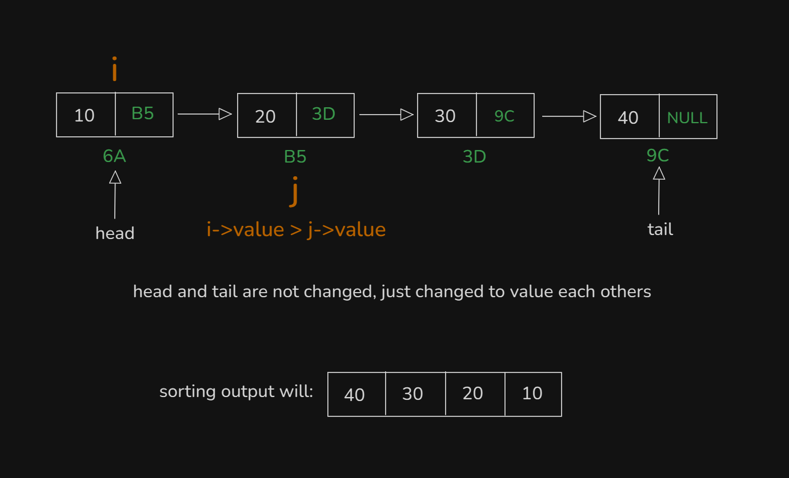

# Date: 01 July, 2025 - Tuesday

## Topics:
0. Introduction
1. Input a linked list
2. Linked list reverse printing
3. Delete at head
4. Delete at Head Animated
5. Delete at any position
6. Delete at tail
7. Delete at Any position Animated
8. Complexity analysis of every operations
9. Sorting a linked list with selection sort
10. Summary
- Quiz: Module 07
- Complexity of every operations
- Quiz Explanation
- Feedback Form: Module 07

## 0. Introduction
- Linked list operations:
    - `Insertion`
    - `Deletion`
    - `Printing`
    - `Sorting`
- Understand the `Deletion` operations
- Understand the `Sorting` operations

## 1. Input a linked list
- Build simple logic with drawing:
    - 
    - This drawing for printing or input a singly linked list.
- Program: `input.cpp`

## 2. Linked list reverse printing
- Build logic with drawing:
    - 
- Program: `reverse_printing.cpp`
- Explanation those reverse program:
    ```
    void print_reverse(Node* tmp) {
        // Base case
        if(tmp == NULL) {
            return;
        }
        print_reverse(tmp->next);
        cout << tmp->value << endl;
    }
    ```

## 3. Delete at head
- Build logic with drawing:
    - 
    - 
    - 
    - Now at head node node are delete from singly linked list
- Program: `delete_head.cpp`

## 4. Delete at Head Animated
- Explanation this code:
    ```
    void delete_at_head(Node* &head) {
        Node* deleteNode = head;
        head = head->next;
        delete deleteNode;
    }
    ```

## 5. Delete at any position
- Build logic with drawing:
    - 
    - 
- Program: `delete_any_position.cpp`

## 6. Delete at tail
- Build logic with drawing:
    - 
- Also same logic from `delete at any position`
- Program: `delete_tail.cpp`

## 7. Delete at Any position Animated
- Explanation this code:
    ```
    void delete_at_any_position(Node* head, int index) {
        Node* tmp = head;
        for(int i = 1; i < index; i++) {
            tmp = tmp->next;
        }
        Node* deleteNode = tmp->next;
        tmp->next = tmp->next->next;
        delete deleteNode;
    }
    ```

## 8. Complexity analysis of every operations
- Operations and complexity:
    - `Insertion`
        - `at head - O(1)`
        - `at tail - O(N)`
        - `at any position - O(N)`
    - `Deletion`
        - `at head - O(1)`
        - `at tail - O(N)`
        - `at any position - O(N)`
    - `Printing`
        - `forward - O(N)`
        - `backward - O(N)`
    - `Input`
        - `O(N)`

## 9. Sorting a linked list with selection sort
- Build logic with drawing:
    - 
    - 
- Make this program will `selection sorting`
- Program: `sorting_linked_list.cpp`

## 10. Summary
- Today we will learn `singly linked list operations`.
- Linked list `insertion`.
- Linked list `deletion`.
- Linked list `printing`.
- Reverse printing with `recursion`
- Linked list `input` and `sorting`.
- Sorting will solve this program will `selection sorting`. Then time complexity was `O(N*N)`.

## Quiz: Module 07
- `Total Questions: 10`
- `Total Marks: 10`

## Complexity of every operations
- [Link](https://docs.google.com/document/d/1d4y8Wvrpquz4vnHq348WiXNTQ7W4wk8GVA94NSnOE88/edit?usp=sharing)
    - 

## Quiz Explanation
- [Quiz Explanation Link:](https://docs.google.com/document/d/1Xs6biChncaiKDSHeAcPXf_9I2JuXM85b597iJmtnuPw/edit?usp=drivesdk)
#### 1. What is the time complexity of insert at any position in a singly linked list?
**a)** O(1)     
**b)** O(N) ✅   
**c)** O(logN)     
**d)** O(N*N)   
> **Explanation:** একটি singly linked list-এ যখন কোনো নির্দিষ্ট পজিশনে ইনসার্ট করতে হয়, তখন প্রথমে সেই পজিশনটি খুঁজে বের করতে হয়। এই কাজের জন্য লিস্টটি head থেকে শুরু করে target position-এর আগের Node এ পৌঁছানো পর্যন্ত traverse করতে হবে। এটি linear traversal হওয়ায় O(N) সময় লাগে, যেখানে N হলো লিস্টের দৈর্ঘ্য।
---
#### 2. What is the time complexity of insert at head in a singly linked list?
**a)** O(1) ✅     
**b)** O(N)    
**c)** O(logN)     
**d)** O(N*N)   
> **Explanation:** Insert at head খুব দ্রুত করা যায় কারণ নতুন node যোগ করার জন্য শুধু head পয়েন্টারটিকে নতুন node-এর দিকে পয়েন্ট করতে হয়।এখানে কোনো traversal লাগবে না। তাই, Time Compleity O(1)।
---
#### 3. What is the time complexity of insert at tail in a singly linked list? We have only one pointer(head) for tracking
**a)** O(1)      
**b)** O(N) ✅   
**c)** O(logN)     
**d)** O(N*N)   
> **Explanation:** যদি head পয়েন্টার দিয়ে tail-এ node যোগ করতে হয়, তবে tail-এ পৌঁছানো পর্যন্ত linked list-টি traverse করতে হবে। এটি O(N) সময়ে সম্পন্ন হয় কারণ N সংখ্যক nodes-এর মধ্য দিয়ে যেতে হয়।
---
#### 4. What is the time complexity of insert at tail in a singly linked list? We have two pointers(head and tail) for tracking
**a)** O(1) ✅     
**b)** O(N)    
**c)** O(logN)     
**d)** O(N*N)   
> **Explanation:** যদি tail pointer থাকে, তাহলে tail-এ সরাসরি node যোগ করা সম্ভব। tail->next-এ নতুন node যোগ করা হয় এবং tail-কে নতুন node-এ পয়েন্ট করা হয়। এই কাজটি O(1) সময়ে হয় কারণ কোনো traversal প্রয়োজন হয় না।
---
#### 5. What is the time complexity of delete head in a singly linked list?
**a)** O(1) ✅     
**b)** O(N)    
**c)** O(logN)     
**d)** O(N*N)   
> **Explanation:** Singly linked list-এ head node delete করা খুব সহজ এবং দ্রুত একটি কাজ। প্রথমে head পয়েন্টারটি বর্তমান head node-এর next node-এর দিকে পয়েন্ট করা হয়। তারপর পুরাতন head node-টিকে delete করা হয়।
---
#### 6. What is the time complexity of delete at tail in a singly linked list? We have two pointers(head and tail) for tracking
**a)** O(1)      
**b)** O(N) ✅   
**c)** O(logN)     
**d)** O(N*N)   
> **Explanation:** যদি শুধু head এবং tail পয়েন্টার থাকে, তবে tail-এর ঠিক আগের node খুঁজে বের করতে linked list-টি traverse করতে হয়। কারন singly linkedlist এ আগের নোড এ ব্যাক করা যায় না।
এটি O(N) সময়ে হয়।
---
#### 7. Which is better to use if we always want to delete from tail?
**a)** Array ✅      
**b)** Linked list    
**c)** Both are equal     
**d)** None   
> **Explanation:** Array-এর ক্ষেত্রে শেষ থেকে delete করা খুব দ্রুত হয় কারণ এটি O(1) সময়ে করা সম্ভব।
কিন্তু singly linked list-এ tail-এর আগের node খুঁজে বের করতে O(N) সময় লাগে। তাই delete from tail করার জন্য array ভালো।
---
#### 8. What will the following code snippet do?
```
Node *tmp = head;
for(int i = 1; i <= pos - 1; i++) {
    tmp = tmp->next;
}
Node *deleteNode = tmp->next;
tmp->next = tmp->next->next;
delete deleteNode;
```
**a)** Insert a node at head       
**b)** Insert a node at any position    
**c)** Delete a node from any position ✅    
**d)** Delete the head node   
> **Explanation:** code snippet-টি একটি নির্দিষ্ট পজিশনে node delete করার কাজ করে। প্রথমে tmp দিয়ে target position-এর আগের node-এ পৌঁছানো হয়। তারপর tmp->next-কে tmp->next->next-এ পয়েন্ট করা হয়, যাতে target node লিস্ট থেকে বাদ পড়ে। পরে delete deleteNode দিয়ে সেই node মেমোরি থেকে ডিলিট করা হয়।
---
#### 9. What is the time complexity of sorting a singly linked list using selection sort?
**a)** O(1)       
**b)** O(N)    
**c)** O(logN)     
**d)** O(N*N) ✅  
> **Explanation:** Selection Sort-এ প্রতিটি node-এর জন্য বাকি nodes-এর মধ্যে সর্বনিম্ন বা সর্বোচ্চ মান খুঁজতে হয়। এর জন্য প্রতিটি iteration-এ O(N) সময় লাগে। মোট N iterations থাকায় সময়  O(N*N) হয়।
---
#### 10. What will the following code snippet do?
```
Node *deleteNode = head;
head = head->next;
delete deleteNode;
```
**a)** Insert a node at head       
**b)** Insert a node at any position    
**c)** Delete a node from any position     
**d)** Delete the head node ✅  
> **Explanation:** code snippet-টি head node ডিলিট করে। head পয়েন্টারকে head->next-এ সেট করা হয়। তারপর পুরানো head node-কে delete করা হয়। এটি O(1) সময়ে সম্পন্ন হয়।
---

## Feedback Form: Module 07
- মডিউল রিলেটেড তোমার যে কোন ফিডব্যাক থাকলে এই ফর্মে লিখে দিতে পারো। আমরা তোমার ফিডব্যাক গুরুত্বসহকার দেখব।
- [Form Links](https://forms.gle/DH5mjuGD1x2EZ4z29)