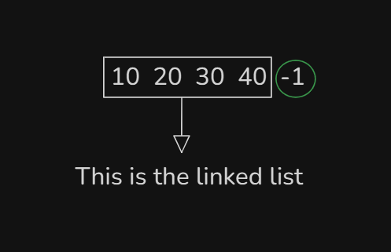
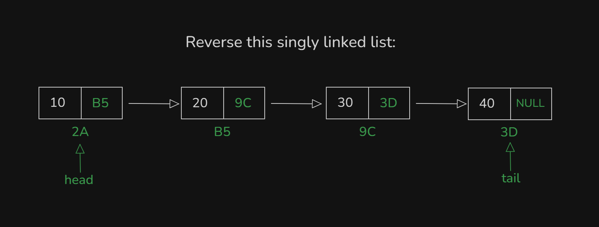

# Date: 01 July, 2025 - Tuesday

## Topics:
0. Introduction
1. Input a linked list
2. Linked list reverse printing
3. Delete at head
4. Delete at Head Animated
5. Delete at any position
6. Delete at tail
7. Delete at Any position Animated
8. Complexity analysis of every operations
9. Sorting a linked list with selection sort
10. Summary
- Quiz: Module 07
- Complexity of every operations
- Quiz Explanation
- Feedback Form: Module 07

## 0. Introduction
- Linked list operations:
    - `Insertion`
    - `Deletion`
    - `Printing`
    - `Sorting`
- Understand the `Deletion` operations
- Understand the `Sorting` operations

## 1. Input a linked list
- Build simple logic with drawing:
    - 
    - This drawing for printing or input a singly linked list.
- Program: `input.cpp`

## 2. Linked list reverse printing
- Build logic with drawing:
    - 