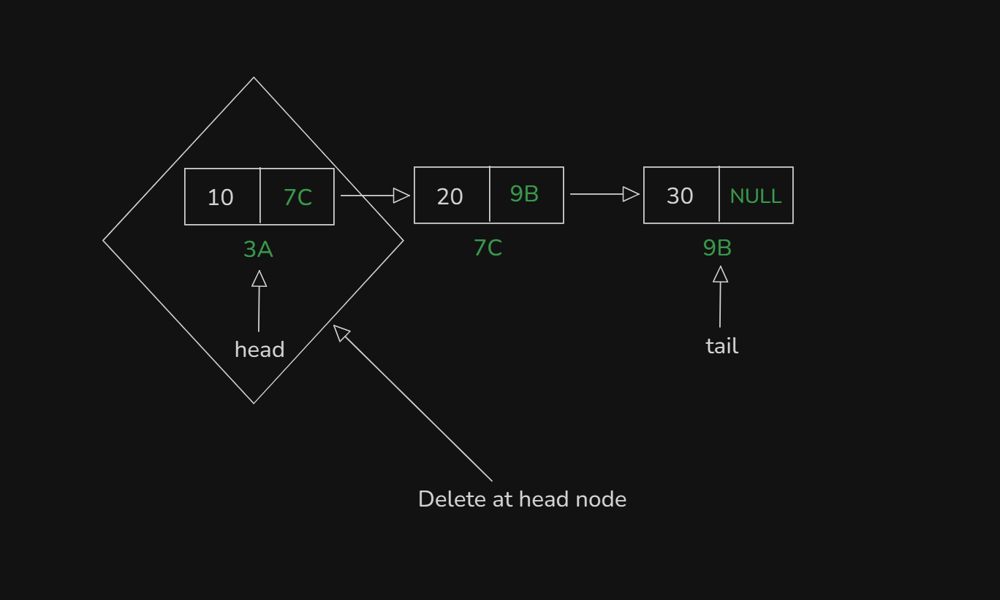
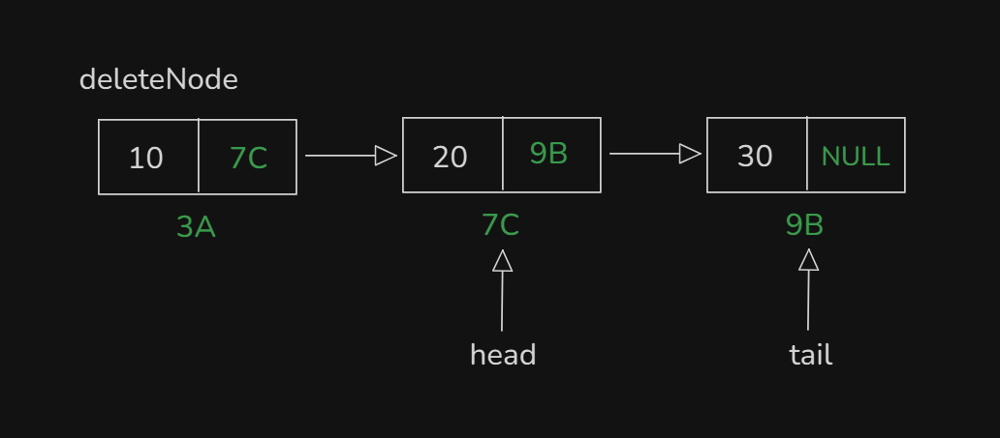
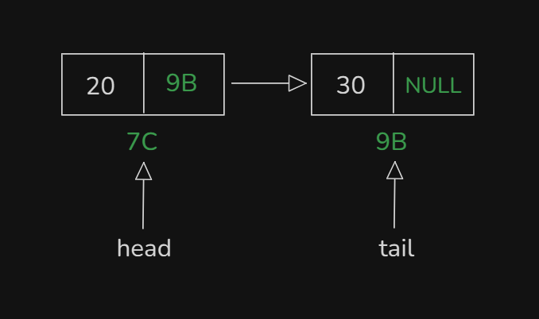
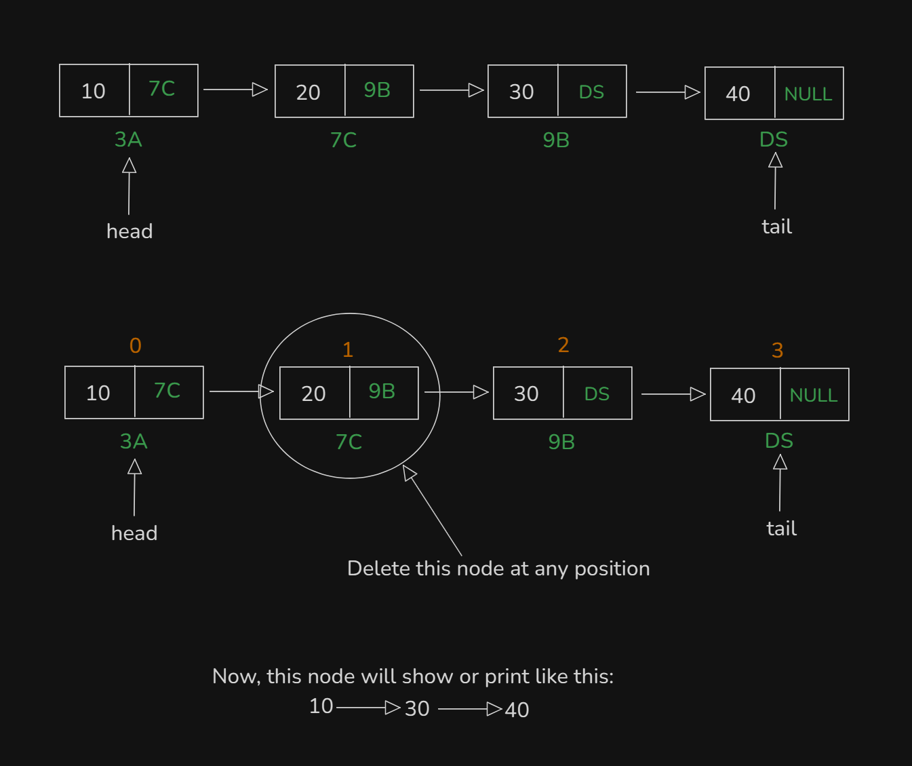
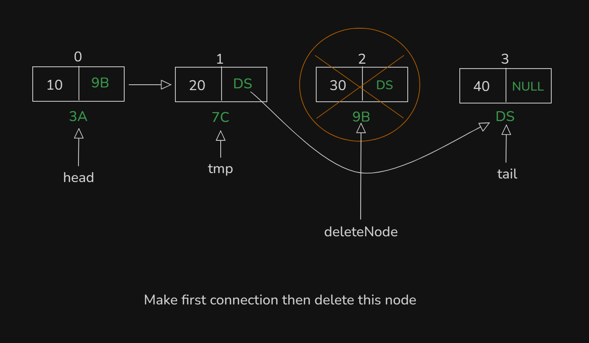

# Date: 01 July, 2025 - Tuesday

## Topics:
0. Introduction
1. Input a linked list
2. Linked list reverse printing
3. Delete at head
4. Delete at Head Animated
5. Delete at any position
6. Delete at tail
7. Delete at Any position Animated
8. Complexity analysis of every operations
9. Sorting a linked list with selection sort
10. Summary
- Quiz: Module 07
- Complexity of every operations
- Quiz Explanation
- Feedback Form: Module 07

## 0. Introduction
- Linked list operations:
    - `Insertion`
    - `Deletion`
    - `Printing`
    - `Sorting`
- Understand the `Deletion` operations
- Understand the `Sorting` operations

## 1. Input a linked list
- Build simple logic with drawing:
    - 
    - This drawing for printing or input a singly linked list.
- Program: `input.cpp`

## 2. Linked list reverse printing
- Build logic with drawing:
    - 
- Program: `reverse_printing.cpp`
- Explanation those reverse program:
    ```
    void print_reverse(Node* tmp) {
        // Base case
        if(tmp == NULL) {
            return;
        }
        print_reverse(tmp->next);
        cout << tmp->value << endl;
    }
    ```

## 3. Delete at head
- Build logic with drawing:
    - 
    - 
    - 
    - Now at head node node are delete from singly linked list
- Program: `delete_head.cpp`

## 4. Delete at Head Animated
- Explanation this code:
    ```
    void delete_at_head(Node* &head) {
        Node* deleteNode = head;
        head = head->next;
        delete deleteNode;
    }
    ```

## 5. Delete at any position
- Build logic with drawing:
    - 
    - 
- Program: `delete_any_position.cpp`

## 6. Delete at Any position Animated
- Explanation this code:
    ```
    void delete_at_any_position(Node* head, int index) {
        Node* tmp = head;
        for(int i = 1; i < index; i++) {
            tmp = tmp->next;
        }
        Node* deleteNode = tmp->next;
        tmp->next = tmp->next->next;
        delete deleteNode;
    }
    ```