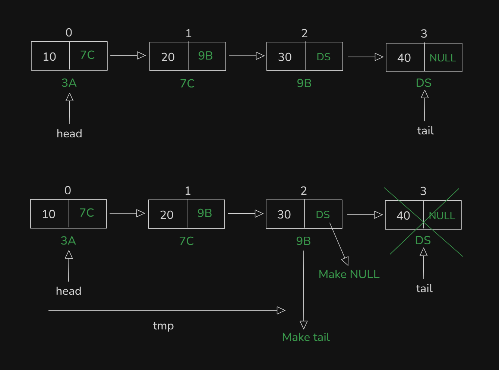
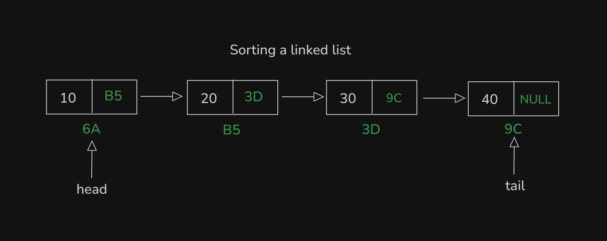
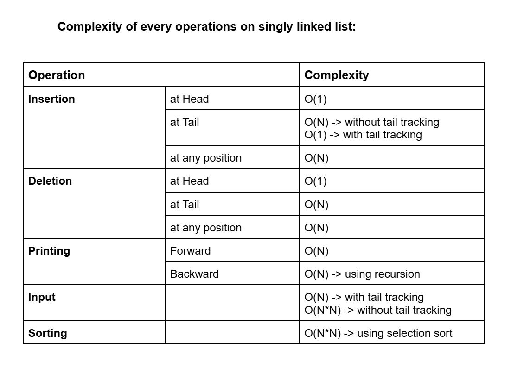

# Date: 01 July, 2025 - Tuesday

## Topics:
0. Introduction
1. Input a linked list
2. Linked list reverse printing
3. Delete at head
4. Delete at Head Animated
5. Delete at any position
6. Delete at tail
7. Delete at Any position Animated
8. Complexity analysis of every operations
9. Sorting a linked list with selection sort
10. Summary
- Quiz: Module 07
- Complexity of every operations
- Quiz Explanation
- Feedback Form: Module 07

## 0. Introduction
- Linked list operations:
    - `Insertion`
    - `Deletion`
    - `Printing`
    - `Sorting`
- Understand the `Deletion` operations
- Understand the `Sorting` operations

## 1. Input a linked list
- Build simple logic with drawing:
    - 
    - This drawing for printing or input a singly linked list.
- Program: `input.cpp`

## 2. Linked list reverse printing
- Build logic with drawing:
    - 
- Program: `reverse_printing.cpp`
- Explanation those reverse program:
    ```
    void print_reverse(Node* tmp) {
        // Base case
        if(tmp == NULL) {
            return;
        }
        print_reverse(tmp->next);
        cout << tmp->value << endl;
    }
    ```

## 3. Delete at head
- Build logic with drawing:
    - 
    - 
    - 
    - Now at head node node are delete from singly linked list
- Program: `delete_head.cpp`

## 4. Delete at Head Animated
- Explanation this code:
    ```
    void delete_at_head(Node* &head) {
        Node* deleteNode = head;
        head = head->next;
        delete deleteNode;
    }
    ```

## 5. Delete at any position
- Build logic with drawing:
    - 
    - 
- Program: `delete_any_position.cpp`

## 6. Delete at tail
- Build logic with drawing:
    - 
- Also same logic from `delete at any position`
- Program: `delete_tail.cpp`

## 7. Delete at Any position Animated
- Explanation this code:
    ```
    void delete_at_any_position(Node* head, int index) {
        Node* tmp = head;
        for(int i = 1; i < index; i++) {
            tmp = tmp->next;
        }
        Node* deleteNode = tmp->next;
        tmp->next = tmp->next->next;
        delete deleteNode;
    }
    ```

## 8. Complexity analysis of every operations
- Operations and complexity:
    - `Insertion`
        - `at head - O(1)`
        - `at tail - O(N)`
        - `at any position - O(N)`
    - `Deletion`
        - `at head - O(1)`
        - `at tail - O(N)`
        - `at any position - O(N)`
    - `Printing`
        - `forward - O(N)`
        - `backward - O(N)`
    - `Input`
        - `O(N)`

## 9. Sorting a linked list with selection sort
- Build logic with drawing:
    - 
- Make this program will `selection sorting`
- Program: `sorting_linked_list.cpp`

## 10. Summary
- Today we will learn `singly linked list operations`.
- Linked list `insertion`.
- Linked list `deletion`.
- Linked list `printing`.
- Reverse printing with `recursion`
- Linked list `input` and `sorting`.
- Sorting will solve this program will `selection sorting`. Then time complexity was `O(N*N)`.

## Quiz: Module 07
- `Total Questions: 10`
- `Total Marks: 10`

## Complexity of every operations
- [Link](https://docs.google.com/document/d/1d4y8Wvrpquz4vnHq348WiXNTQ7W4wk8GVA94NSnOE88/edit?usp=sharing)
    - 

## Quiz Explanation
- [Quiz Explanation Link:](https://docs.google.com/document/d/1Xs6biChncaiKDSHeAcPXf_9I2JuXM85b597iJmtnuPw/edit?usp=drivesdk)
#### 1. What is the time complexity of insert at any position in a singly linked list?
**a)** O(1)     
**b)** O(N) ✅   
**c)** O(logN)     
**d)** O(N*N)   
> **Explanation:** একটি singly linked list-এ যখন কোনো নির্দিষ্ট পজিশনে ইনসার্ট করতে হয়, তখন প্রথমে সেই পজিশনটি খুঁজে বের করতে হয়। এই কাজের জন্য লিস্টটি head থেকে শুরু করে target position-এর আগের Node এ পৌঁছানো পর্যন্ত traverse করতে হবে। এটি linear traversal হওয়ায় O(N) সময় লাগে, যেখানে N হলো লিস্টের দৈর্ঘ্য।
---