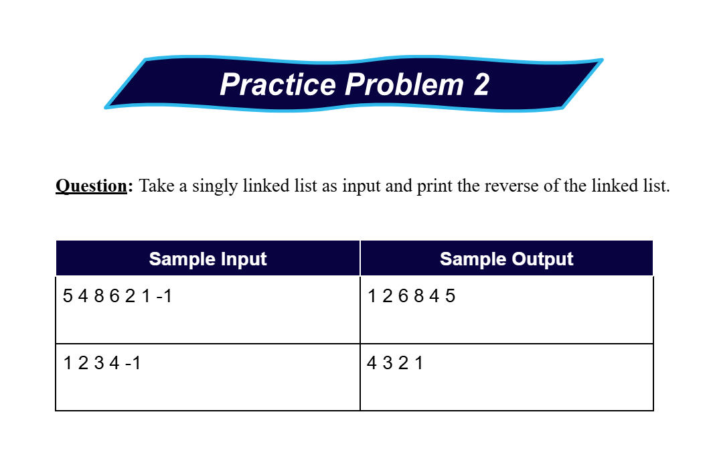

# Date: 02 July, 2025 - Wednesday

## Topics:
- Practice Problem Set: Module 7.5
1. Practice Instructions
2. Solution of Practice Problem 4
3. Insert at head Updated

## Practice Problem Set: Module 7.5
- [Link -](https://docs.google.com/document/d/1EXLsPmtlVXNjdqk49BCcLbPHf0n4UBlP/edit?usp=sharing&ouid=110071013354717279052&rtpof=true&sd=true)
- 
- 
- 
- 
- 
- 

## 1. Practice Instructions
- Explanation those whole practice problems `1 to 5`

## 2. Solution of Practice Problem 4
- Solved this problem 04. Program: `practice_problem4.cpp`

## 3. Insert at head Updated
- adffad