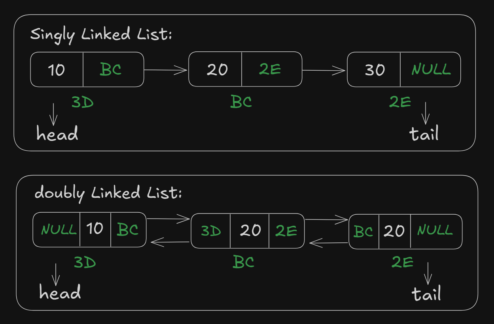
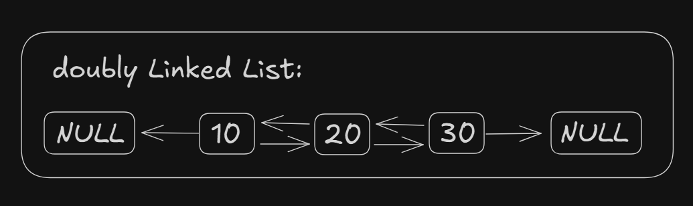
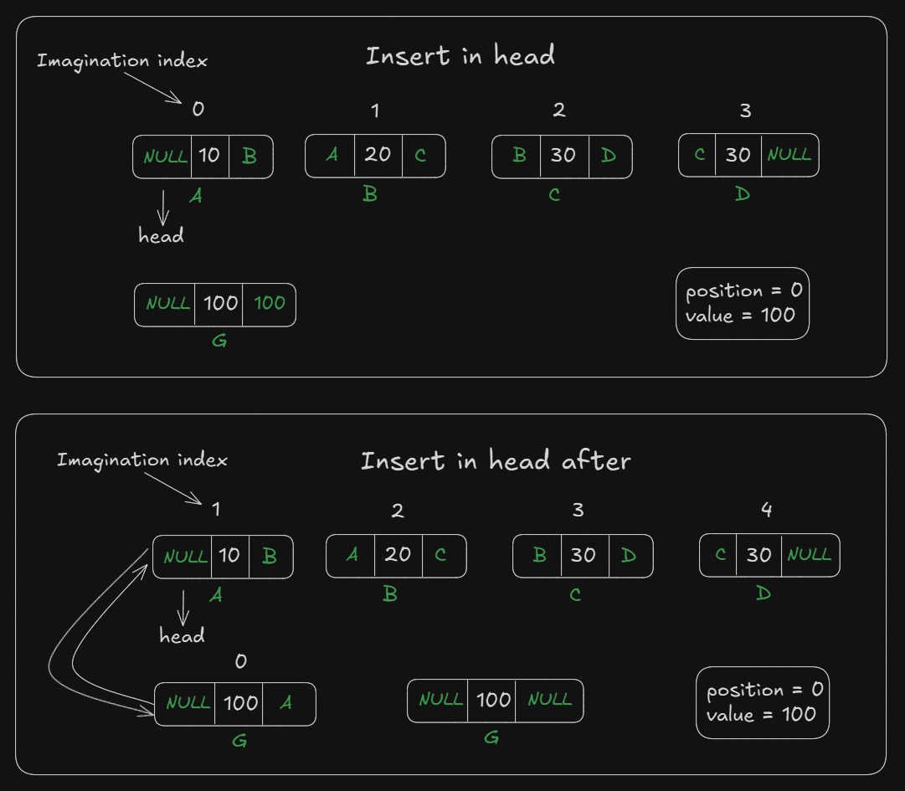

# Date: 06 July, 2025 - Sunday

## Topics:
- Text Instruction: Module 09 [Must Read]
0. Introduction
1. Doubly linked list
2. Printing Doubly Linked list
3. Doubly linked list Animated
4. Insert at head Animated
5. Insert at head
6. Insert at tail Animated
7. Insert at tail
8. Insert at any position Animated
9. Insert at any position
10. Delete at head Animated
11. Delete at head
12. Delete at tail Animated
13. Delete at Tail
14. Delete at any position Animated
15. Delete at any position
16. Complexity Analysis of Array vs Singly vs Doubly
17. Input Doubly linked list
18. Summary
- Quiz: Module 09
- Quiz Explanation
- Feedback Form: Module 09

## Text Instruction: Module 09 [Must Read]
- প্রিভিয়াস উইক ছিলো সিঙ্গলি লিংকড লিস্টের উপর। তোমাদের মোটামুটি সিঙ্গলি লিংকড লিস্ট সম্পর্কে কোর কন্সেপ্টগুলো শেখানো হয়েছিলো। আজ শুরু হচ্ছে নতুন আরেকটি উইক। রিলিজ হচ্ছে এই উইকের প্রথম মডিউল, মডিউল ০৯। আজকের মডিউলে আরো একটা লিংকড লিস্ট তোমাদের শেখানো হবে। সো গায়ের সব জড়তা ভেঙে আবারো চলে আসো প্রোগ্রামিং এর ময়দানে।
- আজকে তোমাদের শেখানো হবে ডাবলি লিংড লিস্ট। ডাবলি লিংকড লিস্ট কিভাবে ডিক্লেয়ার করতে হয়। কিভাবে ইনপুট নিতে হয়, আউটপুট দেখাতে হয় এবং এর বেসিক অপারেশন গুলো স্টেপ বাই স্টেপ তোমাদের শেখানো হবে। সাথে কপ্লেক্সিটিও বুঝিয়ে দেওয়া হবে।
- প্রতি সপ্তাহে মাত্র তিনদিন তোমাদের এরকম লেকচার মডিউল গুলো আসে। সো তোমরা ইউটিলাইজ করতে পারলে এনাফ টাইম কিন্তু পাবে। একটু ভেবে দেখো কোথায় কোথায় তোমাদের মূল্যবান সময়গুলো অথযা ব্যয় হচ্ছে। সেগুলো কাট করে কোর্সের মডিউলগুলো আরো ভালোভাবে প্র্যাক্টিস করার জন্য দাও।
- [Comparison of all operation's complexity -](https://docs.google.com/document/d/1McYLCx7BcrMBsqTCuioWK2FnopEBgXzG1B35Hfwlfzk/edit?usp=sharing)

## 0. Introduction
- Doubly Linked List Operations:
    - `Insertion`:
        - at head
        - at tail
        - at any position
    - `Deletion`:
        - at head
        - at tail
        - at any position
    - `Printing`:
        - forward
        - backward
    - `Input`
        - Array vs Singly vs Doubly

## 1. Doubly linked list
- Doubly linked list can go to the `backward and forward` that means `two connections`. That's why call to `doubly linked list`.
- Doubly linked list logic:
- 
- Program: `doubly.cpp`

## 2. Printing Doubly Linked list
- Program: `doubly_printing.cpp`
- Printing a doubly linked list with `forward and backward`.
- Condition Logic:
    ```
    while(tmp != NULL) {
        cout << tmp->value << " ";
        tmp = tmp->previous;
    }
    ```
- 

## 3. Doubly linked list Animated
- Explanation this program:
    ```
    int main() {
        Node* head = new Node(10);
        Node* a = new Node(20);
        Node* b = new Node(30);

        head->next = a;
        a->previous = head;

        a->next = b;
        b->previous = a;

        return 0;
    }
    ```

## 4. Insert at head Animated
- Let's start the `insertion operations`
- Explanation with animated how to `insert at head`
- 

## 5. Insert at head
- Build program with the previous logics
- Program: `insert_head.cpp`

## 6. Insert at tail Animated
- Abc