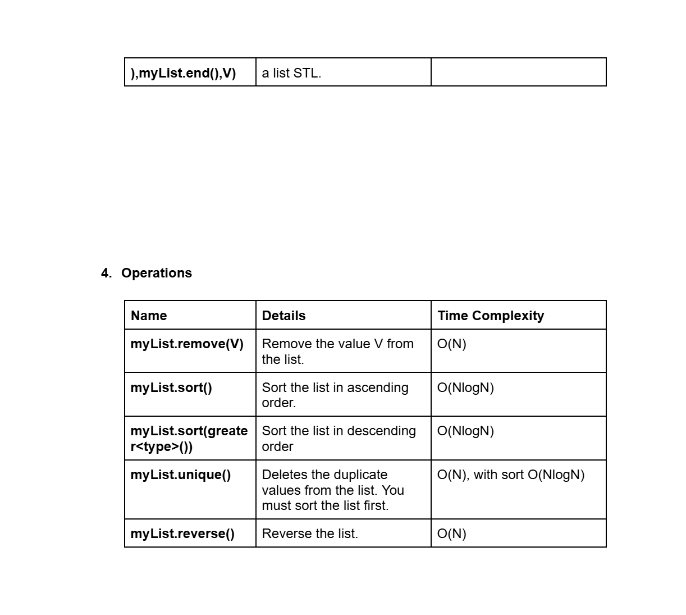

# Date: 08 July, 2025 - Tuesday

## Topics:
- List Build-in Functions
0. Introduction
1. List Constructors
2. List Capacity functions
3. List Modifiers functions
4. List Modifiers functions II
5. List operation functions
6. List element access and iterators
7. Idea of reversing singly linked list
8. Reverse singly linked list Implementation
9. Reverse singly linked list Animated
10. Reverse Doubly linked list
11. Reverse doubly linked list Animated
12. Idea of detecting cycle in linked list
13. Detect cycle implementation
14. Detect cycle Animated.mp4
15. Summary
- Quiz: Module 10
- Quiz Explanation
- Feedback Form: Module 10

## List Build-in Functions
- [Link](https://docs.google.com/document/d/1IbS-qmFx6oRO-GyIG55yavdDUHpfHTNM/edit?usp=sharing&ouid=112433310488936743525&rtpof=true&sd=true)
- 
- 
- 
- 

## 0. Introduction
- Exploring linked list with STL in C++
- STL list: A flexible container
- Mastering STL list functions
- Reversing a singly linked list
- Reversing a doubly linked list
- Detecting cycles in linked list

## 1. List Constructors
- Program: `stl_list.cpp`

## 2. List Capacity functions
- Program: `stl_list2.cpp`

## 3. List Modifiers functions
- Program: `list_modifiers.cpp`

## 4. List Modifiers functions II
- Program: `list_modifiers2.cpp`

## 5. List operation functions
- Program: `list_operations.cpp`

## 6. List element access and iterators
- Program: `list_functions.cpp`

## 7. Idea of reversing singly linked list
- This idea make will `recursion`
- 
- 
- 
- 
- Now, it's perfectly to `reverse` with `recursive function`.

## 8. Reverse singly linked list Implementation
- Program: `reverse_singly.cpp`
- Implementation this program of those four image logics.

## 9. Reverse singly linked list Animated
- Explanation this code:
    ```
    void reverse_linked_list(Node* &head, Node* &tail, Node* tmp) {
        if(tmp->next == NULL) {
            head = tmp;
            return;
        }
        reverse_linked_list(head, tail, tmp->next);
        tmp->next->next = tmp;
        tmp->next = NULL;
        tail = tmp;
    }
    ```

## 10. Reverse Doubly linked list
- Using `two pointer` techniques.
- 
- 
- Now it's time to implementation code with those drawing and logics.
- Program: `reverse_doubly.cpp`

## 11. Reverse doubly linked list Animated
- Explanation this code in this video:
    ```
    void reverse_doubly(Node* head, Node* tail) {
        for(Node *i=head,*j=tail; i!=j && i->previous!=j; i=i->next,j=j->previous) {
            swap(i->value, j->value);
        }
    }
    ```

## 12. Idea of detecting cycle in linked list
- Abc


## Quiz: Module 10
- `Total Questions: 10`
- `Total Marks: 10`

## Quiz Explanation
- [Link](https://docs.google.com/document/d/12TDWvvOyXQSB3tkcFv1eMZxhifiwCG0apN7GM1Nrz0Q/edit?usp=sharing)
#### 1. What is the purpose of a C++ list?
**a)** To store elements in a sequential order     
**b)** To store elements in a sorted order     
**c)** To store elements in a queue-like structure    
**d)** To store elements in a doubly linked-list data structure ✅  
> **Explanation:** C++ এর লিস্ট list হল একটি ডেটা স্ট্রাকচার যা ডাবলি লিঙ্কড লিস্ট (Doubly Linked List) ব্যবহার করে তৈরি। এটি এমন একটি স্ট্রাকচার যেখানে প্রতিটি নোডে দুটি লিঙ্ক থাকে - একটি পূর্ববর্তী নোডের জন্য এবং অন্যটি পরবর্তী নোডের জন্য। এটি দ্রুত ইনসারশন এবং ডিলিশনের জন্য উপযোগী।
---
#### 2. Which of the following operations can be performed on a C++ list?
**a)** Insertion and deletion at the beginning     
**b)** Insertion and deletion at the end     
**c)** Insertion and deletion at a specific position    
**d)** All of the above ✅  
> **Explanation:** C++ লিস্টে লিখিত সব অপারেশনগুলো করা যায়। এটি push_front, push_back, এবং insert এর মতো ফাংশনের মাধ্যমে করা যায়।
---
#### 3. Which function is used to insert an element at the beginning of a C++ list?
**a)** push_back()     
**b)** push_front() ✅   
**c)** front()    
**d)** add()   
> **Explanation:** push_front() ফাংশনটি একটি এলিমেন্টকে লিস্টের শুরুতে যোগ করার জন্য ব্যবহৃত হয়। এটি O(1) সময়ে কাজ করে কারণ এটি সরাসরি শুরুতে ডাটা যোগ করে।
---
#### 4. Which function is used to remove a value from C++ list using the value only?
**a)** remove() ✅    
**b)** delete()    
**c)** erase()    
**d)** pop_front()   
> **Explanation:** remove() ফাংশনটি লিস্টের প্রতিটি নোড স্ক্যান করে এবং নির্দিষ্ট মান পাওয়া গেলে তা মুছে ফেলে। এটি O(n) সময়ে কাজ করে কারণ এটি প্রতিটি নোড চেক করতে হয়।
---
#### 5. What is the time complexity for accessing an element in a C++ list by index (without head and tail)?
**a)** O(1)     
**b)** O(log n)    
**c)** O(n) ✅   
**d)** O(n^2)   
> **Explanation:** C++ লিস্ট একটি ডাবলি লিঙ্কড লিস্ট হওয়ায় এটি এলিমেন্ট সরাসরি ইনডেক্সের মাধ্যমে অ্যাক্সেস করতে পারে না। এটি প্রথম নোড থেকে শুরু করে ইনডেক্স অনুযায়ী এলিমেন্ট খুঁজে বের করে।
---
#### 6. Which function is used to sort a C++ list in ascending order?
**a)** sort() ✅    
**b)** merge_sort()    
**c)** bubble_sort()    
**d)** reverse()   
> **Explanation:** sort() ফাংশনটি একটি লিস্টকে এসেন্ডিং অর্ডারে সাজানোর জন্য ব্যবহৃত হয়। এটি একটি ইন-বিল্ট মেথড এবং এটি O(n log n) সময়ে কাজ করে।
---
#### 7. Which function is used to reverse the order of elements in a C++ list?
**a)** reverse() ✅    
**b)** sort()    
**c)** rotate()    
**d)** shuffle()   
> **Explanation:** reverse() ফাংশনটি একটি লিস্টের এলিমেন্টগুলোর ক্রম (order) উল্টাতে ব্যবহৃত হয়। এটি O(n) সময়ে কাজ করে।
---
#### 8. What is the time complexity for inserting an element at the end of a C++ list?
**a)** O(1) ✅    
**b)** O(logn)    
**c)** O(n)    
**d)** O(n^2)   
> **Explanation:** C++ লিস্টের শেষে একটি এলিমেন্ট যোগ করা খুবই কার্যকর কারণ এটি সরাসরি টেইলে একটি নতুন নোড যোগ করে।
---
#### 9. Which function is used to remove duplicate elements from a C++ list?
**a)** unique() ✅    
**b)** erase()    
**c)** remove()    
**d)** delete()   
> **Explanation:** unique() ফাংশনটি ধারাবাহিকভাবে থাকা সমান মানগুলোকে ফিল্টার করে এবং একবার মাত্র রেখে বাকিগুলো মুছে ফেলে। এটি কার্যকর করার জন্য লিস্টটি প্রথমে sort() করে নিতে হয়।
---
#### 10. Which function is used to check if a C++ list is empty?
**a)** empty() ✅    
**b)** size()    
**c)** is_empty()    
**d)** check_empty()   
> **Explanation:** empty() ফাংশনটি একটি লিস্ট খালি কিনা তা পরীক্ষা করার জন্য ব্যবহৃত হয়। এটি একটি বুলিয়ান ভ্যালু রিটার্ন করে।
---

## Feedback Form: Module 10
- মডিউল রিলেটেড তোমার যে কোন ফিডব্যাক থাকলে এই ফর্মে লিখে দিতে পারো। আমরা তোমার ফিডব্যাক গুরুত্বসহকার দেখব।
- [Form Links](https://forms.gle/DH5mjuGD1x2EZ4z29)