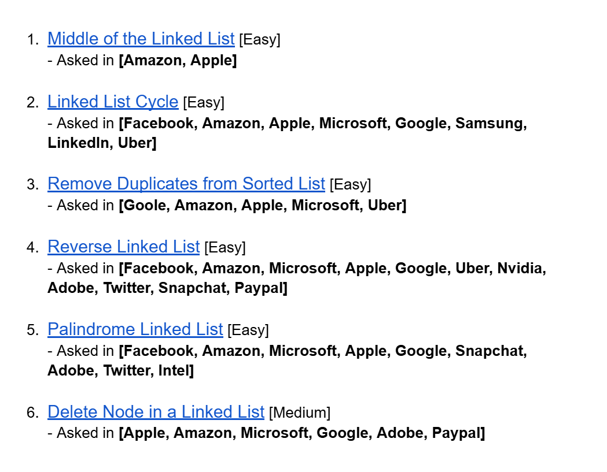
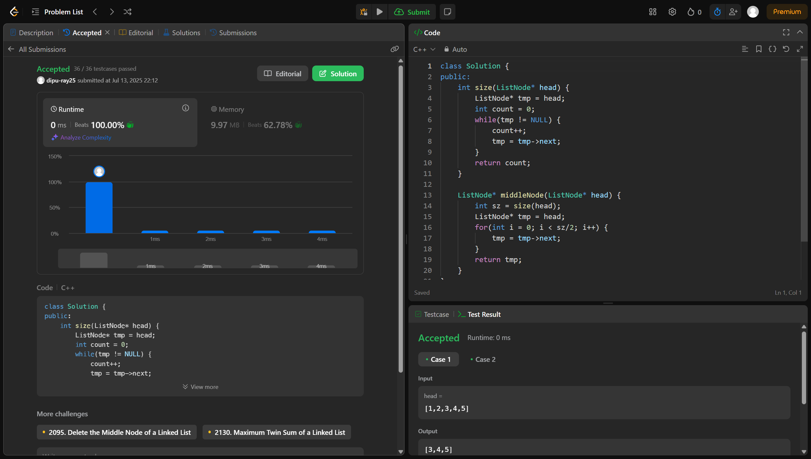
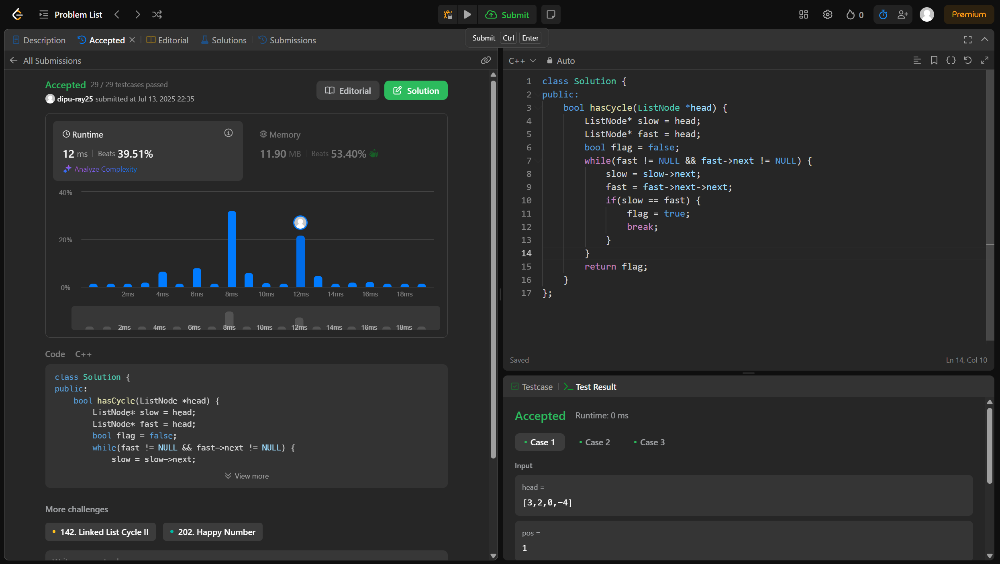
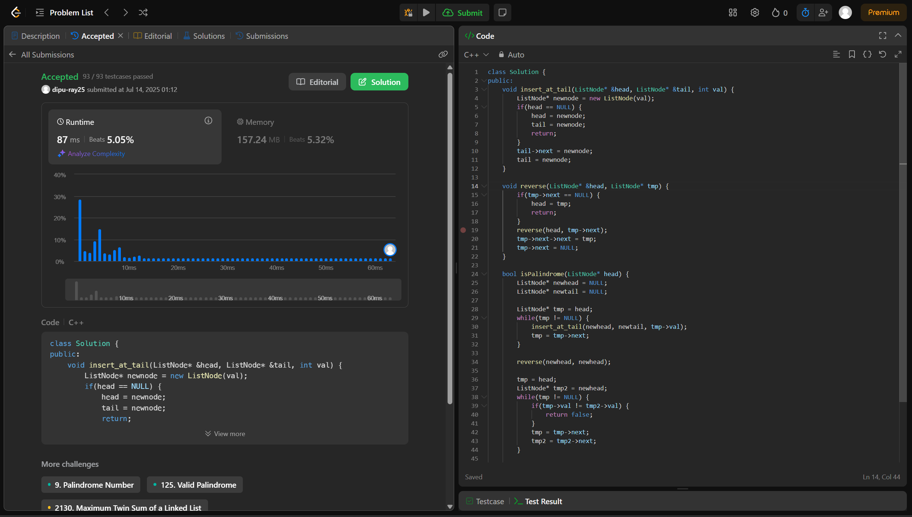
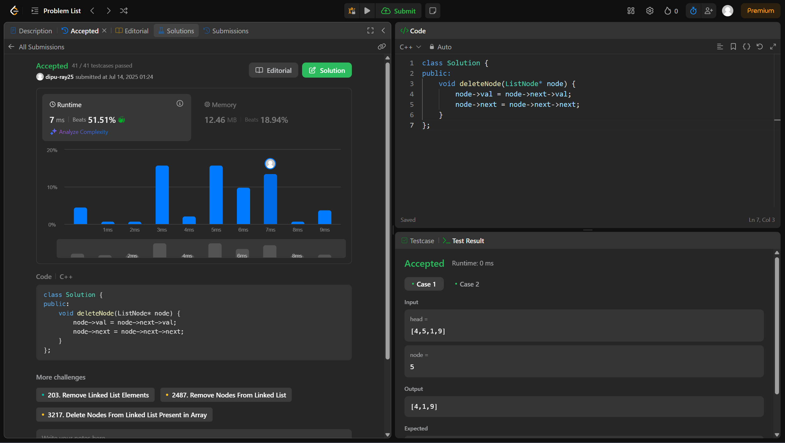
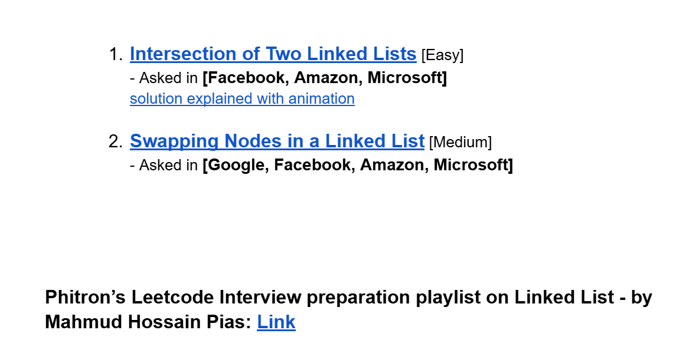
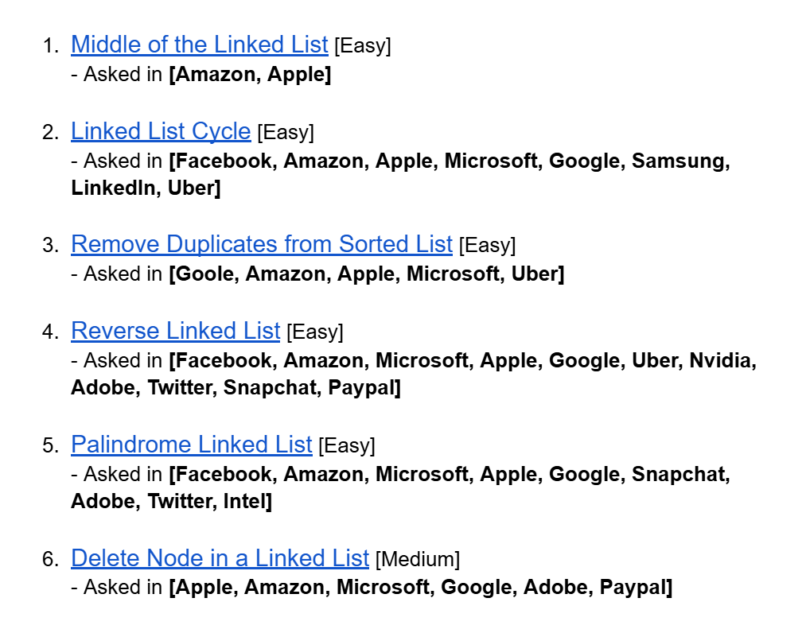

# Date: 12 July, 2025 - Saturday

## Topics:
0. Introduction and Creating account on Leetcode
1. Middle of the linked list
2. Linked list cycle
3. Remove Duplicate from sorted linked list
4. Reverse linked list
5. Palindrome linked list
6. Delete Node in a linked list
7. Summary
8. Leetcode companies and playlist
- Extra Problems and Problem Links
- Feedback Form: Module 11

## 0. Introduction and Creating account on Leetcode
- Today will leetcode problem solving with 6 problems.
- 
- `CodeChef` & `Codeforces` focused on `Competitive Programming` or `Problem Solving`
- `LeetCode` focused on `Data Structure Practice` & `Mainly Mainly for Interview Preparations`
- In this video learn to leetcode basics and how to create an account.

## 1. Middle of the linked list
- [Problem Link:](https://leetcode.com/problems/middle-of-the-linked-list/)
- Here is the solution:
    - 
    - Code:
        ```
        class Solution {
        public:
            int size(ListNode* head) {
                ListNode* tmp = head;
                int count = 0;
                while(tmp != NULL) {
                    count++;
                    tmp = tmp->next;
                }
                return count;
            }

            ListNode* middleNode(ListNode* head) {
                int sz = size(head);
                ListNode* tmp = head;
                for(int i = 0; i < sz/2; i++) {
                    tmp = tmp->next;
                }
                return tmp;
            }
        };
        ```

## 2. Linked list cycle
- [Problem Link:](https://leetcode.com/problems/linked-list-cycle/)
- Here is the solution:
    - 
    - Code:
        ```
        class Solution {
        public:
            bool hasCycle(ListNode *head) {
                ListNode* slow = head;
                ListNode* fast = head;
                bool flag = false;
                while(fast != NULL && fast->next != NULL) {
                    slow = slow->next;
                    fast = fast->next->next;
                    if(slow == fast) {
                        flag = true;
                        break;
                    }
                }
                return flag;
            }
        };
        ```
- More practice in leetcode.

## 3. Remove Duplicate from sorted linked list
- [Problem Link:](https://leetcode.com/problems/remove-duplicates-from-sorted-list/)
- Here is the solution:
    - 
    - Code:
        ```
        class Solution {
        public:
            ListNode* deleteDuplicates(ListNode* head) {
                if(head == NULL) {
                    return head;
                }
                ListNode* tmp = head;
                while(tmp->next != NULL) {
                    if(tmp->val == tmp->next->val) {
                        tmp->next = tmp->next->next;
                    }
                    else {
                        tmp = tmp->next;
                    }
                }
                return head;
            }
        };
        ```

## 4. Reverse linked list
- [Problem Link:](https://leetcode.com/problems/reverse-linked-list/)
- Here is the solution:
    - 
    - Code:
        ```
        class Solution {
        public:
            void reverse(ListNode* &head, ListNode* tmp) {
                if(tmp->next == NULL) {
                    head = tmp;
                    return;
                }
                reverse(head, tmp->next);
                tmp->next->next = tmp;
                tmp->next = NULL;
            }
            ListNode* reverseList(ListNode* head) {
                if(head == NULL) {
                    return head;
                }
                reverse(head, head);
                return head;
            }
        };
        ```

## 5. Palindrome linked list
- [Problem Link:](https://leetcode.com/problems/palindrome-linked-list/)
- Here is the solution:
    - 
    - Code:
        ```
        class Solution {
        public:
            void insert_at_tail(ListNode* &head, ListNode* &tail, int val) {
                ListNode* newnode = new ListNode(val);
                if(head == NULL) {
                    head = newnode;
                    tail = newnode;
                    return;
                }
                tail->next = newnode;
                tail = newnode;
            }

            void reverse(ListNode* &head, ListNode* tmp) {
                if(tmp->next == NULL) {
                    head = tmp;
                    return;
                }
                reverse(head, tmp->next);
                tmp->next->next = tmp;
                tmp->next = NULL;
            }

            bool isPalindrome(ListNode* head) {
                ListNode* newhead = NULL;
                ListNode* newtail = NULL;

                ListNode* tmp = head;
                while(tmp != NULL) {
                    insert_at_tail(newhead, newtail, tmp->val);
                    tmp = tmp->next;
                }

                reverse(newhead, newhead);

                tmp = head;
                ListNode* tmp2 = newhead;
                while(tmp != NULL) {
                    if(tmp->val != tmp2->val) {
                        return false;
                    }
                    tmp = tmp->next;
                    tmp2 = tmp2->next;
                }

                return true;
            }
        };
        ```

## 6. Delete Node in a linked list
- [Problem Link:](https://leetcode.com/problems/delete-node-in-a-linked-list/)
- Here is the solution:
    - 
    - Code:
        ```
        class Solution {
        public:
            void deleteNode(ListNode* node) {
                node->val = node->next->val;
                node->next = node->next->next;
            }
        };
        ```

## 7. Summary
- At first we have learn basics of leetcode
- Then the problems 1 to 6 problems solve in leetcode

## 8. Leetcode companies and playlist
- You can find out problem with company names. Search on google `leetcode.ca problems_serial_number` - `leetcode.ca 876`. Then go the main website and find the companies name from this problems.
- We have already done this six problem with `singly linked list`.
- Resources and learn with leetcode related. Just checkout every point of leetcode. Leetcode, you can use to you high profile or job positions.

## Extra Problems and Problem Links
- [Extra Problems Link -](https://docs.google.com/document/d/1686xqYvPYFUsck_9hNRvLV-m6hfIKeNoSxvNWrIZhXQ/edit?usp=sharing)
    - 
    - [Problem 1](https://leetcode.com/problems/intersection-of-two-linked-lists/description/)
    - [Problem 2](https://leetcode.com/problems/swapping-nodes-in-a-linked-list/)
    - Phitron’s Leetcode Interview preparation playlist on Linked List - by Mahmud Hossain Pias. Here youtube link (Additional) - [Link](https://www.youtube.com/playlist?list=PLiwblITDIFbjkVx-P10zGnT96brFCAXHr)

- [Module Problem List Link -](https://docs.google.com/document/d/11-8wWOLJcDZbLLU7UiRCyUZ3nXYPFDpd/edit?usp=sharing&ouid=112433310488936743525&rtpof=true&sd=true)
    - 
    - [Problem 1](https://leetcode.com/problems/middle-of-the-linked-list/)
    - [Problem 2](https://leetcode.com/problems/linked-list-cycle/)
    - [Problem 3](https://leetcode.com/problems/remove-duplicates-from-sorted-list/)
    - [Problem 4](https://leetcode.com/problems/reverse-linked-list/)
    - [Problem 5](https://leetcode.com/problems/palindrome-linked-list/)
    - [Problem 6](https://leetcode.com/problems/delete-node-in-a-linked-list/)