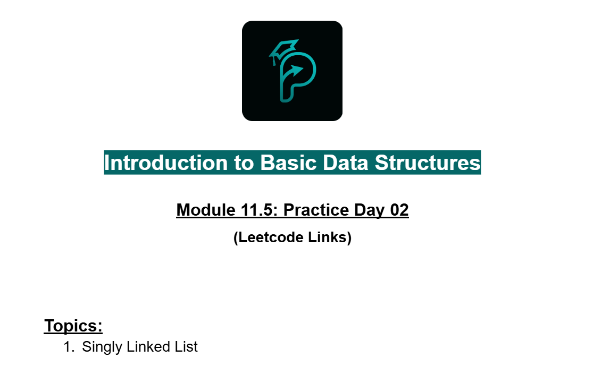
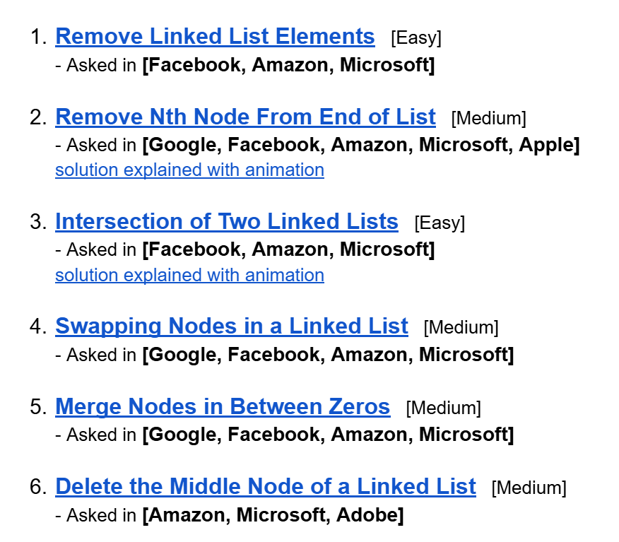

# Date: 14 July, 2025 - Monday

## Topics:
- Practice Problem Set: Module 11.5
- 1 Practice

## Practice Problem Set: Module 11.5
- [Link -](https://docs.google.com/document/d/1O4GbhWEfP09mr1YijlbCh3RApDHTPXH5/edit?usp=drivesdk&ouid=112433310488936743525&rtpof=true&sd=true)
    - 
    - 
    - [Problem 1](https://leetcode.com/problems/remove-linked-list-elements/)
    - [Problem 2](https://leetcode.com/problems/remove-nth-node-from-end-of-list/)
    - [Problem 3](https://leetcode.com/problems/intersection-of-two-linked-lists/description/)
    - [Problem 4](https://leetcode.com/problems/swapping-nodes-in-a-linked-list/)
    - [Problem 5](https://leetcode.com/problems/merge-nodes-in-between-zeros/)
    - [Problem 6](https://leetcode.com/problems/delete-the-middle-node-of-a-linked-list/)

## 1 Practice
- Explanation those whole practice problems in this video.