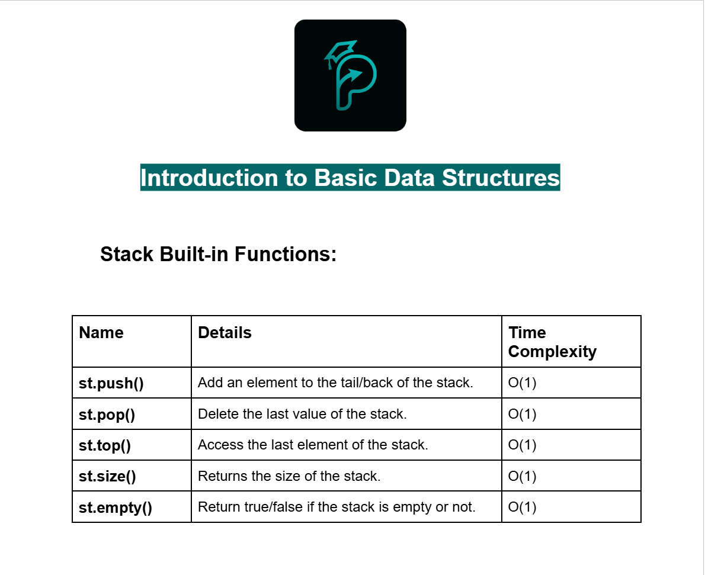
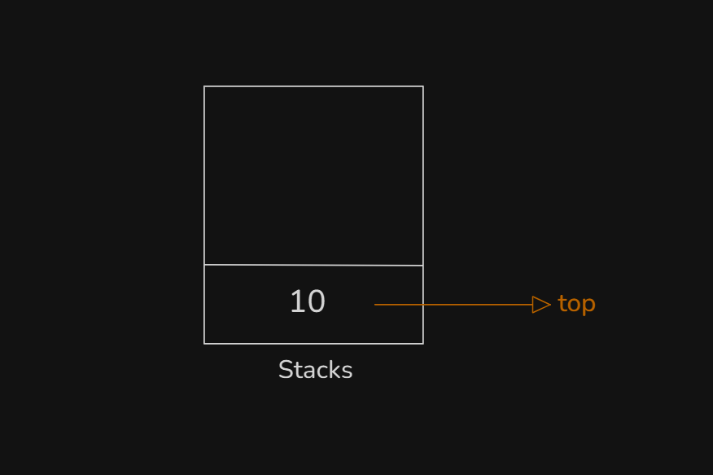
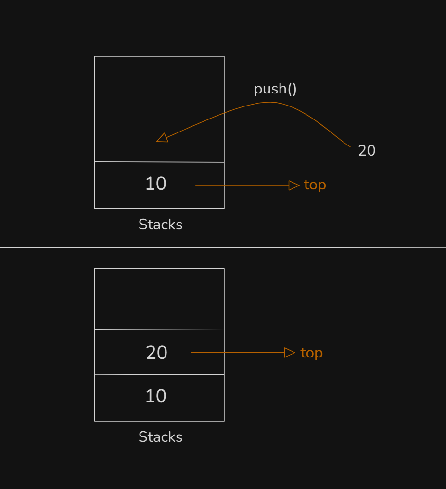
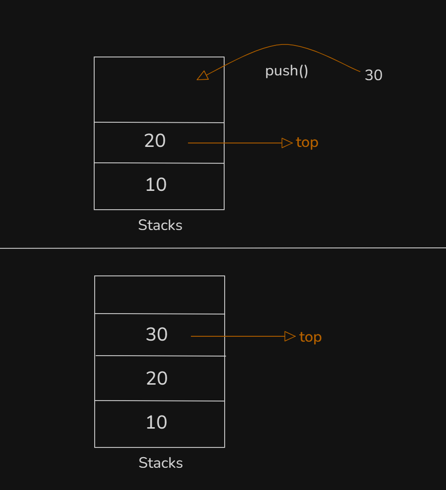
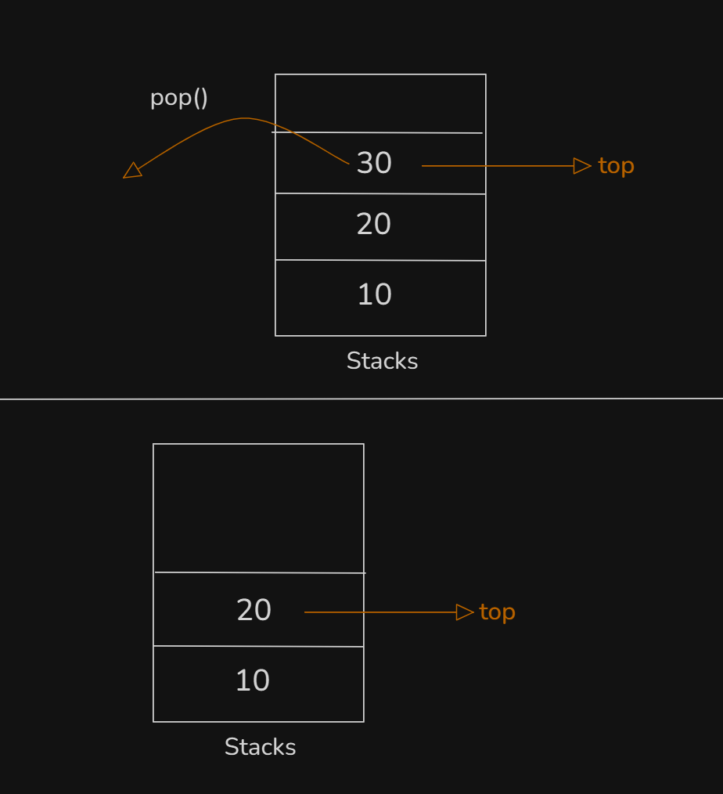
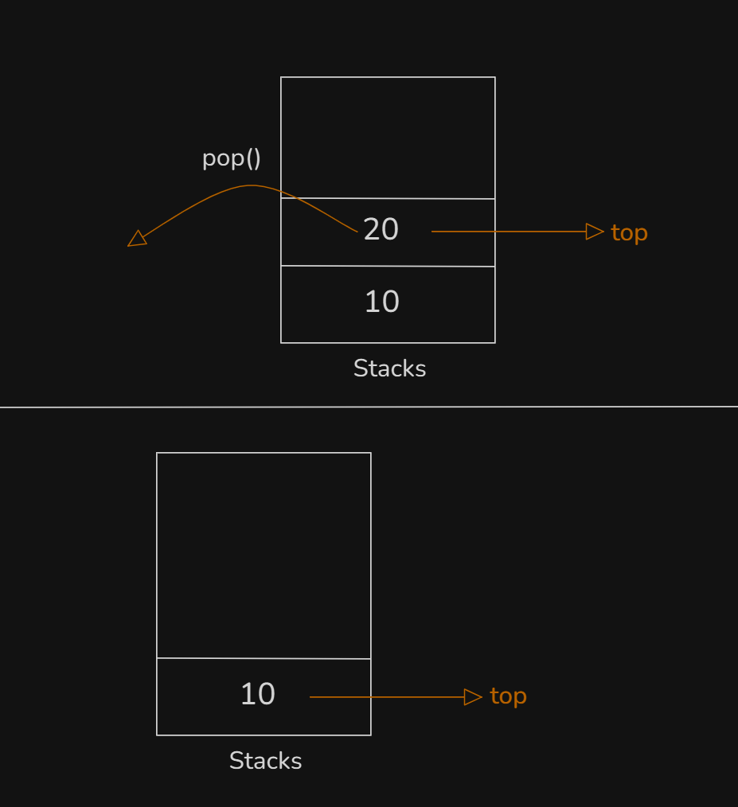
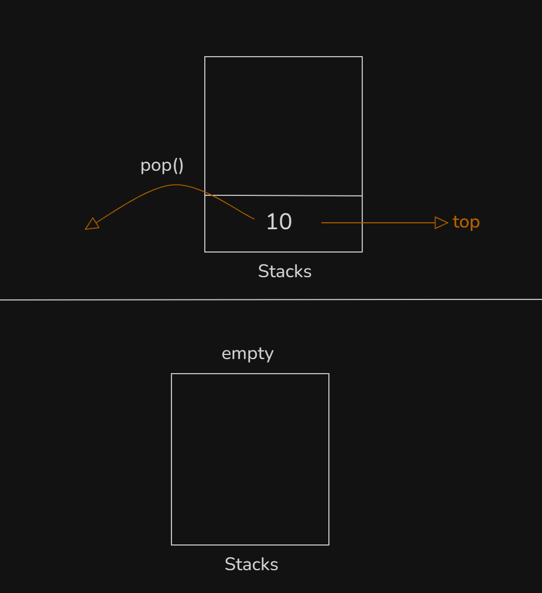
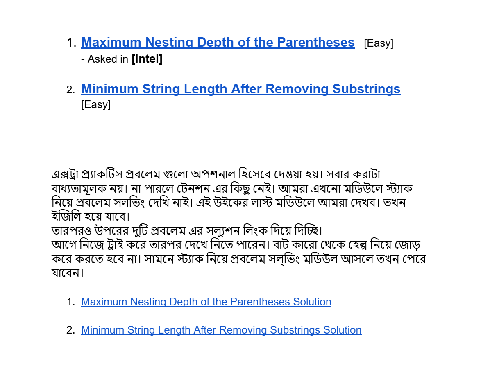

# Date: 19 July, 2025 - Saturday

## Topics:
- Stack Build-in Functions
0. Introduction
1. What is Stack Animated
2. Real life application of Stack Animated
3. What is stack
4. Stack Implementation using Array I
5. Stack Implementation using Array II
6. Stack Input and Output
7. Stack Implementation using list
8. Stack Implementation using Doubly linked list
9. STL stack
10. Summary
- Quiz: Module 13
- Extra Practice Problem and Quiz Explanation
- Feedback Form: Module 13

## Stack Build-in Functions
- [Link-](https://docs.google.com/document/d/1676YNr_Oi_Gylv94ClrpHYu-ac8P0aYQbO0wZw-N2Mw/edit?usp=sharing)
- 

## 0. Introduction
- Exploring Stacks: A Data Structure Deep Dive
- LIFO - Stacks follow the `Last In, First Out (LIFO)` principle
- Implementing stacks using `Arrays`
- Implementing stacks using `STL List`
- Implementing stacks using `Doubly Linked Lists`

## 1. What is Stack Animated
- Explain this video with animated way `Stack of Plates` & `Stack of Chairs`.
- `Push()`- Push() value with top:
    - 
    - 
    - 
- `Pop()` - Pop() value with top:
    - 
    - 
    - 
- You can `Push()` on top and you can `Pop()` will the top

## 2. Real life application of Stack Animated
- Real life implementation of STACK
- Example with a browser. Browser can go to enter a website and back from a website. That's mean forward and backward of a browser.
- Forward with `Push()` on top and Backward with `Pop()` on top in `STACK`
- STACK follow the technique is `LIFO technique`
- STACK help to `Crack The Interview`

## 3. What is stack
- Stack:
    - `Abstract Data Structure`
    - `Higher level Data Structure`
- Example with `Stack of Plates`
- Example with `Stack of Chairs`
- `LIFO` technique follow that's means that is `Stack`
- `Stack` implementation with `Arrays` and `Linked List`
- `Stack` there have don't access to stack middle or stack bottom, they have access to only on the top.
- `Array` can work with stack, `Linked List` can work with stack, `Vector` can work with stack and `STL` can work with stack.
- Stack Operations:
    - `push()`
    - `pop()`
    - `top()`
    - `size()`
    - `empty()`

## 4. Stack Implementation using Array I
- Make functions in classes. Example or Demo:
    ```
    class Stack {
        public:
        push();
        pop();
        top();
    };

    int main() {
        Stack.push();
        Stack.pop();
        Stack.top();

        return 0;
    }
    ```
- Program: `implement_stack_array.cpp`

## 5. Stack Implementation using Array II
- Program: `implement_stack_array2.cpp`
- When you work with dynamic array or vector then you use to `arrow sign ->`. When you work with static array or vector then you use to `dot sign .`.

## 6. Stack Input and Output
- Program: `implement_stack_array3.cpp`

## 7. Stack Implementation using list
- Program: `implement_stack_stl_list.cpp`

## 8. Stack Implementation using Doubly linked list
- Program: `implement_stack_doubly_linked_list.cpp`

## 9. STL stack
- Program: `stl_stack.cpp`

## 10. Summary
- Higher level data structure or abstract data structure this is `Stack`
- Build in STL in stack - uses
- Stack implement with array - using `vector`
- Stack implement with STL List - using `list`
- Stack implement with `doubly linked list`
- At last stack implement with `STL stack`

## Quiz: Module 13
- `Total Questions: 10`
- `Total Marks: 10`

## Extra Practice Problem and Quiz Explanation
- [Quiz Explanation:](https://docs.google.com/document/d/1KsjaPsAdvVYKMtqvoC31RjF00HfXRa21G-mmI8JmEtM/edit?tab=t.0)
#### 1. What is the time complexity of push() operation in a stack implemented using a vector?
**a)** O(1) ✅  
**b)** O(n)  
**c)** O(logn)  
**d)** O(n^2)
> **Explanation:** ভেক্টরেরে push_back এর মাধ্যমে stack এর push অপারেশন টি ইমপ্লিমেন্ট করা হয়ে থাকে, যার কমপ্লেক্সিটি O(1)।
---
#### 2. Which operation is NOT valid on an empty stack?
```
stack<int> s;
```
**a)** s.size()   
**b)** s.top() ✅  
**c)** s.empty()  
**d)** s.push(10)
> **Explanation:** খালি স্ট্যাক-এ top() কল করা undefined behavior অথবা গার্বেজ মান দেখাবে। size() ঠিক ভাবে 0 রিটার্ন করে, empty() ঠিক ভাবে true রিটার্ন করে, push() খালি স্ট্যাক-এ একটি মান যুক্ত করে। তাই, top() অপারেশন ভ্যালিড নয়।
---
#### 3. In a linked list implementation of a stack, where does the new element get inserted?
**a)** At the beginning of the list   
**b)** At the end of the list ✅  
**c)** In the middle of the list  
**d)** It depends on the implementation
> **Explanation:** মডিউল অনুসারে Linked list এর  tail এ ভ্যালু insertion এর মাধ্যমে stack এ ভ্যালু insert করা হয়ে থাকে।
---
#### 4. Which function  is used to insert an element into a stack implemented using an STL list?
**a)** push_back() ✅  
**b)** insert()  
**c)** add()  
**d)** append()
> **Explanation:** STL List এর  push_back ফাংশন এর মাধ্যমে stack এর insertion অপারেশন টি ইমপ্লিমেন্ট করা হয়ে থাকে, যার কমপ্লেক্সিটি O(1)।
---
#### 5. In a stack implemented using the STL list, which function is used to remove the top element?
**a)** pop_back() ✅  
**b)** remove()  
**c)** delete()  
**d)** erase()
> **Explanation:** STL List এর  push_back ফাংশন এর মাধ্যমে এই অপারেশন টি ইমপ্লিমেন্ট করা হয়ে থাকে, যার কমপ্লেক্সিটি O(1)।
---
#### 6. Which function is used to access the top element of a stack implemented using an STL stack?
**a)** top() ✅  
**b)** front()  
**c)** peek()  
**d)** get()
> **Explanation:** STL Stack এর top ফাংশন ব্যবহারের মাধ্যমে stack এর top element এক্সেস করা হয়।
---
#### 7. Which operation is used to check if a stack is empty in the STL stack container?
**a)** is_empty()  
**b)** empty() ✅  
**c)** is_stack_empty()  
**d)** stack_empty()
> **Explanation:** STL Stack এর empty() function ব্যবহারের মাধ্যমে stack empty কিনা চেক করা হয়ে থাকে।
---
#### 8. What is the time complexity of the pop() operation in a stack implemented using a vector?
**a)** O(1) ✅  
**b)** O(n)  
**c)** O(logn)  
**d)** O(n^2)
> **Explanation:** ভেক্টরেরে pop_back এর মাধ্যমে stack এর pop অপারেশন টি ইমপ্লিমেন্ট করা হয়ে থাকে, যার কমপ্লেক্সিটি O(1)।
---
#### 9. In C++, the stack data structure follows the principle of:
**a)** First-In-First-Out (FIFO)  
**b)** First-Come-First-Served (FCFS)  
**c)** Last-In-First-Out (LIFO) ✅  
**d)** Last-Come-Last-Served (LCLS)
> **Explanation:** stack এর ক্ষেত্রে যে ভ্যালুটি সবার পরে stack এ আসে , সে সবার আগে stack থেকে বের হয়ে যায়।
---
#### 10. Which operation is used to check the size of a stack implemented using an STL stack?
**a)** size() ✅  
**b)** length()  
**c)** get_size()  
**d)** stack_size()
> **Explanation:** STL Stack এর size() function ব্যবহারের মাধ্যমে stack এর সাইজ চেক করা হয়ে থাকে।
---
- [Extra Practice Problem (Optional):](https://docs.google.com/document/d/1Hz4Pmc0tO-vXmgy8-PQcjcx3k4A6492Drgv_vsneD9U/edit?usp=sharing)
- 
- [Problem 1](https://leetcode.com/problems/maximum-nesting-depth-of-the-parentheses/)
- [Problem 2](https://leetcode.com/problems/minimum-string-length-after-removing-substrings/description/)
- [Problem 3](https://leetcode.com/problems/maximum-nesting-depth-of-the-parentheses/solutions/6975419/stack-beats-100-beginner-friendly-by-pia-9eh6/)
- [Problem 4](https://leetcode.com/problems/minimum-string-length-after-removing-substrings/solutions/6975472/stack-simple-clear-beginner-friendly-by-ka3iq/)