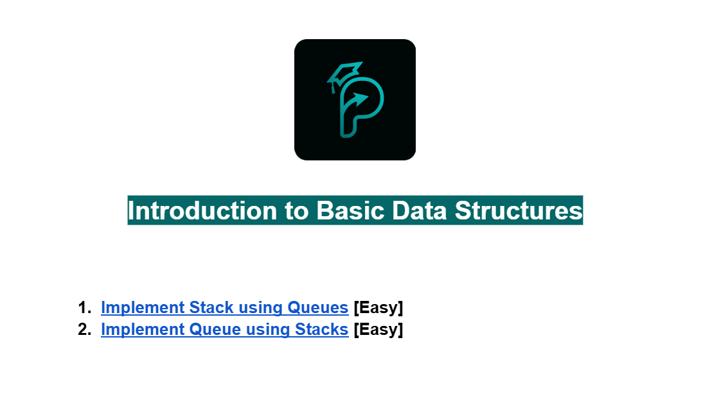
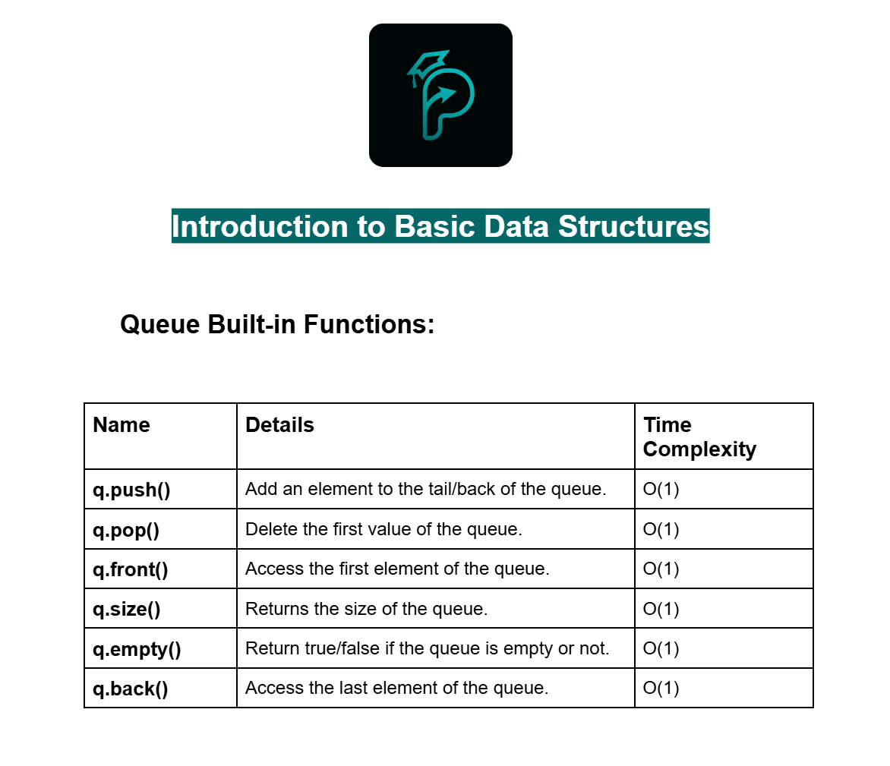
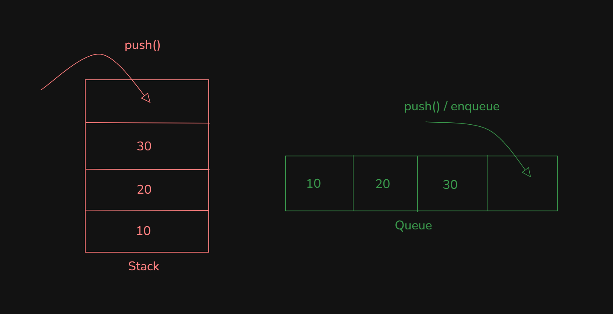
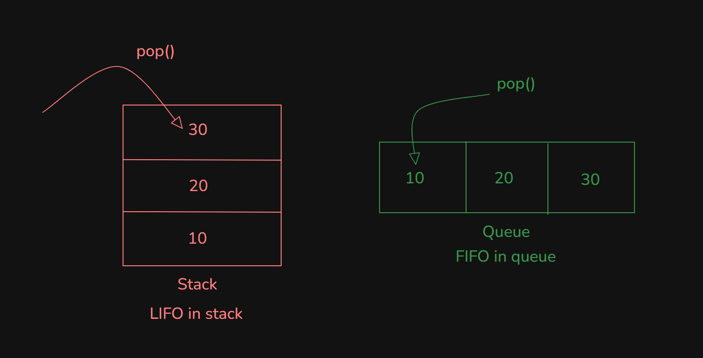
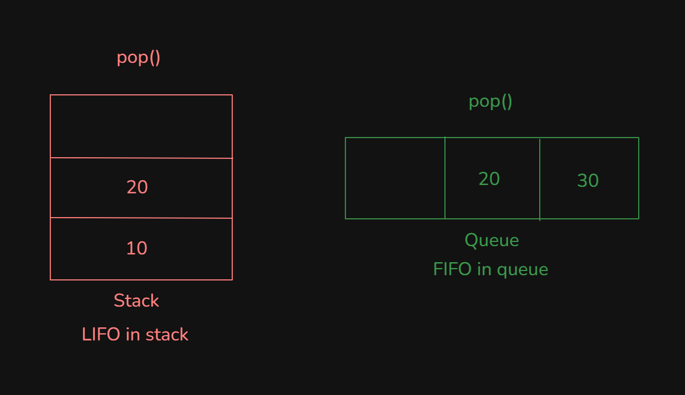
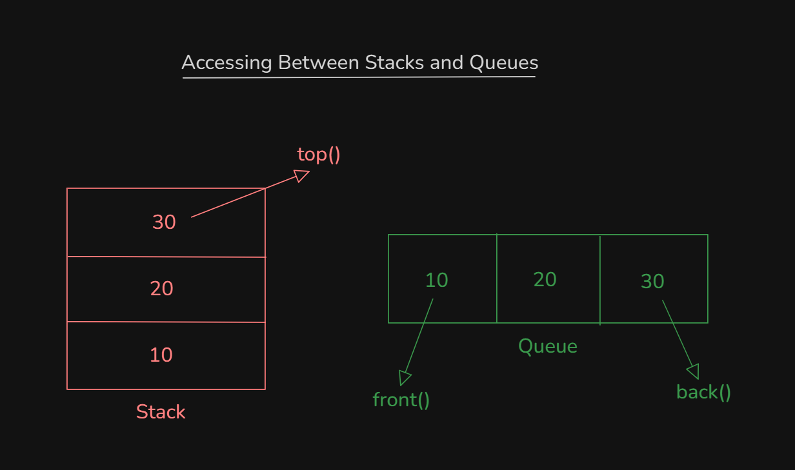
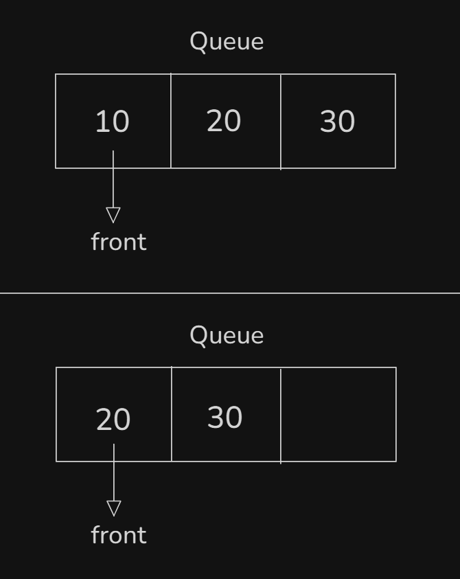
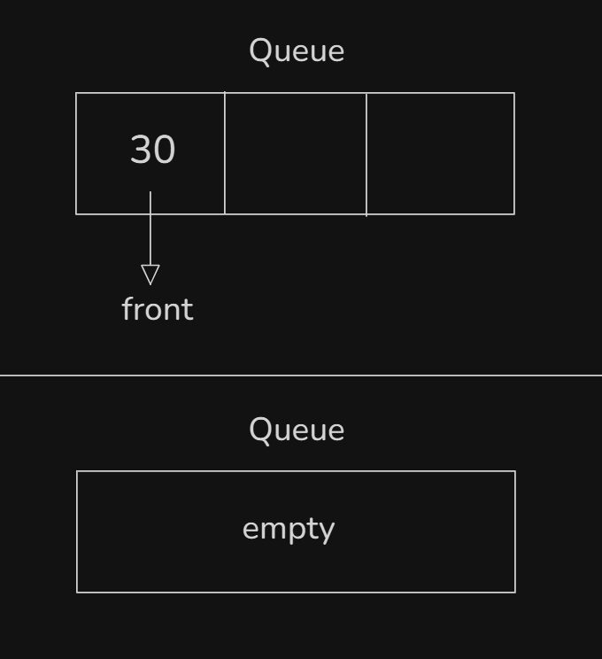
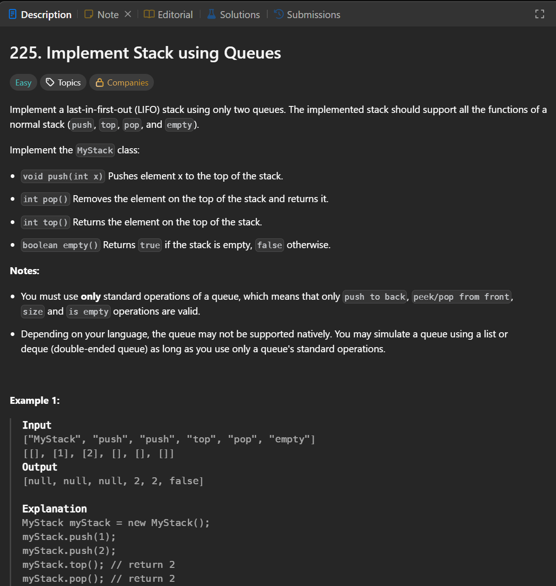

# Date: 20 July, 2025 - Sunday

## Topics:
- Problems Links and Queue Build-in Function
0. Introduction
1. What is Queue
2. Real life application of queue
3. Implement Queue using Singly linked list
4. Queue Input and Output
5. Implement Queue using Doubly linked list
6. Implement Queue using STL list
7. STL Queue
8. Implement stack using queues
9. Implement queue using stacks
10. Summary
- Quiz: Module 14
- Quiz Explanation
- Feedback Form: Module 14

## Problems Links and Queue Build-in Function
- [Problems Links-](https://docs.google.com/document/d/184KGhHMwwfxclCOGczYXjydFRvadXbUI/edit?usp=drivesdk&ouid=112433310488936743525&rtpof=true&sd=true)
- 
- [Problem 1](https://leetcode.com/problems/implement-stack-using-queues/)
- [Problem 2](https://leetcode.com/problems/implement-queue-using-stacks/)
<br><br>
- [Built-in Function -](https://docs.google.com/document/d/1tiYAlnJZWbuamFGwLgR4tGm2TEm_FQe0hxF-rXy-9bU/edit?usp=drivesdk)
- 

## 0. Introduction
- Mastering Queues: Data Structures and Implementations
- Understanding Queues: The `First-in, First-out(FIFO)` Principle
- Implementing Queues Using `Singly Linked Lists`
- Implementing Queues Using `STL Lists`
- Exploring STL Queues: A Powerful and Efficient Option
- `Implementing Stacks Using Queues`: An Intriguing Approach
- `Implementing Queues Using Stacks`: A Reverse Perspective

## 1. What is Queue
- Queues:
    - `Abstract Data Structure`
    - `Higher Level Data Structure`
- Queues means `trail` or `Line`
- Example with `Ticket counter in Lines`. Queues follow to `First-in, First-out (FIFO)` technique.
- Queue Operation:
    - `push()`
    - `pop()`
    - `front()`
    - `size()`
    - `empty()`
    - `back()`
- 
- 
- 
- Main difference in stacks and queues when it `pop() or remove`
- Also called on `pop() or dequeue` in Queues
- 
- `push() on back()` and `pop() on the front()` in `Queues`.

## 2. Real life application of queue
- Serial maintain in queues
- Example with `serial maintaining`.
- 
- 

## 3. Implement Queue using Singly linked list
- Program: `implement_queue_using_singly.cpp`

## 4. Queue Input and Output
- Program: `implement_queue_using_singly2.cpp`

## 5. Implement Queue using Doubly linked list
- Program: `implement_queue_using_doubly.cpp`

## 6. Implement Queue using STL list
- Program: `implement_queue_using_list.cpp`

## 7. STL Queue
- Program: `stl_queue.cpp`

## 8. Implement stack using queues
- Problems:
    - 
- Solve:
    ```
    
    ```

## 9. Implement queue using stacks
- Abc

## 10. Summary
- Learn to new data structure `Queue`
- Implement `Queue` with `Doubly Linked List`
- Implement `Queue` with `STL List`
- Implement `Queue` with `STL Queue`
- Solve with two problems:
    - `Problem 1` - Stack implement with queue
    - `Problem 2` - Queue implement with stack

## Quiz: Module 14
- `Total Questions: 10`
- `Total Marks: 10`

## Quiz Explanation
- [Quiz Explanation -](https://docs.google.com/document/d/17cWGow5iNWXsN6oIs8zLuSb1JSASbBcc/edit?usp=drivesdk&ouid=112433310488936743525&rtpof=true&sd=true)
#### 1. What system does the queue use?
**a)** Last In First Out   
**b)** Last In Last Out ✅  
**c)** First In Last Out  
**d)** First In Middle Out
> **Explanation:** কিউ সিস্টেম "First In First Out (FIFO)" পদ্ধতি ব্যবহার করে, যেখানে প্রথমে প্রবেশ করা ডেটা প্রথমেই বের হয়। একইভাবে বলা যায়, কিউ সিস্টেমে সর্বশেষে প্রবেশ করা ডেটা সর্বশেষে বের হয়, এটি "Last In Last Out" পদ্ধতি অনুসরণ করে।
---
#### 2. What did we use to implement the queue in the module?
**a)** Singly Linked List   
**b)** Doubly Linked List   
**c)** Array  
**d)** Both A and B ✅
> **Explanation:** আমাদের মডিউলে array দিয়ে Queue ইমপ্লিমেন্ট করা হয় নাই। কারণ, array তে front থেকে pop করার কমপ্লেক্সিটি O(N)।
---
#### 3. What is the complexity of push() operation in queue?
**a)** O(1) ✅  
**b)** O(N)  
**c)** O(logN)  
**d)** O(N*N)
> **Explanation:** কিউতে push() অপারেশন কনস্ট্যান্ট টাইমে সম্পন্ন হয়, তাই এর কমপ্লেক্সিটি হল O(1)।
---
#### 4. What is the complexity of pop() operation in queue?
**a)** O(1) ✅  
**b)** O(N)  
**c)** O(logN)  
**d)** O(N*N)
> **Explanation:** কিউতে pop() অপারেশন প্রথম এলিমেন্ট সরাতে কেবল কনস্ট্যান্ট সময় নেয়, তাই এর কমপ্লেক্সিটি O(1)।
---
#### 5. What will happen if we copy one queue to another in the order it is removed?
**a)** We will get a random queue  
**b)** We will get the same queue ✅  
**c)** We will get the reverse of that queue  
**d)** It is not possible
> **Explanation:** যদি একটি কিউ থেকে এলিমেন্টগুলো সরিয়ে অন্য কিউতে কপি করা হয়, তবে এলিমেন্টের ক্রম অপরিবর্তিত থাকে এবং একই কিউ পুনরায় তৈরি হয়।
---
#### 6. What will happen if we copy one stack to another in the order it is removed?
**a)** We will get a random stack  
**b)** We will get the same stack  
**c)** We will get the reverse of that stack ✅  
**d)** It is not possible
> **Explanation:** স্ট্যাক "Last In Last Out" পদ্ধতি ব্যবহার করে, তাই এলিমেন্টগুলো সরানোর সময় ক্রম বিপরীত হয়, এবং অন্য স্ট্যাকে কপি করলে এটি উল্টা স্ট্যাক তৈরি করে।
---
#### 7. What is the main difference between a queue and a stack?
**a)** Queue is FIFO; stack is LIFO ✅  
**b)** Queue is LIFO; stack is FIFO  
**c)** Both are LIFO  
**d)** Both are FIFO
> **Explanation:** Queue (সারি) ফলো করে FIFO (প্রথমে প্রবেশ, প্রথমে বাহির), আর Stack (গাদা বা স্তূপ) ফলো করে LIFO (শেষে প্রবেশ, প্রথমে বাহির)।
---
#### 8. Which of the following operations is not supported by “std::queue” directly?
**a)** Accessing the front element   
**b)** Removing the last element ✅  
**c)** Removing an element from the front  
**d)** Inserting an element at the back
> **Explanation:** pop() ফাংশন ব্যবহার করে কিউ-এর শুরু থেকে উপাদান মুছে ফেলা হয়। কিউ-এর শেষ থেকে উপাদান মুছে ফেলার কোনো উপায় নাই।
---
#### 9. Why didn’t we use an array to implement the queue?
**a)** The first element can’t be removed   
**b)** Time complexity of removing the first element is bad  
**c)** If we don’t remove the first element, memory will be wasted  
**d)** Both B and C ✅
> **Explanation:** <br> B: অ্যারেতে প্রথম এলিমেন্ট সরাতে সময়ের কমপ্লেক্সিটি খারাপ হয়, কারণ প্রতিটি অপসারণের পর বাকি এলিমেন্টগুলোকে এক ধাপ করে সরাতে হয়। <br>
C: যদি প্রথম এলিমেন্ট সরানো না হয়, তবে মেমোরি অপচয় হয়, কারণ অ্যারের ব্যবহৃত স্থানটি আর পুনরায় কাজে লাগানো যায় না।
---
#### 10. If we implement a queue using an array where the last element is connected with the first, what would it be called?
**a)** Special queue   
**b)** Array queue  
**c)** Circular queue ✅  
**d)** Loop queue
> **Explanation:** যদি একটি কিউ অ্যারে দিয়ে ইমপ্লিমেন্ট করা হয় যেখানে শেষ এলিমেন্টটি প্রথম এলিমেন্টের সাথে সংযুক্ত করতে হয়, তখন সেটিকে সার্কুলার কিউ বলা হয়। এটি মেমোরি অপচয় রোধ করে এবং অ্যারের সীমাবদ্ধ স্থান কার্যকরভাবে ব্যবহার করে।

## Feedback Form: Module 14
- মডিউল রিলেটেড তোমার যে কোন ফিডব্যাক থাকলে এই ফর্মে লিখে দিতে পারো। আমরা তোমার ফিডব্যাক গুরুত্বসহকার দেখব।
- [Form Links](https://forms.gle/DH5mjuGD1x2EZ4z29)