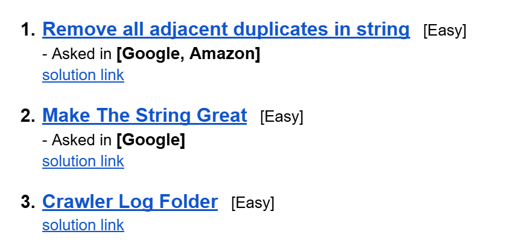

# Date: 22 July, 2025 - Tuesday

## Topics:
- Problem Link
0. Introduction
1. Valid parentheses
2. Backspace string compare
3. Insert an element at its bottom in a given stack
4. Maximum equal stack sum
5. Reversing a queue
6. Min stack
7. Summary
- Extra Problem
- Feedback Form: Module 15

## Problem Link
- [Extra Practice Problem -](https://docs.google.com/document/d/1bjgJn3eVfTFpYyzUbqoUb4SVcNS_LCT4kGXzTihVmRI/edit?usp=sharing)
- 
- [Problem 1](https://leetcode.com/problems/remove-all-adjacent-duplicates-in-string/description/)
    - [Solution Link](https://leetcode.com/problems/remove-all-adjacent-duplicates-in-string/solutions/6975541/stack-simple-clean-by-piaaaas-jqwa/)
- [Problem 2](https://leetcode.com/problems/make-the-string-great/description/)
    - [Solution Link](https://leetcode.com/problems/make-the-string-great/solutions/6975497/simple-stack-beginner-friendly-by-piaaaa-w319/)
- [Problem 1](https://leetcode.com/problems/crawler-log-folder/description/)
    - [Solution Link](https://leetcode.com/problems/crawler-log-folder/solutions/6975509/stack-simple-clean-by-piaaaas-1yz1/)