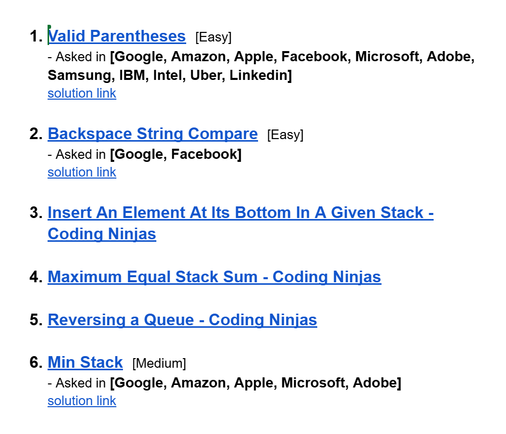

# Date: 22 July, 2025 - Tuesday

## Topics:
- Problem Link
0. Introduction
1. Valid parentheses
2. Backspace string compare
3. Insert an element at its bottom in a given stack
4. Maximum equal stack sum
5. Reversing a queue
6. Min stack
7. Summary
- Extra Problem
- Feedback Form: Module 15

## Problem Link
- [Extra Practice Problem -](https://docs.google.com/document/d/1fuirtZp8dUD6cCnwjBsSpbFZI_CqOBIw/edit?usp=sharing&ouid=112433310488936743525&rtpof=true&sd=true)
- 
- [Problem 1](https://leetcode.com/problems/valid-parentheses/)
    - [Solution Link](https://leetcode.com/problems/valid-parentheses/solutions/6981469/simple-beginner-friendly-stack-beats-100-ogx0/)
- [Problem 2](https://leetcode.com/problems/backspace-string-compare/description/)
    - [Solution Link](https://leetcode.com/problems/backspace-string-compare/solutions/6981972/simple-stack-beats-100-by-piaaaas-8wmp/)
- [Problem 3](https://www.codingninjas.com/studio/problems/insert-an-element-at-its-bottom-in-a-given-stack_1171166)
- [Problem 4](https://www.codingninjas.com/studio/problems/maximum-equal-stack-sum_1062571)
- [Problem 5](https://www.codingninjas.com/studio/problems/reversing-a-queue_982934)
- [Problem 6](https://leetcode.com/problems/min-stack/description/)
    - [Solution Link](https://leetcode.com/problems/min-stack/solutions/6981989/beginner-friendly-just-using-another-sta-po6a/)

## 0. Introduction
- Those problem are from `big tech` companies and this are also most uses problem in big tech `interview crack`
- There have six problems:
    - `3 problems from leetcode`
    - `3 problem from new online judges`
    - 

## 1. Valid parentheses
- [Problem 1](https://leetcode.com/problems/valid-parentheses/)
- 
- Problem Solution:
    ```
    class Solution {
    public:
        bool isValid(string s) {
            stack<char> st;
            for(char c : s) {
                if(c == '(' || c == '{' || c == '[') {
                    st.push(c);
                }
                else {
                    if(st.empty()) {
                        return false;
                    }
                    else {
                        if(c == ')' && st.top() == '(') {
                            st.pop();
                        }
                        else if(c == '}' && st.top() == '{') {
                            st.pop();
                        }
                        else if(c == ']' && st.top() == '[') {
                            st.pop();
                        }
                        else {
                            return false;
                        }
                    }
                }
            }
            if(st.empty()) return true;
            else return false;
        }
    };
    ```

# 2. Backspace string compare
- 