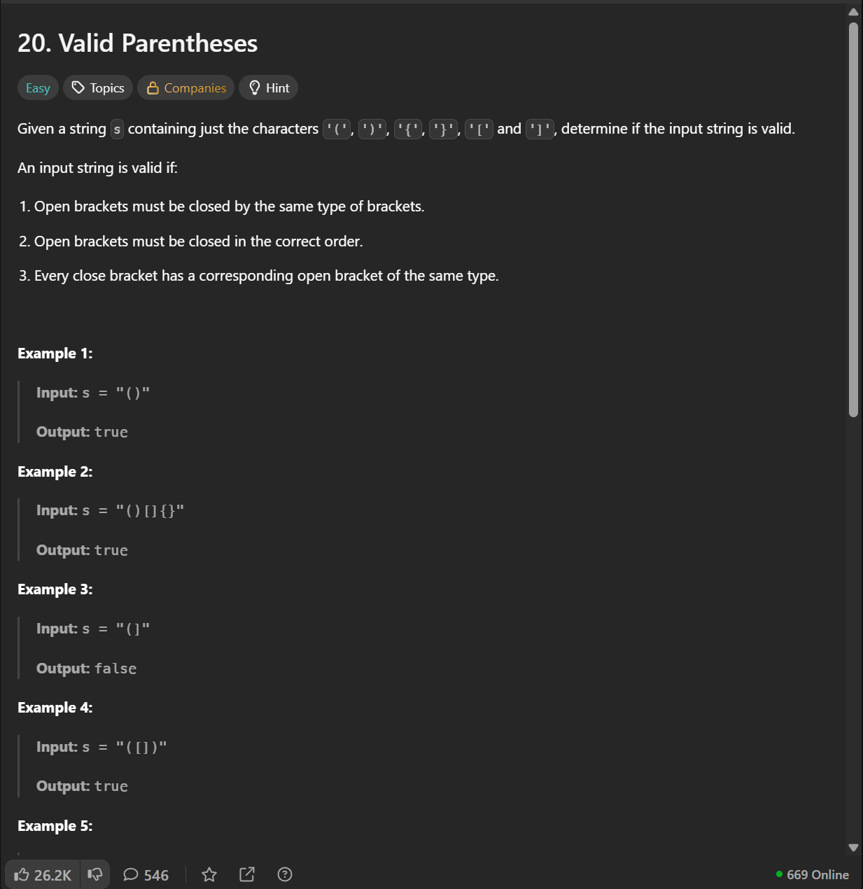

# Date: 22 July, 2025 - Tuesday

## Topics:
- Problem Link
0. Introduction
1. Valid parentheses
2. Backspace string compare
3. Insert an element at its bottom in a given stack
4. Maximum equal stack sum
5. Reversing a queue
6. Min stack
7. Summary
- Extra Problem
- Feedback Form: Module 15

## Problem Link
- [Extra Practice Problem -](https://docs.google.com/document/d/1fuirtZp8dUD6cCnwjBsSpbFZI_CqOBIw/edit?usp=sharing&ouid=112433310488936743525&rtpof=true&sd=true)
- 
- [Problem 1](https://leetcode.com/problems/valid-parentheses/)
    - [Solution Link](https://leetcode.com/problems/valid-parentheses/solutions/6981469/simple-beginner-friendly-stack-beats-100-ogx0/)
- [Problem 2](https://leetcode.com/problems/backspace-string-compare/description/)
    - [Solution Link](https://leetcode.com/problems/backspace-string-compare/solutions/6981972/simple-stack-beats-100-by-piaaaas-8wmp/)
- [Problem 3](https://www.codingninjas.com/studio/problems/insert-an-element-at-its-bottom-in-a-given-stack_1171166)
- [Problem 4](https://www.codingninjas.com/studio/problems/maximum-equal-stack-sum_1062571)
- [Problem 5](https://www.codingninjas.com/studio/problems/reversing-a-queue_982934)
- [Problem 6](https://leetcode.com/problems/min-stack/description/)
    - [Solution Link](https://leetcode.com/problems/min-stack/solutions/6981989/beginner-friendly-just-using-another-sta-po6a/)

## 0. Introduction
- Those problem are from `big tech` companies and this are also most uses problem in big tech `interview crack`
- There have six problems:
    - `2 problems from leetcode`
    - `4 problem from new online judges`
    - 

## 1. Valid parentheses
- [Problem 1](https://leetcode.com/problems/valid-parentheses/)
- 
- Problem Solution:
    ```
    class Solution {
    public:
        bool isValid(string s) {
            stack<char> st;
            for(char c : s) {
                if(c == '(' || c == '{' || c == '[') {
                    st.push(c);
                }
                else {
                    if(st.empty()) {
                        return false;
                    }
                    else {
                        if(c == ')' && st.top() == '(') {
                            st.pop();
                        }
                        else if(c == '}' && st.top() == '{') {
                            st.pop();
                        }
                        else if(c == ']' && st.top() == '[') {
                            st.pop();
                        }
                        else {
                            return false;
                        }
                    }
                }
            }
            if(st.empty()) return true;
            else return false;
        }
    };
    ```

## 2. Backspace string compare
- [Problem 2](https://leetcode.com/problems/backspace-string-compare/description/)
- 
- Problem Solution:
    ```
    class Solution {
    public:
        bool backspaceCompare(string s, string t) {
        stack<char> st;
        for(char c : s)
        {
                if(c == '#')
                {
                    if(!st.empty())
                        st.pop();
                }
                else
                    st.push(c);
        }
        
        stack<char> st2;
        for(char c : t)
        {
                if(c == '#')
                {
                    if(!st2.empty())
                        st2.pop();
                }
                else
                    st2.push(c);
        }

        return st == st2;
        }
    };
    ```

## 3. Insert an element at its bottom in a given stack
- [Problem 3](https://www.codingninjas.com/studio/problems/insert-an-element-at-its-bottom-in-a-given-stack_1171166)
- 
- Problem Solution:
    ```
    #include <bits/stdc++.h> 
    stack<int> pushAtBottom(stack<int>& st, int x) {
        stack<int> new_st;
        while(!st.empty()) {
            new_st.push(st.top());
            st.pop();
        }

        st.push(x);
        while(!new_st.empty()) {
            st.push(new_st.top());
            new_st.pop();
        }

        return st;
    }
    ```

## 4. Maximum equal stack sum
- [Problem 4](https://www.codingninjas.com/studio/problems/maximum-equal-stack-sum_1062571)
- 
- Problem Solution:
    ```
    #include <bits/stdc++.h>

    int getSum(stack<int> st) {
        int sum = 0;
        while(!st.empty()) {
            sum += st.top();
            st.pop();
        }
        return sum;
    }

    int maxSum(stack<int> &st1, stack<int> &st2, stack<int> &st3) {
        int sum1 = getSum(st1);
        int sum2 = getSum(st2);
        int sum3 = getSum(st3);

        while(true) {
            if(sum1 == sum2 && sum2 == sum3) {
                break;
            }
            if(sum1 >= sum2 && sum1 >= sum3) {
                sum1 -= st1.top();
                st1.pop();
            }
            else if(sum2 >= sum1 && sum2 >= sum3) {
                sum2 -= st2.top();
                st2.pop();
            }
            else {
                sum3 -= st3.top();
                st3.pop();
            }
        }

        return sum1;
    }
    ```

## 5. Reversing a queue
- [Problem 5]()
- 
- Problem Solution:
    ```
    ```