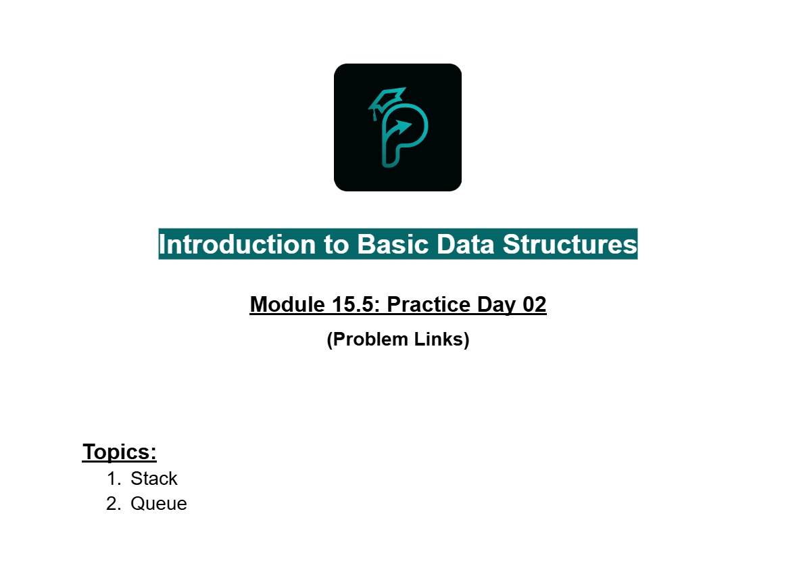
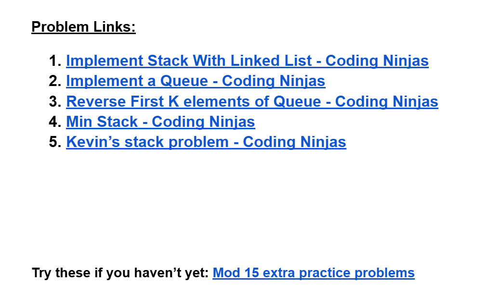

# Date: 23 July, 2025 - Wednesday

## Topics:
- Practice Problem Set: Module 15.5
- 1 Practice

## Practice Problem Set: Module 15.5
- [Link:](https://docs.google.com/document/d/19fo_5BxNyy3te0x6FGu_2t4MRXy4AlcR/edit?usp=drivesdk&ouid=112433310488936743525&rtpof=true&sd=true)
- 
- 
- [Problem 1](https://www.codingninjas.com/studio/problems/implement-stack-with-linked-list_630475)
- [Problem 2](https://www.codingninjas.com/studio/problems/queue-using-array-or-singly-linked-list_2099908)
- [Problem 3](https://www.codingninjas.com/studio/problems/reverse-first-k-elements-of-queue_982771)
- [Problem 4](https://www.codingninjas.com/studio/problems/min-stack_3843991)
- [Problem 5](https://www.codingninjas.com/studio/problems/kevin-s-stack-problem_1169465)

## 1 Practice
- Explanation those whole `five problems` in this video.