# Date: 26 July, 2025 - Saturday

## Topics:
- Extra Practice Problem Link
0. Introduction
1. What is Tree Data Structure
2. Why we need to learn Tree Data Structure
3. Real life application of Tree Animated
4. What is Binary Tree
5. Creating a Binary Tree
6. Creating Binary Tree Animated
7. Printing Binary Tree
8. Preorder Traversal
9. Preorder Traversal Implementation
10. Preorder Traversal Animated
11. Inorder Traversal
12. Inorder Traversal Animated
13. Postorder Traversal
14. Postorder Traversal Animated
15. Summary
- Quiz: Module 17
- Quiz Explanation
- Feedback Form: Module 17

## Extra Practice Problem Link
- [Here is Link:](https://docs.google.com/document/d/1MioUnRGIA_F5-X7--OJAZ7aAd9pM1V156OMhxto7FHY/edit?usp=sharing)
- 

## 0. Introduction
- A guide to tree data structures
- We will learn to `binary tree` from `tree data structures`.
- `Tree data structure`: Introduction
- `The binary tree`: A special case
- `Creating a binary tree`: step-by-step
- `Traversal techniques`: Exploring the tree
- `Conclusion`: Key takeaways
- `Recursion` needed in tree for printout or others
- There haven't `STL - Standard Template Library`
- This is a `non-linear` data structures

## 1. What is Tree Data Structure
- `Hierarchy` concept in Tree. Also follow to `Hierarchial` data structures.
- Example with Tree:
    - Start to `Root`
    - End to `Leaf`
- Tree link to each others like this:
    - 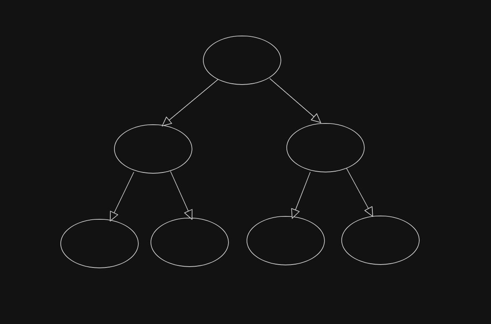
- This image data can't store by arrays, linked lists, stacks, queues or others. Only can do it `tree data structures`
- 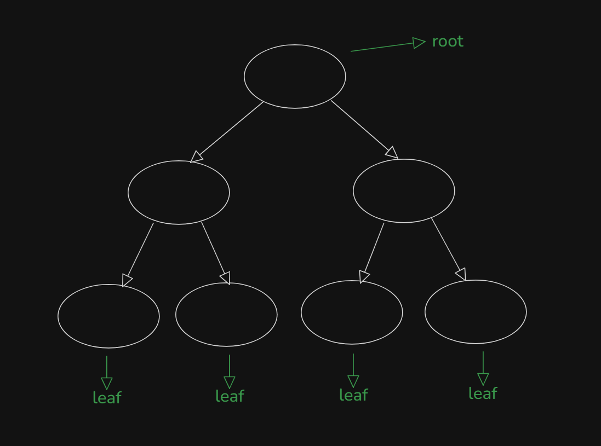

## 2. Why we need to learn Tree Data Structure
- 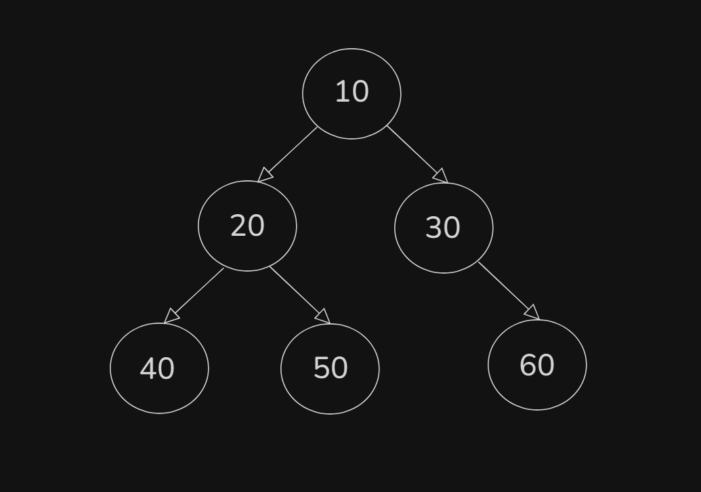
- This `tree` data structure compare to others data structures, can write `others data structures` for `tree`.
- Another Example with Tree:
    - 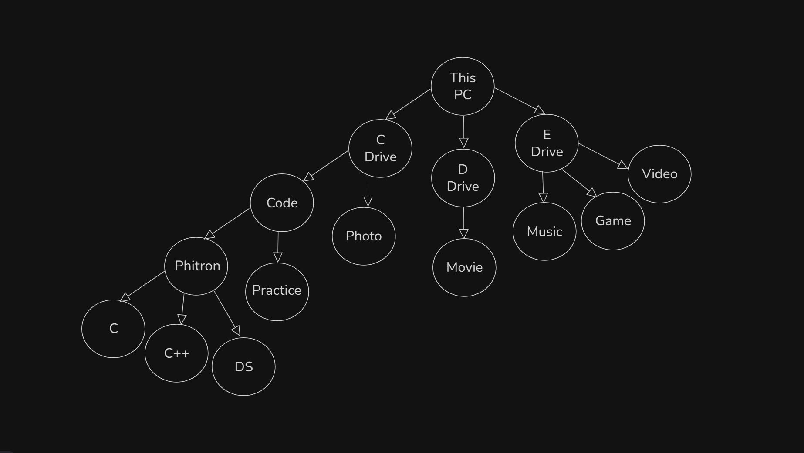
- 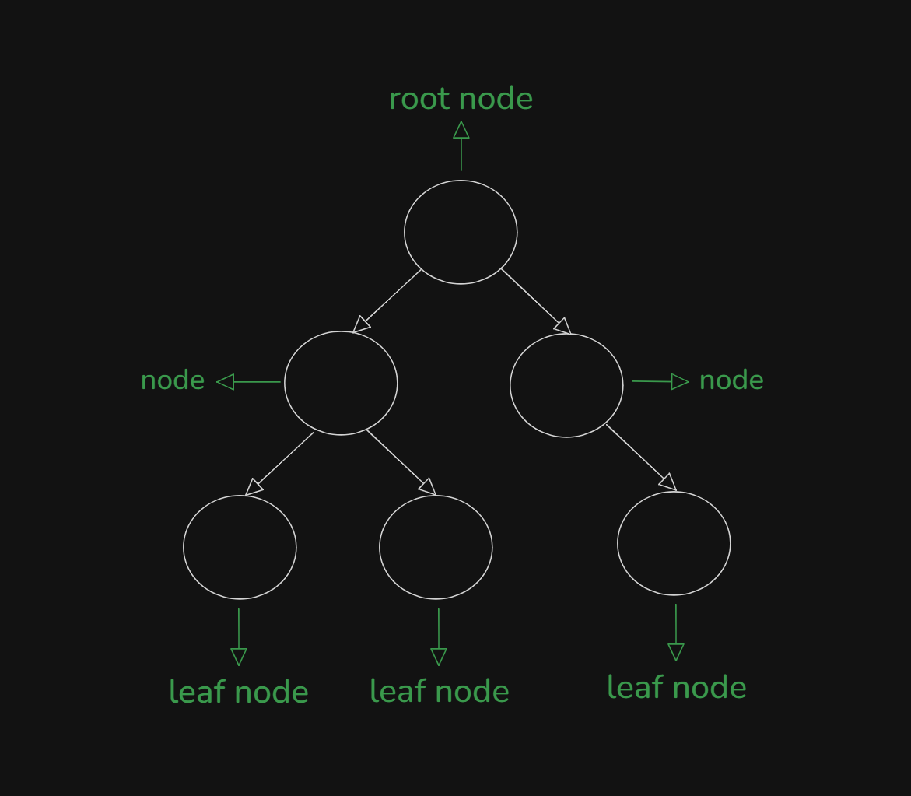
- `They have connect with parent and child`
- `root node don't have parent node`
- `leaf node don't have child node`

## 3. Real life application of Tree Animated
- Real Life Example with This PC:
    - 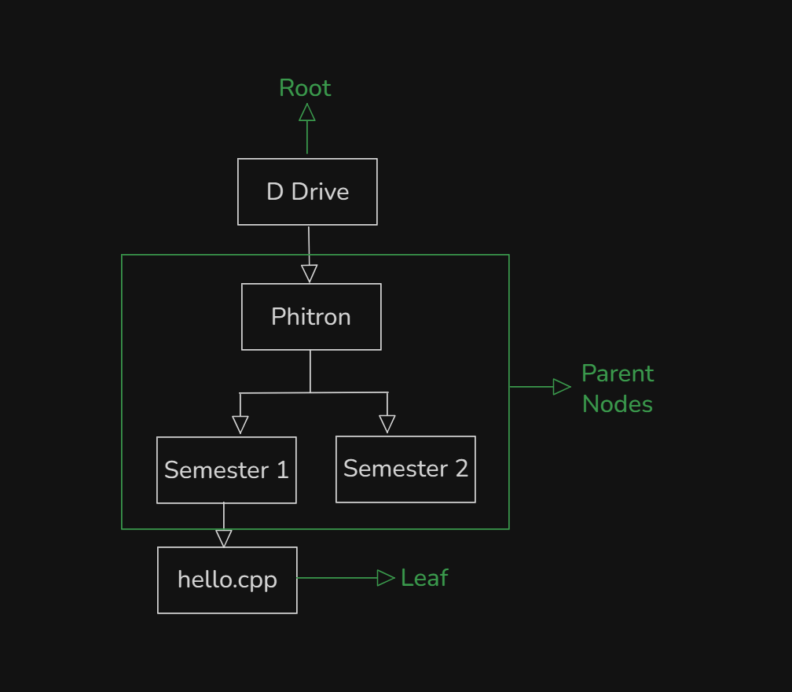

## 4. What is Binary Tree
- Every node child max are two, then that's is `binary tree`.
- `0, 1, 2 (Child)`. You don't use that after two max child. Like - `3, 4, 5 (Child) don't use that`.
- `Binary Tree`:
    - 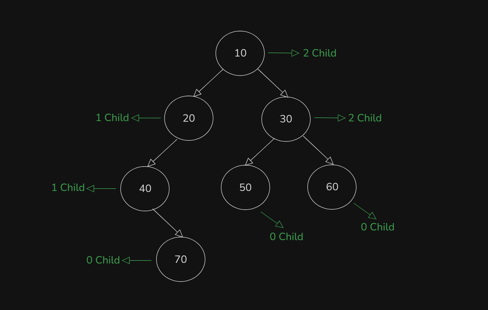
- `Not A Binary Tree`:
    - 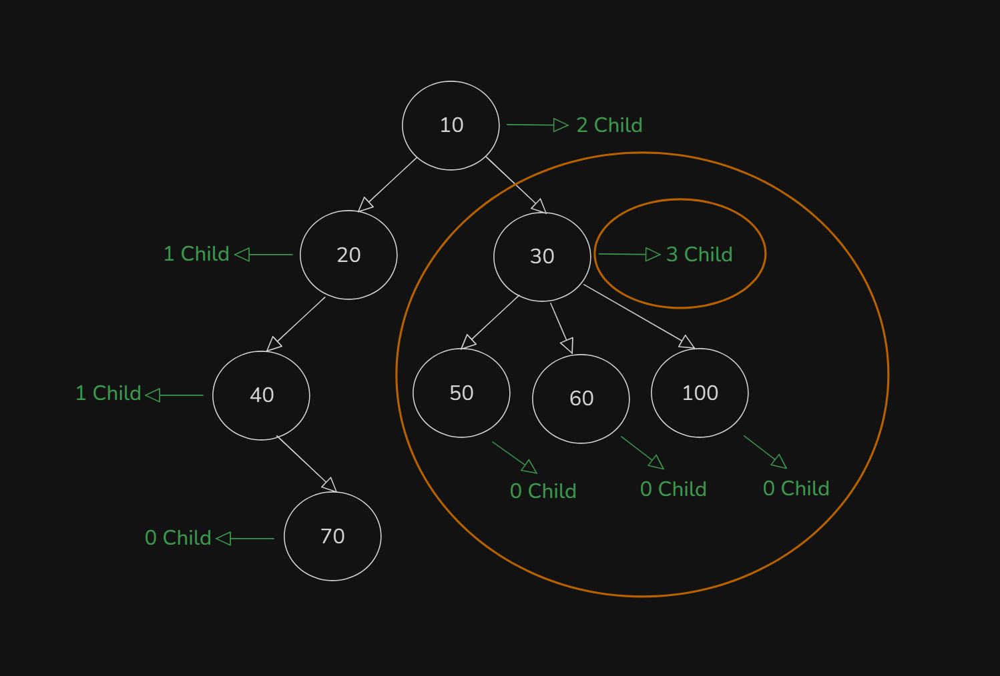

## 5. Creating a Binary Tree
- Two type of Tree:
    - `Binary Tree` - Max 2 (Child)
    - `N-ary Tree` - Max n (Child)
- Pointing to the node:
    - 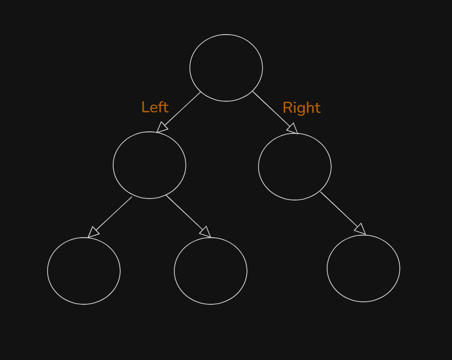
Program: `creating_nodes.cpp`
- 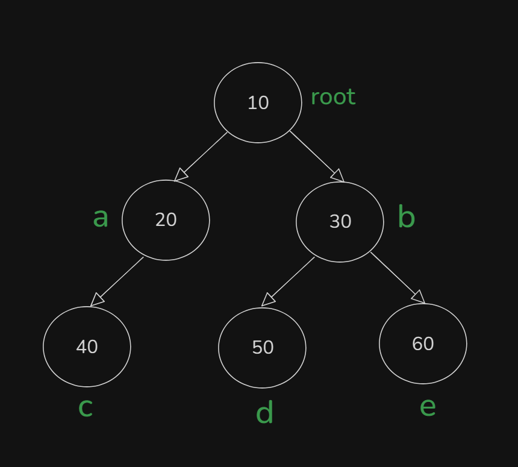

## 6. Creating Binary Tree Animated
- Explanation those code with animated way:
    ```
    // Create manually nodes
    Node* root = new Node(10);
    Node* a = new Node(20);
    Node* b = new Node(30);
    Node* c = new Node(40);
    Node* d = new Node(50);
    Node* e = new Node(60);

    // Make connection with each other nodes
    root->left = a;
    root->right = b;
    a->left = c;
    b->left = d;
    b->right = e;
    ```

## 7. Printing Binary Tree
- 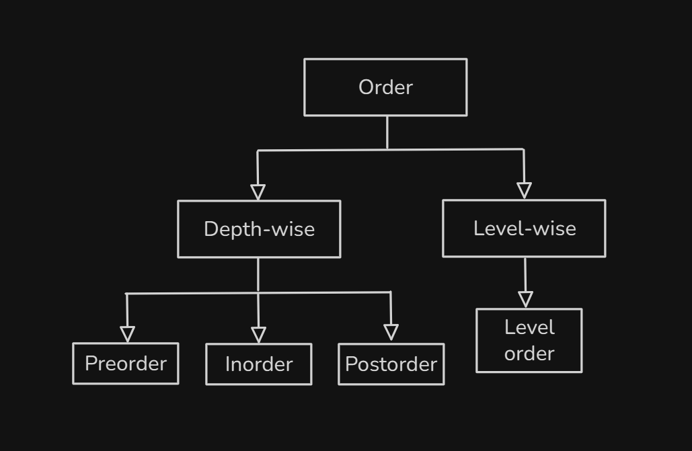

## 8. Preorder Traversal
- `Preorder : root left right`
- `Inorder : left root right`
- `Postorder : left right root`
- Learn to explore to `Preorder : root left right`
    - 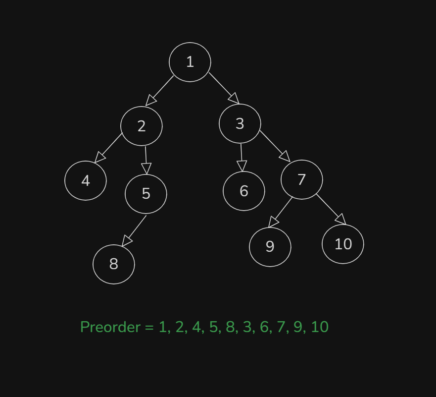

## 9. Preorder Traversal Implementation
- Preorder Traversal Implementation with `Recursion`
- 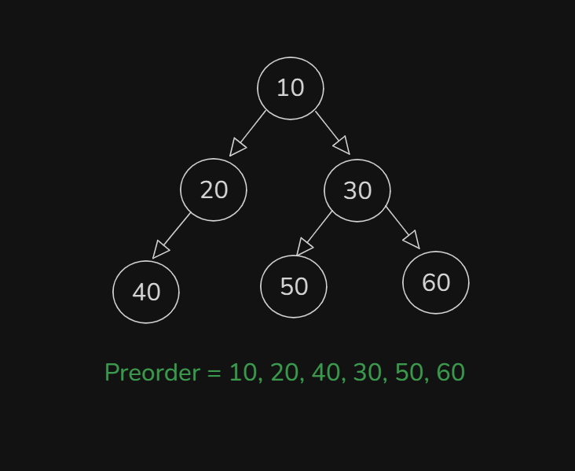
- Program: `preorder_traversal.cpp`

## 10. Preorder Traversal Animated
- Explanation those code with animated way in this video:
    ```
    void preorder(Node* root) {
        if(root == NULL) {
            return;
        }
        cout << root->val << " ";
        preorder(root->left);
        preorder(root->right);
    }
    ```

## 11. Inorder Traversal
- Learn to explore to `Inorder : left root right`
    - 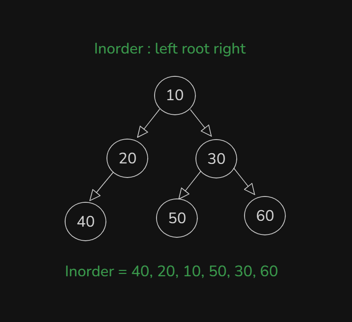
    - 
- Program: `inorder_traversal.cpp`

## 12. Inorder Traversal Animated
- Explanation those code with animated way in this video:
    ```
    // Inorder Traversal: left root right
    void inorder(Node* root) {
        if(root == NULL) {
            return;                 // Base Case
        }
        inorder(root->left);       // Go to Left
        cout << root->val << " ";   // Root
        inorder(root->right);      // Go to Right
    }
    ```

## 13. Postorder Traversal
- Learn to explore to `Postorder : left right root`
    - 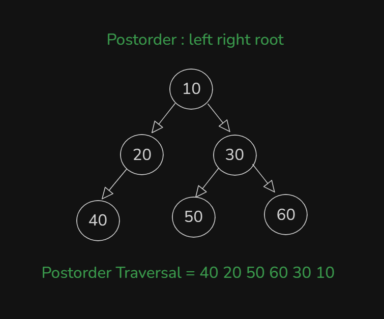
Program: `postorder_traversal.cpp`

## 14. Postorder Traversal Animated
- Explanation those code with animated way in this video:
    ```
    void postorder(Node* root) {
        if(root == NULL) {
            return;                  // Base Case
        }
        postorder(root->left);       // Go to Left
        postorder(root->right);      // Go to Right
        cout << root->val << " ";    // Root
    }
    ```

## 15. Summary
- Learn and explore to `Tree Data Structures` and this is `Non-linear data structures`
- Learn and explore to `Binary Tree Data Structures` and create binary tree `nodes` and make `connections`. At last print to `Binary Tree`
- Three types of `Printing Order` or `Traversing Order`
    - `Preorder`
    - `Ineorder`
    - `Postorder`
- Learn this order and implement this with `Code` or `Recursion`.
- More concept clear to `Traversing Order` and `Recursion`.

## Quiz: Module 17
- `Total Questions: 10`
- `Total Marks: 10`

## Quiz Explanation
- [Quiz Explanation Link:](https://docs.google.com/document/d/12AAp8gvjaOv-o4EgPCmWCJVwao8RCO_u/edit?usp=sharing&ouid=112433310488936743525&rtpof=true&sd=true)
#### 1. What system does the queue use?
**a)** Last In First Out   
**b)** Last In Last Out ✅  
**c)** First In Last Out  
**d)** First In Middle Out
> **Explanation:** ।
---