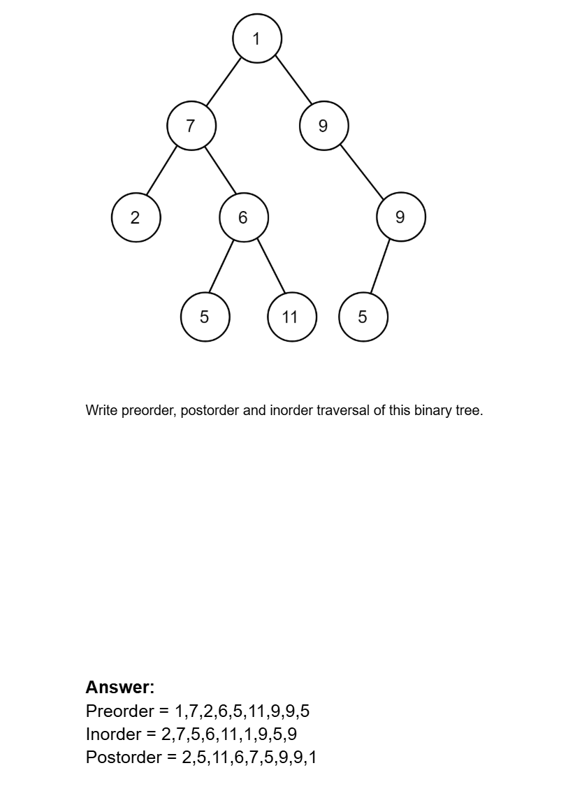

# Date: 26 July, 2025 - Saturday

## Topics:
- Extra Practice Problem Link
0. Introduction
1. What is Tree Data Structure
2. Why we need to learn Tree Data Structure
3. Real life application of Tree Animated
4. What is Binary Tree
5. Creating a Binary Tree
6. Creating Binary Tree Animated
7. Printing Binary Tree
8. Preorder Traversal
9. Preorder Traversal Implementation
10. Preorder Traversal Animated
11. Inorder Traversal
12. Inorder Traversal Animated
13. Postorder Traversal
14. Postorder Traversal Animated
15. Summary
- Quiz: Module 17
- Quiz Explanation
- Feedback Form: Module 17

## Extra Practice Problem Link
- [Link](https://docs.google.com/document/d/1MioUnRGIA_F5-X7--OJAZ7aAd9pM1V156OMhxto7FHY/edit?usp=sharing)
- 