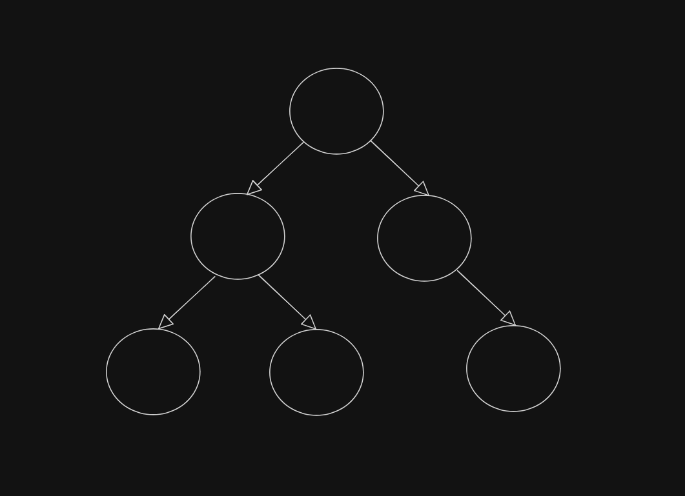
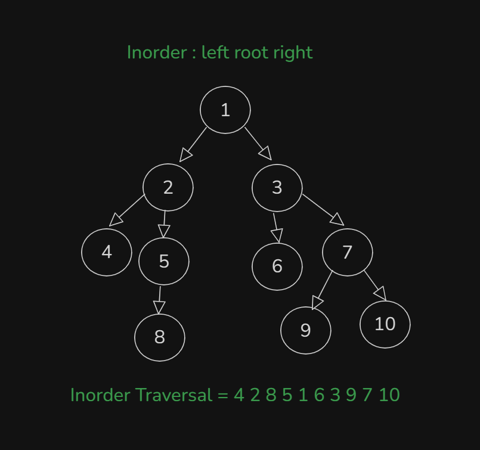

# Date: 26 July, 2025 - Saturday

## Topics:
- Extra Practice Problem Link
0. Introduction
1. What is Tree Data Structure
2. Why we need to learn Tree Data Structure
3. Real life application of Tree Animated
4. What is Binary Tree
5. Creating a Binary Tree
6. Creating Binary Tree Animated
7. Printing Binary Tree
8. Preorder Traversal
9. Preorder Traversal Implementation
10. Preorder Traversal Animated
11. Inorder Traversal
12. Inorder Traversal Animated
13. Postorder Traversal
14. Postorder Traversal Animated
15. Summary
- Quiz: Module 17
- Quiz Explanation
- Feedback Form: Module 17

## Extra Practice Problem Link
- [Here is Link:](https://docs.google.com/document/d/1MioUnRGIA_F5-X7--OJAZ7aAd9pM1V156OMhxto7FHY/edit?usp=sharing)
- 

## 0. Introduction
- A guide to tree data structures
- We will learn to `binary tree` from `tree data structures`.
- `Tree data structure`: Introduction
- `The binary tree`: A special case
- `Creating a binary tree`: step-by-step
- `Traversal techniques`: Exploring the tree
- `Conclusion`: Key takeaways
- `Recursion` needed in tree for printout or others
- There haven't `STL - Standard Template Library`
- This is a `non-linear` data structures

## 1. What is Tree Data Structure
- `Hierarchy` concept in Tree. Also follow to `Hierarchial` data structures.
- Example with Tree:
    - Start to `Root`
    - End to `Leaf`
- Tree link to each others like this:
    - 
- This image data can't store by arrays, linked lists, stacks, queues or others. Only can do it `tree data structures`
- 

## 2. Why we need to learn Tree Data Structure
- 
- This `tree` data structure compare to others data structures, can write `others data structures` for `tree`.
- Another Example with Tree:
    - 
- 
- `They have connect with parent and child`
- `root node don't have parent node`
- `leaf node don't have child node`

## 3. Real life application of Tree Animated
- Real Life Example with This PC:
    - 

## 4. What is Binary Tree
- Every node child max are two, then that's is `binary tree`.
- `0, 1, 2 (Child)`. You don't use that after two max child. Like - `3, 4, 5 (Child) don't use that`.
- `Binary Tree`:
    - 
- `Not A Binary Tree`:
    - 

## 5. Creating a Binary Tree
- Two type of Tree:
    - `Binary Tree` - Max 2 (Child)
    - `N-ary Tree` - Max n (Child)
- Pointing to the node:
    - 
Program: `creating_nodes.cpp`
- 

## 6. Creating Binary Tree Animated
- Explanation those code with animated way:
    ```
    // Create manually nodes
    Node* root = new Node(10);
    Node* a = new Node(20);
    Node* b = new Node(30);
    Node* c = new Node(40);
    Node* d = new Node(50);
    Node* e = new Node(60);

    // Make connection with each other nodes
    root->left = a;
    root->right = b;
    a->left = c;
    b->left = d;
    b->right = e;
    ```

## 7. Printing Binary Tree
- 

## 8. Preorder Traversal
- `Preorder : root left right`
- `Inorder : left root right`
- `Postorder : left right root`
- Learn to explore to `Preorder : root left right`
    - 

## 9. Preorder Traversal Implementation
- Preorder Traversal Implementation with `Recursion`
- 
- Program: `preorder_traversal.cpp`

## 10. Preorder Traversal Animated
- Explanation those code with animated way in this video:
    ```
    void preorder(Node* root) {
        if(root == NULL) {
            return;
        }
        cout << root->val << " ";
        preorder(root->left);
        preorder(root->right);
    }
    ```

## 11. Inorder Traversal
- Learn to explore to `Inorder : left root right`
    - 
    - 
- Program: `inorder_traversal.cpp`

## 12. Inorder Traversal Animated
- Explanation those code with animated way in this video:
    ```
    // Inorder Traversal: left root right
    void inorder(Node* root) {
        if(root == NULL) {
            return;                 // Base Case
        }
        inorder(root->left);       // Go to Left
        cout << root->val << " ";   // Root
        inorder(root->right);      // Go to Right
    }
    ```

## 13. Postorder Traversal
- Learn to explore to `Postorder : left right root`
    - 
Program: `postorder_traversal.cpp`

## 14. Postorder Traversal Animated
- Explanation those code with animated way in this video:
    ```
    void postorder(Node* root) {
        if(root == NULL) {
            return;                  // Base Case
        }
        postorder(root->left);       // Go to Left
        postorder(root->right);      // Go to Right
        cout << root->val << " ";    // Root
    }
    ```

## 15. Summary
- Learn and explore to `Tree Data Structures` and this is `Non-linear data structures`
- Learn and explore to `Binary Tree Data Structures` and create binary tree `nodes` and make `connections`. At last print to `Binary Tree`
- Three types of `Printing Order` or `Traversing Order`
    - `Preorder`
    - `Ineorder`
    - `Postorder`
- Learn this order and implement this with `Code` or `Recursion`.
- More concept clear to `Traversing Order` and `Recursion`.

## Quiz: Module 17
- `Total Questions: 10`
- `Total Marks: 10`

## Quiz Explanation
- [Quiz Explanation Link:](https://docs.google.com/document/d/12AAp8gvjaOv-o4EgPCmWCJVwao8RCO_u/edit?usp=sharing&ouid=112433310488936743525&rtpof=true&sd=true)
#### 1. Which of the following is true about a binary tree?
**a)** Each node can have more than two children   
**b)** Each node can have at most two children ✅  
**c)** Each node must have exactly two children  
**d)** Each node must have at least two children
> **Explanation:** বাইনারি ট্রি এমন একটি ডেটা স্ট্রাকচার যেখানে প্রতিটি নোডের সর্বোচ্চ দুটি  Child থাকতে পারে। এই দুটি Child কে সাধারণত বলা হয়: Left Child and Right Child।
---
#### 2. Which traversal visits the nodes in the following order: Left subtree, root, right subtree?
**a)** Preorder traversal   
**b)** Inorder traversal ✅  
**c)** Postorder traversal  
**d)** Level order traversal
> **Explanation:** Inorder traversal-এ নোডগুলো নিম্নলিখিত ক্রমে ভিজিট করা হয়: <br>
1.বাম সাবট্রি (Left subtree) ভিজিট করা হয়। <br>
2.এরপর মূল নোড (Root) ভিজিট করা হয়। <br>
3.তারপর ডান সাবট্রি (Right subtree) ভিজিট করা হয়।
---
#### 3. Which traversal visits the nodes in the following order: Root, left subtree, right subtree?
**a)** Preorder traversal ✅  
**b)** Inorder traversal  
**c)** Postorder traversal  
**d)** Level order traversal
> **Explanation:** Preorder traversal-এ নোডগুলো নিম্নলিখিত ক্রমে ভিজিট করা হয়: <br>
1.প্রথমে মূল নোড (Root) ভিজিট করা হয়। <br>
2.এরপর বাম সাবট্রি (Left subtree) ভিজিট করা হয়। <br>
3.তারপর ডান সাবট্রি (Right subtree) ভিজিট করা হয়।
---
#### 4. Which traversal visits the nodes in the following order: Left subtree, right subtree, root?
**a)** Preorder traversal  
**b)** Inorder traversal  
**c)** Postorder traversal ✅  
**d)** Level order traversal
> **Explanation:** Postorder traversal-এ নোডগুলো নিম্নলিখিত ক্রমে ভিজিট করা হয়: <br>
1.প্রথমে বাম সাবট্রি (Left subtree) ভিজিট করা হয়। <br>
2.তারপর ডান সাবট্রি (Right subtree) ভিজিট করা হয়। <br>
3.সবশেষে মূল নোড (Root) ভিজিট করা হয়।
---
#### 5. Which of the following are linear data structures?
**a)** array  
**b)** linked list  
**c)** stack  
**d)** all of the above ✅
> **Explanation:** Linear Data Structure - Array/Vector, Stack, Queue, Linked List. <br>
Non-linear Data Structure - Graph, Tree.
---
#### 6. How many properties a binary tree node class may have according to the module video?
**a)** 1  
**b)** 2  
**c)** 3 ✅  
**d)** 4
> **Explanation:** একটি বাইনারি ট্রি নোড ক্লাসে সাধারণত ৩টি বৈশিষ্ট্য থাকে। তা হলো: <br>
1.Node Value বা Data: নোডটি যে তথ্য বা মান সংরক্ষণ করে। <br>
2.Left Child Pointer: এটি Left Child নোডের দিকে নির্দেশ করে (যদি left child না থাকে, তাহলে এটি null থাকে)। <br>
3.Right Child Pointer: এটি Right Child নোডের দিকে নির্দেশ করে (যদি right child না থাকে, তাহলে এটি null থাকে)।
---
#### 7. In a binary tree, which node is considered as the starting point of the tree?
**a)** Root node ✅  
**b)** Leaf node  
**c)** Uncle node  
**d)** Sibling node
> **Explanation:** বাইনারি ট্রি-তে, রুট নোড (Root Node) হলো ট্রি-এর শীর্ষে থাকা নোড এবং এটি ট্রি-এর starting point। এই নোডের কোনো  Parent নেই এবং এখান থেকেই পুরো ট্রি ট্রাভার্স করা হয়।
---
#### 8. Which of the following statements is true about a leaf node?
**a)** A leaf node is the topmost node in a binary tree  
**b)** A leaf node has exactly one child node  
**c)** A leaf node does not have any child nodes ✅  
**d)** A leaf node has both left and right child nodes
> **Explanation:** বাইনারি ট্রি-তে, একটি লিফ (Leaf) নোড হলো সেই নোড যার কোনো Child নোড নেই। এর অর্থ: Leaf Node এর left and right পয়েন্টার উভয়ই null এবং লিফ নোড সাধারণত ট্রি-এর নিচের স্তরে থাকে।
---
#### 9. Which of the following is level order traversing in a binary tree?
**a)** Inorder  
**b)** Preorder  
**c)** Postorder  
**d)** None of the above ✅
> **Explanation:** Order - 1.Depth Wise 2.Level Wise <br>
1.Depth Wise - Preorder, Inorder, Postorder. <br>
2.Level Wise - Level order.
---
#### 10. Which technique is used for binary tree depth traversing?
**a)** stack  
**b)** queue  
**c)** recursion ✅  
**d)** loop
> **Explanation:** বাইনারি ট্রি ডেপথ ট্রাভার্সাল (Depth Traversing)-এ সাধারণত Recursion ব্যবহার করা হয়। Recursion দ্বারা tree এর প্রতিটি শাখার মধ্যে যতটা সম্ভব গভীরভাবে প্রবেশ করা হয়, তারপর আবার পিছনে ফিরে আসা হয়। Recursion দ্বারা, আমরা বাম এবং ডান সাবট্রির জন্য একই ফাংশনকে কল করি, যা tree এর প্রতিটি নোড ভিজিট করে।
---