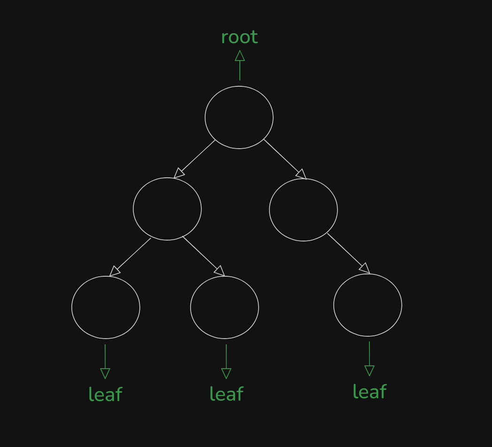

# Date: 26 July, 2025 - Saturday

## Topics:
- Extra Practice Problem Link
0. Introduction
1. What is Tree Data Structure
2. Why we need to learn Tree Data Structure
3. Real life application of Tree Animated
4. What is Binary Tree
5. Creating a Binary Tree
6. Creating Binary Tree Animated
7. Printing Binary Tree
8. Preorder Traversal
9. Preorder Traversal Implementation
10. Preorder Traversal Animated
11. Inorder Traversal
12. Inorder Traversal Animated
13. Postorder Traversal
14. Postorder Traversal Animated
15. Summary
- Quiz: Module 17
- Quiz Explanation
- Feedback Form: Module 17

## Extra Practice Problem Link
- [Here is Link:](https://docs.google.com/document/d/1MioUnRGIA_F5-X7--OJAZ7aAd9pM1V156OMhxto7FHY/edit?usp=sharing)
- 

## 0. Introduction
- A guide to tree data structures
- We will learn to `binary tree` from `tree data structures`.
- `Tree data structure`: Introduction
- `The binary tree`: A special case
- `Creating a binary tree`: step-by-step
- `Traversal techniques`: Exploring the tree
- `Conclusion`: Key takeaways
- `Recursion` needed in tree for printout or others
- There haven't `STL - Standard Template Library`
- This is a `non-linear` data structures

## 1. What is Tree Data Structure
- `Hierarchy` concept in Tree. Also follow to `Hierarchial` data structures.
- Example with Tree:
    - Start to `Root`
    - End to `Leaf`
- Tree link to each others like this:
    - 
- This image data can't store by arrays, linked lists, stacks, queues or others. Only can do it `tree data structures`
- 

## 2. Why we need to learn Tree Data Structure
- 
- This `tree` data structure compare to others data structures, can write `others data structures` for `tree`.
- Another Example with Tree:
    - 
- 
- `They have connect with parent and child`
- `root node don't have parent node`
- `leaf node don't have child node`

## 3. Real life application of Tree Animated
- Real Life Example with This PC:
    - 

## 4. What is Binary Tree
- Every node child max are two, then that's is `binary tree`.
- `0, 1, 2 (Child)`. You don't use that after two max child. Like - `3, 4, 5 (Child) don't use that`.
- `Binary Tree`:
    - 
- `Not A Binary Tree`:
    - 

## 5. Creating a Binary Tree
- Two type of Tree:
    - `Binary Tree` - Max 2 (Child)
    - `N-ary Tree` - Max n (Child)
- Pointing to the node:
    - 
Program: `creating_nodes.cpp`
