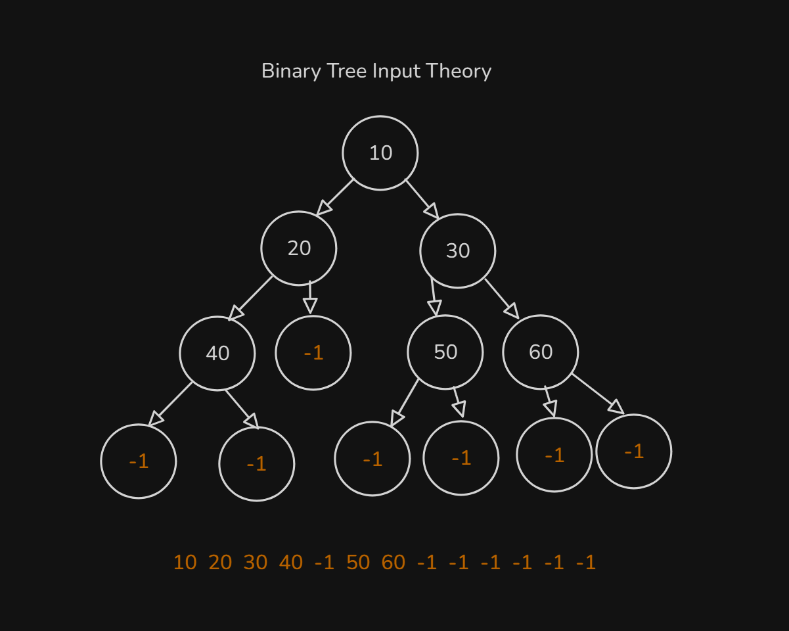
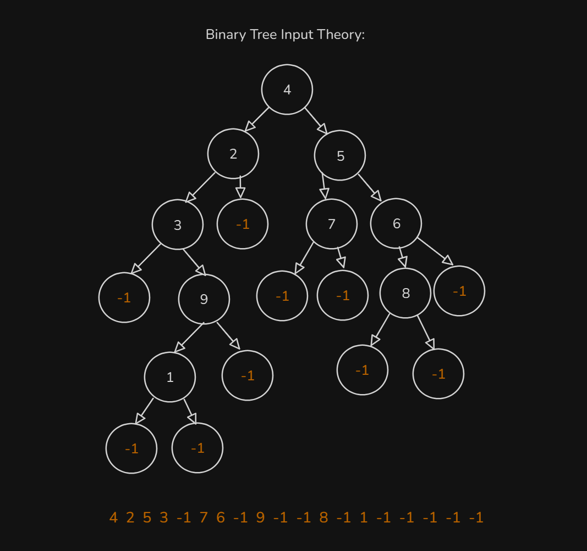
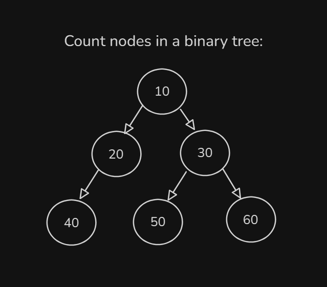
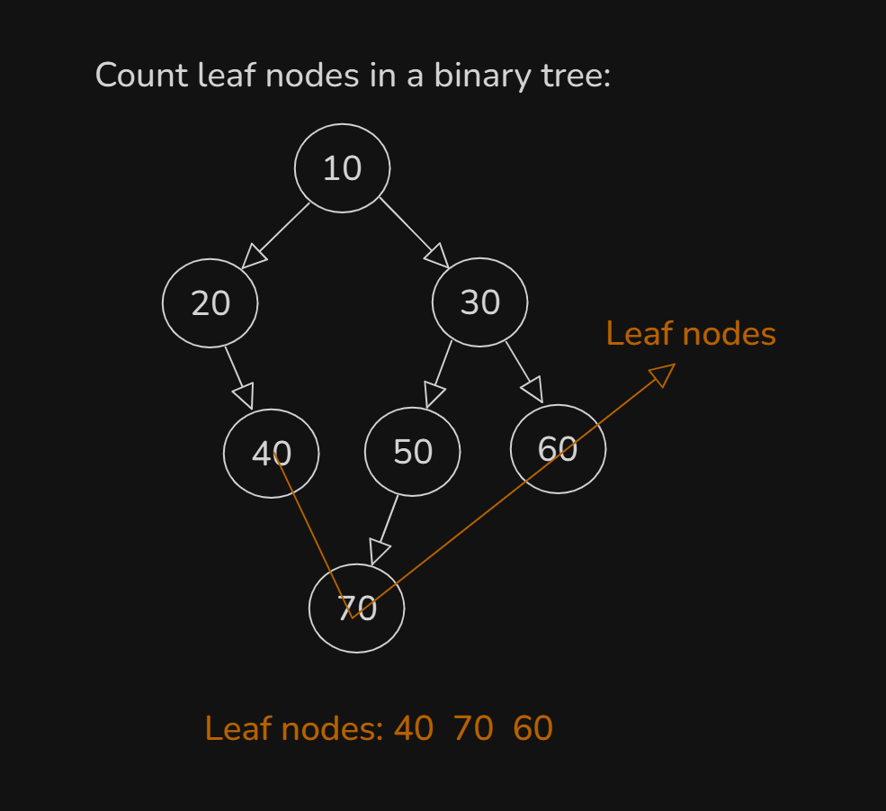

# Date: 27 July, 2025 - Sunday

## Topics:
0. Introduction
1. Level order traversal Theory
2. Level order traversal Implementation
3. Level order traversal Animated
4. Binary tree input Theory
5. Binary tree input Implementation
6. Binary tree input Animated
7. Count nodes in a binary tree
8. Count leaf nodes in a binary tree
9. Count leaf nodes simulation
- Quiz: Module 18
- Extra Practice Problem and Quiz Explanation
- Feedback Form: Module 18

## 0. Introduction
- Binary Tree Operations
- Level Order Traversal
- Binary Tree Input
- Counting nodes in Binary Tree - With `Recursive`
- Counting Leaf Nodes - With `Recursive`
- Maximum Height of a Binary Tree - With `Recursive`

## 1. Level order traversal Theory
- Understand `Level order traversal theory` with drawing:
    - 
    - 
- Rules of `Level order traversal theory`:
    - `Take out`
    - `Working with Node`
    - `Children push`
    - 
- `Queue` with non-linear data structure help to level order.

## 2. Level order traversal Implementation
- Program: `level_order_traversal.cpp`

## 3. Level order traversal Animated
- Explanation those code with animated way:
    ```
    void level_order(Node* root) {
        if(root == NULL) {
            cout << "No Tree" << endl;
            return;
        }

        queue<Node*> q;
        q.push(root);
        while(!q.empty()) {
            Node* f = q.front();
            q.pop();

            cout << f->val << " ";

            if(f->left != NULL) {
                q.push(f->left);
            }
            if(f->right != NULL) {
                q.push(f->right);
            }
        }
    }
    ```

## 4. Binary tree input Theory
- Example 1:
    - 
- Example 2:
    - 

## 5. Binary tree input Implementation
- Program: `binary_tree_input.cpp`

## 6. Binary tree input Animated
- Explanation those code with animated way:
    ```
    Node* input_tree() {
        int val;
        cin >> val;
        Node* root;

        if(val == -1) root = NULL;
        else root = new Node(val);
        queue<Node*> q;

        if(root) q.push(root);
        while(!q.empty()) {
            // 1. Ber kore ana
            Node* p = q.front();
            q.pop();

            // 2. Oi node ke niye kaj
            int l, r;
            cin >> l >> r;
            Node *myLeft, *myRight;

            if(l == -1) myLeft = NULL;
            else myLeft = new Node(l);
            if(r == -1) myRight = NULL;
            else myRight = new Node(r);

            p->left = myLeft;
            p->right = myRight;

            // 3. Children push kora
            if(p->left) {
                q.push(p->left);
            }
            if(p->right) {
                q.push(p->right);
            }
        }
        return root;
    }
    ```

## 7. Count nodes in a binary tree
- 
- Count nodes using with `Recursion`
- Program: `count_nodes.cpp`

## 8. Count leaf nodes in a binary tree
- Leaf nodes means they haven't children.
- 
- Program: `count_leaf_nodes.cpp`

## 9. Count leaf nodes simulation
- Explanation this code with simulation:
    ```
    int count_leaf_nodes(Node* root) {
        if(root == NULL) {
            return 0;
        }
        if(root->left == NULL && root->right == NULL) {
            return 1;
        }
        int l = count_leaf_nodes(root->left);
        int r = count_leaf_nodes(root->right);
        return l + r;
    }
    ```

## Quiz: Module 18
- `Total Questions: 10`
- `Total Marks: 10`

## Extra Practice Problem and Quiz Explanation
- [Quiz Explanation:](https://docs.google.com/document/d/1ZN-xP1ejpmekpVWW2gida9pU8IsbhBZ4FUhUyoWiUio/edit?usp=sharing)
- [Extra Practice Problem (Optional):](https://docs.google.com/document/d/1bvnxY4f-Z2NOTm2v0FdYhB5hgdfW6G_FqX_-bd_mQ00/edit?usp=sharing)
#### 1. What is level order traversal of a binary tree?
**a)** Visiting nodes in ascending order  
**b)** Visiting nodes in descending order  
**c)** Visiting nodes level by level, from left to right ✅  
**d)** Visiting nodes randomly
> **Explanation:** Binary Tree-এর Level Order Traversal বলতে বোঝানো হয় একটি ট্রি-র নোডগুলোকে লেভেল বাই লেভেল ভিজিট করা। অর্থাৎ প্রথমে রুট নোড, তারপর দ্বিতীয় লেভেলের সমস্ত নোড (বাম দিক থেকে ডান দিকে), এরপর তৃতীয় লেভেলের নোড, এভাবে একে একে প্রতিটি লেভেল ভিজিট করা হয়।
---
#### 2. Which data structure is typically used to implement level order traversal?
**a)** Stack  
**b)** Queue ✅  
**c)** Array  
**d)** Linked list
> **Explanation:** Level Order Traversal সাধারণত Queue ডেটা স্ট্রাকচার ব্যবহার করে ইমপ্লিমেন্ট করা হয়। Queue নোডগুলোকে সঠিক ক্রমানুসারে (লেভেল বাই লেভেল) প্রক্রিয়া করতে সাহায্য করে যা মডিউলে দেখানো হয়েছে।
---
#### 3. In level order traversal, which node is visited first?
**a)** Root node ✅  
**b)** Left child of the root  
**c)** Right child of the root  
**d)** Node with the smallest value
> **Explanation:** Level Order Traversal-এ Root Node সর্বপ্রথম ভিজিট করা হয়। এরপরে Root Node-এর left child এবং right child ভিজিট করা হয়, তারপর তাদের child নোডগুলো লেভেল অনুযায়ী প্রসেস করা হয়।
---
#### 4. Which traversal technique uses a queue according to the module?
**a)** Preorder traversal  
**b)** Inorder traversal  
**c)** Postorder traversal  
**d)** Level order traversal ✅
> **Explanation:** Level Order Traversal হল সেই পদ্ধতি যেখানে Queue ডেটা স্ট্রাকচার ব্যবহার করা হয়। এই পদ্ধতিতে ট্রি-এর নোডগুলোকে লেভেল অনুযায়ী ভিজিট করা হয়, অর্থাৎ প্রথমে রুট নোড, তারপর তার চাইল্ড নোড, এরপর তাদের চাইল্ড নোড—এইভাবে লেভেল বাই লেভেল প্রসেস করা হয়।
---
#### 5. In level order traversal, which nodes are visited first at each level?
**a)** Nodes with the smallest value  
**b)** Nodes with the largest value  
**c)** Nodes with the most children  
**d)** Nodes that appear first in the tree's structure ✅
> **Explanation:** Level Order Traversal বলতে বোঝানো হয় একটি ট্রি-র নোডগুলোকে লেভেল বাই লেভেল ভিজিট করা। অর্থাৎ প্রথমে রুট নোড, তারপর দ্বিতীয় লেভেলের সমস্ত নোড (বাম দিক থেকে ডান দিকে) এক্ষেত্রে যে Node গুলো আগে আসে তাদের আগে প্রসেস করা হয়ে থাকে , এরপর তৃতীয় লেভেলের নোড, এভাবে একে একে প্রতিটি লেভেল ভিজিট করা হয়।
---
#### 6. The space complexity of level order traversal with n nodes is (think deeply):
**a)** O(1)  
**b)** O(n) ✅  
**c)** O(logn)  
**d)** O(n^2)
> **Explanation:** Level Order Traversal করতে গেলে Queue ডেটা স্ট্রাকচার ব্যবহার করা হয়। Queue-তে নোডগুলো লেভেল অনুসারে যোগ হয় এবং প্রসেস হওয়ার পর একে একে Queue থেকে বের করা হয়। এক্ষেত্রে একটি certain moment এ Queue তে N থেকে বেশি Node থাকতে পারবে না , যেহেতু tree তে ম্যাক্সিমাম Node আছে N সংখ্যক।
---
#### 7. Given a binary tree, how can you determine the number of leaf nodes?
**a)** Count the nodes with only a left child  
**b)** Count the nodes with only a right child  
**c)** Count the nodes with both left and right children  
**d)** Count the nodes with no children ✅
> **Explanation:** Binary Tree-তে Leaf Node বলতে বোঝানো হয় সেই নোডগুলোকে যেগুলোর কোনো চাইল্ড নেই। অর্থাৎ, Leaf Node-এর left child এবং right child দুটোই NULL বা শূন্য থাকে। তাহলে, একটি Binary Tree-এর Leaf Node নির্ধারণ করতে হলে সেই নোডগুলো গণনা করতে হবে যেগুলোর left child = NULL এবং right child = NULL।
---
#### 8. In the context of binary tree input, what does it mean when the first value is -1?
**a)** The root node has a value of -1  
**b)** The tree contains only one node  
**c)** The tree is empty ✅  
**d)** The tree has a height of -1
> **Explanation:** বাইনারি ট্রি ইনপুট নেয়ার সময় প্রথম ভ্যালু -১ হলে এর অর্থ আমাদের বাইনারি ট্রি তে কোনো নোড নেই অথবা ট্রি টি এম্পটি।
---
#### 9. What will be the input values for this binary tree, where 10 is the root and 20 is connected to the left of 10?
```
    10
   /
  /
20
```
**a)** 10 -1 20 -1 -1  
**b)** 10 20 -1 -1 -1 ✅  
**c)** 10 -1 -1 20 -1 -1  
**d)** 10 20 -1 -1
> **Explanation:** মডিউলে একটা ট্রি এর ইনপুট কিভাবে নিতে হয় তা দেখানো হয়েছে। (মডিউল ১৮_৪, ১৮_৫ ১৮_৬)।
---
#### 10. How many nodes are visited in level order traversal of a binary tree with 7 nodes?
**a)** 6  
**b)** 7 ✅  
**c)** 8  
**d)** 9
> **Explanation:** Level Order Traversal এর ক্ষেত্রে সব কয়টি Node ই ভিজিটেড অর্থাৎ প্রসেস হবে।
---