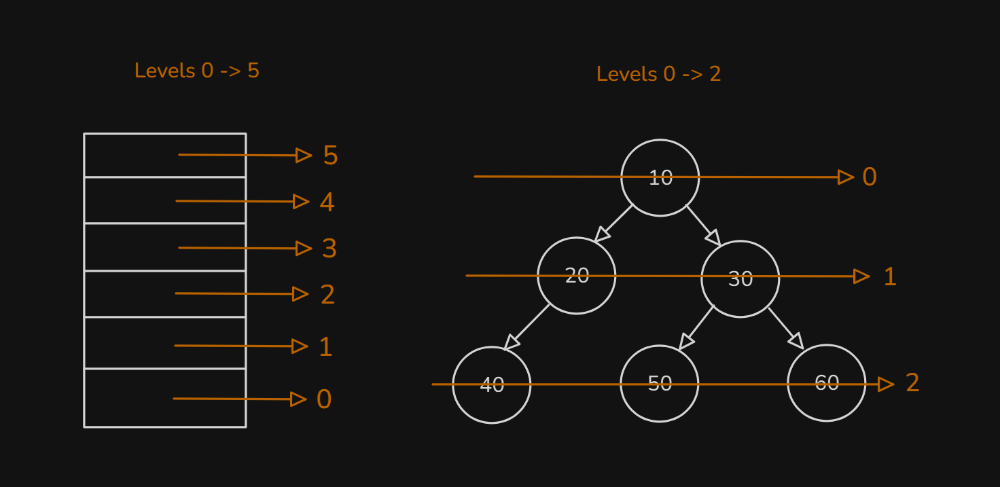
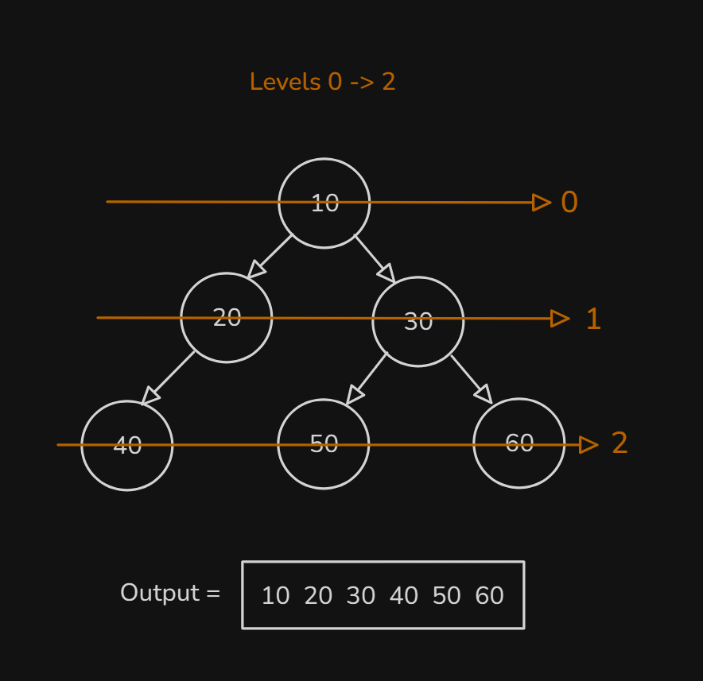
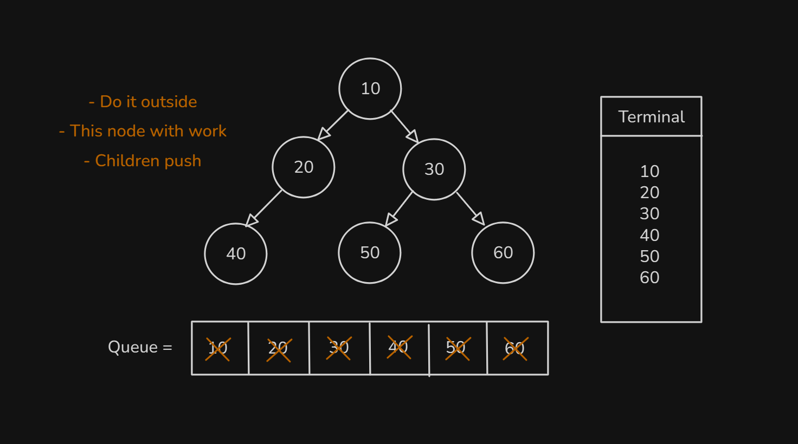

# Date: 27 July, 2025 - Sunday

## Topics:
0. Introduction
1. Level order traversal Theory
2. Level order traversal Implementation
3. Level order traversal Animated
4. Binary tree input Theory
5. Binary tree input Implementation
6. Binary tree input Animated
7. Count nodes in a binary tree
8. Count leaf nodes in a binary tree
9. Count leaf nodes simulation
- Quiz: Module 18
- Extra Practice Problem and Quiz Explanation
- Feedback Form: Module 18

## 0. Introduction
- Binary Tree Operations
- Level Order Traversal
- Binary Tree Input
- Counting nodes in Binary Tree - With `Recursive`
- Counting Leaf Nodes - With `Recursive`
- Maximum Height of a Binary Tree - With `Recursive`

## 1. Level order traversal Theory
- Understand `Level order traversal theory` with drawing:
    - 
    - 
- Rules of `Level order traversal theory`:
    - `Take out`
    - `Working with Node`
    - `Children push`
    - 
- `Queue` with non-linear data structure help to level order.

## 2. Level order traversal Implementation
- Program: `level_order_traversal.cpp`