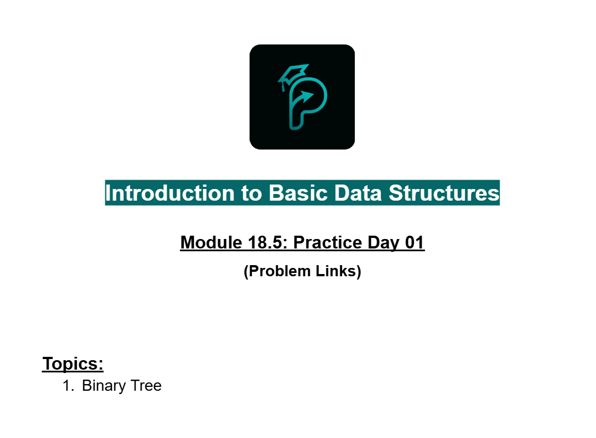
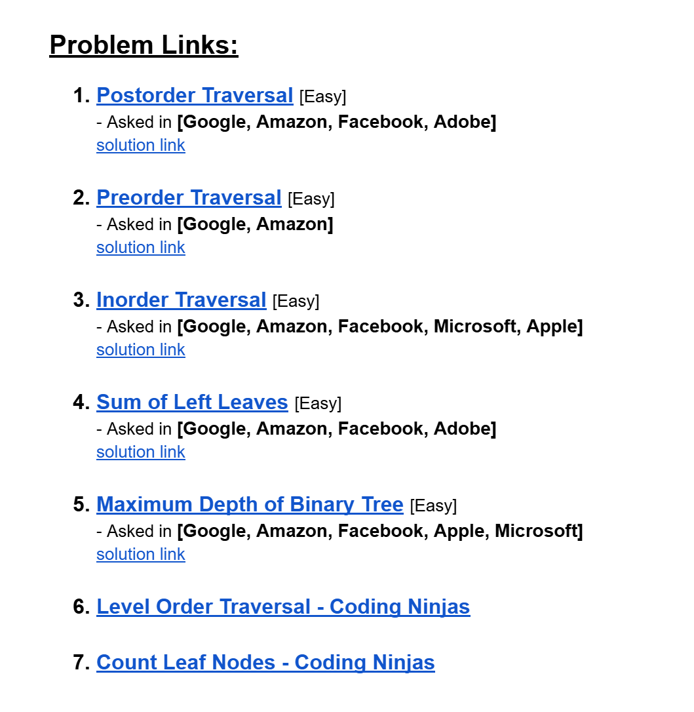
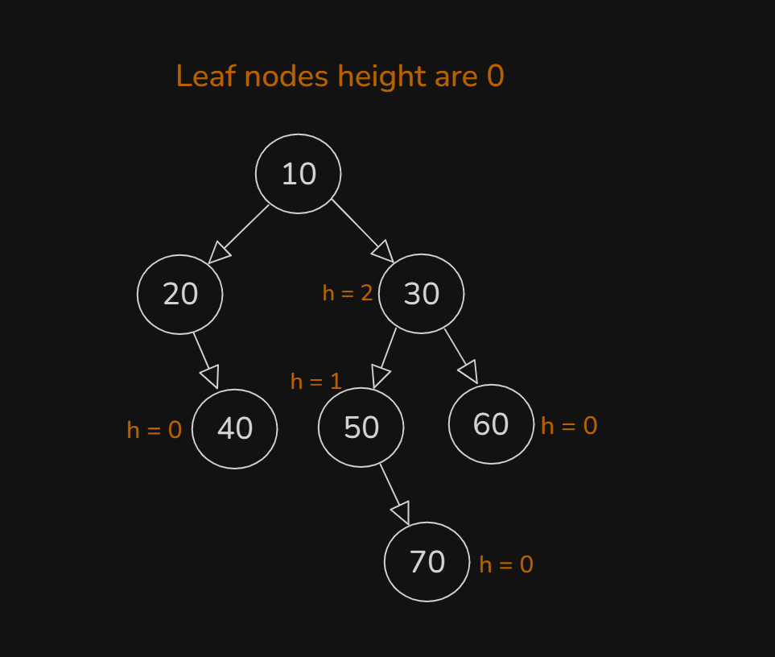
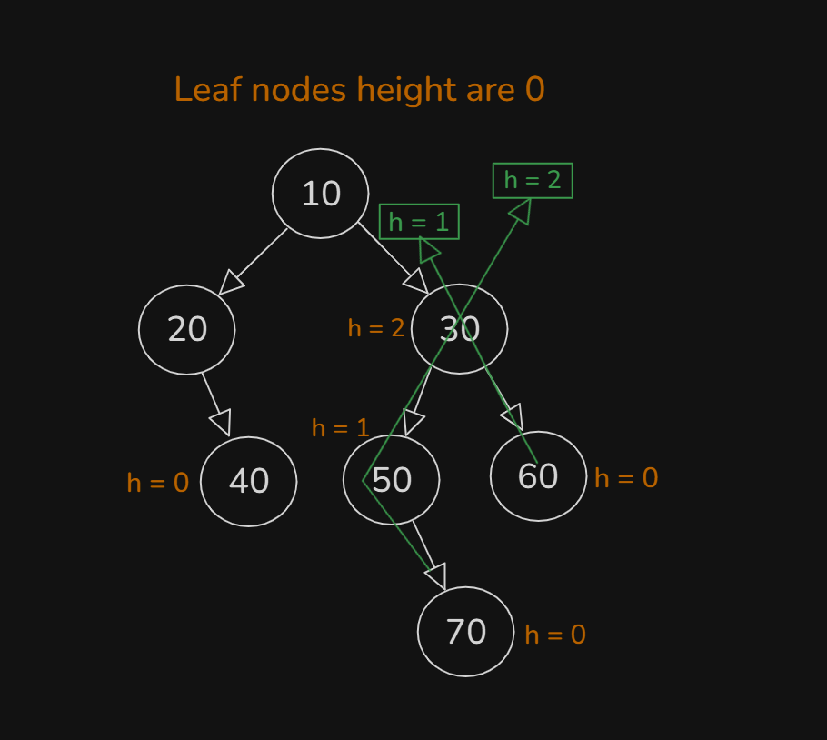
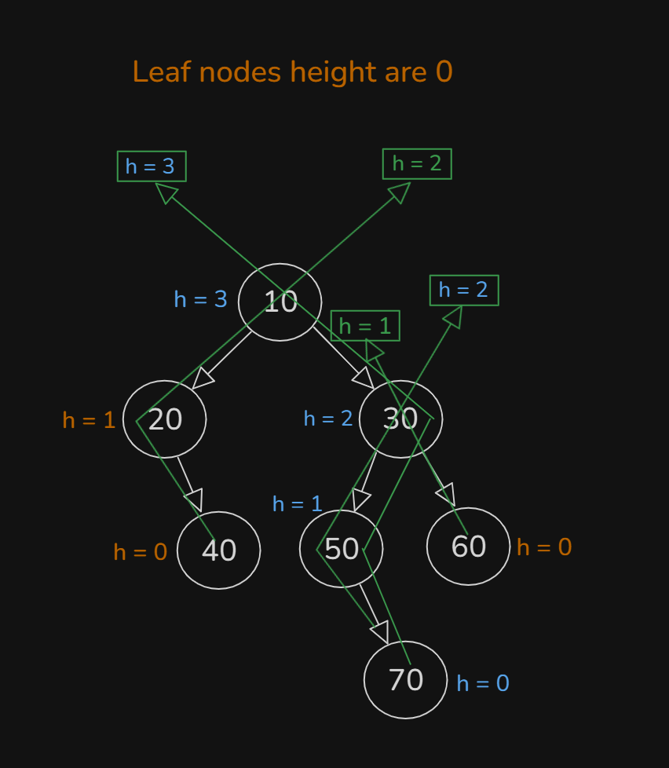
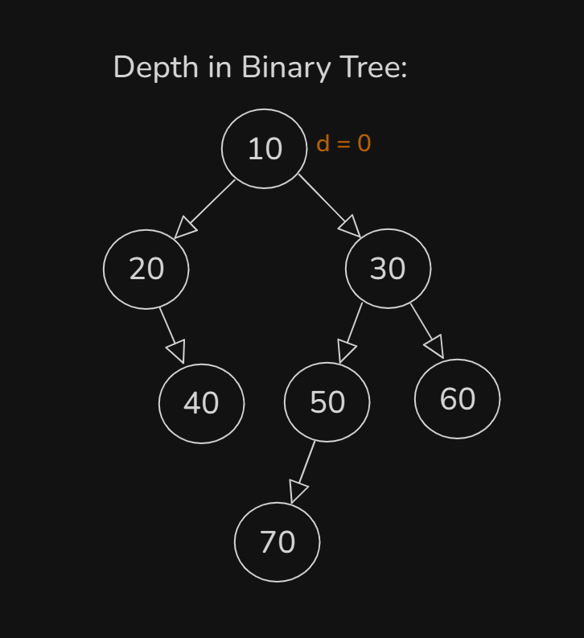
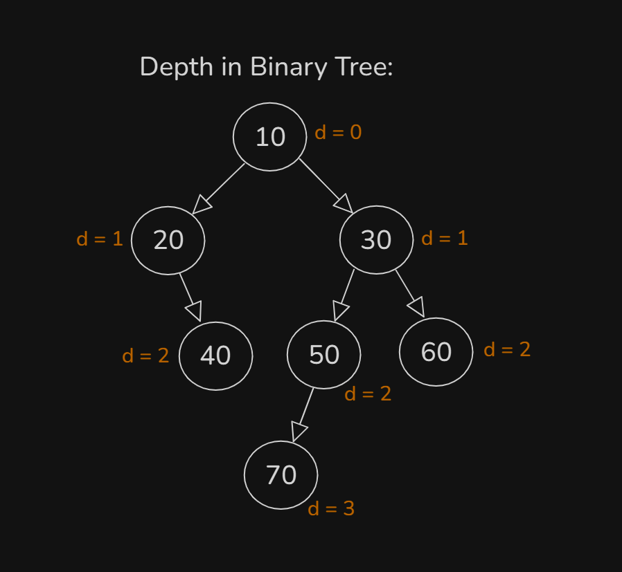
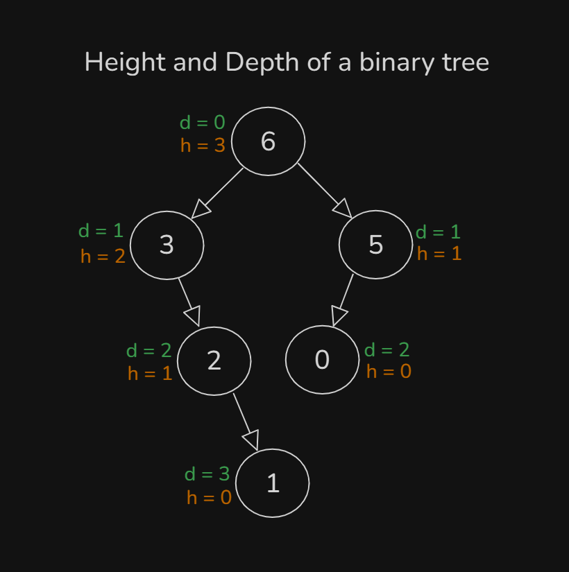

# Date: 28 July, 2025 - Monday

## Topics:
- Practice Problem Set: Module 18.5
0. Height and Depth of a binary tree
1. Get maximum height of a binary tree
2. Get maximum height of a binary tree animated
3. Practice Instructions

## Practice Problem Set: Module 18.5
- [Practice Problem Link](https://docs.google.com/document/d/1vv9MccarlZeoF1WYHkhBBqG2iCENXE9M/edit?usp=sharing&ouid=110071013354717279052&rtpof=true&sd=true)
- 
- 
- [Problem 1](https://leetcode.com/problems/binary-tree-postorder-traversal/description/)
    - [Solution Link](https://leetcode.com/problems/binary-tree-postorder-traversal/solutions/6983185/simple-recursion-runtime-beats-100-memor-1cjt/)
- [Problem 2](https://leetcode.com/problems/binary-tree-preorder-traversal/description/)
    - [Solution Link](https://leetcode.com/problems/binary-tree-preorder-traversal/solutions/6983211/simple-recursion-runtime-memory-beats-10-8s6b/)
- [Problem 3](https://leetcode.com/problems/binary-tree-inorder-traversal/description/)
    - [Solution Link](https://leetcode.com/problems/binary-tree-inorder-traversal/solutions/6983229/simple-recursion-runtime-memory-beats-10-rwtp/)
- [Problem 4](https://leetcode.com/problems/sum-of-left-leaves/description/)
    - [Solution Link](https://leetcode.com/problems/sum-of-left-leaves/solutions/7006699/simple-recursion-beginner-friendly-beats-px7k/)
- [Problem 5](https://leetcode.com/problems/maximum-depth-of-binary-tree/)
    - [Solution Link](https://leetcode.com/problems/maximum-depth-of-binary-tree/solutions/7006797/simple-clean-recursion-beats-100-by-piaa-gpiu/)
- [Problem 6](https://www.codingninjas.com/studio/problems/level-order-traversal_796002)
- [Problem 7](https://www.codingninjas.com/studio/problems/count-leaf-nodes_893055)

## 0. Height and Depth of a binary tree
- Understand and explore to `Binary Tree Height` with this draw:
    - 
    - 
    - 
    - `This way to height count - Drawing...`
    - `Height are always count with maximum number.`
    - `Height - was leaf nodes are 0 and root node was n numbers`
- Understand and explore to `Binary Tree Depth` with this draw:
    - 
    - 
    - `Depth - was root node are 0 and leaf nodes was n numbers`
- `Height` and `Depth` in `Binary Tree`:
    - 

## 1. Get maximum height of a binary tree
- Abc
- Add the next modules into github repo
- This whole notes are blanks.
