# Date: 29 July, 2025 - Tuesday

## Topics:
- Problem Link: Module 19
0. Introduction
1. Is Node Present
2. STL pair
3. Node level
4. Left View of a Binary Tree
5. Diameter of a Binary Tree
6. Special Binary Tree
7. Reverse Level Order Traversal
8. Summary
- Extra Practice Problem Link: Module 19
- Feedback Form: Module 19

## Problem Link: Module 19
- [Click Here - Problem Link](https://docs.google.com/document/d/1HlhOqkYlEajgtr8_AF69KHqIWHJM5Kdm/edit?usp=sharing&rtpof=true&sd=true)
- 
- [Problem 1](https://www.codingninjas.com/studio/problems/code-find-a-node_5682)
- [Problem 2](https://www.codingninjas.com/studio/problems/node-level_920383)
- [Problem 3](https://www.codingninjas.com/studio/problems/left-view-of-a-binary-tree_920519)
- [Problem 4](https://www.codingninjas.com/studio/problems/diameter-of-the-binary-tree_920552)
- [Problem 5](https://www.codingninjas.com/studio/problems/special-binary-tree_920502)
- [Problem 6](https://www.codingninjas.com/studio/problems/reverse-level-order-traversal_764339)

## 0. Introduction
- There have six problems and trying to solve itself before `Pias Bhai` explain or solved.
    - 

## 1. Is Node Present
- Let's go to `Problem 1`
- [Problem 1](https://www.codingninjas.com/studio/problems/code-find-a-node_5682)
- `Problem Statement`:
    - 
- `Solved code`:
    ```
    bool isNodePresent(BinaryTreeNode<int> *root, int x) {
        if(root == NULL) return false;
        if(root->data == x) return true;
        bool l = isNodePresent(root->left, x);
        bool r = isNodePresent(root->right, x);
        if(l || r) return true;
        else return false;
    }
    ```

## 2. STL pair
- Learn and explore to new `STL` - Called to `Pair`
- Program: `stl_pair.cpp`
- When two values are combined then we will use to `STL Pair`.

## 3. Node level
- Let's go to `Problem 2`
- [Problem 2](https://www.codingninjas.com/studio/problems/node-level_920383)
- `Problem Statement`:
    - 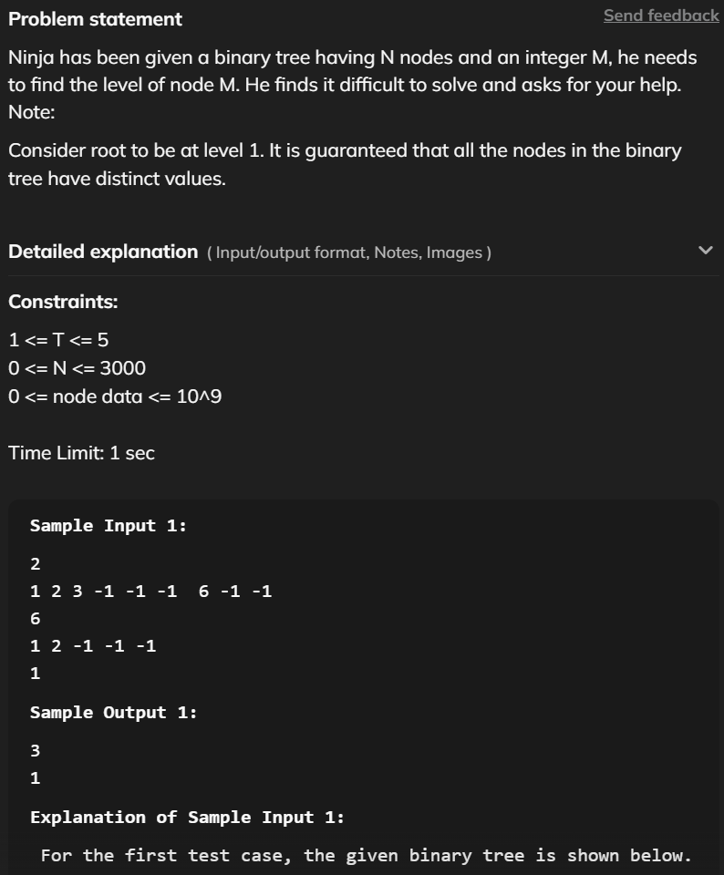
    - 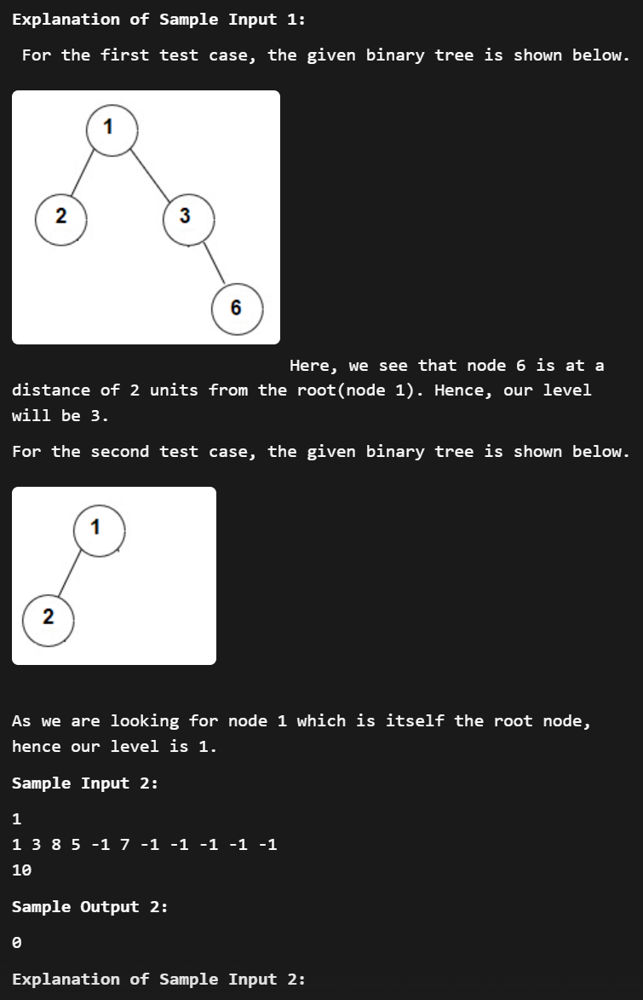
    - 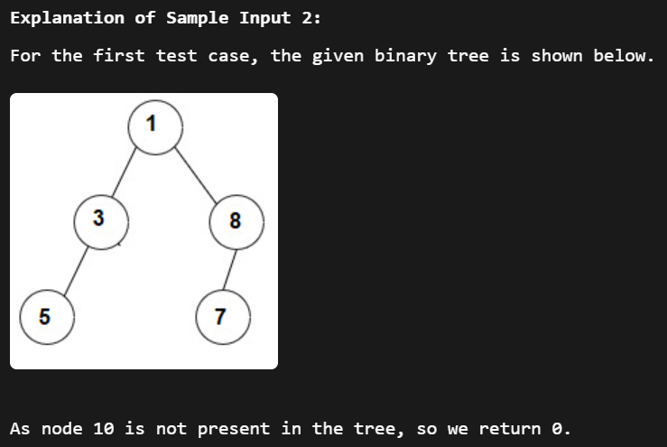
- `Solved code`:
    ```
    #include <bits/stdc++.h>

    int nodeLevel(TreeNode<int>* root, int searchedValue) {
        queue<pair<TreeNode<int>*, int>> q;
        if(root) 
            q.push({root, 1});
        while(!q.empty()) {
            pair<TreeNode<int>*, int> parent = q.front();
            q.pop();
            TreeNode<int>* node = parent.first;
            int level = parent.second;
            if(node->val == searchedValue)
                return level;
            if(node->left)
                q.push({node->left, level+1});
            if(node->right)
                q.push({node->right, level+1});
        }
    }
    ```

## 4. Left View of a Binary Tree
- Let's go to `Problem 3`
- [Problem 3](https://www.codingninjas.com/studio/problems/left-view-of-a-binary-tree_920519)
- `Problem Statement`:
    - 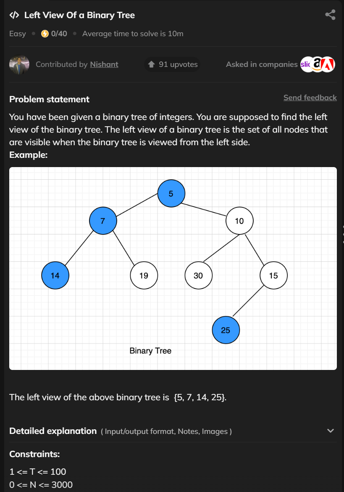
    - 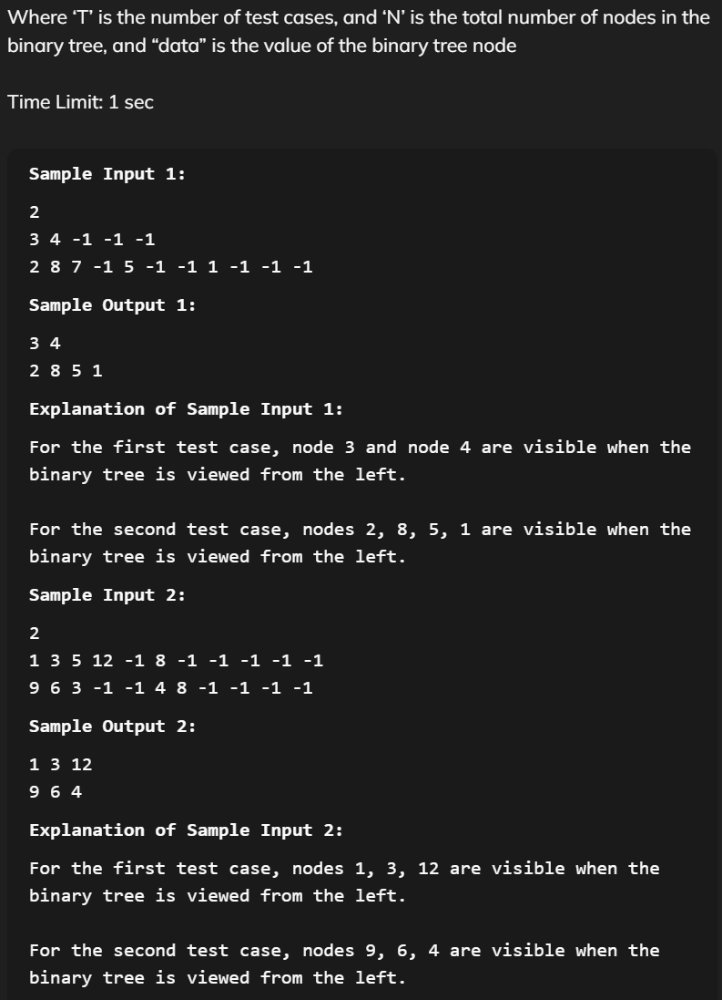
- `Solved code`:
    ```
    #include <bits/stdc++.h>

    vector<int> getLeftView(TreeNode<int> *root) {
        vector<int> ans;
        bool fre[3005] = {false};
        queue<pair<TreeNode<int>*, int>> q;
        if(root)
            q.push({root, 1});
        while(!q.empty()) {
            pair<TreeNode<int>*, int> parent = q.front();
            q.pop();
            TreeNode<int>* node = parent.first;
            int level = parent.second;

            if(fre[level] == false) {
                ans.push_back(node->data);
                fre[level] = true;
            }
            if(node->left)
                q.push({node->left, level+1});
            if(node->right)
                q.push({node->right, level+1});
        }
        return ans;
    }
    ```

## 5. Diameter of a Binary Tree
- The `hardest problem` into six problems.
- Let's go to `Problem 4`
- [Problem 4](https://www.codingninjas.com/studio/problems/diameter-of-the-binary-tree_920552)
- `Problem Statement`:
    - 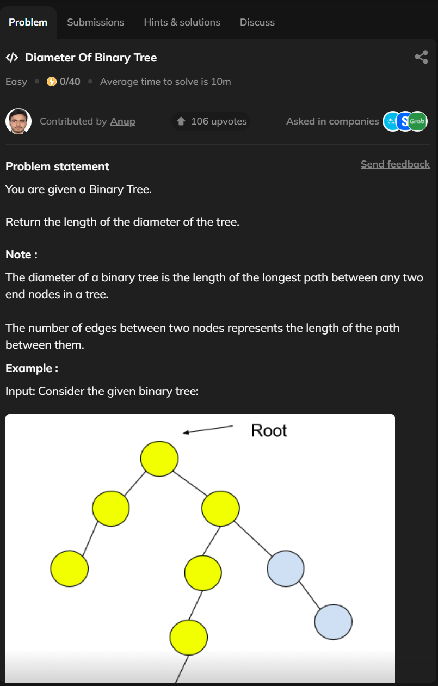
    - 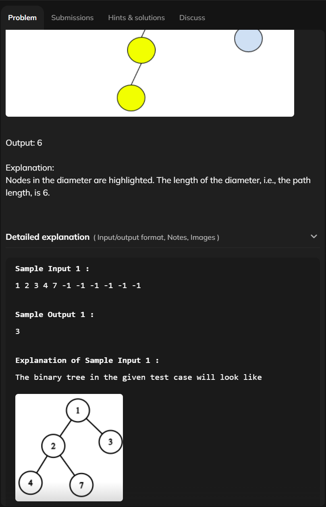
    - 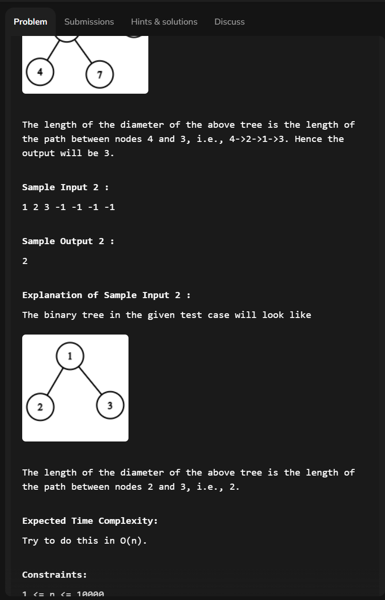
    - 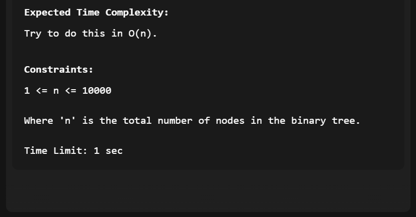
- `Solved code`:
    ```
    int mx;

    int max_height(TreeNode<int> *root) {
        if(root == NULL)
            return 0;
        if(root->left == NULL && root->right == NULL)
            return 1;
        int l = max_height(root->left);
        int r = max_height(root->right);
        int d = l + r;
        mx = max(mx, d);
        return max(l, r) + 1;
    }

    int diameterOfBinaryTree(TreeNode<int> *root) {
        mx = 0;
        int h = max_height(root);
        return mx;
    }
    ```

## 6. Special Binary Tree
- Let's go to `Problem 5`
- [Problem 5](https://www.codingninjas.com/studio/problems/special-binary-tree_920502)
- `Problem Statement`:
    - 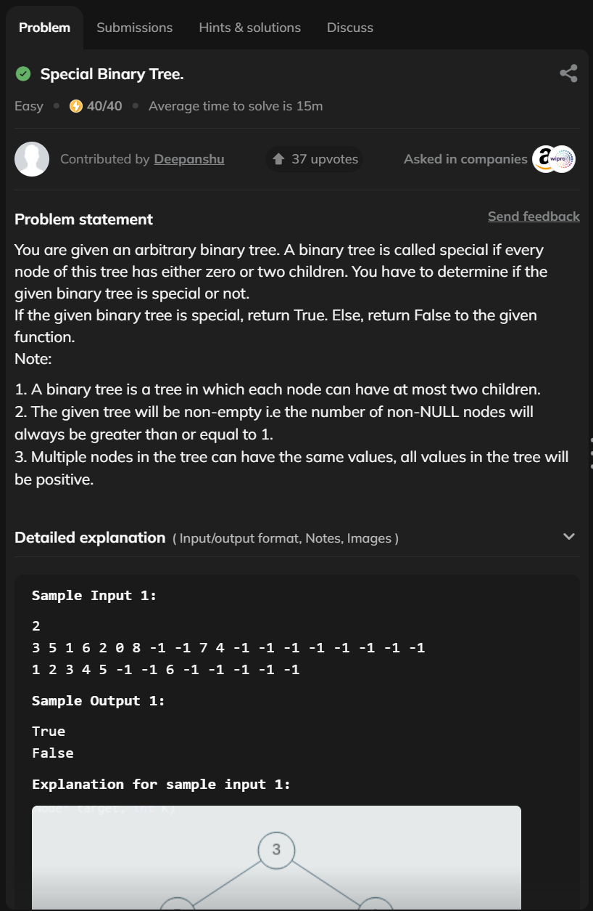
    - 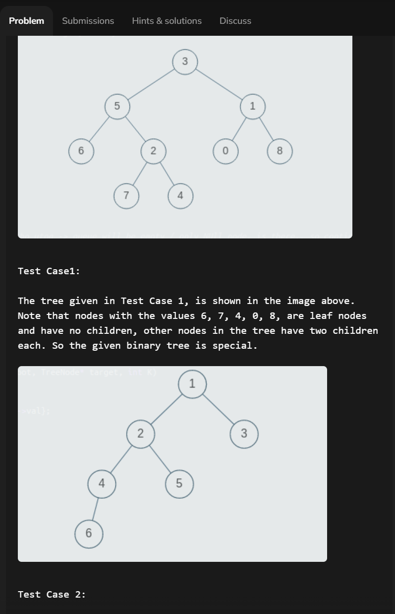
    - 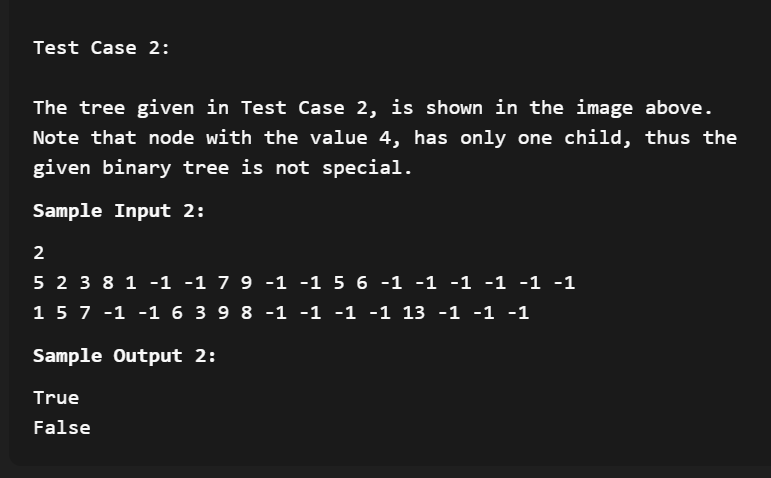
- `Solved code`:
    ```
    #include <bits/stdc++.h>

    bool isSpecialBinaryTree(BinaryTreeNode<int>* root) {
        if(root == NULL)
            return true;
        if((root->left != NULL && root->right == NULL) || (root->left == NULL && root->right != NULL))
            return false;
        bool l = isSpecialBinaryTree(root->left);
        bool r = isSpecialBinaryTree(root->right);
        return l && r;
    }
    ```

## 7. Reverse Level Order Traversal
- Let's go to `Problem 6`
- [Problem 6](https://www.codingninjas.com/studio/problems/reverse-level-order-traversal_764339)
- `Problem Statement`:
    - 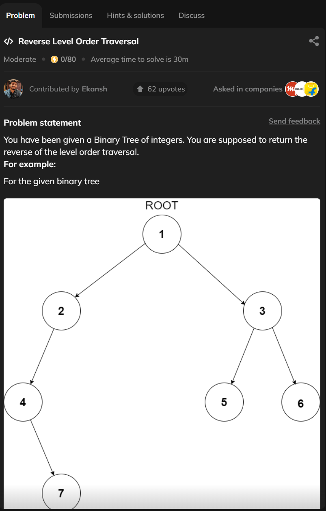
    - 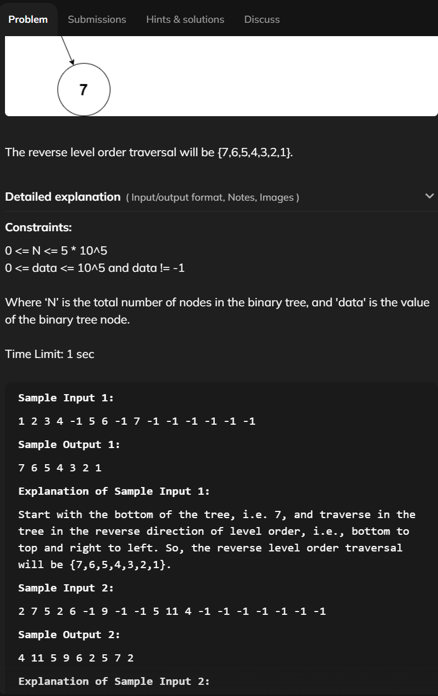
- `Solved code`:
    ```
    #include <bits/stdc++.h>

    vector<int> reverseLevelOrder(TreeNode<int> *root){
        vector<int> v;
        queue<TreeNode<int> *> q;
        if(root)
            q.push(root);
        while(!q.empty()) {
            TreeNode<int> * f = q.front();
            q.pop();
            v.push_back(f->val);
            if(f->left)
                q.push(f->left);
            if(f->right)
                q.push(f->right);
        }
        reverse(v.begin(), v.end());
        return v;
    }
    ```

## 8. Summary
- We had `6 (six)` problem solved. There was 3 problem were hard and 3 problem was easy.
- Learn `STL Pair` with those 6 problem solving.
- Problem solving was good understanding making as a `Programmer`.

## Extra Practice Problem Link: Module 19
- [Extra Practice Problem Link](https://docs.google.com/document/d/1QEUDBWXJZyDUk4aVZ1jhR9ux8TWXzdet-TSG9RhTKkk/edit?usp=sharing)
- 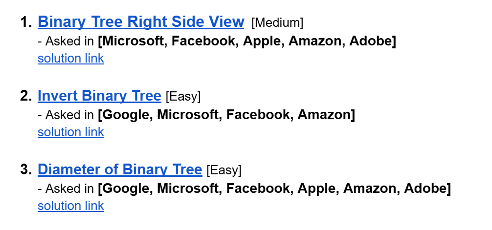
- [Problem 1](https://leetcode.com/problems/binary-tree-right-side-view/description/)
    - [Solution Link](https://leetcode.com/problems/binary-tree-right-side-view/solutions/6979528/simple-clean-tracking-visited-by-piaaaas-dcxm/)
- [Problem 2](https://leetcode.com/problems/invert-binary-tree/description/)
    - [Solution Link](https://leetcode.com/problems/invert-binary-tree/solutions/6979505/simple-recursion-swapping-beats-100-by-p-3am1/)
- [Problem 3](https://leetcode.com/problems/diameter-of-binary-tree/description/)
    - [Solution Link](https://leetcode.com/problems/diameter-of-binary-tree/solutions/6979539/simple-recursion-by-piaaaas-o3qk/)

## Feedback Form: Module 19
- মডিউল রিলেটেড তোমার যে কোন ফিডব্যাক থাকলে এই ফর্মে লিখে দিতে পারো। আমরা তোমার ফিডব্যাক গুরুত্বসহকার দেখব।
- [Form Links](https://forms.gle/DH5mjuGD1x2EZ4z29)