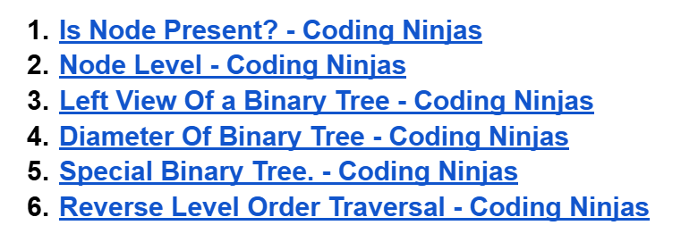
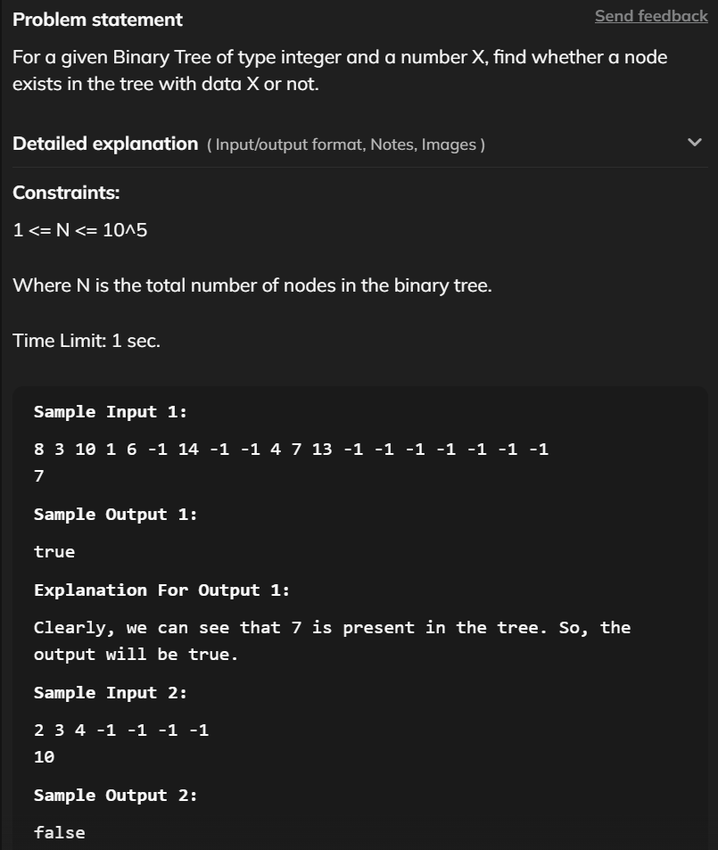

# Date: 29 July, 2025 - Tuesday

## Topics:
- Problem Link: Module 19
0. Introduction
1. Is Node Present
2. STL pair
3. Node level
4. Left View of a Binary Tree
5. Diameter of a Binary Tree
6. Special Binary Tree
7. Reverse Level Order Traversal
8. Summary
- Extra Practice Problem Link: Module 19
- Feedback Form: Module 19

## Problem Link: Module 19
- [Click Here - Problem Link](https://docs.google.com/document/d/1HlhOqkYlEajgtr8_AF69KHqIWHJM5Kdm/edit?usp=sharing&rtpof=true&sd=true)
- 
- [Problem 1](https://www.codingninjas.com/studio/problems/code-find-a-node_5682)
- [Problem 2](https://www.codingninjas.com/studio/problems/node-level_920383)
- [Problem 3](https://www.codingninjas.com/studio/problems/left-view-of-a-binary-tree_920519)
- [Problem 4](https://www.codingninjas.com/studio/problems/diameter-of-the-binary-tree_920552)
- [Problem 5](https://www.codingninjas.com/studio/problems/special-binary-tree_920502)
- [Problem 6](https://www.codingninjas.com/studio/problems/reverse-level-order-traversal_764339)

## 0. Introduction
- There have six problems and trying to solve itself before `Pias Bhai` explain or solved.
    - 

## 1. Is Node Present
- Let's go to solve `Problem 1`
- [Problem 1](https://www.codingninjas.com/studio/problems/code-find-a-node_5682)
- `Problem Statement`:
    - 
- `Solved code`:
    ```
    bool isNodePresent(BinaryTreeNode<int> *root, int x) {
        if(root == NULL) return false;
        if(root->data == x) return true;
        bool l = isNodePresent(root->left, x);
        bool r = isNodePresent(root->right, x);
        if(l || r) return true;
        else return false;
    }
    ```

## 2. STL pair
- Learn and explore to new `STL` - Called to `Pair`
- Program: `stl_pair.cpp`
- When two values are combined then we will use to `STL Pair`.